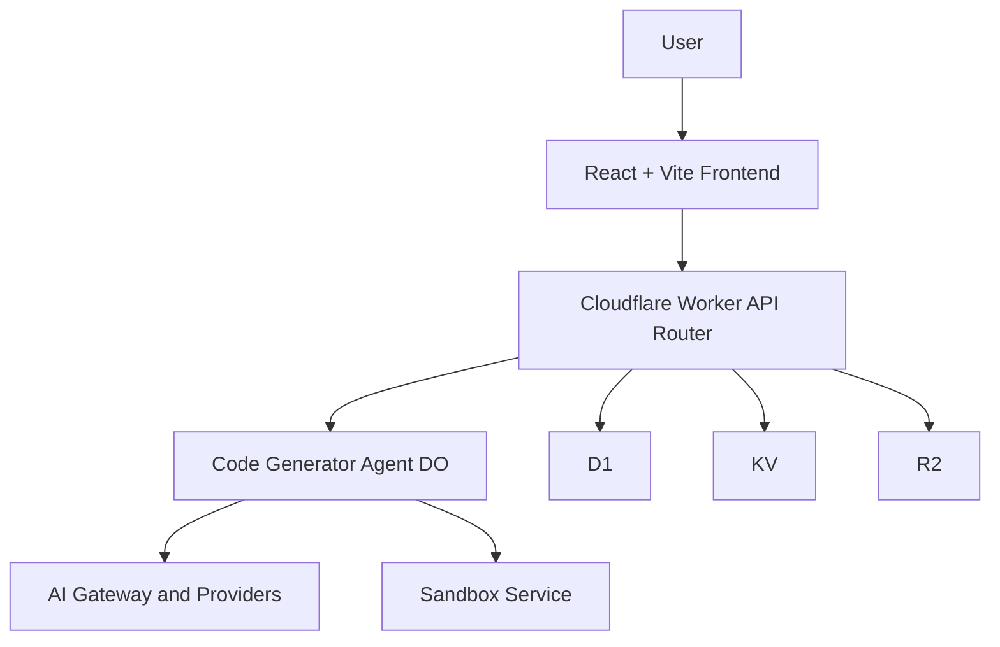
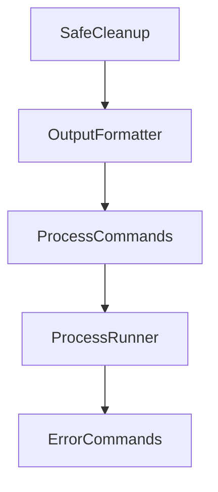

# Chapter 2: System Architecture

Welcome to **Chapter 2: System Architecture**. In this part of **VibeSDK Tutorial: Build a Vibe-Coding Platform on Cloudflare**, you will build an intuitive mental model first, then move into concrete implementation details and practical production tradeoffs.


VibeSDK combines a React frontend, Worker API plane, Durable Object orchestration, and Cloudflare-managed infrastructure into one app-generation platform.

## Learning Goals

By the end of this chapter, you should be able to:

- explain how user requests become generated/deployed applications
- identify where state lives across the platform
- distinguish responsibilities between API, orchestration, and runtime layers
- navigate the main code locations confidently

## High-Level Topology


```mermaid
graph TD
    U[User] --> FE[React + Vite Frontend]
    FE --> API[Cloudflare Worker API Router]
    API --> AG[Code Generator Agent DO]
    AG --> AI[AI Gateway and Providers]
    AG --> SB[Sandbox Service]
    API --> D1[D1]
    API --> KV[KV]
    API --> R2[R2]
```

## Layer Responsibilities

| Layer | Core Responsibilities | Typical Code Locations |
|:------|:----------------------|:-----------------------|
| frontend | prompt input, live status UI, preview controls, auth UX | `src/` |
| API plane | request auth, routing, app/session endpoints | `worker/api/`, `worker/app.ts` |
| orchestration | phase engine, generation loops, state transitions | `worker/agents/` |
| data and infra | relational state, cache/session data, artifacts, runtime bindings | `wrangler.jsonc`, D1/KV/R2 bindings |
| execution runtime | preview container lifecycle, deployment actions | sandbox and dispatch service paths |

## Why Durable Objects Are Central

Generation sessions need ordered, stateful, resumable execution. Durable Objects provide per-session state and deterministic event handling so VibeSDK can support long-lived agent workflows without forcing fragile client-side orchestration.

## End-to-End Flow (Simplified)

1. user submits prompt from frontend
2. API validates identity/session and routes to agent
3. Durable Object agent runs blueprint and phase logic
4. model calls route through AI Gateway/provider config
5. generated output is assembled and sent to sandbox runtime
6. preview/deploy events stream back to UI in real time

## State Surfaces to Understand

| State Type | Where It Lives | Why It Matters |
|:-----------|:---------------|:---------------|
| user/app metadata | D1 | source of truth for account and app records |
| session/transient keys | KV | fast lookups and ephemeral coordination |
| generated assets/templates | R2 | persistent artifact storage and handoff |
| in-flight generation state | Durable Object state | continuity for active build sessions |

## Key Code Areas to Read First

- `worker/agents/` for orchestration internals
- `worker/api/` for control-plane contracts
- `worker/agents/inferutils/config.ts` for model routing setup
- `wrangler.jsonc` for Cloudflare binding topology
- `src/` for frontend event and status handling

## Architecture Review Checklist

Before extending the platform, verify:

- where new state should persist (D1 vs KV vs DO vs R2)
- whether the change belongs in API plane or agent orchestration
- how failures will surface back to user-facing status
- whether new dependencies alter deployment or permission requirements

## Source References

- [Architecture Diagrams](https://github.com/cloudflare/vibesdk/blob/main/docs/architecture-diagrams.md)
- [VibeSDK Repository](https://github.com/cloudflare/vibesdk)

## Summary

You now have a clear system map for VibeSDK and can reason about where to implement changes without cross-layer confusion.

Next: [Chapter 3: AI Pipeline and Phase Engine](03-ai-pipeline-and-phase-engine.md)

## Source Code Walkthrough

### `container/cli-tools.ts`

The `SafeCleanup` class in [`container/cli-tools.ts`](https://github.com/cloudflare/vibesdk/blob/HEAD/container/cli-tools.ts) handles a key part of this chapter's functionality:

```ts
}

class SafeCleanup {
  /**
   * Safely close storage manager.
   * Storage.close() is synchronous, so we just wrap it in try-catch.
   */
  static closeStorage(storage: StorageManager | null): void {
    if (!storage) return;

    try {
      storage.close();
    } catch (error) {
      console.warn('Storage close error:', error);
      // Don't throw - we're in cleanup
    }
  }
}

class OutputFormatter {
  static formatOutput(data: unknown, format: 'json' | 'table' | 'raw' = 'json'): void {
    switch (format) {
      case 'json':
        console.log(SafeJSON.stringify(data, 2));
        break;
      case 'raw':
        if (typeof data === 'string') {
          console.log(data);
        } else {
          console.log(String(data));
        }
        break;
```

This class is important because it defines how VibeSDK Tutorial: Build a Vibe-Coding Platform on Cloudflare implements the patterns covered in this chapter.

### `container/cli-tools.ts`

The `OutputFormatter` class in [`container/cli-tools.ts`](https://github.com/cloudflare/vibesdk/blob/HEAD/container/cli-tools.ts) handles a key part of this chapter's functionality:

```ts
}

class OutputFormatter {
  static formatOutput(data: unknown, format: 'json' | 'table' | 'raw' = 'json'): void {
    switch (format) {
      case 'json':
        console.log(SafeJSON.stringify(data, 2));
        break;
      case 'raw':
        if (typeof data === 'string') {
          console.log(data);
        } else {
          console.log(String(data));
        }
        break;
      case 'table':
        // Table formatting is handled by specific formatters
        console.log(SafeJSON.stringify(data, 2));
        break;
    }
  }

  static formatError(error: string, additionalData?: Record<string, unknown>): void {
    const errorResponse = {
      success: false,
      error,
      ...additionalData
    };
    console.log(SafeJSON.stringify(errorResponse, 2));
  }

  static formatSuccess(message: string, data?: unknown): void {
```

This class is important because it defines how VibeSDK Tutorial: Build a Vibe-Coding Platform on Cloudflare implements the patterns covered in this chapter.

### `container/cli-tools.ts`

The `ProcessCommands` class in [`container/cli-tools.ts`](https://github.com/cloudflare/vibesdk/blob/HEAD/container/cli-tools.ts) handles a key part of this chapter's functionality:

```ts
}

class ProcessCommands {
  private static activeRunners = new Map<string, ProcessRunner>();

  static async start(options: {
    instanceId: string;
    command: string;
    args: string[];
    cwd?: string;
    port?: string;
    healthCheckInterval?: number;
    maxRestarts?: number;
    restartDelay?: number;
    maxErrors?: number;
    retentionDays?: number;
    logRetentionHours?: number;
  }): Promise<void> {
    try {
      // Check if already running
      if (this.activeRunners.has(options.instanceId)) {
        OutputFormatter.formatError(`Process ${options.instanceId} is already running`);
        process.exit(1);
      }

      // Set PORT environment variable if provided
      if (options.port) {
        process.env.PORT = options.port;
      }

      // Build configuration
      const envVars: Record<string, string> = {};
```

This class is important because it defines how VibeSDK Tutorial: Build a Vibe-Coding Platform on Cloudflare implements the patterns covered in this chapter.

### `container/cli-tools.ts`

The `ProcessRunner` class in [`container/cli-tools.ts`](https://github.com/cloudflare/vibesdk/blob/HEAD/container/cli-tools.ts) handles a key part of this chapter's functionality:

```ts
import { ProcessMonitor } from './process-monitor.js';
import { 
  ProcessRunnerConfig, 
  ProcessInfo, 
  MonitoringOptions,
  LogStoreOptions as LogStoreOptionsType,
  ErrorStoreOptions as ErrorStoreOptionsType,
  LogFilter,
  LogCursor,
  LogLevel,
  StoredError,
  StoredLog,
  SimpleError,
  Result,
  DEFAULT_MONITORING_OPTIONS,
  DEFAULT_STORAGE_OPTIONS,
  DEFAULT_LOG_STORE_OPTIONS,
  getDataDirectory,
  getErrorDbPath,
  getLogDbPath
} from './types.js';

// Instance ID validation pattern - alphanumeric with dashes and underscores
const INSTANCE_ID_PATTERN = /^[a-zA-Z0-9][a-zA-Z0-9_-]*$/;
const MAX_INSTANCE_ID_LENGTH = 64;

/**
 * Validate instance ID format to prevent path traversal and other issues
 */
function validateInstanceId(id: string): void {
  if (!id || id.length === 0) {
    throw new Error('Instance ID is required');
```

This class is important because it defines how VibeSDK Tutorial: Build a Vibe-Coding Platform on Cloudflare implements the patterns covered in this chapter.


## How These Components Connect


```mermaid
flowchart TD
    A[SafeCleanup]
    B[OutputFormatter]
    C[ProcessCommands]
    D[ProcessRunner]
    E[ErrorCommands]
    A --> B
    B --> C
    C --> D
    D --> E
```
