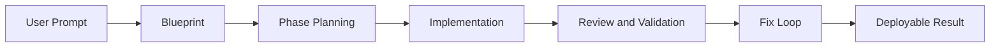

# Chapter 3: AI Pipeline and Phase Engine

VibeSDK uses a structured phase engine so generation is auditable, recoverable, and tunable instead of a one-shot black box.

## Learning Goals

By the end of this chapter, you should be able to:

- explain each generation stage and its output
- tune model/provider choices by operation type
- apply phase-gate criteria to improve delivery quality
- understand fallback and recovery behavior under provider instability

## Pipeline Overview

## Operation Types and Intent

| Operation | Purpose | Typical Failure Mode |
|:----------|:--------|:---------------------|
| blueprint generation | convert product intent into architecture and scope | over-broad or under-constrained plans |
| phase planning | sequence milestones and dependencies | phase granularity too coarse |
| implementation | generate concrete file-level outputs | partial/inconsistent file sets |
| review and validation | detect runtime or structural issues | shallow checks miss integration failures |
| fix loops | repair targeted failures quickly | oscillating fixes when root cause is unclear |

## Model Routing and Provider Strategy

Model/provider behavior is configured at operation level in `worker/agents/inferutils/config.ts`.

Recommended approach:

- keep a known-good default provider/model pair per operation
- define explicit fallback routes for provider/API outages
- test changes per operation, not globally
- track quality and cost by operation type

## Phase Gate Criteria (Practical)

Move to next phase only when all are true:

1. expected phase artifacts are produced
2. validation signals are green for touched scope
3. unresolved risks are documented with severity and owner
4. rollback path is known if downstream phase fails

## Quality Controls That Matter Most

- bounded prompts per phase reduce drift
- explicit artifacts improve auditability
- deterministic phase transitions reduce unreproducible failures
- short fix loops improve mean time to usable preview

## Debugging Playbook

If generation quality regresses:

1. isolate which operation regressed (blueprint/phase/impl/review/fix)
2. compare provider/model route for that operation
3. inspect prompt inputs and context payload size
4. replay with constrained scope before full prompt retry
5. update fallback policy when instability is provider-specific

## Source References

- [VibeSDK LLM Developer Guide](https://github.com/cloudflare/vibesdk/blob/main/docs/llm.md)
- [VibeSDK Repository](https://github.com/cloudflare/vibesdk)

## Summary

You now understand how VibeSDK decomposes app generation into controllable phases and where to tune for reliability.

Next: [Chapter 4: Sandbox and Preview Runtime](04-sandbox-and-preview-runtime.md)
