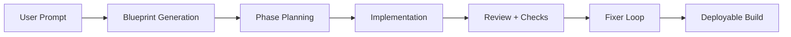

# Chapter 3: AI Pipeline and Phase Engine

VibeSDK does not generate an app in one opaque call. It runs a phased loop with planning, implementation, validation, and correction.

## Phase-Oriented Flow

## Core AI Operations

| Operation | Goal |
|:----------|:-----|
| Blueprint generation | derive architecture and file targets |
| Phase planning | break work into ordered implementation blocks |
| Phase implementation | generate and apply file updates |
| Code review/fix | detect errors and patch quickly |
| User conversation processing | integrate iterative user direction |

## Model and Routing Configuration

VibeSDK supports multi-provider model routing through gateway/provider config. Your high-impact controls are:

- provider keys and gateway settings in env vars
- operation-level model strategy in `worker/agents/inferutils/config.ts`
- fallback behavior for degraded provider paths

## Reliability Patterns

- bounded, phase-specific prompts reduce drift
- explicit intermediate artifacts improve explainability
- correction loops reduce manual intervention after first pass

## Summary

You now understand how VibeSDK converts one natural-language request into controlled multi-step generation.

Next: [Chapter 4: Sandbox and Preview Runtime](04-sandbox-and-preview-runtime.md)
