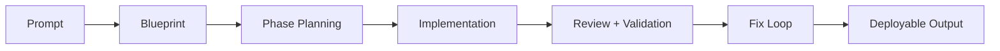

# Chapter 3: AI Pipeline and Phase Engine

VibeSDK uses a staged AI workflow so generation can be reviewed, corrected, and resumed instead of treated as a black box.

## Phase Pipeline

## Operation Types

| Operation | Goal |
|:----------|:-----|
| blueprint generation | choose architecture and file targets |
| phase planning | sequence implementation milestones |
| implementation | produce concrete patch sets |
| review/fix | detect runtime and structural issues |
| user conversation processing | ingest iterative feedback safely |

## Model Strategy Controls

- provider credentials and gateway settings in env vars
- operation-level model selection in `worker/agents/inferutils/config.ts`
- fallback paths for degraded providers

## Quality Controls

- bounded prompts per phase reduce drift
- explicit phase artifacts improve auditability
- fixer loops cut manual post-generation repair time

## Phase Gate Checklist

Before moving to the next phase, require:

- artifact output for the current phase
- passing validation signal for touched scope
- explicit unresolved-risk notes if any gaps remain

## Summary

You now understand how VibeSDK turns high-level intent into controlled, multi-step delivery.

Next: [Chapter 4: Sandbox and Preview Runtime](04-sandbox-and-preview-runtime.md)
