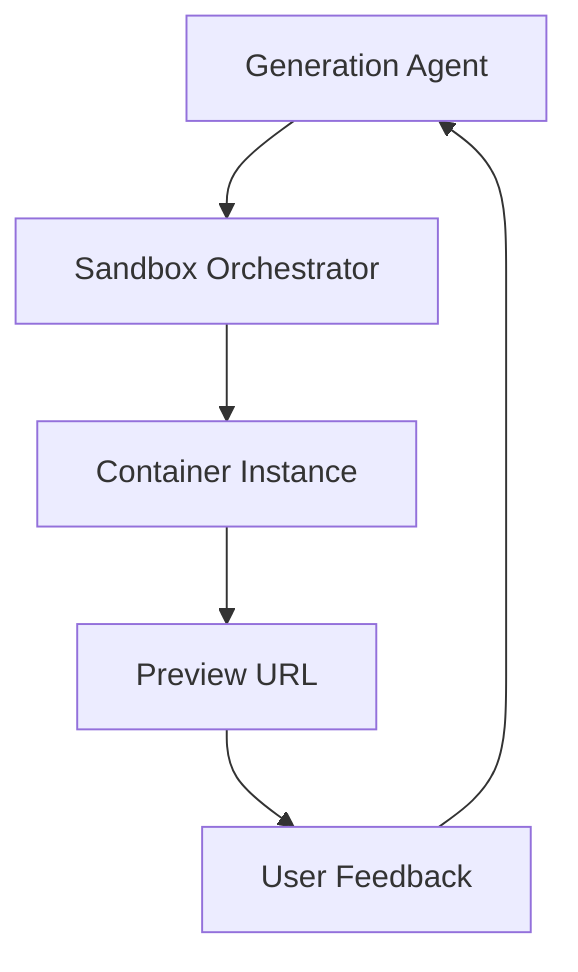

# Chapter 4: Sandbox and Preview Runtime

Generated apps are executed in isolated containers so users can validate behavior before deployment.

## Runtime Flow

1. generation output is assembled into runnable project state
2. sandbox instance boots using configured instance type
3. preview route is returned to the client
4. logs/errors feed back into correction loops

## Runtime Controls

| Control | Effect |
|:--------|:-------|
| `SANDBOX_INSTANCE_TYPE` | CPU/memory tier for previews |
| `MAX_SANDBOX_INSTANCES` | concurrent sandbox capacity cap |
| dispatch namespace config | preview routing and deployment path |

## Isolation Model

## Operational Guidance

- profile sandbox startup and crash rates per instance type
- enforce idle cleanup to control runaway cost
- separate preview-runtime incidents from generation-quality incidents

## Capacity Planning Baseline

Track these together when tuning runtime tiers:

- concurrent active previews
- median container startup time
- restart rate under peak load
- cost per active preview hour

## Summary

You now understand how VibeSDK provides safe preview execution loops.

Next: [Chapter 5: Data Layer and Persistence](05-data-layer-and-persistence.md)
