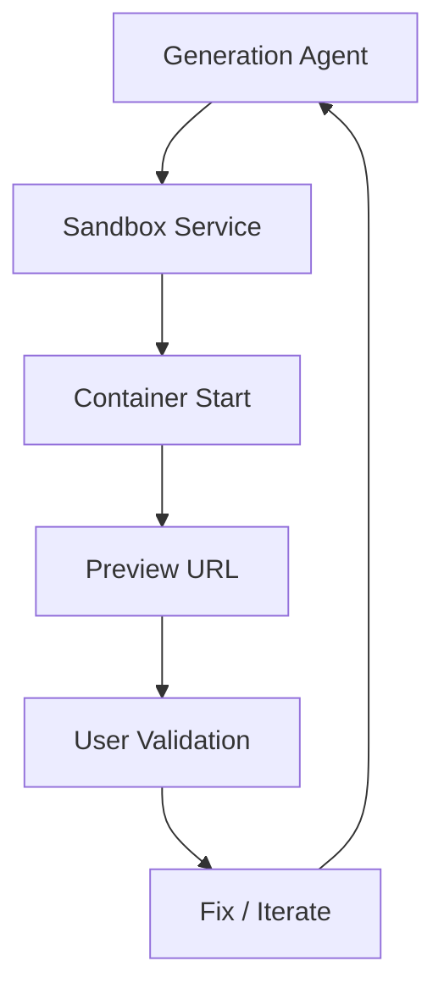

# Chapter 4: Sandbox and Preview Runtime

Generated applications execute in isolated sandbox containers so users can test safely before deployment.

## Container Lifecycle

1. generation output is assembled into runnable app state
2. sandbox instance boots with configured instance type
3. preview route is issued back to the UI
4. logs/errors feed back into fixer loops

## Core Control Knobs

| Variable | Effect |
|:---------|:-------|
| `SANDBOX_INSTANCE_TYPE` | CPU/memory profile for preview runtime |
| `MAX_SANDBOX_INSTANCES` | upper bound on concurrent active sandboxes |
| dispatch namespace settings | routes preview apps through Workers for Platforms |

## Execution Boundary

Sandboxing keeps generated app execution isolated from the control-plane worker and user session management paths.

## Operational Tips

- start with a mid-tier sandbox type, then profile before scaling up
- enforce idle/ttl shutdown policies for cost control
- separate preview instability from generation quality in runbooks

## Summary

You now know how VibeSDK isolates generated apps and exposes fast feedback loops through preview environments.

Next: [Chapter 5: Data Layer and Persistence](05-data-layer-and-persistence.md)
