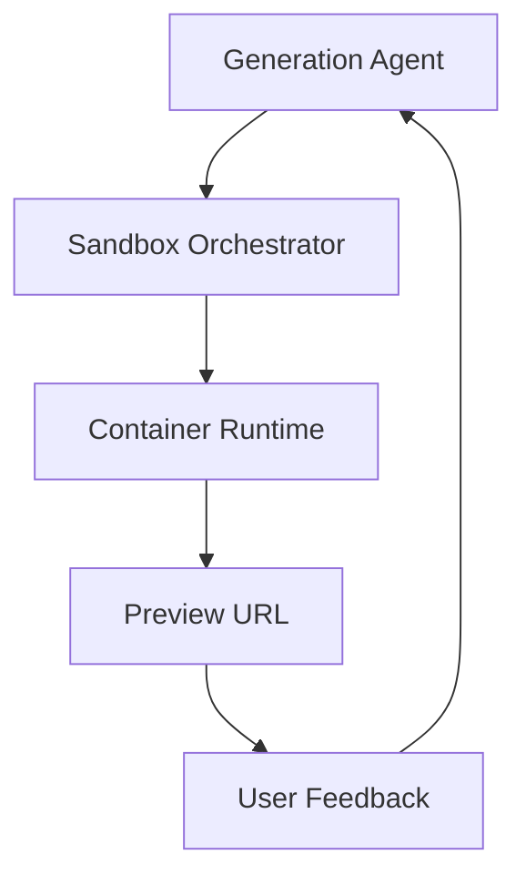
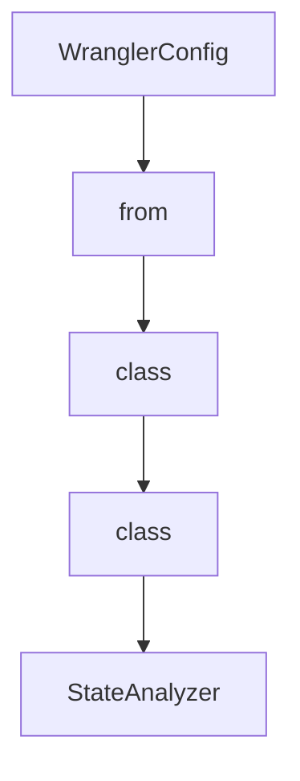

# Chapter 4: Sandbox and Preview Runtime

Welcome to **Chapter 4: Sandbox and Preview Runtime**. In this part of **VibeSDK Tutorial: Build a Vibe-Coding Platform on Cloudflare**, you will build an intuitive mental model first, then move into concrete implementation details and practical production tradeoffs.


VibeSDK runs generated projects in isolated preview runtimes so users can validate behavior before publishing.

## Learning Goals

By the end of this chapter, you should be able to:

- explain how generated code becomes a live preview URL
- tune sandbox capacity and runtime controls
- separate sandbox/runtime failures from generation-quality issues
- design a basic incident response flow for preview instability

## Runtime Flow

1. agent finishes a generation stage with runnable outputs
2. sandbox orchestration spins up or assigns a runtime instance
3. preview routing returns a URL to user session
4. runtime logs and errors feed back into fix loops
5. stable results can be promoted to deployment actions

## Isolation Model


```mermaid
graph TD
    A[Generation Agent] --> B[Sandbox Orchestrator]
    B --> C[Container Runtime]
    C --> D[Preview URL]
    D --> E[User Feedback]
    E --> A
```

## Core Runtime Controls

| Control | Why It Exists | Tuning Guidance |
|:--------|:--------------|:----------------|
| `SANDBOX_INSTANCE_TYPE` | defines CPU/RAM profile | start conservative, raise only when startup/latency data justifies |
| `MAX_SANDBOX_INSTANCES` | caps concurrent preview capacity | align with expected user concurrency and budget limits |
| tunnel/preview settings | controls preview reachability | keep defaults initially, change only with verified need |
| dispatch/deployment bindings | enables app handoff from preview to deploy | validate early in staging to avoid late surprises |

## Operational Baseline Metrics

Track these together, not in isolation:

- preview startup latency (p50 and p95)
- runtime restart/crash rate
- concurrent active preview count
- preview availability success rate
- cost per preview hour

## Triage: Generation vs Runtime

| Symptom | Likely Layer | First Check |
|:--------|:-------------|:------------|
| files look wrong before preview | generation pipeline | phase outputs and model routing |
| preview never starts | runtime/orchestration | sandbox logs and instance quotas |
| preview starts then dies | runtime stability | container restarts and resource pressure |
| preview works, deploy fails | deployment bindings/policy | dispatch namespace and credentials |

## Hardening Practices

- enforce idle cleanup and timeout policies
- isolate noisy tenant workloads when concurrency spikes
- keep a safe fallback instance profile
- include preview health in user-visible status telemetry

## Source References

- [VibeSDK Setup Guide](https://github.com/cloudflare/vibesdk/blob/main/docs/setup.md)
- [Architecture Diagrams](https://github.com/cloudflare/vibesdk/blob/main/docs/architecture-diagrams.md)

## Summary

You now have a runtime model for sandbox previews and a practical baseline for stability tuning.

Next: [Chapter 5: Data Layer and Persistence](05-data-layer-and-persistence.md)

## Source Code Walkthrough

### `scripts/undeploy.ts`

The `WranglerConfig` interface in [`scripts/undeploy.ts`](https://github.com/cloudflare/vibesdk/blob/HEAD/scripts/undeploy.ts) handles a key part of this chapter's functionality:

```ts

// Types for configuration
interface WranglerConfig {
  name: string;
  dispatch_namespaces?: Array<{
    binding: string;
    namespace: string;
    experimental_remote?: boolean;
  }>;
  r2_buckets?: Array<{
    binding: string;
    bucket_name: string;
    experimental_remote?: boolean;
  }>;
  containers?: Array<{
    class_name: string;
    image: string;
    max_instances: number;
  }>;
  d1_databases?: Array<{
    binding: string;
    database_name: string;
    database_id: string;
    migrations_dir?: string;
    experimental_remote?: boolean;
  }>;
  kv_namespaces?: Array<{
    binding: string;
    id: string;
    experimental_remote?: boolean;
  }>;
}
```

This interface is important because it defines how VibeSDK Tutorial: Build a Vibe-Coding Platform on Cloudflare implements the patterns covered in this chapter.

### `debug-tools/state_analyzer.py`

The `from` class in [`debug-tools/state_analyzer.py`](https://github.com/cloudflare/vibesdk/blob/HEAD/debug-tools/state_analyzer.py) handles a key part of this chapter's functionality:

```py
State Analyzer for SimpleGeneratorAgent setState debugging

This script parses error messages from setState failures and analyzes:
1. Size of each state property when serialized
2. Differences between old and new states
3. Main contributors to state growth
4. Detailed breakdown for debugging SQL storage issues

Usage: python state_analyzer.py <error_file_path>
"""

import json
import sys
import re
import os
from typing import Dict, Any, List, Tuple, Union
from dataclasses import dataclass
from collections import defaultdict
import difflib


@dataclass
class PropertyAnalysis:
    """Analysis results for a single property"""
    name: str
    old_size: int
    new_size: int
    old_serialized_length: int
    new_serialized_length: int
    growth_bytes: int
    growth_chars: int
    has_changed: bool
```

This class is important because it defines how VibeSDK Tutorial: Build a Vibe-Coding Platform on Cloudflare implements the patterns covered in this chapter.

### `debug-tools/state_analyzer.py`

The `class` class in [`debug-tools/state_analyzer.py`](https://github.com/cloudflare/vibesdk/blob/HEAD/debug-tools/state_analyzer.py) handles a key part of this chapter's functionality:

```py
import os
from typing import Dict, Any, List, Tuple, Union
from dataclasses import dataclass
from collections import defaultdict
import difflib


@dataclass
class PropertyAnalysis:
    """Analysis results for a single property"""
    name: str
    old_size: int
    new_size: int
    old_serialized_length: int
    new_serialized_length: int
    growth_bytes: int
    growth_chars: int
    has_changed: bool
    old_type: str
    new_type: str


@dataclass
class StateAnalysis:
    """Complete analysis of state comparison"""
    total_old_size: int
    total_new_size: int
    total_old_serialized_length: int
    total_new_serialized_length: int
    total_growth_bytes: int
    total_growth_chars: int
    property_analyses: List[PropertyAnalysis]
```

This class is important because it defines how VibeSDK Tutorial: Build a Vibe-Coding Platform on Cloudflare implements the patterns covered in this chapter.

### `debug-tools/state_analyzer.py`

The `class` class in [`debug-tools/state_analyzer.py`](https://github.com/cloudflare/vibesdk/blob/HEAD/debug-tools/state_analyzer.py) handles a key part of this chapter's functionality:

```py
import os
from typing import Dict, Any, List, Tuple, Union
from dataclasses import dataclass
from collections import defaultdict
import difflib


@dataclass
class PropertyAnalysis:
    """Analysis results for a single property"""
    name: str
    old_size: int
    new_size: int
    old_serialized_length: int
    new_serialized_length: int
    growth_bytes: int
    growth_chars: int
    has_changed: bool
    old_type: str
    new_type: str


@dataclass
class StateAnalysis:
    """Complete analysis of state comparison"""
    total_old_size: int
    total_new_size: int
    total_old_serialized_length: int
    total_new_serialized_length: int
    total_growth_bytes: int
    total_growth_chars: int
    property_analyses: List[PropertyAnalysis]
```

This class is important because it defines how VibeSDK Tutorial: Build a Vibe-Coding Platform on Cloudflare implements the patterns covered in this chapter.


## How These Components Connect


```mermaid
flowchart TD
    A[WranglerConfig]
    B[from]
    C[class]
    D[class]
    E[StateAnalyzer]
    A --> B
    B --> C
    C --> D
    D --> E
```
