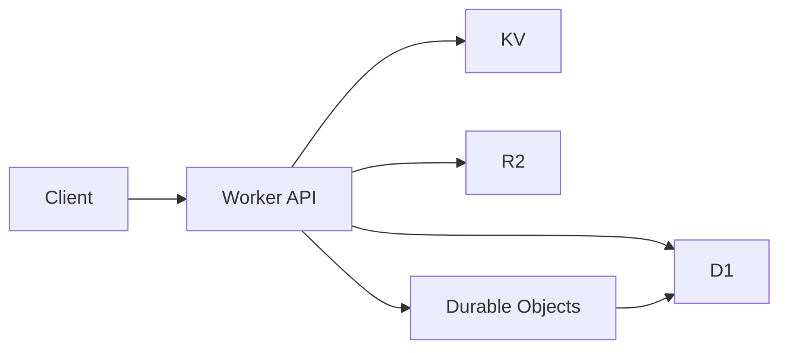

# Chapter 5: Data Layer and Persistence

VibeSDK intentionally splits persistence across D1, Durable Object state, KV, and R2.

## Storage Map

| Store | Primary Responsibility |
|:------|:-----------------------|
| D1 | relational platform and user/app metadata |
| Durable Object SQLite | per-session orchestration continuity |
| KV | session/cache-like fast key-value state |
| R2 | templates and larger object artifacts |

## Data Interaction Pattern



## Migration Workflow

```bash
bun run db:generate
bun run db:migrate:local
bun run db:migrate:remote
```

## Persistence Pitfalls

- treating preview state as durable source of truth
- unversioned schema changes during active usage
- no lifecycle policy for stale generated assets

## Summary

You now have a data-plane model for operating VibeSDK with predictable persistence behavior.

Next: [Chapter 6: API, SDK, and Integrations](06-api-sdk-and-integrations.md)
