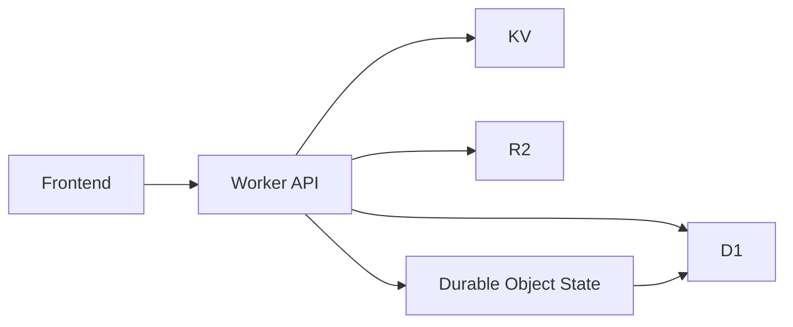

# Chapter 5: Data Layer and Persistence

Welcome to **Chapter 5: Data Layer and Persistence**. In this part of **VibeSDK Tutorial: Build a Vibe-Coding Platform on Cloudflare**, you will build an intuitive mental model first, then move into concrete implementation details and practical production tradeoffs.


VibeSDK distributes persistence across D1, KV, R2, and Durable Object state to balance consistency, speed, and operational cost.

## Learning Goals

By the end of this chapter, you should be able to:

- choose the right Cloudflare data primitive for each data class
- reason about durable vs transient platform state
- run schema migration workflows safely
- avoid common persistence anti-patterns in agent-driven systems

## Storage Responsibility Map

| Store | Best For | Avoid Using It For |
|:------|:---------|:-------------------|
| D1 | relational records: users, apps, metadata | high-frequency transient session churn |
| KV | fast key-value/session/cache state | complex relational queries |
| R2 | templates, artifact blobs, larger generated assets | strongly consistent transactional records |
| Durable Object state | in-flight orchestration continuity | long-term analytics/reporting store |

## Data Interaction Pattern



## Migration Workflow

```bash
bun run db:generate
bun run db:migrate:local
bun run db:migrate:remote
```

Treat remote migration as a controlled operation with rollback readiness.

## Practical Data Design Rules

- persist authoritative business state in D1
- use KV for speed-oriented coordination data only
- keep large generated artifacts in R2, with lifecycle cleanup
- keep Durable Object state scoped to active session execution

## Persistence Pitfalls

| Pitfall | Why It Hurts | Better Approach |
|:--------|:-------------|:----------------|
| treating preview runtime as durable truth | data disappears with runtime lifecycle | persist required state before runtime handoff |
| schema changes without staged validation | migration regressions can block platform flows | run migration rehearsals in staging |
| no artifact retention policy | storage costs and clutter grow silently | define TTL/lifecycle and cleanup jobs |
| mixing transient and durable records | query complexity and data confusion | enforce explicit store ownership per entity type |

## Data Governance Checklist

- documented ownership for each table/bucket/key namespace
- migration rollback plan for every schema change
- retention and deletion policy for generated artifacts
- periodic storage cost review by workload type

## Source References

- [VibeSDK Setup Guide](https://github.com/cloudflare/vibesdk/blob/main/docs/setup.md)
- [VibeSDK Repository](https://github.com/cloudflare/vibesdk)

## Summary

You now have a persistence model that supports reliable operations without overloading any single data layer.

Next: [Chapter 6: API, SDK, and Integrations](06-api-sdk-and-integrations.md)

## Depth Expansion Playbook

<!-- depth-expansion-v2 -->

This chapter is expanded to v1-style depth for production-grade learning and implementation quality.

### Strategic Context

- tutorial: **VibeSDK Tutorial: Build a Vibe-Coding Platform on Cloudflare**
- tutorial slug: **vibesdk-tutorial**
- chapter focus: **Chapter 5: Data Layer and Persistence**
- system context: **Vibesdk Tutorial**
- objective: move from surface-level usage to repeatable engineering operation

### Architecture Decomposition

1. Define the runtime boundary for `Chapter 5: Data Layer and Persistence`.
2. Separate control-plane decisions from data-plane execution.
3. Capture input contracts, transformation points, and output contracts.
4. Trace state transitions across request lifecycle stages.
5. Identify extension hooks and policy interception points.
6. Map ownership boundaries for team and automation workflows.
7. Specify rollback and recovery paths for unsafe changes.
8. Track observability signals for correctness, latency, and cost.

### Operator Decision Matrix

| Decision Area | Low-Risk Path | High-Control Path | Tradeoff |
|:--------------|:--------------|:------------------|:---------|
| Runtime mode | managed defaults | explicit policy config | speed vs control |
| State handling | local ephemeral | durable persisted state | simplicity vs auditability |
| Tool integration | direct API use | mediated adapter layer | velocity vs governance |
| Rollout method | manual change | staged + canary rollout | effort vs safety |
| Incident response | best effort logs | runbooks + SLO alerts | cost vs reliability |

### Failure Modes and Countermeasures

| Failure Mode | Early Signal | Root Cause Pattern | Countermeasure |
|:-------------|:-------------|:-------------------|:---------------|
| stale context | inconsistent outputs | missing refresh window | enforce context TTL and refresh hooks |
| policy drift | unexpected execution | ad hoc overrides | centralize policy profiles |
| auth mismatch | 401/403 bursts | credential sprawl | rotation schedule + scope minimization |
| schema breakage | parser/validation errors | unmanaged upstream changes | contract tests per release |
| retry storms | queue congestion | no backoff controls | jittered backoff + circuit breakers |
| silent regressions | quality drop without alerts | weak baseline metrics | eval harness with thresholds |

### Implementation Runbook

1. Establish a reproducible baseline environment.
2. Capture chapter-specific success criteria before changes.
3. Implement minimal viable path with explicit interfaces.
4. Add observability before expanding feature scope.
5. Run deterministic tests for happy-path behavior.
6. Inject failure scenarios for negative-path validation.
7. Compare output quality against baseline snapshots.
8. Promote through staged environments with rollback gates.
9. Record operational lessons in release notes.

### Quality Gate Checklist

- [ ] chapter-level assumptions are explicit and testable
- [ ] API/tool boundaries are documented with input/output examples
- [ ] failure handling includes retry, timeout, and fallback policy
- [ ] security controls include auth scopes and secret rotation plans
- [ ] observability includes logs, metrics, traces, and alert thresholds
- [ ] deployment guidance includes canary and rollback paths
- [ ] docs include links to upstream sources and related tracks
- [ ] post-release verification confirms expected behavior under load

### Source Alignment

- [VibeSDK Repository](https://github.com/cloudflare/vibesdk)
- [VibeSDK Releases](https://github.com/cloudflare/vibesdk/releases)
- [VibeSDK Setup Guide](https://github.com/cloudflare/vibesdk/blob/main/docs/setup.md)
- [VibeSDK SDK Documentation](https://github.com/cloudflare/vibesdk/blob/main/sdk/README.md)
- [Live Demo](https://build.cloudflare.dev/)

### Cross-Tutorial Connection Map

- [bolt.diy Tutorial](../bolt-diy-tutorial/)
- [Dyad Tutorial](../dyad-tutorial/)
- [Vercel AI Tutorial](../vercel-ai-tutorial/)
- [OpenHands Tutorial](../openhands-tutorial/)
- [Chapter 1: Getting Started and Deployment Paths](01-getting-started-and-deployment-paths.md)

### Advanced Practice Exercises

1. Build a minimal end-to-end implementation for `Chapter 5: Data Layer and Persistence`.
2. Add instrumentation and measure baseline latency and error rate.
3. Introduce one controlled failure and confirm graceful recovery.
4. Add policy constraints and verify they are enforced consistently.
5. Run a staged rollout and document rollback decision criteria.

### Review Questions

1. Which execution boundary matters most for this chapter and why?
2. What signal detects regressions earliest in your environment?
3. What tradeoff did you make between delivery speed and governance?
4. How would you recover from the highest-impact failure mode?
5. What must be automated before scaling to team-wide adoption?

### Scenario Playbook 1: Chapter 5: Data Layer and Persistence

- tutorial context: **VibeSDK Tutorial: Build a Vibe-Coding Platform on Cloudflare**
- trigger condition: incoming request volume spikes after release
- initial hypothesis: identify the smallest reproducible failure boundary
- immediate action: protect user-facing stability before optimization work
- engineering control: introduce adaptive concurrency limits and queue bounds
- verification target: latency p95 and p99 stay within defined SLO windows
- rollback trigger: pre-defined quality gate fails for two consecutive checks
- communication step: publish incident status with owner and ETA
- learning capture: add postmortem and convert findings into automated tests

### Scenario Playbook 2: Chapter 5: Data Layer and Persistence

- tutorial context: **VibeSDK Tutorial: Build a Vibe-Coding Platform on Cloudflare**
- trigger condition: tool dependency latency increases under concurrency
- initial hypothesis: identify the smallest reproducible failure boundary
- immediate action: protect user-facing stability before optimization work
- engineering control: enable staged retries with jitter and circuit breaker fallback
- verification target: error budget burn rate remains below escalation threshold
- rollback trigger: pre-defined quality gate fails for two consecutive checks
- communication step: publish incident status with owner and ETA
- learning capture: add postmortem and convert findings into automated tests

### Scenario Playbook 3: Chapter 5: Data Layer and Persistence

- tutorial context: **VibeSDK Tutorial: Build a Vibe-Coding Platform on Cloudflare**
- trigger condition: schema updates introduce incompatible payloads
- initial hypothesis: identify the smallest reproducible failure boundary
- immediate action: protect user-facing stability before optimization work
- engineering control: pin schema versions and add compatibility shims
- verification target: throughput remains stable under target concurrency
- rollback trigger: pre-defined quality gate fails for two consecutive checks
- communication step: publish incident status with owner and ETA
- learning capture: add postmortem and convert findings into automated tests

### Scenario Playbook 4: Chapter 5: Data Layer and Persistence

- tutorial context: **VibeSDK Tutorial: Build a Vibe-Coding Platform on Cloudflare**
- trigger condition: environment parity drifts between staging and production
- initial hypothesis: identify the smallest reproducible failure boundary
- immediate action: protect user-facing stability before optimization work
- engineering control: restore environment parity via immutable config promotion
- verification target: retry volume stays bounded without feedback loops
- rollback trigger: pre-defined quality gate fails for two consecutive checks
- communication step: publish incident status with owner and ETA
- learning capture: add postmortem and convert findings into automated tests

### Scenario Playbook 5: Chapter 5: Data Layer and Persistence

- tutorial context: **VibeSDK Tutorial: Build a Vibe-Coding Platform on Cloudflare**
- trigger condition: access policy changes reduce successful execution rates
- initial hypothesis: identify the smallest reproducible failure boundary
- immediate action: protect user-facing stability before optimization work
- engineering control: re-scope credentials and rotate leaked or stale keys
- verification target: data integrity checks pass across write/read cycles
- rollback trigger: pre-defined quality gate fails for two consecutive checks
- communication step: publish incident status with owner and ETA
- learning capture: add postmortem and convert findings into automated tests

### Scenario Playbook 6: Chapter 5: Data Layer and Persistence

- tutorial context: **VibeSDK Tutorial: Build a Vibe-Coding Platform on Cloudflare**
- trigger condition: background jobs accumulate and exceed processing windows
- initial hypothesis: identify the smallest reproducible failure boundary
- immediate action: protect user-facing stability before optimization work
- engineering control: activate degradation mode to preserve core user paths
- verification target: audit logs capture all control-plane mutations
- rollback trigger: pre-defined quality gate fails for two consecutive checks
- communication step: publish incident status with owner and ETA
- learning capture: add postmortem and convert findings into automated tests

### Scenario Playbook 7: Chapter 5: Data Layer and Persistence

- tutorial context: **VibeSDK Tutorial: Build a Vibe-Coding Platform on Cloudflare**
- trigger condition: incoming request volume spikes after release
- initial hypothesis: identify the smallest reproducible failure boundary
- immediate action: protect user-facing stability before optimization work
- engineering control: introduce adaptive concurrency limits and queue bounds
- verification target: latency p95 and p99 stay within defined SLO windows
- rollback trigger: pre-defined quality gate fails for two consecutive checks
- communication step: publish incident status with owner and ETA
- learning capture: add postmortem and convert findings into automated tests

### Scenario Playbook 8: Chapter 5: Data Layer and Persistence

- tutorial context: **VibeSDK Tutorial: Build a Vibe-Coding Platform on Cloudflare**
- trigger condition: tool dependency latency increases under concurrency
- initial hypothesis: identify the smallest reproducible failure boundary
- immediate action: protect user-facing stability before optimization work
- engineering control: enable staged retries with jitter and circuit breaker fallback
- verification target: error budget burn rate remains below escalation threshold
- rollback trigger: pre-defined quality gate fails for two consecutive checks
- communication step: publish incident status with owner and ETA
- learning capture: add postmortem and convert findings into automated tests

### Scenario Playbook 9: Chapter 5: Data Layer and Persistence

- tutorial context: **VibeSDK Tutorial: Build a Vibe-Coding Platform on Cloudflare**
- trigger condition: schema updates introduce incompatible payloads
- initial hypothesis: identify the smallest reproducible failure boundary
- immediate action: protect user-facing stability before optimization work
- engineering control: pin schema versions and add compatibility shims
- verification target: throughput remains stable under target concurrency
- rollback trigger: pre-defined quality gate fails for two consecutive checks
- communication step: publish incident status with owner and ETA
- learning capture: add postmortem and convert findings into automated tests

### Scenario Playbook 10: Chapter 5: Data Layer and Persistence

- tutorial context: **VibeSDK Tutorial: Build a Vibe-Coding Platform on Cloudflare**
- trigger condition: environment parity drifts between staging and production
- initial hypothesis: identify the smallest reproducible failure boundary
- immediate action: protect user-facing stability before optimization work
- engineering control: restore environment parity via immutable config promotion
- verification target: retry volume stays bounded without feedback loops
- rollback trigger: pre-defined quality gate fails for two consecutive checks
- communication step: publish incident status with owner and ETA
- learning capture: add postmortem and convert findings into automated tests

### Scenario Playbook 11: Chapter 5: Data Layer and Persistence

- tutorial context: **VibeSDK Tutorial: Build a Vibe-Coding Platform on Cloudflare**
- trigger condition: access policy changes reduce successful execution rates
- initial hypothesis: identify the smallest reproducible failure boundary
- immediate action: protect user-facing stability before optimization work
- engineering control: re-scope credentials and rotate leaked or stale keys
- verification target: data integrity checks pass across write/read cycles
- rollback trigger: pre-defined quality gate fails for two consecutive checks
- communication step: publish incident status with owner and ETA
- learning capture: add postmortem and convert findings into automated tests

### Scenario Playbook 12: Chapter 5: Data Layer and Persistence

- tutorial context: **VibeSDK Tutorial: Build a Vibe-Coding Platform on Cloudflare**
- trigger condition: background jobs accumulate and exceed processing windows
- initial hypothesis: identify the smallest reproducible failure boundary
- immediate action: protect user-facing stability before optimization work
- engineering control: activate degradation mode to preserve core user paths
- verification target: audit logs capture all control-plane mutations
- rollback trigger: pre-defined quality gate fails for two consecutive checks
- communication step: publish incident status with owner and ETA
- learning capture: add postmortem and convert findings into automated tests

### Scenario Playbook 13: Chapter 5: Data Layer and Persistence

- tutorial context: **VibeSDK Tutorial: Build a Vibe-Coding Platform on Cloudflare**
- trigger condition: incoming request volume spikes after release
- initial hypothesis: identify the smallest reproducible failure boundary
- immediate action: protect user-facing stability before optimization work
- engineering control: introduce adaptive concurrency limits and queue bounds
- verification target: latency p95 and p99 stay within defined SLO windows
- rollback trigger: pre-defined quality gate fails for two consecutive checks
- communication step: publish incident status with owner and ETA
- learning capture: add postmortem and convert findings into automated tests

### Scenario Playbook 14: Chapter 5: Data Layer and Persistence

- tutorial context: **VibeSDK Tutorial: Build a Vibe-Coding Platform on Cloudflare**
- trigger condition: tool dependency latency increases under concurrency
- initial hypothesis: identify the smallest reproducible failure boundary
- immediate action: protect user-facing stability before optimization work
- engineering control: enable staged retries with jitter and circuit breaker fallback
- verification target: error budget burn rate remains below escalation threshold
- rollback trigger: pre-defined quality gate fails for two consecutive checks
- communication step: publish incident status with owner and ETA
- learning capture: add postmortem and convert findings into automated tests

### Scenario Playbook 15: Chapter 5: Data Layer and Persistence

- tutorial context: **VibeSDK Tutorial: Build a Vibe-Coding Platform on Cloudflare**
- trigger condition: schema updates introduce incompatible payloads
- initial hypothesis: identify the smallest reproducible failure boundary
- immediate action: protect user-facing stability before optimization work
- engineering control: pin schema versions and add compatibility shims
- verification target: throughput remains stable under target concurrency
- rollback trigger: pre-defined quality gate fails for two consecutive checks
- communication step: publish incident status with owner and ETA
- learning capture: add postmortem and convert findings into automated tests

### Scenario Playbook 16: Chapter 5: Data Layer and Persistence

- tutorial context: **VibeSDK Tutorial: Build a Vibe-Coding Platform on Cloudflare**
- trigger condition: environment parity drifts between staging and production
- initial hypothesis: identify the smallest reproducible failure boundary
- immediate action: protect user-facing stability before optimization work
- engineering control: restore environment parity via immutable config promotion
- verification target: retry volume stays bounded without feedback loops
- rollback trigger: pre-defined quality gate fails for two consecutive checks
- communication step: publish incident status with owner and ETA
- learning capture: add postmortem and convert findings into automated tests

### Scenario Playbook 17: Chapter 5: Data Layer and Persistence

- tutorial context: **VibeSDK Tutorial: Build a Vibe-Coding Platform on Cloudflare**
- trigger condition: access policy changes reduce successful execution rates
- initial hypothesis: identify the smallest reproducible failure boundary
- immediate action: protect user-facing stability before optimization work
- engineering control: re-scope credentials and rotate leaked or stale keys
- verification target: data integrity checks pass across write/read cycles
- rollback trigger: pre-defined quality gate fails for two consecutive checks
- communication step: publish incident status with owner and ETA
- learning capture: add postmortem and convert findings into automated tests

### Scenario Playbook 18: Chapter 5: Data Layer and Persistence

- tutorial context: **VibeSDK Tutorial: Build a Vibe-Coding Platform on Cloudflare**
- trigger condition: background jobs accumulate and exceed processing windows
- initial hypothesis: identify the smallest reproducible failure boundary
- immediate action: protect user-facing stability before optimization work
- engineering control: activate degradation mode to preserve core user paths
- verification target: audit logs capture all control-plane mutations
- rollback trigger: pre-defined quality gate fails for two consecutive checks
- communication step: publish incident status with owner and ETA
- learning capture: add postmortem and convert findings into automated tests

### Scenario Playbook 19: Chapter 5: Data Layer and Persistence

- tutorial context: **VibeSDK Tutorial: Build a Vibe-Coding Platform on Cloudflare**
- trigger condition: incoming request volume spikes after release
- initial hypothesis: identify the smallest reproducible failure boundary
- immediate action: protect user-facing stability before optimization work
- engineering control: introduce adaptive concurrency limits and queue bounds
- verification target: latency p95 and p99 stay within defined SLO windows
- rollback trigger: pre-defined quality gate fails for two consecutive checks
- communication step: publish incident status with owner and ETA
- learning capture: add postmortem and convert findings into automated tests

### Scenario Playbook 20: Chapter 5: Data Layer and Persistence

- tutorial context: **VibeSDK Tutorial: Build a Vibe-Coding Platform on Cloudflare**
- trigger condition: tool dependency latency increases under concurrency
- initial hypothesis: identify the smallest reproducible failure boundary
- immediate action: protect user-facing stability before optimization work
- engineering control: enable staged retries with jitter and circuit breaker fallback
- verification target: error budget burn rate remains below escalation threshold
- rollback trigger: pre-defined quality gate fails for two consecutive checks
- communication step: publish incident status with owner and ETA
- learning capture: add postmortem and convert findings into automated tests

### Scenario Playbook 21: Chapter 5: Data Layer and Persistence

- tutorial context: **VibeSDK Tutorial: Build a Vibe-Coding Platform on Cloudflare**
- trigger condition: schema updates introduce incompatible payloads
- initial hypothesis: identify the smallest reproducible failure boundary
- immediate action: protect user-facing stability before optimization work
- engineering control: pin schema versions and add compatibility shims
- verification target: throughput remains stable under target concurrency
- rollback trigger: pre-defined quality gate fails for two consecutive checks
- communication step: publish incident status with owner and ETA
- learning capture: add postmortem and convert findings into automated tests

### Scenario Playbook 22: Chapter 5: Data Layer and Persistence

- tutorial context: **VibeSDK Tutorial: Build a Vibe-Coding Platform on Cloudflare**
- trigger condition: environment parity drifts between staging and production
- initial hypothesis: identify the smallest reproducible failure boundary
- immediate action: protect user-facing stability before optimization work
- engineering control: restore environment parity via immutable config promotion
- verification target: retry volume stays bounded without feedback loops
- rollback trigger: pre-defined quality gate fails for two consecutive checks
- communication step: publish incident status with owner and ETA
- learning capture: add postmortem and convert findings into automated tests

### Scenario Playbook 23: Chapter 5: Data Layer and Persistence

- tutorial context: **VibeSDK Tutorial: Build a Vibe-Coding Platform on Cloudflare**
- trigger condition: access policy changes reduce successful execution rates
- initial hypothesis: identify the smallest reproducible failure boundary
- immediate action: protect user-facing stability before optimization work
- engineering control: re-scope credentials and rotate leaked or stale keys
- verification target: data integrity checks pass across write/read cycles
- rollback trigger: pre-defined quality gate fails for two consecutive checks
- communication step: publish incident status with owner and ETA
- learning capture: add postmortem and convert findings into automated tests

### Scenario Playbook 24: Chapter 5: Data Layer and Persistence

- tutorial context: **VibeSDK Tutorial: Build a Vibe-Coding Platform on Cloudflare**
- trigger condition: background jobs accumulate and exceed processing windows
- initial hypothesis: identify the smallest reproducible failure boundary
- immediate action: protect user-facing stability before optimization work
- engineering control: activate degradation mode to preserve core user paths
- verification target: audit logs capture all control-plane mutations
- rollback trigger: pre-defined quality gate fails for two consecutive checks
- communication step: publish incident status with owner and ETA
- learning capture: add postmortem and convert findings into automated tests

### Scenario Playbook 25: Chapter 5: Data Layer and Persistence

- tutorial context: **VibeSDK Tutorial: Build a Vibe-Coding Platform on Cloudflare**
- trigger condition: incoming request volume spikes after release
- initial hypothesis: identify the smallest reproducible failure boundary
- immediate action: protect user-facing stability before optimization work
- engineering control: introduce adaptive concurrency limits and queue bounds
- verification target: latency p95 and p99 stay within defined SLO windows
- rollback trigger: pre-defined quality gate fails for two consecutive checks
- communication step: publish incident status with owner and ETA
- learning capture: add postmortem and convert findings into automated tests

### Scenario Playbook 26: Chapter 5: Data Layer and Persistence

- tutorial context: **VibeSDK Tutorial: Build a Vibe-Coding Platform on Cloudflare**
- trigger condition: tool dependency latency increases under concurrency
- initial hypothesis: identify the smallest reproducible failure boundary
- immediate action: protect user-facing stability before optimization work
- engineering control: enable staged retries with jitter and circuit breaker fallback
- verification target: error budget burn rate remains below escalation threshold
- rollback trigger: pre-defined quality gate fails for two consecutive checks
- communication step: publish incident status with owner and ETA
- learning capture: add postmortem and convert findings into automated tests

### Scenario Playbook 27: Chapter 5: Data Layer and Persistence

- tutorial context: **VibeSDK Tutorial: Build a Vibe-Coding Platform on Cloudflare**
- trigger condition: schema updates introduce incompatible payloads
- initial hypothesis: identify the smallest reproducible failure boundary
- immediate action: protect user-facing stability before optimization work
- engineering control: pin schema versions and add compatibility shims
- verification target: throughput remains stable under target concurrency
- rollback trigger: pre-defined quality gate fails for two consecutive checks
- communication step: publish incident status with owner and ETA
- learning capture: add postmortem and convert findings into automated tests

### Scenario Playbook 28: Chapter 5: Data Layer and Persistence

- tutorial context: **VibeSDK Tutorial: Build a Vibe-Coding Platform on Cloudflare**
- trigger condition: environment parity drifts between staging and production
- initial hypothesis: identify the smallest reproducible failure boundary
- immediate action: protect user-facing stability before optimization work
- engineering control: restore environment parity via immutable config promotion
- verification target: retry volume stays bounded without feedback loops
- rollback trigger: pre-defined quality gate fails for two consecutive checks
- communication step: publish incident status with owner and ETA
- learning capture: add postmortem and convert findings into automated tests

### Scenario Playbook 29: Chapter 5: Data Layer and Persistence

- tutorial context: **VibeSDK Tutorial: Build a Vibe-Coding Platform on Cloudflare**
- trigger condition: access policy changes reduce successful execution rates
- initial hypothesis: identify the smallest reproducible failure boundary
- immediate action: protect user-facing stability before optimization work
- engineering control: re-scope credentials and rotate leaked or stale keys
- verification target: data integrity checks pass across write/read cycles
- rollback trigger: pre-defined quality gate fails for two consecutive checks
- communication step: publish incident status with owner and ETA
- learning capture: add postmortem and convert findings into automated tests

### Scenario Playbook 30: Chapter 5: Data Layer and Persistence

- tutorial context: **VibeSDK Tutorial: Build a Vibe-Coding Platform on Cloudflare**
- trigger condition: background jobs accumulate and exceed processing windows
- initial hypothesis: identify the smallest reproducible failure boundary
- immediate action: protect user-facing stability before optimization work
- engineering control: activate degradation mode to preserve core user paths
- verification target: audit logs capture all control-plane mutations
- rollback trigger: pre-defined quality gate fails for two consecutive checks
- communication step: publish incident status with owner and ETA
- learning capture: add postmortem and convert findings into automated tests

### Scenario Playbook 31: Chapter 5: Data Layer and Persistence

- tutorial context: **VibeSDK Tutorial: Build a Vibe-Coding Platform on Cloudflare**
- trigger condition: incoming request volume spikes after release
- initial hypothesis: identify the smallest reproducible failure boundary
- immediate action: protect user-facing stability before optimization work
- engineering control: introduce adaptive concurrency limits and queue bounds
- verification target: latency p95 and p99 stay within defined SLO windows
- rollback trigger: pre-defined quality gate fails for two consecutive checks
- communication step: publish incident status with owner and ETA
- learning capture: add postmortem and convert findings into automated tests

### Scenario Playbook 32: Chapter 5: Data Layer and Persistence

- tutorial context: **VibeSDK Tutorial: Build a Vibe-Coding Platform on Cloudflare**
- trigger condition: tool dependency latency increases under concurrency
- initial hypothesis: identify the smallest reproducible failure boundary
- immediate action: protect user-facing stability before optimization work
- engineering control: enable staged retries with jitter and circuit breaker fallback
- verification target: error budget burn rate remains below escalation threshold
- rollback trigger: pre-defined quality gate fails for two consecutive checks
- communication step: publish incident status with owner and ETA
- learning capture: add postmortem and convert findings into automated tests

### Scenario Playbook 33: Chapter 5: Data Layer and Persistence

- tutorial context: **VibeSDK Tutorial: Build a Vibe-Coding Platform on Cloudflare**
- trigger condition: schema updates introduce incompatible payloads
- initial hypothesis: identify the smallest reproducible failure boundary
- immediate action: protect user-facing stability before optimization work
- engineering control: pin schema versions and add compatibility shims
- verification target: throughput remains stable under target concurrency
- rollback trigger: pre-defined quality gate fails for two consecutive checks
- communication step: publish incident status with owner and ETA
- learning capture: add postmortem and convert findings into automated tests

## What Problem Does This Solve?

Most teams struggle here because the hard part is not writing more code, but deciding clear boundaries for `migrate`, `graph`, `Frontend` so behavior stays predictable as complexity grows.

In practical terms, this chapter helps you avoid three common failures:

- coupling core logic too tightly to one implementation path
- missing the handoff boundaries between setup, execution, and validation
- shipping changes without clear rollback or observability strategy

After working through this chapter, you should be able to reason about `Chapter 5: Data Layer and Persistence` as an operating subsystem inside **VibeSDK Tutorial: Build a Vibe-Coding Platform on Cloudflare**, with explicit contracts for inputs, state transitions, and outputs.

Use the implementation notes around `Worker`, `Durable`, `Object` as your checklist when adapting these patterns to your own repository.

## How it Works Under the Hood

Under the hood, `Chapter 5: Data Layer and Persistence` usually follows a repeatable control path:

1. **Context bootstrap**: initialize runtime config and prerequisites for `migrate`.
2. **Input normalization**: shape incoming data so `graph` receives stable contracts.
3. **Core execution**: run the main logic branch and propagate intermediate state through `Frontend`.
4. **Policy and safety checks**: enforce limits, auth scopes, and failure boundaries.
5. **Output composition**: return canonical result payloads for downstream consumers.
6. **Operational telemetry**: emit logs/metrics needed for debugging and performance tuning.

When debugging, walk this sequence in order and confirm each stage has explicit success/failure conditions.

## Source Walkthrough

Use the following upstream sources to verify implementation details while reading this chapter:

- [VibeSDK Repository](https://github.com/cloudflare/vibesdk)
  Why it matters: authoritative reference on `VibeSDK Repository` (github.com).
- [VibeSDK Releases](https://github.com/cloudflare/vibesdk/releases)
  Why it matters: authoritative reference on `VibeSDK Releases` (github.com).
- [VibeSDK Setup Guide](https://github.com/cloudflare/vibesdk/blob/main/docs/setup.md)
  Why it matters: authoritative reference on `VibeSDK Setup Guide` (github.com).
- [VibeSDK SDK Documentation](https://github.com/cloudflare/vibesdk/blob/main/sdk/README.md)
  Why it matters: authoritative reference on `VibeSDK SDK Documentation` (github.com).
- [Live Demo](https://build.cloudflare.dev/)
  Why it matters: authoritative reference on `Live Demo` (build.cloudflare.dev).

Suggested trace strategy:
- search upstream code for `migrate` and `graph` to map concrete implementation paths
- compare docs claims against actual runtime/config code before reusing patterns in production

## Chapter Connections

- [Tutorial Index](index.md)
- [Previous Chapter: Chapter 4: Sandbox and Preview Runtime](04-sandbox-and-preview-runtime.md)
- [Next Chapter: Chapter 6: API, SDK, and Integrations](06-api-sdk-and-integrations.md)
- [Main Catalog](../../README.md#-tutorial-catalog)
- [A-Z Tutorial Directory](../../discoverability/tutorial-directory.md)
