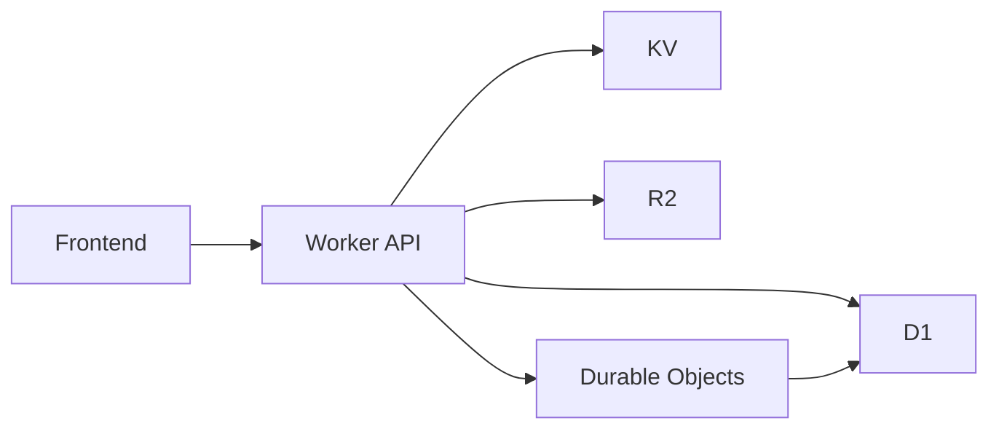

# Chapter 5: Data Layer and Persistence

VibeSDK combines multiple Cloudflare storage primitives, each with a specific purpose.

## Storage Roles

| Store | Primary Purpose |
|:------|:----------------|
| D1 | relational app/user state and platform records |
| Durable Object SQLite state | per-agent workflow continuity |
| KV | session/cache style fast key-value access |
| R2 | templates and larger object assets |

## Data Flow Pattern

## Migration and Schema Workflow

Typical lifecycle:

1. generate migration artifacts
2. apply local migrations for validation
3. run remote migrations in controlled rollout
4. monitor for runtime query/regression issues

Useful scripts from `package.json`:

- `bun run db:generate`
- `bun run db:migrate:local`
- `bun run db:migrate:remote`

## Persistence Pitfalls

- mixing ephemeral preview state with durable records
- skipping backward-compatible migration planning
- lacking cleanup policies for stale generated assets

## Summary

You now understand how VibeSDK composes D1, KV, R2, and Durable Object storage into one operational data plane.

Next: [Chapter 6: API, SDK, and Integrations](06-api-sdk-and-integrations.md)
