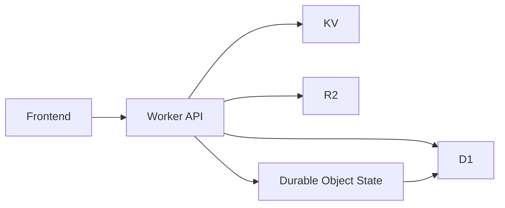

# Chapter 5: Data Layer and Persistence

VibeSDK distributes persistence across D1, KV, R2, and Durable Object state to balance consistency, speed, and operational cost.

## Learning Goals

By the end of this chapter, you should be able to:

- choose the right Cloudflare data primitive for each data class
- reason about durable vs transient platform state
- run schema migration workflows safely
- avoid common persistence anti-patterns in agent-driven systems

## Storage Responsibility Map

| Store | Best For | Avoid Using It For |
|:------|:---------|:-------------------|
| D1 | relational records: users, apps, metadata | high-frequency transient session churn |
| KV | fast key-value/session/cache state | complex relational queries |
| R2 | templates, artifact blobs, larger generated assets | strongly consistent transactional records |
| Durable Object state | in-flight orchestration continuity | long-term analytics/reporting store |

## Data Interaction Pattern



## Migration Workflow

```bash
bun run db:generate
bun run db:migrate:local
bun run db:migrate:remote
```

Treat remote migration as a controlled operation with rollback readiness.

## Practical Data Design Rules

- persist authoritative business state in D1
- use KV for speed-oriented coordination data only
- keep large generated artifacts in R2, with lifecycle cleanup
- keep Durable Object state scoped to active session execution

## Persistence Pitfalls

| Pitfall | Why It Hurts | Better Approach |
|:--------|:-------------|:----------------|
| treating preview runtime as durable truth | data disappears with runtime lifecycle | persist required state before runtime handoff |
| schema changes without staged validation | migration regressions can block platform flows | run migration rehearsals in staging |
| no artifact retention policy | storage costs and clutter grow silently | define TTL/lifecycle and cleanup jobs |
| mixing transient and durable records | query complexity and data confusion | enforce explicit store ownership per entity type |

## Data Governance Checklist

- documented ownership for each table/bucket/key namespace
- migration rollback plan for every schema change
- retention and deletion policy for generated artifacts
- periodic storage cost review by workload type

## Source References

- [VibeSDK Setup Guide](https://github.com/cloudflare/vibesdk/blob/main/docs/setup.md)
- [VibeSDK Repository](https://github.com/cloudflare/vibesdk)

## Summary

You now have a persistence model that supports reliable operations without overloading any single data layer.

Next: [Chapter 6: API, SDK, and Integrations](06-api-sdk-and-integrations.md)
