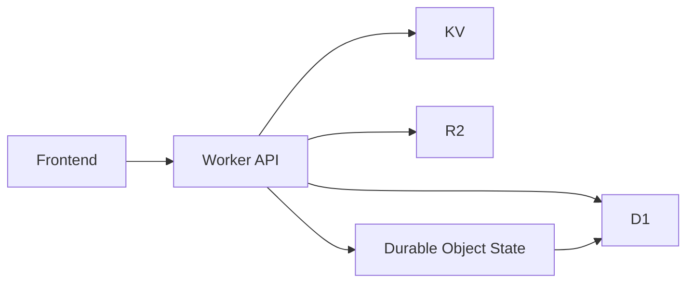
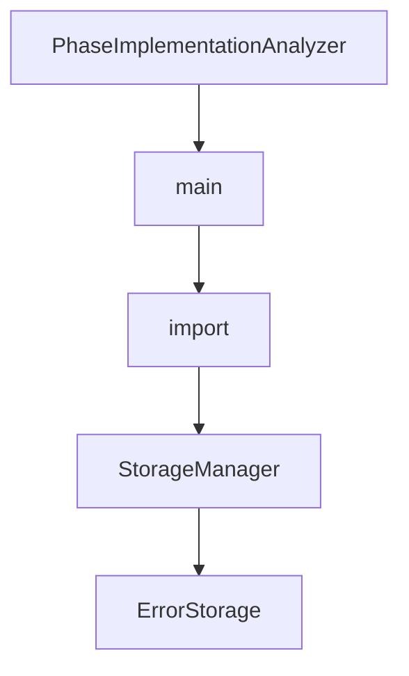

# Chapter 5: Data Layer and Persistence

Welcome to **Chapter 5: Data Layer and Persistence**. In this part of **VibeSDK Tutorial: Build a Vibe-Coding Platform on Cloudflare**, you will build an intuitive mental model first, then move into concrete implementation details and practical production tradeoffs.


VibeSDK distributes persistence across D1, KV, R2, and Durable Object state to balance consistency, speed, and operational cost.

## Learning Goals

By the end of this chapter, you should be able to:

- choose the right Cloudflare data primitive for each data class
- reason about durable vs transient platform state
- run schema migration workflows safely
- avoid common persistence anti-patterns in agent-driven systems

## Storage Responsibility Map

| Store | Best For | Avoid Using It For |
|:------|:---------|:-------------------|
| D1 | relational records: users, apps, metadata | high-frequency transient session churn |
| KV | fast key-value/session/cache state | complex relational queries |
| R2 | templates, artifact blobs, larger generated assets | strongly consistent transactional records |
| Durable Object state | in-flight orchestration continuity | long-term analytics/reporting store |

## Data Interaction Pattern


```mermaid
graph LR
    UI[Frontend] --> API[Worker API]
    API --> D1[D1]
    API --> KV[KV]
    API --> R2[R2]
    API --> DO[Durable Object State]
    DO --> D1
```

## Migration Workflow

```bash
bun run db:generate
bun run db:migrate:local
bun run db:migrate:remote
```

Treat remote migration as a controlled operation with rollback readiness.

## Practical Data Design Rules

- persist authoritative business state in D1
- use KV for speed-oriented coordination data only
- keep large generated artifacts in R2, with lifecycle cleanup
- keep Durable Object state scoped to active session execution

## Persistence Pitfalls

| Pitfall | Why It Hurts | Better Approach |
|:--------|:-------------|:----------------|
| treating preview runtime as durable truth | data disappears with runtime lifecycle | persist required state before runtime handoff |
| schema changes without staged validation | migration regressions can block platform flows | run migration rehearsals in staging |
| no artifact retention policy | storage costs and clutter grow silently | define TTL/lifecycle and cleanup jobs |
| mixing transient and durable records | query complexity and data confusion | enforce explicit store ownership per entity type |

## Data Governance Checklist

- documented ownership for each table/bucket/key namespace
- migration rollback plan for every schema change
- retention and deletion policy for generated artifacts
- periodic storage cost review by workload type

## Source References

- [VibeSDK Setup Guide](https://github.com/cloudflare/vibesdk/blob/main/docs/setup.md)
- [VibeSDK Repository](https://github.com/cloudflare/vibesdk)

## Summary

You now have a persistence model that supports reliable operations without overloading any single data layer.

Next: [Chapter 6: API, SDK, and Integrations](06-api-sdk-and-integrations.md)

## Depth Expansion Playbook

## Source Code Walkthrough

### `debug-tools/ai_request_analyzer_v2.py`

The `PhaseImplementationAnalyzer` class in [`debug-tools/ai_request_analyzer_v2.py`](https://github.com/cloudflare/vibesdk/blob/HEAD/debug-tools/ai_request_analyzer_v2.py) handles a key part of this chapter's functionality:

```py


class PhaseImplementationAnalyzer:
    """Main type-safe analyzer for Phase Implementation requests."""
    
    def __init__(self):
        self.scof_parser = SCOFParser()
        self.dependency_parser = DependencyParser()
        self.template_parser = TemplateParser()
        
        self.prompt_patterns = self._get_prompt_patterns()
    
    def _get_prompt_patterns(self) -> Dict[ComponentName, Tuple[str, str]]:
        """Get prompt component patterns."""
        return {
            ComponentName.ROLE_SECTION: ('<ROLE>', '</ROLE>'),
            ComponentName.GOAL_SECTION: ('<GOAL>', '</GOAL>'),
            ComponentName.CONTEXT_SECTION: ('<CONTEXT>', '</CONTEXT>'),
            ComponentName.CLIENT_REQUEST: ('<CLIENT REQUEST>', '</CLIENT REQUEST>'),
            ComponentName.BLUEPRINT: ('<BLUEPRINT>', '</BLUEPRINT>'),
            # Use more specific pattern for DEPENDENCIES to avoid matching references
            ComponentName.DEPENDENCIES: ('<DEPENDENCIES>\n**Available Dependencies:**', '</DEPENDENCIES>'),
            ComponentName.STRATEGY: ('<PHASES GENERATION STRATEGY>', '</PHASES GENERATION STRATEGY>'),
            ComponentName.PROJECT_CONTEXT: ('<PROJECT CONTEXT>', '</PROJECT CONTEXT>'),
            ComponentName.COMPLETED_PHASES: ('<COMPLETED PHASES>', '</COMPLETED PHASES>'),
            ComponentName.CODEBASE: ('<CODEBASE>', '</CODEBASE>'),
            ComponentName.CURRENT_PHASE: ('<CURRENT_PHASE>', '</CURRENT_PHASE>'),
            ComponentName.INSTRUCTIONS: ('<INSTRUCTIONS & CODE QUALITY STANDARDS>', '</INSTRUCTIONS & CODE QUALITY STANDARDS>'),
        }
    
    def analyze_request(self, json_path: str) -> RequestAnalysis:
        """Analyze AI request with full type safety."""
```

This class is important because it defines how VibeSDK Tutorial: Build a Vibe-Coding Platform on Cloudflare implements the patterns covered in this chapter.

### `debug-tools/ai_request_analyzer_v2.py`

The `main` function in [`debug-tools/ai_request_analyzer_v2.py`](https://github.com/cloudflare/vibesdk/blob/HEAD/debug-tools/ai_request_analyzer_v2.py) handles a key part of this chapter's functionality:

```py


def main():
    """Main CLI entry point with proper error handling."""
    parser = argparse.ArgumentParser(
        description="Type-safe AI Gateway request analyzer for PhaseImplementation",
        formatter_class=argparse.RawDescriptionHelpFormatter,
        epilog="""
Examples:
  python ai_request_analyzer_v2.py sample-request.json --detailed
  python ai_request_analyzer_v2.py sample-request.json --export analysis.json
        """
    )
    
    parser.add_argument('request_file', help='Path to the JSON request file')
    parser.add_argument('--detailed', '-d', action='store_true', 
                       help='Print detailed analysis')
    parser.add_argument('--export', '-e', help='Export analysis to JSON file')
    
    args = parser.parse_args()
    
    # Validate input
    if not Path(args.request_file).exists():
        print(f"❌ Error: Request file not found: {args.request_file}")
        sys.exit(1)
    
    try:
        # Run analysis
        analyzer = PhaseImplementationAnalyzer()
        analysis = analyzer.analyze_request(args.request_file)
        
        # Print results
```

This function is important because it defines how VibeSDK Tutorial: Build a Vibe-Coding Platform on Cloudflare implements the patterns covered in this chapter.

### `debug-tools/ai_request_analyzer_v2.py`

The `import` interface in [`debug-tools/ai_request_analyzer_v2.py`](https://github.com/cloudflare/vibesdk/blob/HEAD/debug-tools/ai_request_analyzer_v2.py) handles a key part of this chapter's functionality:

```py
"""

import json
import sys
import re
from dataclasses import dataclass, field
from typing import Dict, List, Any, Optional, Tuple, Union, TypedDict, Protocol
from pathlib import Path
import argparse
from collections import defaultdict, Counter
import math
from enum import Enum
from abc import ABC, abstractmethod


class ContentType(Enum):
    """Enumeration for content types."""
    SOURCE_CODE = "source_code"
    JSON_DATA = "json_data" 
    MARKDOWN_STRUCTURED = "markdown_structured"
    LARGE_TEXT = "large_text"
    METADATA = "metadata"
    PROSE = "prose"


class ComponentName(Enum):
    """Enumeration for component names."""
    ROLE_SECTION = "role_section"
    GOAL_SECTION = "goal_section"
    CONTEXT_SECTION = "context_section"
    CLIENT_REQUEST = "client_request"
    BLUEPRINT = "blueprint"
```

This interface is important because it defines how VibeSDK Tutorial: Build a Vibe-Coding Platform on Cloudflare implements the patterns covered in this chapter.

### `container/storage.ts`

The `StorageManager` class in [`container/storage.ts`](https://github.com/cloudflare/vibesdk/blob/HEAD/container/storage.ts) handles a key part of this chapter's functionality:

```ts
 * Unified storage manager with shared database connections and optimized operations
 */
export class StorageManager {
  private errorDb: Database;
  private logDb: Database;
  private errorStorage: ErrorStorage;
  private logStorage: LogStorage;
  private options: {
    error: Required<ErrorStoreOptions>;
    log: Required<LogStoreOptions>;
  };

  constructor(
    errorDbPath: string = getErrorDbPath(),
    logDbPath: string = getLogDbPath(),
    options: { error?: ErrorStoreOptions; log?: LogStoreOptions } = {}
  ) {
    this.options = {
      error: { ...DEFAULT_STORAGE_OPTIONS, ...options.error } as Required<ErrorStoreOptions>,
      log: { ...DEFAULT_LOG_STORE_OPTIONS, ...options.log } as Required<LogStoreOptions>
    };

    this.ensureDataDirectory(errorDbPath);
    if (errorDbPath !== logDbPath) {
      this.ensureDataDirectory(logDbPath);
    }

    this.errorDb = this.initializeDatabase(errorDbPath);
    this.logDb = errorDbPath === logDbPath ? this.errorDb : this.initializeDatabase(logDbPath);

    this.errorStorage = new ErrorStorage(this.errorDb, this.options.error);
    this.logStorage = new LogStorage(this.logDb, this.options.log);
```

This class is important because it defines how VibeSDK Tutorial: Build a Vibe-Coding Platform on Cloudflare implements the patterns covered in this chapter.


## How These Components Connect


```mermaid
flowchart TD
    A[PhaseImplementationAnalyzer]
    B[main]
    C[import]
    D[StorageManager]
    E[ErrorStorage]
    A --> B
    B --> C
    C --> D
    D --> E
```
