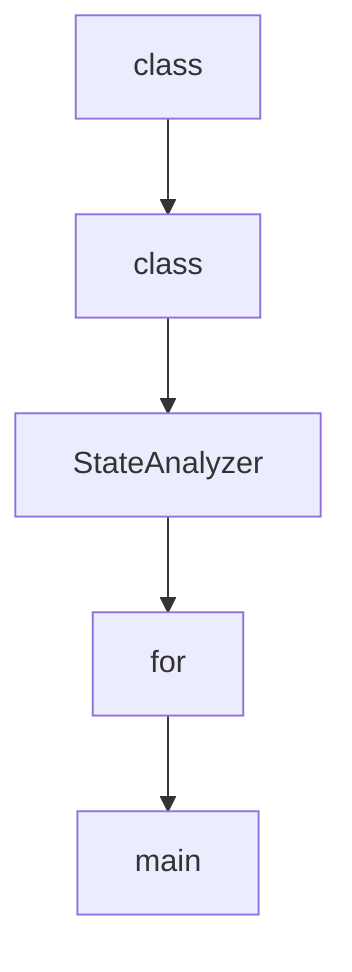

# Chapter 6: API, SDK, and Integrations

Welcome to **Chapter 6: API, SDK, and Integrations**. In this part of **VibeSDK Tutorial: Build a Vibe-Coding Platform on Cloudflare**, you will build an intuitive mental model first, then move into concrete implementation details and practical production tradeoffs.


VibeSDK can be embedded into workflows beyond the chat UI through APIs, the official TypeScript SDK, and automated handoff flows.

## Learning Goals

By the end of this chapter, you should be able to:

- use `@cf-vibesdk/sdk` for programmatic app generation
- choose between phasic and agentic behavior modes
- automate build, wait, preview, and export workflows
- integrate VibeSDK into CI and internal platform operations

## SDK Installation

```bash
npm install @cf-vibesdk/sdk
```

## Minimal SDK Flow

```ts
import { PhasicClient } from '@cf-vibesdk/sdk';

const client = new PhasicClient({
  baseUrl: 'https://build.cloudflare.dev',
  apiKey: process.env.VIBESDK_API_KEY!,
});

const session = await client.build('Build a landing page with auth', {
  projectType: 'app',
  autoGenerate: true,
});

await session.wait.deployable();
session.deployPreview();
await session.wait.previewDeployed();
session.close();
```

## Integration Surfaces

| Surface | Primary Use Case |
|:--------|:-----------------|
| SDK (`PhasicClient`, `AgenticClient`) | scriptable generation and lifecycle automation |
| API routes/controllers | internal governance and operational controls |
| deploy/export tooling | repository handoff and developer workflow integration |
| Postman docs assets | quick API validation and team onboarding |

## Behavior Mode Selection

| Mode | Best For | Risk Profile |
|:-----|:---------|:-------------|
| phasic | controlled enterprise pipelines | slower iteration, higher predictability |
| agentic | exploratory generation and rapid iteration | higher variability, needs stronger guardrails |

## CI-Friendly Automation Pattern

1. trigger build from internal service or pipeline job
2. wait for deployable milestone
3. run policy checks (security, quality, ownership)
4. deploy preview and run smoke tests
5. export/handoff to repo with traceable metadata

## Reliability Practices for Integrations

- always implement timeout and retry handling around wait helpers
- close sessions explicitly to avoid resource leaks
- persist build session metadata for debugging and audit
- separate API keys for automation workloads vs human UI usage

## Source References

- [VibeSDK SDK README](https://github.com/cloudflare/vibesdk/blob/main/sdk/README.md)
- [Postman Collection README](https://github.com/cloudflare/vibesdk/blob/main/docs/POSTMAN_COLLECTION_README.md)
- [VibeSDK Repository](https://github.com/cloudflare/vibesdk)

## Summary

You now have a practical integration model for embedding VibeSDK into programmatic workflows and CI paths.

Next: [Chapter 7: Security, Auth, and Governance](07-security-auth-and-governance.md)

## Depth Expansion Playbook

## Source Code Walkthrough

### `debug-tools/state_analyzer.py`

The `class` class in [`debug-tools/state_analyzer.py`](https://github.com/cloudflare/vibesdk/blob/HEAD/debug-tools/state_analyzer.py) handles a key part of this chapter's functionality:

```py
import os
from typing import Dict, Any, List, Tuple, Union
from dataclasses import dataclass
from collections import defaultdict
import difflib


@dataclass
class PropertyAnalysis:
    """Analysis results for a single property"""
    name: str
    old_size: int
    new_size: int
    old_serialized_length: int
    new_serialized_length: int
    growth_bytes: int
    growth_chars: int
    has_changed: bool
    old_type: str
    new_type: str


@dataclass
class StateAnalysis:
    """Complete analysis of state comparison"""
    total_old_size: int
    total_new_size: int
    total_old_serialized_length: int
    total_new_serialized_length: int
    total_growth_bytes: int
    total_growth_chars: int
    property_analyses: List[PropertyAnalysis]
```

This class is important because it defines how VibeSDK Tutorial: Build a Vibe-Coding Platform on Cloudflare implements the patterns covered in this chapter.

### `debug-tools/state_analyzer.py`

The `class` class in [`debug-tools/state_analyzer.py`](https://github.com/cloudflare/vibesdk/blob/HEAD/debug-tools/state_analyzer.py) handles a key part of this chapter's functionality:

```py
import os
from typing import Dict, Any, List, Tuple, Union
from dataclasses import dataclass
from collections import defaultdict
import difflib


@dataclass
class PropertyAnalysis:
    """Analysis results for a single property"""
    name: str
    old_size: int
    new_size: int
    old_serialized_length: int
    new_serialized_length: int
    growth_bytes: int
    growth_chars: int
    has_changed: bool
    old_type: str
    new_type: str


@dataclass
class StateAnalysis:
    """Complete analysis of state comparison"""
    total_old_size: int
    total_new_size: int
    total_old_serialized_length: int
    total_new_serialized_length: int
    total_growth_bytes: int
    total_growth_chars: int
    property_analyses: List[PropertyAnalysis]
```

This class is important because it defines how VibeSDK Tutorial: Build a Vibe-Coding Platform on Cloudflare implements the patterns covered in this chapter.

### `debug-tools/state_analyzer.py`

The `StateAnalyzer` class in [`debug-tools/state_analyzer.py`](https://github.com/cloudflare/vibesdk/blob/HEAD/debug-tools/state_analyzer.py) handles a key part of this chapter's functionality:

```py


class StateAnalyzer:
    """Main analyzer class for state debugging"""
    
    def __init__(self):
        self.known_large_properties = {
            'generatedFilesMap', 'templateDetails', 'conversationMessages', 
            'generatedPhases', 'blueprint', 'commandsHistory'
        }
    
    def extract_states_from_error(self, error_content: str) -> Tuple[Dict[str, Any], Dict[str, Any]]:
        """Extract original and new states from WebSocket error message"""
        print("🔍 Extracting states from WebSocket error message...")
        
        # First, try to parse as WebSocket JSON message
        websocket_message = None
        try:
            websocket_message = json.loads(error_content)
            print("✅ Successfully parsed WebSocket message")
        except json.JSONDecodeError:
            print("⚠️  Not a JSON WebSocket message, trying as plain text...")
        
        # Extract the error text
        if websocket_message and isinstance(websocket_message, dict):
            # Handle WebSocket message format: {"type": "error", "error": "..."}
            if 'error' in websocket_message:
                error_text = websocket_message['error']
                print(f"📄 Extracted error text from WebSocket message: {len(error_text):,} chars")
            else:
                # Maybe the whole message is the error text
                error_text = str(websocket_message)
```

This class is important because it defines how VibeSDK Tutorial: Build a Vibe-Coding Platform on Cloudflare implements the patterns covered in this chapter.

### `debug-tools/state_analyzer.py`

The `for` class in [`debug-tools/state_analyzer.py`](https://github.com/cloudflare/vibesdk/blob/HEAD/debug-tools/state_analyzer.py) handles a key part of this chapter's functionality:

```py
#!/usr/bin/env python3
"""
State Analyzer for SimpleGeneratorAgent setState debugging

This script parses error messages from setState failures and analyzes:
1. Size of each state property when serialized
2. Differences between old and new states
3. Main contributors to state growth
4. Detailed breakdown for debugging SQL storage issues

Usage: python state_analyzer.py <error_file_path>
"""

import json
import sys
import re
import os
from typing import Dict, Any, List, Tuple, Union
from dataclasses import dataclass
from collections import defaultdict
import difflib


@dataclass
class PropertyAnalysis:
    """Analysis results for a single property"""
    name: str
    old_size: int
    new_size: int
    old_serialized_length: int
    new_serialized_length: int
    growth_bytes: int
```

This class is important because it defines how VibeSDK Tutorial: Build a Vibe-Coding Platform on Cloudflare implements the patterns covered in this chapter.


## How These Components Connect


