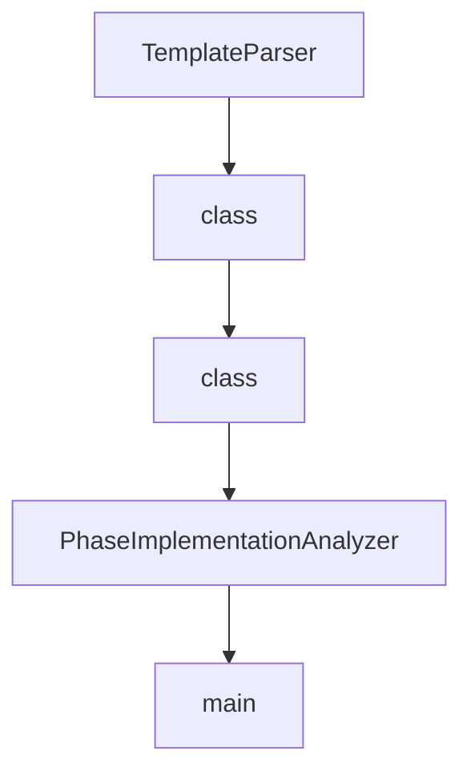

# Chapter 6: API, SDK, and Integrations

Welcome to **Chapter 6: API, SDK, and Integrations**. In this part of **VibeSDK Tutorial: Build a Vibe-Coding Platform on Cloudflare**, you will build an intuitive mental model first, then move into concrete implementation details and practical production tradeoffs.


VibeSDK can be embedded into workflows beyond the chat UI through APIs, the official TypeScript SDK, and automated handoff flows.

## Learning Goals

By the end of this chapter, you should be able to:

- use `@cf-vibesdk/sdk` for programmatic app generation
- choose between phasic and agentic behavior modes
- automate build, wait, preview, and export workflows
- integrate VibeSDK into CI and internal platform operations

## SDK Installation

```bash
npm install @cf-vibesdk/sdk
```

## Minimal SDK Flow

```ts
import { PhasicClient } from '@cf-vibesdk/sdk';

const client = new PhasicClient({
  baseUrl: 'https://build.cloudflare.dev',
  apiKey: process.env.VIBESDK_API_KEY!,
});

const session = await client.build('Build a landing page with auth', {
  projectType: 'app',
  autoGenerate: true,
});

await session.wait.deployable();
session.deployPreview();
await session.wait.previewDeployed();
session.close();
```

## Integration Surfaces

| Surface | Primary Use Case |
|:--------|:-----------------|
| SDK (`PhasicClient`, `AgenticClient`) | scriptable generation and lifecycle automation |
| API routes/controllers | internal governance and operational controls |
| deploy/export tooling | repository handoff and developer workflow integration |
| Postman docs assets | quick API validation and team onboarding |

## Behavior Mode Selection

| Mode | Best For | Risk Profile |
|:-----|:---------|:-------------|
| phasic | controlled enterprise pipelines | slower iteration, higher predictability |
| agentic | exploratory generation and rapid iteration | higher variability, needs stronger guardrails |

## CI-Friendly Automation Pattern

1. trigger build from internal service or pipeline job
2. wait for deployable milestone
3. run policy checks (security, quality, ownership)
4. deploy preview and run smoke tests
5. export/handoff to repo with traceable metadata

## Reliability Practices for Integrations

- always implement timeout and retry handling around wait helpers
- close sessions explicitly to avoid resource leaks
- persist build session metadata for debugging and audit
- separate API keys for automation workloads vs human UI usage

## Source References

- [VibeSDK SDK README](https://github.com/cloudflare/vibesdk/blob/main/sdk/README.md)
- [Postman Collection README](https://github.com/cloudflare/vibesdk/blob/main/docs/POSTMAN_COLLECTION_README.md)
- [VibeSDK Repository](https://github.com/cloudflare/vibesdk)

## Summary

You now have a practical integration model for embedding VibeSDK into programmatic workflows and CI paths.

Next: [Chapter 7: Security, Auth, and Governance](07-security-auth-and-governance.md)

## Source Code Walkthrough

### `debug-tools/ai_request_analyzer_v2.py`

The `TemplateParser` class in [`debug-tools/ai_request_analyzer_v2.py`](https://github.com/cloudflare/vibesdk/blob/HEAD/debug-tools/ai_request_analyzer_v2.py) handles a key part of this chapter's functionality:

```py


class TemplateParser(BaseAnalyzer):
    """Type-safe template analysis parser."""
    
    TEMPLATE_VAR_PATTERN = re.compile(r'\{\{(\w+)\}\}')
    MARKDOWN_SECTION_PATTERN = re.compile(r'^#{2,6}\s+(.+)$', re.MULTILINE)
    
    def analyze(self, content: str) -> TemplateAnalysis:
        """Analyze template usage and efficiency."""
        # Find template variables
        template_vars = list(set(self.TEMPLATE_VAR_PATTERN.findall(content)))
        
        # Count markdown sections
        markdown_sections = len(self.MARKDOWN_SECTION_PATTERN.findall(content))
        
        # Calculate overheads
        substitution_overhead = len(template_vars) * 20  # Estimated overhead per variable
        markdown_overhead = markdown_sections * 50  # Estimated overhead per section
        
        # Detect unused sections (simplified heuristic)
        unused_sections = []
        if 'placeholder' in content.lower() or 'example' in content.lower():
            unused_sections.append('example_content')
        
        return TemplateAnalysis(
            template_variables=template_vars,
            substitution_overhead=substitution_overhead,
            markdown_sections=markdown_sections,
            markdown_overhead=markdown_overhead,
            unused_sections=unused_sections,
            total_template_size=len(content)
```

This class is important because it defines how VibeSDK Tutorial: Build a Vibe-Coding Platform on Cloudflare implements the patterns covered in this chapter.

### `debug-tools/ai_request_analyzer_v2.py`

The `class` class in [`debug-tools/ai_request_analyzer_v2.py`](https://github.com/cloudflare/vibesdk/blob/HEAD/debug-tools/ai_request_analyzer_v2.py) handles a key part of this chapter's functionality:

```py
import sys
import re
from dataclasses import dataclass, field
from typing import Dict, List, Any, Optional, Tuple, Union, TypedDict, Protocol
from pathlib import Path
import argparse
from collections import defaultdict, Counter
import math
from enum import Enum
from abc import ABC, abstractmethod


class ContentType(Enum):
    """Enumeration for content types."""
    SOURCE_CODE = "source_code"
    JSON_DATA = "json_data" 
    MARKDOWN_STRUCTURED = "markdown_structured"
    LARGE_TEXT = "large_text"
    METADATA = "metadata"
    PROSE = "prose"


class ComponentName(Enum):
    """Enumeration for component names."""
    ROLE_SECTION = "role_section"
    GOAL_SECTION = "goal_section"
    CONTEXT_SECTION = "context_section"
    CLIENT_REQUEST = "client_request"
    BLUEPRINT = "blueprint"
    DEPENDENCIES = "dependencies"
    UI_GUIDELINES = "ui_guidelines"
    STRATEGY = "strategy"
```

This class is important because it defines how VibeSDK Tutorial: Build a Vibe-Coding Platform on Cloudflare implements the patterns covered in this chapter.

### `debug-tools/ai_request_analyzer_v2.py`

The `class` class in [`debug-tools/ai_request_analyzer_v2.py`](https://github.com/cloudflare/vibesdk/blob/HEAD/debug-tools/ai_request_analyzer_v2.py) handles a key part of this chapter's functionality:

```py
import sys
import re
from dataclasses import dataclass, field
from typing import Dict, List, Any, Optional, Tuple, Union, TypedDict, Protocol
from pathlib import Path
import argparse
from collections import defaultdict, Counter
import math
from enum import Enum
from abc import ABC, abstractmethod


class ContentType(Enum):
    """Enumeration for content types."""
    SOURCE_CODE = "source_code"
    JSON_DATA = "json_data" 
    MARKDOWN_STRUCTURED = "markdown_structured"
    LARGE_TEXT = "large_text"
    METADATA = "metadata"
    PROSE = "prose"


class ComponentName(Enum):
    """Enumeration for component names."""
    ROLE_SECTION = "role_section"
    GOAL_SECTION = "goal_section"
    CONTEXT_SECTION = "context_section"
    CLIENT_REQUEST = "client_request"
    BLUEPRINT = "blueprint"
    DEPENDENCIES = "dependencies"
    UI_GUIDELINES = "ui_guidelines"
    STRATEGY = "strategy"
```

This class is important because it defines how VibeSDK Tutorial: Build a Vibe-Coding Platform on Cloudflare implements the patterns covered in this chapter.

### `debug-tools/ai_request_analyzer_v2.py`

The `PhaseImplementationAnalyzer` class in [`debug-tools/ai_request_analyzer_v2.py`](https://github.com/cloudflare/vibesdk/blob/HEAD/debug-tools/ai_request_analyzer_v2.py) handles a key part of this chapter's functionality:

```py


class PhaseImplementationAnalyzer:
    """Main type-safe analyzer for Phase Implementation requests."""
    
    def __init__(self):
        self.scof_parser = SCOFParser()
        self.dependency_parser = DependencyParser()
        self.template_parser = TemplateParser()
        
        self.prompt_patterns = self._get_prompt_patterns()
    
    def _get_prompt_patterns(self) -> Dict[ComponentName, Tuple[str, str]]:
        """Get prompt component patterns."""
        return {
            ComponentName.ROLE_SECTION: ('<ROLE>', '</ROLE>'),
            ComponentName.GOAL_SECTION: ('<GOAL>', '</GOAL>'),
            ComponentName.CONTEXT_SECTION: ('<CONTEXT>', '</CONTEXT>'),
            ComponentName.CLIENT_REQUEST: ('<CLIENT REQUEST>', '</CLIENT REQUEST>'),
            ComponentName.BLUEPRINT: ('<BLUEPRINT>', '</BLUEPRINT>'),
            # Use more specific pattern for DEPENDENCIES to avoid matching references
            ComponentName.DEPENDENCIES: ('<DEPENDENCIES>\n**Available Dependencies:**', '</DEPENDENCIES>'),
            ComponentName.STRATEGY: ('<PHASES GENERATION STRATEGY>', '</PHASES GENERATION STRATEGY>'),
            ComponentName.PROJECT_CONTEXT: ('<PROJECT CONTEXT>', '</PROJECT CONTEXT>'),
            ComponentName.COMPLETED_PHASES: ('<COMPLETED PHASES>', '</COMPLETED PHASES>'),
            ComponentName.CODEBASE: ('<CODEBASE>', '</CODEBASE>'),
            ComponentName.CURRENT_PHASE: ('<CURRENT_PHASE>', '</CURRENT_PHASE>'),
            ComponentName.INSTRUCTIONS: ('<INSTRUCTIONS & CODE QUALITY STANDARDS>', '</INSTRUCTIONS & CODE QUALITY STANDARDS>'),
        }
    
    def analyze_request(self, json_path: str) -> RequestAnalysis:
        """Analyze AI request with full type safety."""
```

This class is important because it defines how VibeSDK Tutorial: Build a Vibe-Coding Platform on Cloudflare implements the patterns covered in this chapter.


## How These Components Connect


