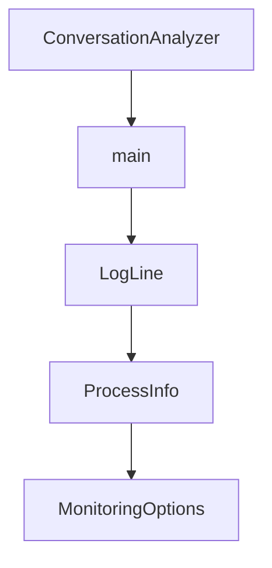

# Chapter 7: Security, Auth, and Governance

Welcome to **Chapter 7: Security, Auth, and Governance**. In this part of **VibeSDK Tutorial: Build a Vibe-Coding Platform on Cloudflare**, you will build an intuitive mental model first, then move into concrete implementation details and practical production tradeoffs.


VibeSDK security is a cross-layer concern: identity, secret management, execution controls, and policy enforcement all matter.

## Learning Goals

By the end of this chapter, you should be able to:

- define a baseline security posture for multi-user VibeSDK environments
- separate auth, token, and secret responsibilities clearly
- design governance checks for model/provider and deployment changes
- prepare recurring operational audits and incident drills

## Security Domains

| Domain | Core Controls |
|:-------|:--------------|
| identity and access | OAuth/email auth flows, session guardrails, role-aware endpoints |
| token/session integrity | JWT signing controls, token rotation cadence, revocation paths |
| secret management | least-privilege API keys, env isolation, secure secret distribution |
| abuse prevention | rate limits, quota caps, workload isolation |
| change governance | review gates for model routing, deployment bindings, policy updates |

## Deployment-Level Security Controls

At minimum, enforce:

- separate credentials for dev/stage/prod
- explicit Cloudflare API token scopes (avoid overbroad tokens)
- environment-specific rate-limit bindings
- clear default-deny behavior for sensitive operations

## Governance Practices That Scale

1. require review for changes in `worker/agents/inferutils/config.ts`
2. log deployment and generation actions with actor identity
3. document retention/deletion policy for generated artifacts and logs
4. tie emergency rollback procedures to named on-call owners

## Security Runbook Checks

| Check | Frequency | Owner |
|:------|:----------|:------|
| secret/token rotation audit | monthly | platform security |
| permission drift review | bi-weekly | platform engineering |
| auth anomaly triage | daily | on-call engineer |
| rollback simulation | quarterly | incident response team |

## High-Risk Mistakes to Avoid

- sharing production API tokens in developer-local environments
- enabling broad provider access without per-environment controls
- skipping review on model/provider fallback changes
- missing retention policies for sensitive generation artifacts

## Source References

- [VibeSDK Setup Guide](https://github.com/cloudflare/vibesdk/blob/main/docs/setup.md)
- [VibeSDK LLM Developer Guide](https://github.com/cloudflare/vibesdk/blob/main/docs/llm.md)

## Summary

You now have a practical security and governance baseline for operating VibeSDK beyond a single-user demo setup.

Next: [Chapter 8: Production Operations and Scaling](08-production-operations-and-scaling.md)

## Source Code Walkthrough

### `debug-tools/conversation_analyzer.py`

The `ConversationAnalyzer` class in [`debug-tools/conversation_analyzer.py`](https://github.com/cloudflare/vibesdk/blob/HEAD/debug-tools/conversation_analyzer.py) handles a key part of this chapter's functionality:

```py
    recommendations: List[str]

class ConversationAnalyzer:
    def __init__(self):
        self.size_thresholds = {
            'small': 1000,      # 1KB
            'medium': 5000,     # 5KB  
            'large': 20000,     # 20KB
            'huge': 100000      # 100KB
        }
    
    def analyze_conversation_messages(self, messages: List[Dict[str, Any]]) -> ConversationAnalysis:
        """Analyze conversation messages for size and content"""
        print(f"🔍 Analyzing {len(messages)} conversation messages...")
        
        total_size = 0
        message_types = Counter()
        size_by_type = defaultdict(int)
        largest_messages = []
        
        for i, msg in enumerate(messages):
            # Calculate message size
            msg_size = len(json.dumps(msg, default=str))
            total_size += msg_size
            
            # Categorize by type/role
            msg_type = msg.get('role', msg.get('type', 'unknown'))
            message_types[msg_type] += 1
            size_by_type[msg_type] += msg_size
            
            # Track largest messages
            msg_info = {
```

This class is important because it defines how VibeSDK Tutorial: Build a Vibe-Coding Platform on Cloudflare implements the patterns covered in this chapter.

### `debug-tools/conversation_analyzer.py`

The `main` function in [`debug-tools/conversation_analyzer.py`](https://github.com/cloudflare/vibesdk/blob/HEAD/debug-tools/conversation_analyzer.py) handles a key part of this chapter's functionality:

```py
        return "\n".join(report)

def main():
    # Check if we have debug files from the main analyzer
    conversation_file = "debug_output/conversationMessages_new.json"
    
    if not os.path.exists(conversation_file):
        print("❌ Conversation messages debug file not found!")
        print("   Please run the main state analyzer first: python state_analyzer.py errorfile.json")
        print("   This will generate the required debug files in debug_output/")
        return
    
    print("🚀 Starting conversation messages analysis...")
    print(f"📁 Reading conversation data from: {conversation_file}")
    
    try:
        with open(conversation_file, 'r') as f:
            messages = json.load(f)
        
        print(f"📄 Loaded {len(messages)} conversation messages")
        
        analyzer = ConversationAnalyzer()
        analysis = analyzer.analyze_conversation_messages(messages)
        
        # Generate report
        report = analyzer.generate_report(analysis)
        
        # Save report
        report_file = "conversation_analysis_report.txt"
        with open(report_file, 'w') as f:
            f.write(report)
        
```

This function is important because it defines how VibeSDK Tutorial: Build a Vibe-Coding Platform on Cloudflare implements the patterns covered in this chapter.

### `container/types.ts`

The `LogLine` interface in [`container/types.ts`](https://github.com/cloudflare/vibesdk/blob/HEAD/container/types.ts) handles a key part of this chapter's functionality:

```ts
// ==========================================

export interface LogLine {
  readonly content: string;
  readonly timestamp: Date;
  readonly stream: StreamType;
  readonly processId: string;
}

// ==========================================
// STORAGE SCHEMAS - Extend base types
// ==========================================

// StoredError extends SimpleError with storage-specific fields
export const StoredErrorSchema = SimpleErrorSchema.extend({
  id: z.number(),
  instanceId: z.string(),
  processId: z.string(),
  errorHash: z.string(),
  occurrenceCount: z.number(),
  createdAt: z.string()
});
export type StoredError = z.infer<typeof StoredErrorSchema>;

// Base fields shared by stored entities
const StoredEntityBaseSchema = z.object({
  id: z.number(),
  instanceId: z.string(),
  processId: z.string(),
  timestamp: z.string(),
  createdAt: z.string()
});
```

This interface is important because it defines how VibeSDK Tutorial: Build a Vibe-Coding Platform on Cloudflare implements the patterns covered in this chapter.

### `container/types.ts`

The `ProcessInfo` interface in [`container/types.ts`](https://github.com/cloudflare/vibesdk/blob/HEAD/container/types.ts) handles a key part of this chapter's functionality:

```ts
export type ProcessState = z.infer<typeof ProcessStateSchema>;

export interface ProcessInfo {
  readonly id: string;
  readonly instanceId: string;
  readonly command: string;
  readonly args?: readonly string[];
  readonly cwd: string;
  pid?: number;
  readonly env?: Record<string, string>;
  readonly startTime?: Date;
  readonly status?: ProcessState;
  readonly endTime?: Date;
  readonly exitCode?: number;
  readonly restartCount: number;
  readonly lastError?: string;
}

export interface MonitoringOptions {
  readonly autoRestart?: boolean;
  readonly maxRestarts?: number;
  readonly restartDelay?: number;
  readonly healthCheckInterval?: number;
  readonly errorBufferSize?: number;
  readonly env?: Record<string, string>;
  readonly killTimeout?: number;
  readonly expectedPort?: number; // Port the child process should bind to (for health checks)
}

// ==========================================
// STORAGE OPTIONS
// ==========================================
```

This interface is important because it defines how VibeSDK Tutorial: Build a Vibe-Coding Platform on Cloudflare implements the patterns covered in this chapter.


## How These Components Connect


