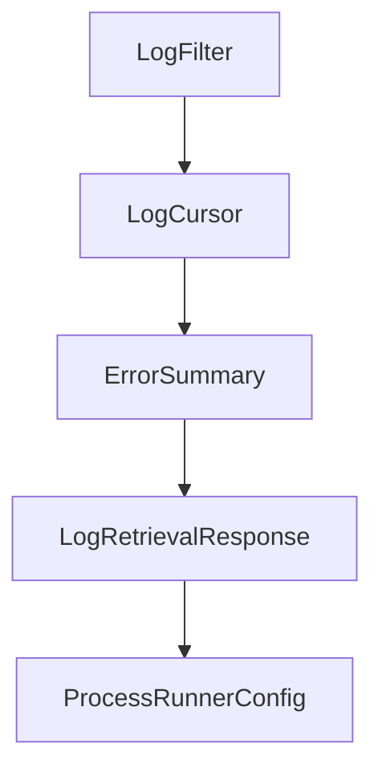

# Chapter 8: Production Operations and Scaling

Welcome to **Chapter 8: Production Operations and Scaling**. In this part of **VibeSDK Tutorial: Build a Vibe-Coding Platform on Cloudflare**, you will build an intuitive mental model first, then move into concrete implementation details and practical production tradeoffs.


This chapter turns VibeSDK from a working deployment into a managed, production-ready platform.

## Learning Goals

By the end of this chapter, you should be able to:

- define a production readiness checklist tied to measurable outcomes
- operate rollout, rollback, and incident workflows confidently
- track metrics that reflect quality, reliability, and cost
- scale traffic while preserving governance and performance controls

## Production Readiness Checklist

Before broad user rollout, verify:

- observability is enabled for API, agent, and sandbox paths
- migration and rollback procedures are tested
- preview and deploy paths are stable under expected concurrency
- key/token rotation and incident ownership are documented
- cost and quota guardrails are defined and enforced

## Validation Commands

```bash
bun run lint
bun run typecheck
bun run test
bun run db:migrate:remote
```

Run these in CI and again for release candidates with production-like bindings.

## Operating Metrics That Matter

| Area | Primary Metrics |
|:-----|:----------------|
| generation quality | completion success rate, time-to-deployable, fix-loop count |
| runtime health | preview startup latency, crash/restart rate, availability |
| data layer | D1 query latency, migration error rate, artifact growth |
| spend efficiency | provider cost per generation, runtime cost per preview hour |
| security posture | auth failure anomalies, rate-limit breach frequency |

## Rollout Strategy

1. stage in production-like environment with real bindings
2. onboard users in controlled waves by policy tier
3. monitor quality and cost metrics after each wave
4. pause expansion when SLOs or budgets drift
5. promote only after stable observation window

## Incident Taxonomy and First Response

| Incident Class | First Action |
|:---------------|:-------------|
| provider outage | fail over to validated backup route and reduce optional workload |
| sandbox instability | cap concurrency and isolate affected tenant/session classes |
| migration regression | stop rollout and restore last known-good schema/data path |
| auth or policy failure | revoke potentially exposed tokens and reapply baseline controls |

## Continuous Improvement Loop

- review top incident classes monthly
- convert recurring failures into automated mitigations
- tune model routing from observed quality/cost outcomes
- retire stale features and bindings that increase operational surface area

## Source References

- [VibeSDK Repository](https://github.com/cloudflare/vibesdk)
- [Architecture Diagrams](https://github.com/cloudflare/vibesdk/blob/main/docs/architecture-diagrams.md)
- [VibeSDK Setup Guide](https://github.com/cloudflare/vibesdk/blob/main/docs/setup.md)

## Summary

You now have an operations blueprint for running VibeSDK as a production platform with measurable reliability and governance.

Next: return to the [VibeSDK Tutorial index](README.md).

## Source Code Walkthrough

### `container/types.ts`

The `LogFilter` interface in [`container/types.ts`](https://github.com/cloudflare/vibesdk/blob/HEAD/container/types.ts) handles a key part of this chapter's functionality:

```ts
}

export interface LogFilter extends BaseFilter {
  readonly levels?: readonly LogLevel[];
  readonly streams?: readonly StreamType[];
  readonly includeMetadata?: boolean;
  readonly afterSequence?: number;
}

export interface LogCursor {
  readonly instanceId: string;
  readonly lastSequence: number;
  readonly lastRetrieved: Date;
}

// ==========================================
// SUMMARY TYPES
// ==========================================

export interface ErrorSummary {
  readonly totalErrors: number;
  readonly errorsByLevel: Record<number, number>;
  readonly latestError?: Date;
  readonly oldestError?: Date;
  readonly uniqueErrors: number;
  readonly repeatedErrors: number;
}

export interface LogRetrievalResponse {
  readonly success: boolean;
  readonly logs: readonly StoredLog[];
  readonly cursor: LogCursor;
```

This interface is important because it defines how VibeSDK Tutorial: Build a Vibe-Coding Platform on Cloudflare implements the patterns covered in this chapter.

### `container/types.ts`

The `LogCursor` interface in [`container/types.ts`](https://github.com/cloudflare/vibesdk/blob/HEAD/container/types.ts) handles a key part of this chapter's functionality:

```ts
}

export interface LogCursor {
  readonly instanceId: string;
  readonly lastSequence: number;
  readonly lastRetrieved: Date;
}

// ==========================================
// SUMMARY TYPES
// ==========================================

export interface ErrorSummary {
  readonly totalErrors: number;
  readonly errorsByLevel: Record<number, number>;
  readonly latestError?: Date;
  readonly oldestError?: Date;
  readonly uniqueErrors: number;
  readonly repeatedErrors: number;
}

export interface LogRetrievalResponse {
  readonly success: boolean;
  readonly logs: readonly StoredLog[];
  readonly cursor: LogCursor;
  readonly hasMore: boolean;
  readonly totalCount?: number;
  readonly error?: string;
}

// ==========================================
// MONITORING EVENTS
```

This interface is important because it defines how VibeSDK Tutorial: Build a Vibe-Coding Platform on Cloudflare implements the patterns covered in this chapter.

### `container/types.ts`

The `ErrorSummary` interface in [`container/types.ts`](https://github.com/cloudflare/vibesdk/blob/HEAD/container/types.ts) handles a key part of this chapter's functionality:

```ts
// ==========================================

export interface ErrorSummary {
  readonly totalErrors: number;
  readonly errorsByLevel: Record<number, number>;
  readonly latestError?: Date;
  readonly oldestError?: Date;
  readonly uniqueErrors: number;
  readonly repeatedErrors: number;
}

export interface LogRetrievalResponse {
  readonly success: boolean;
  readonly logs: readonly StoredLog[];
  readonly cursor: LogCursor;
  readonly hasMore: boolean;
  readonly totalCount?: number;
  readonly error?: string;
}

// ==========================================
// MONITORING EVENTS
// ==========================================

export type MonitoringEvent = 
  | {
      type: 'process_started';
      processId: string;
      instanceId: string;
      pid?: number;
      command?: string;
      timestamp: Date;
```

This interface is important because it defines how VibeSDK Tutorial: Build a Vibe-Coding Platform on Cloudflare implements the patterns covered in this chapter.

### `container/types.ts`

The `LogRetrievalResponse` interface in [`container/types.ts`](https://github.com/cloudflare/vibesdk/blob/HEAD/container/types.ts) handles a key part of this chapter's functionality:

```ts
}

export interface LogRetrievalResponse {
  readonly success: boolean;
  readonly logs: readonly StoredLog[];
  readonly cursor: LogCursor;
  readonly hasMore: boolean;
  readonly totalCount?: number;
  readonly error?: string;
}

// ==========================================
// MONITORING EVENTS
// ==========================================

export type MonitoringEvent = 
  | {
      type: 'process_started';
      processId: string;
      instanceId: string;
      pid?: number;
      command?: string;
      timestamp: Date;
    }
  | {
      type: 'process_stopped';
      processId: string;
      instanceId: string;
      exitCode?: number | null;
      reason?: string;
      timestamp: Date;
    }
```

This interface is important because it defines how VibeSDK Tutorial: Build a Vibe-Coding Platform on Cloudflare implements the patterns covered in this chapter.


## How These Components Connect


