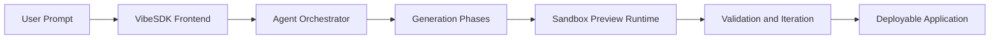

# VibeSDK Tutorial: Build a Vibe-Coding Platform on Cloudflare

> Learn how to use `cloudflare/vibesdk` to run a prompt-to-app platform with agent orchestration, preview sandboxes, and production deployment on Cloudflare.

## Why This Track Matters

VibeSDK is a strong reference architecture for teams building their own AI application generation products instead of only consuming hosted tools.

This track focuses on:

- deploying an end-to-end vibe-coding platform on Cloudflare
- understanding phase-driven AI generation and review loops
- managing sandbox previews and platform data layers
- operating securely in production with tenancy and governance controls

## Current Snapshot (Verified February 11, 2026)

- repository: [`cloudflare/vibesdk`](https://github.com/cloudflare/vibesdk)
- stars: about **4.8k**
- latest release: [`v1.5.0`](https://github.com/cloudflare/vibesdk/releases/tag/v1.5.0)
- development activity: active with recent updates
- project positioning in repo: open-source Cloudflare-native reference platform for vibe-coding products

## Mental Model

## Chapter Guide

| Chapter | Key Question | Outcome |
|:--------|:-------------|:--------|
| [01 - Getting Started and Deployment Paths](01-getting-started-and-deployment-paths.md) | How do I deploy and run VibeSDK quickly? | Working platform baseline |
| [02 - System Architecture](02-system-architecture.md) | How is the platform composed across runtimes and services? | Clear architecture mental model |
| [03 - AI Pipeline and Phase Engine](03-ai-pipeline-and-phase-engine.md) | How does prompt-to-app generation actually execute? | Tunable generation workflow |
| [04 - Sandbox and Preview Runtime](04-sandbox-and-preview-runtime.md) | How are generated apps isolated and previewed? | Secure preview execution strategy |
| [05 - Data Layer and Persistence](05-data-layer-and-persistence.md) | How are state and artifacts stored across services? | Data architecture baseline |
| [06 - API, SDK, and Integrations](06-api-sdk-and-integrations.md) | How do I automate and extend the platform? | Integration and automation playbook |
| [07 - Security, Auth, and Governance](07-security-auth-and-governance.md) | How do I control access and policy boundaries? | Production governance model |
| [08 - Production Operations and Scaling](08-production-operations-and-scaling.md) | How do I run VibeSDK reliably at scale? | Operations and scaling baseline |

## What You Will Learn

- how to deploy and operate a self-hosted vibe-coding platform
- how to reason about orchestration, phase engines, and preview sandboxes
- how to connect Cloudflare data primitives into a cohesive product backend
- how to harden the platform for real user traffic and multi-tenant usage

## Source References

- [VibeSDK Repository](https://github.com/cloudflare/vibesdk)
- [VibeSDK Releases](https://github.com/cloudflare/vibesdk/releases)
- [VibeSDK Setup Guide](https://github.com/cloudflare/vibesdk/blob/main/docs/setup.md)
- [VibeSDK SDK Documentation](https://github.com/cloudflare/vibesdk/blob/main/sdk/README.md)
- [Live Demo](https://build.cloudflare.dev/)

## Related Tutorials

- [bolt.diy Tutorial](../bolt-diy-tutorial/)
- [Dyad Tutorial](../dyad-tutorial/)
- [Vercel AI Tutorial](../vercel-ai-tutorial/)
- [OpenHands Tutorial](../openhands-tutorial/)

---

Start with [Chapter 1: Getting Started and Deployment Paths](01-getting-started-and-deployment-paths.md).
