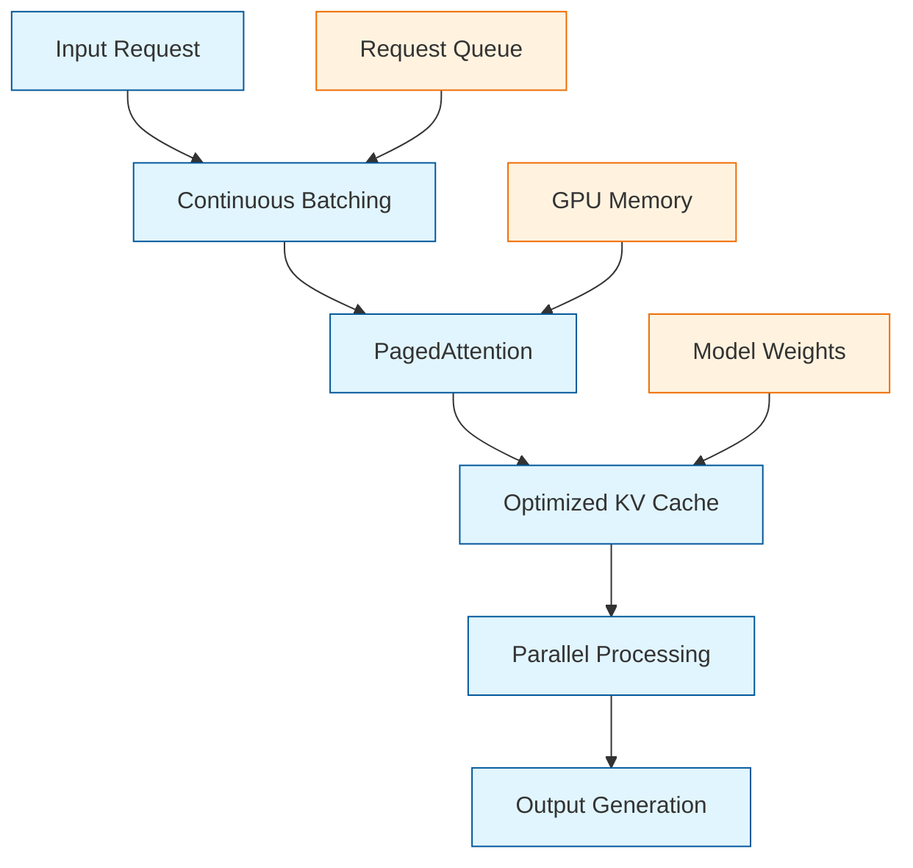

# vLLM Tutorial: High-Performance LLM Inference

> Master vLLM for blazing-fast, cost-effective large language model inference with advanced optimization techniques.

<div align="center">

**🚀 High-Performance LLM Serving Engine**

[](https://github.com/vllm-project/vllm)

</div>

---

## 🎯 What is vLLM?

**vLLM**<sup>[View Repo](https://github.com/vllm-project/vllm)</sup> is a high-performance, memory-efficient inference engine for large language models. It achieves state-of-the-art serving throughput while maintaining low latency, making it ideal for production LLM deployments.

### Why vLLM Matters

| Feature | vLLM | Traditional Inference |
|:--------|:-----|:----------------------|
| **Throughput** | 2-4x higher | Baseline |
| **Latency** | 10-20% lower | Baseline |
| **Memory Usage** | 50% less | Higher memory overhead |
| **Scalability** | Excellent | Limited |
| **Cost Efficiency** | Superior | Higher operational costs |



## Core Technologies

### Continuous Batching
Dynamically batches incoming requests for optimal GPU utilization, eliminating wasted compute cycles.

### PagedAttention
Revolutionary attention mechanism that manages KV cache in non-contiguous memory blocks, reducing memory fragmentation.

### Optimized CUDA Kernels
Custom GPU kernels for attention, normalization, and matrix operations that outperform standard implementations.

### Advanced Scheduling
Intelligent request scheduling that minimizes latency while maximizing throughput.

## Tutorial Chapters

1. **[Chapter 1: Getting Started](01-getting-started.md)** - Installation, basic setup, and your first vLLM inference
2. **[Chapter 2: Model Loading](02-model-loading.md)** - Loading different model formats (HuggingFace, quantized, etc.)
3. **[Chapter 3: Basic Inference](03-basic-inference.md)** - Text generation, sampling strategies, and parameter tuning
4. **[Chapter 4: Advanced Features](04-advanced-features.md)** - Streaming, tool calling, and multi-modal models
5. **[Chapter 5: Performance Optimization](05-performance-optimization.md)** - Batching, quantization, and GPU optimization
6. **[Chapter 6: Distributed Inference](06-distributed-inference.md)** - Multi-GPU and multi-node scaling
7. **[Chapter 7: Production Deployment](07-production-deployment.md)** - Serving with FastAPI, Docker, and Kubernetes
8. **[Chapter 8: Monitoring & Scaling](08-monitoring-scaling.md)** - Performance monitoring and auto-scaling

## What You'll Learn

- **High-Performance Inference** - Achieve maximum throughput with minimal latency
- **Memory Optimization** - Efficiently serve large models with limited resources
- **Production Deployment** - Scale vLLM for enterprise applications
- **Advanced Features** - Streaming, tool calling, and multi-modal capabilities
- **Distributed Systems** - Multi-GPU and multi-node inference architectures

## Prerequisites

- Python 3.8+
- CUDA-compatible GPU (recommended for best performance)
- Basic understanding of LLMs and inference
- Familiarity with PyTorch (helpful but not required)

## Quick Start

```bash
# Install vLLM
pip install vllm

# Basic usage
from vllm import LLM, SamplingParams

# Load model
llm = LLM(model="microsoft/DialoGPT-medium")

# Generate text
sampling_params = SamplingParams(temperature=0.8, top_p=0.95, max_tokens=100)
outputs = llm.generate(["Hello, how are you?"], sampling_params)

print(outputs[0].outputs[0].text)
```

## Performance Comparison

```python
import time
from vllm import LLM
from transformers import pipeline

# vLLM implementation
llm = LLM(model="microsoft/DialoGPT-medium", gpu_memory_utilization=0.9)
start = time.time()
vllm_outputs = llm.generate(["Hello world"] * 100, SamplingParams(max_tokens=50))
vllm_time = time.time() - start

# Traditional implementation
pipe = pipeline("text-generation", model="microsoft/DialoGPT-medium", device=0)
start = time.time()
hf_outputs = []
for prompt in ["Hello world"] * 100:
    output = pipe(prompt, max_length=50, num_return_sequences=1)
    hf_outputs.append(output)
hf_time = time.time() - start

print(f"vLLM: {vllm_time:.2f}s for 100 requests")
print(f"HuggingFace: {hf_time:.2f}s for 100 requests")
print(f"Speedup: {hf_time/vllm_time:.1f}x faster")
```

## Key Features Overview

### Memory Efficiency
- **PagedAttention**: Up to 50% memory savings
- **Continuous Batching**: Optimal GPU utilization
- **Quantization Support**: 4-bit, 8-bit model compression

### High Throughput
- **Dynamic Batching**: Real-time request batching
- **Parallel Processing**: Concurrent inference across multiple requests
- **Optimized Kernels**: Custom CUDA implementations

### Production Ready
- **Async API**: Non-blocking inference calls
- **Streaming Support**: Real-time text generation
- **Multi-Modal**: Vision-language models support
- **Tool Calling**: Function calling capabilities

## Learning Path

### 🟢 Beginner Track
1. Chapters 1-2: Setup and basic model loading
2. Simple text generation applications

### 🟡 Intermediate Track
1. Chapters 3-4: Advanced inference and features
2. Building conversational AI applications

### 🔴 Advanced Track
1. Chapters 5-8: Optimization, scaling, and production
2. Enterprise-grade LLM deployment

---

**Ready to achieve blazing-fast LLM inference? Let's begin with [Chapter 1: Getting Started](01-getting-started.md)!**

*Generated for [Awesome Code Docs](https://github.com/johnxie/awesome-code-docs)*