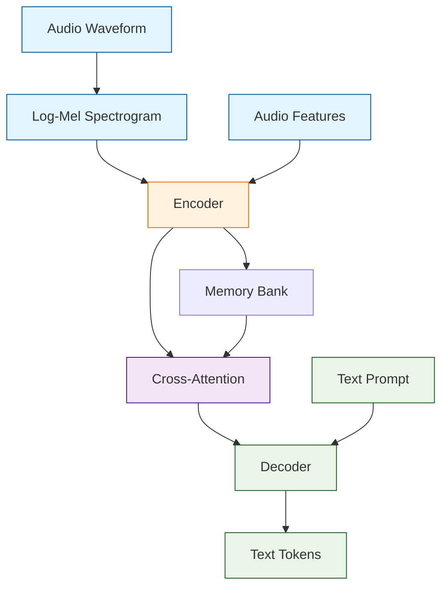

# Chapter 3: Model Architecture & GGML

Welcome to **Chapter 3: Model Architecture & GGML**. In this part of **Whisper.cpp Tutorial: High-Performance Speech Recognition in C/C++**, you will build an intuitive mental model first, then move into concrete implementation details and practical production tradeoffs.


> Understanding how Whisper works internally and the GGML tensor library that powers Whisper.cpp

## 🎯 Learning Objectives

By the end of this chapter, you'll understand:
- The Whisper model architecture and how it processes audio
- GGML fundamentals and tensor operations
- How Whisper.cpp implements the model efficiently
- Memory management and quantization techniques

## 🏗️ Whisper Model Architecture

### **Encoder-Decoder Architecture**

Whisper uses a transformer-based encoder-decoder architecture specifically designed for speech recognition:



### **Key Components**

#### **1. Audio Preprocessing**
```python
# Audio preprocessing pipeline
def preprocess_audio(audio_waveform, sample_rate=16000):
    """
    Convert raw audio to log-mel spectrogram features
    """

    # 1. Resample to 16kHz if needed
    if sample_rate != 16000:
        audio = resample(audio_waveform, sample_rate, 16000)

    # 2. Apply pre-emphasis filter
    audio = pre_emphasis_filter(audio, alpha=0.97)

    # 3. Extract 80-channel log-mel spectrogram
    mel_spec = log_mel_spectrogram(
        audio,
        n_fft=400,
        hop_length=160,  # 10ms frames
        n_mels=80,
        fmin=0,
        fmax=8000
    )

    # 4. Normalize and pad/trim to 30 seconds
    mel_spec = normalize_spectrogram(mel_spec)

    return mel_spec
```

#### **2. Encoder Architecture**
```python
# Simplified encoder implementation
class WhisperEncoder:
    def __init__(self, n_layers=6, n_heads=8, embed_dim=512):
        self.layers = []
        for _ in range(n_layers):
            self.layers.append(TransformerBlock(n_heads, embed_dim))

        # Positional embeddings for audio features
        self.pos_embedding = AudioPositionalEmbedding()

    def forward(self, mel_features):
        """
        Process mel spectrogram through encoder
        Args:
            mel_features: (batch_size, 80, time_steps) - 80 mel bins, ~3000 time steps
        Returns:
            encoder_output: (batch_size, time_steps, embed_dim)
        """

        # Add positional information
        x = self.pos_embedding(mel_features)  # (batch_size, time_steps, embed_dim)

        # Apply transformer layers
        for layer in self.layers:
            x = layer(x)  # Self-attention + feed-forward

        return x
```

#### **3. Decoder Architecture**
```python
class WhisperDecoder:
    def __init__(self, n_layers=6, n_heads=8, embed_dim=512, vocab_size=51865):
        self.embed_tokens = nn.Embedding(vocab_size, embed_dim)
        self.pos_embedding = SinusoidalPositionalEmbedding(embed_dim)

        self.layers = []
        for _ in range(n_layers):
            self.layers.append(TransformerDecoderBlock(n_heads, embed_dim))

        self.lm_head = nn.Linear(embed_dim, vocab_size)

    def forward(self, tokens, encoder_output, encoder_mask=None):
        """
        Generate text tokens from encoder output
        Args:
            tokens: (batch_size, seq_len) - previous tokens
            encoder_output: (batch_size, time_steps, embed_dim) - from encoder
        Returns:
            logits: (batch_size, seq_len, vocab_size)
        """

        # Embed tokens and add positional information
        x = self.embed_tokens(tokens)  # (batch_size, seq_len, embed_dim)
        x = self.pos_embedding(x)

        # Apply decoder layers with cross-attention to encoder
        for layer in self.layers:
            x = layer(x, encoder_output, encoder_mask)

        # Project to vocabulary
        logits = self.lm_head(x)

        return logits
```

### **Special Features for Speech**

#### **Audio Positional Embeddings**
```python
class AudioPositionalEmbedding:
    def __init__(self, embed_dim=512, max_positions=1500):
        self.embed_dim = embed_dim
        self.max_positions = max_positions

        # Pre-compute positional embeddings
        self.embeddings = self._create_audio_positional_embeddings()

    def _create_audio_positional_embeddings(self):
        """Create positional embeddings optimized for audio features"""
        positions = torch.arange(self.max_positions).unsqueeze(1)
        div_term = torch.exp(torch.arange(0, self.embed_dim, 2) * -(math.log(10000.0) / self.embed_dim))

        embeddings = torch.zeros(self.max_positions, self.embed_dim)
        embeddings[:, 0::2] = torch.sin(positions * div_term)
        embeddings[:, 1::2] = torch.cos(positions * div_term)

        return embeddings

    def forward(self, mel_features):
        """
        Add positional information to mel spectrogram
        Args:
            mel_features: (batch_size, n_mels, time_steps)
        Returns:
            embedded: (batch_size, time_steps, embed_dim)
        """
        batch_size, n_mels, time_steps = mel_features.shape

        # Linear projection from mel bins to embedding dimension
        projection = nn.Linear(n_mels, self.embed_dim)

        # Apply projection and add positional embeddings
        embedded = projection(mel_features.transpose(1, 2))  # (batch_size, time_steps, embed_dim)
        embedded += self.embeddings[:time_steps]

        return embedded
```

## 🧮 GGML: Tensor Library for Machine Learning

### **What is GGML?**

GGML (Georgi Gerganov Machine Learning) is a C library for machine learning that emphasizes:

- **CPU-first design**: Optimized for CPU execution without GPU requirements
- **Minimal dependencies**: Only requires C standard library
- **Quantization support**: Multiple quantization levels for reduced memory usage
- **Cross-platform**: Runs on x86, ARM, RISC-V, and other architectures

### **Core Concepts**

#### **1. Tensors**
```c
// GGML tensor structure
struct ggml_tensor {
    enum ggml_type type;      // Data type (FP32, FP16, Q4_0, etc.)
    int n_dims;               // Number of dimensions
    int64_t ne[GGML_MAX_DIMS]; // Dimensions
    size_t nb[GGML_MAX_DIMS];  // Strides in bytes
    void * data;              // Pointer to data
    struct ggml_tensor * src0; // Source tensor 0
    struct ggml_tensor * src1; // Source tensor 1
    struct ggml_tensor * opt[GGML_MAX_OPT]; // Additional operands
    bool is_param;            // Is this a parameter tensor?
};
```

#### **2. Computation Graph**
```c
// Building computation graphs
ggml_tensor * build_whisper_encoder(ggml_context * ctx, ggml_tensor * mel_features) {
    // Convolutional projection
    ggml_tensor * conv1 = ggml_conv_2d(ctx, mel_features, weight_conv1, stride=1);

    // Positional embeddings
    ggml_tensor * pos_embed = ggml_add(ctx, conv1, positional_embeddings);

    // Transformer layers
    ggml_tensor * x = pos_embed;
    for (int i = 0; i < n_layers; i++) {
        x = transformer_block(ctx, x, layer_weights[i]);
    }

    return x;
}
```

### **Quantization Types**

```c
// GGML quantization levels
enum ggml_type {
    GGML_TYPE_F32     = 0,  // 32-bit float
    GGML_TYPE_F16     = 1,  // 16-bit float
    GGML_TYPE_Q4_0    = 2,  // 4-bit quantization (original)
    GGML_TYPE_Q4_1    = 3,  // 4-bit quantization (improved)
    GGML_TYPE_Q5_0    = 6,  // 5-bit quantization
    GGML_TYPE_Q5_1    = 7,  // 5-bit quantization (improved)
    GGML_TYPE_Q8_0    = 8,  // 8-bit quantization
    GGML_TYPE_Q8_1    = 9,  // 8-bit quantization (improved)
    GGML_TYPE_Q2_K    = 10, // 2-bit quantization
    GGML_TYPE_Q3_K    = 11, // 3-bit quantization
    GGML_TYPE_Q4_K    = 12, // 4-bit quantization (K-quant)
    GGML_TYPE_Q5_K    = 13, // 5-bit quantization (K-quant)
    GGML_TYPE_Q6_K    = 14, // 6-bit quantization (K-quant)
};
```

## ⚙️ Whisper.cpp Implementation

### **Model Loading and Weight Management**

```cpp
// Model structure in Whisper.cpp
struct whisper_model {
    e_model type = MODEL_UNKNOWN;

    whisper_hparams hparams;
    whisper_filters filters;

    // encoder
    struct {
        std::vector<uint8_t> data;
        ggml_tensor * e_pe;     // positional encoding
        ggml_tensor * e_conv_1_w;
        ggml_tensor * e_conv_1_b;
        ggml_tensor * e_conv_2_w;
        ggml_tensor * e_conv_2_b;

        std::vector<whisper_layer_encoder> layers;

        ggml_tensor * e_ln_w;
        ggml_tensor * e_ln_b;
    } encoder;

    // decoder
    struct {
        std::vector<uint8_t> data;
        ggml_tensor * d_pe;     // positional encoding
        ggml_tensor * d_te;     // token embeddings

        std::vector<whisper_layer_decoder> layers;

        ggml_tensor * d_ln_w;
        ggml_tensor * d_ln_b;
    } decoder;

    // key + value memory
    struct {
        std::vector<uint8_t> data;

        ggml_tensor * k_enc;
        ggml_tensor * v_enc;

        ggml_tensor * k_dec;
        ggml_tensor * v_dec;
    } memory;

    // mel spectrogram input
    struct {
        std::vector<uint8_t> data;
        ggml_tensor * mel;
    } mel;
};

// Model loading function
bool whisper_model_load(const std::string & fname, whisper_model & model) {
    auto fin = std::ifstream(fname, std::ios::binary);
    if (!fin) {
        fprintf(stderr, "%s: failed to open '%s'\n", __func__, fname.c_str());
        return false;
    }

    // Read model header
    uint32_t magic = 0;
    fin.read((char *) &magic, sizeof(magic));
    if (magic != GGML_FILE_MAGIC) {
        fprintf(stderr, "%s: invalid model file '%s' (bad magic)\n", __func__, fname.c_str());
        return false;
    }

    // Load hyperparameters
    whisper_hparams hparams;
    // ... load hparams from file

    // Initialize model with hparams
    model.hparams = hparams;

    // Load model weights
    // ... load all tensor weights

    return true;
}
```

### **Inference Pipeline**

```cpp
// Main inference function
int whisper_full(
        struct whisper_context * ctx,
        struct whisper_full_params params,
        const float * samples,
        int n_samples) {

    // 1. Convert audio to mel spectrogram
    const int mel_len = whisper_pcm_to_mel(ctx, samples, n_samples, params.n_threads);
    if (mel_len == 0) {
        return -1;
    }

    // 2. Initialize decoder state
    whisper_kv_cache_clear(ctx);
    whisper_decoder_init(ctx, params);

    // 3. Encode audio features
    if (whisper_encode(ctx, mel_len, params.n_threads) != 0) {
        return -2;
    }

    // 4. Generate text tokens
    std::vector<whisper_token> prompt_tokens;
    if (!params.prompt_tokens.empty()) {
        prompt_tokens = params.prompt_tokens;
    }

    // Main generation loop
    for (int i = 0; i < params.max_tokens; i++) {
        // Run decoder step
        if (whisper_decode(ctx, prompt_tokens.data(), prompt_tokens.size(), i, params.n_threads) != 0) {
            return -3;
        }

        // Sample next token
        whisper_token token = whisper_sample_token(ctx, i, params);

        // Add token to sequence
        prompt_tokens.push_back(token);

        // Check for end of text
        if (token == whisper_token_eot(ctx)) {
            break;
        }

        // Call progress callback if provided
        if (params.progress_callback) {
            params.progress_callback(ctx, ctx->state, i, params.progress_callback_user_data);
        }
    }

    // 5. Convert tokens to text
    whisper_token_to_str(ctx, prompt_tokens.data(), prompt_tokens.size(), params.language);

    return 0;
}
```

## 🔄 Memory Management and Optimization

### **Quantization Implementation**

```cpp
// Quantization functions
void quantize_tensor_q4_0(const float * src, void * dst, int n, int k) {
    // Quantize weights to 4-bit precision
    for (int i = 0; i < n; i++) {
        // Group 32 float values into 4-bit quantized values
        float32x4_t values = vld1q_f32(&src[i * 32]);

        // Compute scale and zero point
        float max_val = vmaxvq_f32(values);
        float min_val = vminvq_f32(values);
        float scale = (max_val - min_val) / 15.0f;  // 4 bits = 16 levels (0-15)
        float zero_point = min_val;

        // Quantize values
        uint8_t quantized[16];  // 32 values -> 16 bytes (4 bits each)
        for (int j = 0; j < 32; j++) {
            uint8_t q = roundf((src[i * 32 + j] - zero_point) / scale);
            q = q < 0 ? 0 : (q > 15 ? 15 : q);

            if (j % 2 == 0) {
                quantized[j / 2] = q;
            } else {
                quantized[j / 2] |= (q << 4);
            }
        }

        // Store quantized values and metadata
        memcpy(&((uint8_t*)dst)[i * 18], quantized, 16);
        ((float*)&((uint8_t*)dst)[i * 18 + 16])[0] = scale;
        ((float*)&((uint8_t*)dst)[i * 18 + 16])[1] = zero_point;
    }
}

// Dequantization during inference
float dequantize_q4_0(const void * data, int index) {
    const uint8_t * quantized = (const uint8_t *)data;
    const int block_idx = index / 32;
    const int value_idx = index % 32;

    const uint8_t * block_data = &quantized[block_idx * 18];
    const float scale = ((const float*)&block_data[16])[0];
    const float zero_point = ((const float*)&block_data[16])[1];

    // Extract 4-bit value
    const int byte_idx = value_idx / 2;
    const uint8_t byte_val = block_data[byte_idx];
    const uint8_t q = (value_idx % 2 == 0) ? (byte_val & 0x0F) : (byte_val >> 4);

    // Dequantize
    return zero_point + (q * scale);
}
```

### **KV Cache Management**

```cpp
// Key-Value cache for efficient decoding
struct whisper_kv_cache {
    ggml_tensor * k;  // Keys   (n_ctx, n_embd)
    ggml_tensor * v;  // Values (n_ctx, n_embd)

    int n;  // number of tokens in cache
    int max_n;  // maximum number of tokens
};

// Cache operations
void whisper_kv_cache_init(struct whisper_context * ctx, const int n_ctx) {
    const int n_embd = ctx->model.hparams.n_embd;

    ctx->kv_cache.n = 0;
    ctx->kv_cache.max_n = n_ctx;

    // Allocate cache tensors
    ctx->kv_cache.k = ggml_new_tensor_2d(ctx->ctx, GGML_TYPE_F32, n_embd, n_ctx);
    ctx->kv_cache.v = ggml_new_tensor_2d(ctx->ctx, GGML_TYPE_F32, n_embd, n_ctx);
}

void whisper_kv_cache_add(struct whisper_context * ctx,
                         const ggml_tensor * k, const ggml_tensor * v) {
    const int n_embd = ctx->model.hparams.n_embd;
    const int n = ctx->kv_cache.n;

    // Copy new key-value pairs to cache
    ggml_build_forward_expand(&ctx->gf, ggml_cpy(ctx->ctx, k, ggml_view_2d(ctx->ctx, ctx->kv_cache.k, n_embd, 1, n_embd * sizeof(float), n * n_embd * sizeof(float))));
    ggml_build_forward_expand(&ctx->gf, ggml_cpy(ctx->ctx, v, ggml_view_2d(ctx->ctx, ctx->kv_cache.v, n_embd, 1, n_embd * sizeof(float), n * n_embd * sizeof(float))));

    ctx->kv_cache.n++;
}

void whisper_kv_cache_clear(struct whisper_context * ctx) {
    ctx->kv_cache.n = 0;
}
```

## 🚀 Performance Characteristics

### **Memory Usage Comparison**

| Model Size | FP32 | FP16 | Q4_0 | Q4_1 | Q5_0 | Q5_1 | Q8_0 |
|:-----------|:-----|:-----|:-----|:-----|:-----|:-----|:-----|
| Tiny (39M) | 156MB | 78MB | 21MB | 22MB | 25MB | 26MB | 39MB |
| Base (74M) | 296MB | 148MB | 42MB | 44MB | 48MB | 50MB | 74MB |
| Small (244M) | 980MB | 490MB | 153MB | 161MB | 177MB | 185MB | 245MB |
| Medium (769M) | 3.1GB | 1.5GB | 484MB | 509MB | 561MB | 586MB | 769MB |
| Large (1550M) | 6.2GB | 3.1GB | 969MB | 1018MB | 1123MB | 1174MB | 1.5GB |

### **Inference Speed**

```cpp
// Performance benchmarking
struct whisper_benchmark {
    int64_t t_load_ms;     // model load time
    int64_t t_mel_ms;      // mel spectrogram time
    int64_t t_encode_ms;   // encoder time
    int64_t t_decode_ms;   // decoder time
    int64_t t_audio_ms;    // audio loading time
};

// Benchmarking function
void whisper_benchmark_print(struct whisper_benchmark * b) {
    fprintf(stderr, "\n");
    fprintf(stderr, "================================================================================\n");
    fprintf(stderr, "load time:  %8.2f ms\n", b->t_load_ms / 1000.0f);
    fprintf(stderr, "mel time:   %8.2f ms\n", b->t_mel_ms / 1000.0f);
    fprintf(stderr, "encode time:%8.2f ms (%.2f sec)\n", b->t_encode_ms / 1000.0f, b->t_encode_ms / 1000000.0f);
    fprintf(stderr, "decode time:%8.2f ms (%.2f sec)\n", b->t_decode_ms / 1000.0f, b->t_decode_ms / 1000000.0f);
    fprintf(stderr, "audio time: %8.2f ms\n", b->t_audio_ms / 1000.0f);
    fprintf(stderr, "total time: %8.2f ms (%.2f sec)\n",
            (b->t_load_ms + b->t_mel_ms + b->t_encode_ms + b->t_decode_ms + b->t_audio_ms) / 1000.0f,
            (b->t_load_ms + b->t_mel_ms + b->t_encode_ms + b->t_decode_ms + b->t_audio_ms) / 1000000.0f);
    fprintf(stderr, "================================================================================\n");
}
```

## 🎯 Key Takeaways

1. **Transformer Architecture**: Whisper uses encoder-decoder with cross-attention for speech recognition
2. **GGML Efficiency**: C library enables CPU-only inference with quantization for memory efficiency
3. **Audio Processing**: Log-mel spectrograms capture essential audio features for the model
4. **Quantization Trade-offs**: Smaller models sacrifice some accuracy for significant memory/performance gains
5. **KV Cache**: Attention optimization dramatically speeds up auto-regressive text generation

## 🧪 Hands-On Exercise

**Estimated Time: 75 minutes**

1. **Model Architecture Analysis**: Examine the Whisper model structure and understand encoder-decoder flow
2. **GGML Operations**: Explore basic tensor operations and understand quantization math
3. **Memory Profiling**: Compare memory usage of different quantization levels
4. **Performance Benchmarking**: Time inference for different model sizes and quantization levels
5. **Optimization Techniques**: Implement and test various performance optimizations

---

**Ready to use the core API?** Continue to [Chapter 4: Core API & Usage Patterns](04-core-api.md)

## What Problem Does This Solve?

Most teams struggle here because the hard part is not writing more code, but deciding clear boundaries for `self`, `ggml_tensor`, `embed_dim` so behavior stays predictable as complexity grows.

In practical terms, this chapter helps you avoid three common failures:

- coupling core logic too tightly to one implementation path
- missing the handoff boundaries between setup, execution, and validation
- shipping changes without clear rollback or observability strategy

After working through this chapter, you should be able to reason about `Chapter 3: Model Architecture & GGML` as an operating subsystem inside **Whisper.cpp Tutorial: High-Performance Speech Recognition in C/C++**, with explicit contracts for inputs, state transitions, and outputs.

Use the implementation notes around `float`, `struct`, `uint8_t` as your checklist when adapting these patterns to your own repository.

## How it Works Under the Hood

Under the hood, `Chapter 3: Model Architecture & GGML` usually follows a repeatable control path:

1. **Context bootstrap**: initialize runtime config and prerequisites for `self`.
2. **Input normalization**: shape incoming data so `ggml_tensor` receives stable contracts.
3. **Core execution**: run the main logic branch and propagate intermediate state through `embed_dim`.
4. **Policy and safety checks**: enforce limits, auth scopes, and failure boundaries.
5. **Output composition**: return canonical result payloads for downstream consumers.
6. **Operational telemetry**: emit logs/metrics needed for debugging and performance tuning.

When debugging, walk this sequence in order and confirm each stage has explicit success/failure conditions.

## Source Walkthrough

Use the following upstream sources to verify implementation details while reading this chapter:

- [View Repo](https://github.com/ggml-org/whisper.cpp)
  Why it matters: authoritative reference on `View Repo` (github.com).

Suggested trace strategy:
- search upstream code for `self` and `ggml_tensor` to map concrete implementation paths
- compare docs claims against actual runtime/config code before reusing patterns in production

## Chapter Connections

- [Tutorial Index](index.md)
- [Previous Chapter: Chapter 2: Audio Processing Fundamentals](02-audio-processing.md)
- [Next Chapter: Chapter 4: Core API & Usage Patterns](04-core-api.md)
- [Main Catalog](../../README.md#-tutorial-catalog)
- [A-Z Tutorial Directory](../../discoverability/tutorial-directory.md)
