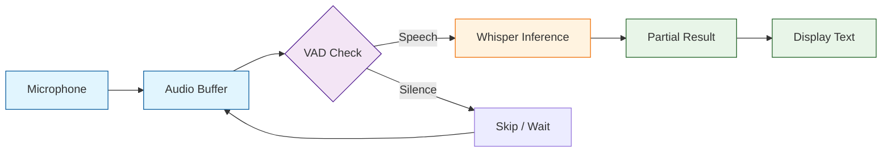
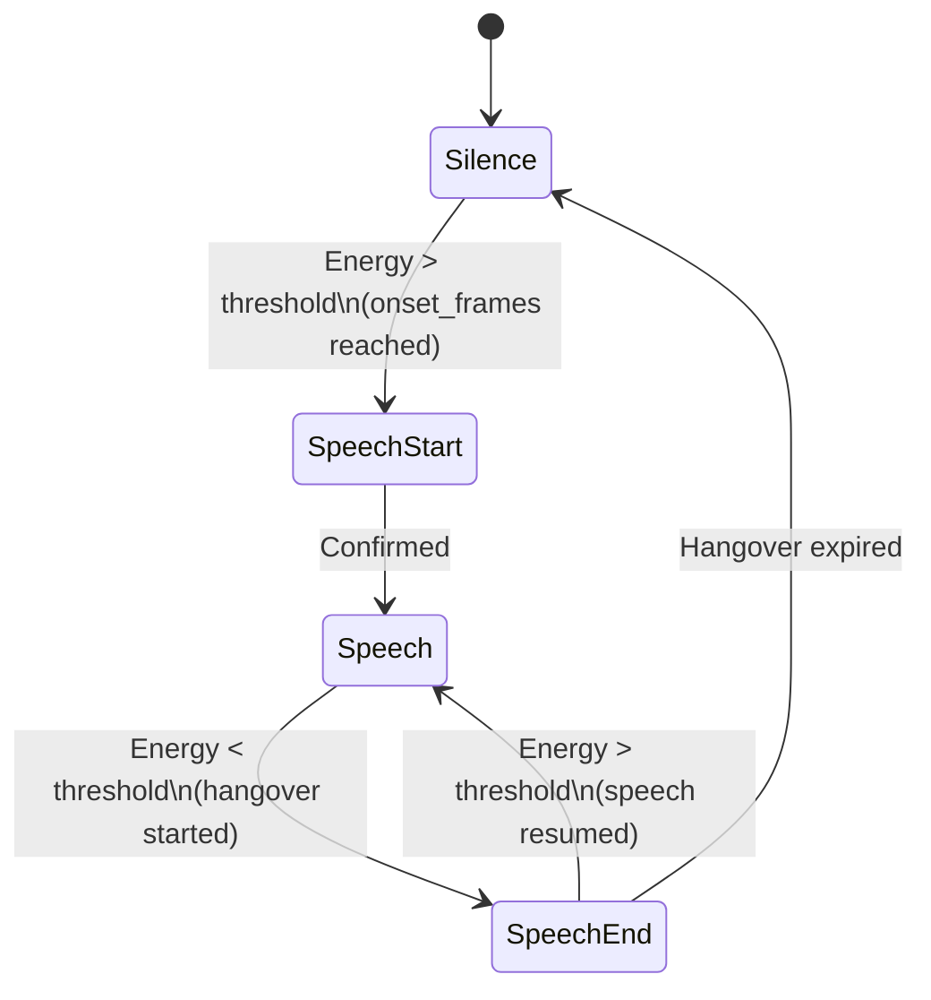

# Chapter 5: Real-Time Streaming

> Stream processing, voice activity detection, and real-time transcription with Whisper.cpp

## Learning Objectives

By the end of this chapter, you'll understand:
- How real-time audio streaming works with Whisper.cpp
- Voice Activity Detection (VAD) for efficient processing
- Microphone capture and live transcription pipelines
- Buffering strategies and latency management
- Building production-quality streaming applications

## The Streaming Challenge

Whisper was originally designed for offline, batch transcription of fixed-length audio segments. Real-time streaming introduces several new challenges: audio arrives continuously, latency must be minimized, and the system needs to decide *when* to process each chunk. Whisper.cpp's `stream` example and its underlying API provide the building blocks for solving these problems.



## Audio Streaming Fundamentals

### Chunk-Based Processing

Real-time streaming works by dividing the continuous audio stream into overlapping chunks, processing each chunk independently (or with limited context from the previous chunk), and stitching the results together.

```cpp
// Core streaming parameters
struct StreamConfig {
    int sample_rate     = 16000;   // Whisper requires 16 kHz
    int chunk_ms        = 5000;    // Process every 5 seconds
    int overlap_ms      = 200;     // Overlap between chunks
    int vad_ms          = 2000;    // VAD look-back window
    int keep_ms         = 200;     // Audio to keep from previous chunk
    int n_threads       = 4;       // Processing threads
    bool use_vad        = true;    // Enable voice activity detection
    float vad_threshold = 0.6f;    // VAD energy threshold
};

// Calculate buffer sizes from config
int chunk_samples(const StreamConfig & cfg) {
    return (cfg.chunk_ms * cfg.sample_rate) / 1000;
}

int overlap_samples(const StreamConfig & cfg) {
    return (cfg.overlap_ms * cfg.sample_rate) / 1000;
}
```

### The Stream Processing Loop

```cpp
#include "whisper.h"
#include <vector>
#include <string>
#include <chrono>

class WhisperStream {
private:
    struct whisper_context * ctx = nullptr;
    StreamConfig config;

    // Audio buffers
    std::vector<float> pcmf32;          // Current chunk
    std::vector<float> pcmf32_old;      // Carry-over from previous chunk
    std::vector<float> pcmf32_new;      // Newly arrived audio

public:
    WhisperStream(const char * model_path, StreamConfig cfg = {})
        : config(cfg)
    {
        struct whisper_context_params cparams = whisper_context_default_params();
        ctx = whisper_init_from_file_with_params(model_path, cparams);
        if (!ctx) {
            throw std::runtime_error("Failed to load Whisper model");
        }
    }

    ~WhisperStream() {
        if (ctx) whisper_free(ctx);
    }

    // Feed new audio samples into the stream
    void feed(const float * samples, int n_samples) {
        pcmf32_new.insert(pcmf32_new.end(), samples, samples + n_samples);
    }

    // Process buffered audio and return transcription
    std::string process() {
        const int n_chunk = chunk_samples(config);

        // Not enough audio yet
        if ((int)pcmf32_new.size() < n_chunk) {
            return "";
        }

        // Build the processing buffer: old context + new audio
        pcmf32.clear();
        if (!pcmf32_old.empty()) {
            pcmf32.insert(pcmf32.end(), pcmf32_old.begin(), pcmf32_old.end());
        }
        pcmf32.insert(pcmf32.end(), pcmf32_new.begin(), pcmf32_new.end());

        // Save tail of current audio as context for next chunk
        const int n_keep = (config.keep_ms * config.sample_rate) / 1000;
        pcmf32_old.assign(
            pcmf32_new.end() - std::min(n_keep, (int)pcmf32_new.size()),
            pcmf32_new.end()
        );
        pcmf32_new.clear();

        // Optional VAD check
        if (config.use_vad && !vad_detect(pcmf32, config.sample_rate, config.vad_threshold)) {
            return "";  // No speech detected
        }

        // Run Whisper inference
        struct whisper_full_params wparams = whisper_full_default_params(WHISPER_SAMPLING_GREEDY);
        wparams.print_progress   = false;
        wparams.print_special    = false;
        wparams.print_realtime   = false;
        wparams.print_timestamps = false;
        wparams.single_segment   = true;
        wparams.no_context       = true;
        wparams.language         = "en";
        wparams.n_threads        = config.n_threads;

        if (whisper_full(ctx, wparams, pcmf32.data(), pcmf32.size()) != 0) {
            return "[error]";
        }

        // Collect result
        std::string result;
        const int n_segments = whisper_full_n_segments(ctx);
        for (int i = 0; i < n_segments; ++i) {
            result += whisper_full_get_segment_text(ctx, i);
        }

        return result;
    }
};
```

## Voice Activity Detection (VAD)

VAD is essential for real-time streaming: it prevents Whisper from wasting compute cycles on silence and background noise.

### Energy-Based VAD

The simplest approach measures short-term audio energy and compares it against a threshold.

```cpp
#include <cmath>
#include <numeric>
#include <algorithm>

// Simple energy-based Voice Activity Detection
bool vad_detect(const std::vector<float> & pcmf32, int sample_rate, float threshold) {
    const int window_ms   = 30;    // 30 ms analysis window
    const int window_size = (sample_rate * window_ms) / 1000;
    const int n_windows   = pcmf32.size() / window_size;

    if (n_windows == 0) return false;

    int active_windows = 0;

    for (int i = 0; i < n_windows; ++i) {
        float energy = 0.0f;
        for (int j = 0; j < window_size; ++j) {
            float sample = pcmf32[i * window_size + j];
            energy += sample * sample;
        }
        energy /= window_size;  // Mean energy
        energy = 10.0f * log10f(energy + 1e-10f);  // Convert to dB

        if (energy > threshold) {
            active_windows++;
        }
    }

    // Speech detected if more than 10% of windows are active
    float active_ratio = (float)active_windows / n_windows;
    return active_ratio > 0.10f;
}
```

### Zero-Crossing Rate VAD

A more robust approach combines energy with zero-crossing rate to distinguish speech from noise.

```cpp
struct VADResult {
    bool is_speech;
    float energy_db;
    float zcr;           // Zero-crossing rate
    float confidence;    // 0.0 to 1.0
};

VADResult vad_analyze(const float * samples, int n_samples, int sample_rate) {
    VADResult result = { false, -100.0f, 0.0f, 0.0f };

    if (n_samples < 2) return result;

    // Compute RMS energy
    float sum_sq = 0.0f;
    for (int i = 0; i < n_samples; ++i) {
        sum_sq += samples[i] * samples[i];
    }
    float rms = sqrtf(sum_sq / n_samples);
    result.energy_db = 20.0f * log10f(rms + 1e-10f);

    // Compute zero-crossing rate
    int zero_crossings = 0;
    for (int i = 1; i < n_samples; ++i) {
        if ((samples[i] >= 0 && samples[i - 1] < 0) ||
            (samples[i] < 0 && samples[i - 1] >= 0)) {
            zero_crossings++;
        }
    }
    result.zcr = (float)zero_crossings / n_samples;

    // Speech typically has moderate energy and low-to-medium ZCR
    // Noise tends to have low energy and high ZCR
    const float energy_threshold = -40.0f;  // dB
    const float zcr_upper        = 0.30f;   // Reject high ZCR (noise)

    if (result.energy_db > energy_threshold && result.zcr < zcr_upper) {
        result.is_speech = true;
        result.confidence = std::min(1.0f,
            (result.energy_db - energy_threshold) / 20.0f);
    }

    return result;
}
```

### VAD State Machine

For production use, a state machine prevents rapid toggling between speech and silence.



```cpp
enum VADState { VAD_SILENCE, VAD_SPEECH_START, VAD_SPEECH, VAD_SPEECH_END };

class VADStateMachine {
private:
    VADState state = VAD_SILENCE;
    int onset_counter  = 0;    // Frames above threshold
    int hangover_counter = 0;  // Frames below threshold after speech

    // Tunable parameters
    int onset_frames   = 3;    // Frames to confirm speech onset
    int hangover_frames = 15;  // Frames to wait before ending speech

    float threshold = -35.0f;  // Energy threshold in dB

public:
    bool update(float energy_db) {
        switch (state) {
            case VAD_SILENCE:
                if (energy_db > threshold) {
                    onset_counter++;
                    if (onset_counter >= onset_frames) {
                        state = VAD_SPEECH_START;
                        onset_counter = 0;
                    }
                } else {
                    onset_counter = 0;
                }
                break;

            case VAD_SPEECH_START:
                state = VAD_SPEECH;
                break;

            case VAD_SPEECH:
                if (energy_db < threshold) {
                    hangover_counter++;
                    if (hangover_counter >= hangover_frames) {
                        state = VAD_SPEECH_END;
                        hangover_counter = 0;
                    }
                } else {
                    hangover_counter = 0;
                }
                break;

            case VAD_SPEECH_END:
                state = VAD_SILENCE;
                break;
        }

        return (state == VAD_SPEECH_START || state == VAD_SPEECH);
    }

    VADState get_state() const { return state; }
};
```

## Microphone Input

### Using SDL2 for Cross-Platform Audio Capture

Whisper.cpp's built-in `stream` example uses SDL2 for cross-platform microphone access.

```cpp
#include <SDL2/SDL.h>
#include <vector>
#include <mutex>

class MicrophoneCapture {
private:
    SDL_AudioDeviceID device_id = 0;
    std::vector<float> audio_buffer;
    std::mutex buffer_mutex;
    bool is_capturing = false;

    // SDL audio callback (called from audio thread)
    static void audio_callback(void * userdata, Uint8 * stream, int len) {
        auto * self = static_cast<MicrophoneCapture *>(userdata);
        int n_samples = len / sizeof(float);
        const float * samples = reinterpret_cast<const float *>(stream);

        std::lock_guard<std::mutex> lock(self->buffer_mutex);
        self->audio_buffer.insert(
            self->audio_buffer.end(), samples, samples + n_samples
        );
    }

public:
    bool start(int sample_rate = 16000) {
        if (SDL_Init(SDL_INIT_AUDIO) < 0) {
            fprintf(stderr, "SDL_Init failed: %s\n", SDL_GetError());
            return false;
        }

        SDL_AudioSpec desired;
        SDL_zero(desired);
        desired.freq     = sample_rate;
        desired.format   = AUDIO_F32;
        desired.channels = 1;
        desired.samples  = 1024;
        desired.callback = audio_callback;
        desired.userdata = this;

        SDL_AudioSpec obtained;
        device_id = SDL_OpenAudioDevice(
            nullptr,   // Default device
            1,         // Is capture (microphone)
            &desired,
            &obtained,
            0          // No allowed changes
        );

        if (device_id == 0) {
            fprintf(stderr, "SDL_OpenAudioDevice failed: %s\n", SDL_GetError());
            return false;
        }

        // Start capturing
        SDL_PauseAudioDevice(device_id, 0);
        is_capturing = true;

        return true;
    }

    void stop() {
        if (device_id != 0) {
            SDL_CloseAudioDevice(device_id);
            device_id = 0;
        }
        is_capturing = false;
        SDL_Quit();
    }

    // Retrieve and clear buffered audio
    std::vector<float> get_audio() {
        std::lock_guard<std::mutex> lock(buffer_mutex);
        std::vector<float> result = std::move(audio_buffer);
        audio_buffer.clear();
        return result;
    }

    bool capturing() const { return is_capturing; }
};
```

### Building the Stream Example

```bash
# Build whisper.cpp with SDL2 support for the stream example
cmake -B build -DWHISPER_SDL2=ON
cmake --build build --config Release

# Run the stream example
./build/bin/stream -m models/ggml-base.en.bin --step 5000 --length 5000
```

### Stream Example Parameters

| Parameter | Description | Default |
|-----------|-------------|---------|
| `--step` | Audio step size in milliseconds | 3000 |
| `--length` | Audio length per processing chunk in milliseconds | 10000 |
| `--keep` | Audio to keep from previous step (ms) | 200 |
| `--capture` | Capture device ID | -1 (default) |
| `--max-tokens` | Maximum tokens per audio chunk | 32 |
| `--vad-thold` | VAD threshold | 0.6 |
| `--freq-thold` | Frequency threshold for VAD | 100.0 |
| `--no-context` | Do not use previous transcription as prompt | false |
| `-kc` | Keep context between chunks | false |

## Complete Streaming Application

### End-to-End Real-Time Transcriber

```cpp
#include "whisper.h"
#include <SDL2/SDL.h>
#include <iostream>
#include <vector>
#include <string>
#include <atomic>
#include <thread>
#include <chrono>

class RealtimeTranscriber {
private:
    struct whisper_context * ctx = nullptr;
    MicrophoneCapture mic;
    VADStateMachine vad;
    StreamConfig config;

    std::atomic<bool> running{false};
    std::string last_text;

public:
    RealtimeTranscriber(const char * model_path, StreamConfig cfg = {})
        : config(cfg)
    {
        struct whisper_context_params cparams = whisper_context_default_params();
        ctx = whisper_init_from_file_with_params(model_path, cparams);
        if (!ctx) {
            throw std::runtime_error("Failed to load model");
        }
    }

    ~RealtimeTranscriber() {
        stop();
        if (ctx) whisper_free(ctx);
    }

    void start() {
        if (!mic.start(config.sample_rate)) {
            throw std::runtime_error("Failed to start microphone");
        }

        running = true;
        std::cout << "Listening... (press Ctrl+C to stop)" << std::endl;

        while (running) {
            // Collect audio from microphone
            auto audio = mic.get_audio();
            if (audio.empty()) {
                std::this_thread::sleep_for(std::chrono::milliseconds(10));
                continue;
            }

            // Run VAD on the new audio
            VADResult vad_result = vad_analyze(
                audio.data(), audio.size(), config.sample_rate
            );

            if (!vad_result.is_speech && config.use_vad) {
                continue;  // Skip silent segments
            }

            // Transcribe the audio chunk
            std::string text = transcribe_chunk(audio);

            // Display result (avoid duplicates)
            if (!text.empty() && text != last_text) {
                std::cout << "\r" << text << std::flush;
                last_text = text;
            }
        }
    }

    void stop() {
        running = false;
        mic.stop();
    }

private:
    std::string transcribe_chunk(const std::vector<float> & audio) {
        struct whisper_full_params wparams =
            whisper_full_default_params(WHISPER_SAMPLING_GREEDY);

        wparams.print_progress   = false;
        wparams.print_special    = false;
        wparams.print_realtime   = false;
        wparams.print_timestamps = false;
        wparams.single_segment   = true;
        wparams.no_context       = true;
        wparams.language         = "en";
        wparams.n_threads        = config.n_threads;

        if (whisper_full(ctx, wparams, audio.data(), audio.size()) != 0) {
            return "";
        }

        std::string result;
        const int n_seg = whisper_full_n_segments(ctx);
        for (int i = 0; i < n_seg; ++i) {
            result += whisper_full_get_segment_text(ctx, i);
        }
        return result;
    }
};

// Usage
int main(int argc, char * argv[]) {
    const char * model = "models/ggml-base.en.bin";
    if (argc > 1) model = argv[1];

    StreamConfig config;
    config.chunk_ms  = 5000;
    config.n_threads = 4;
    config.use_vad   = true;

    try {
        RealtimeTranscriber transcriber(model, config);
        transcriber.start();
    } catch (const std::exception & e) {
        fprintf(stderr, "Error: %s\n", e.what());
        return 1;
    }

    return 0;
}
```

### Python Streaming with whisper-cpp-python

```python
import numpy as np
import sounddevice as sd
import threading
import queue
import time

class PythonStreamTranscriber:
    """Real-time transcription using the whisper-cpp-python bindings."""

    def __init__(self, model_path, sample_rate=16000, chunk_sec=5):
        from whisper_cpp_python import Whisper

        self.whisper = Whisper(model_path)
        self.sample_rate = sample_rate
        self.chunk_sec = chunk_sec
        self.chunk_samples = sample_rate * chunk_sec

        self.audio_queue = queue.Queue()
        self.running = False

    # ---- Microphone callback (runs on audio thread) ----
    def _audio_callback(self, indata, frames, time_info, status):
        if status:
            print(f"Audio status: {status}")
        self.audio_queue.put(indata[:, 0].copy())

    # ---- VAD (simple energy gate) ----
    @staticmethod
    def _has_speech(audio, threshold=-40.0):
        rms = np.sqrt(np.mean(audio ** 2))
        db = 20 * np.log10(rms + 1e-10)
        return db > threshold

    # ---- Processing loop ----
    def _process_loop(self):
        buffer = np.array([], dtype=np.float32)

        while self.running:
            try:
                chunk = self.audio_queue.get(timeout=0.1)
                buffer = np.concatenate([buffer, chunk])
            except queue.Empty:
                continue

            if len(buffer) < self.chunk_samples:
                continue

            # Take exactly one chunk
            audio_chunk = buffer[:self.chunk_samples]
            buffer = buffer[self.chunk_samples:]

            # Skip silence
            if not self._has_speech(audio_chunk):
                continue

            # Transcribe
            result = self.whisper.transcribe(audio_chunk)
            text = result.get("text", "").strip()
            if text:
                print(f">> {text}")

    # ---- Public API ----
    def start(self):
        self.running = True
        worker = threading.Thread(target=self._process_loop, daemon=True)
        worker.start()

        print("Listening... press Ctrl+C to stop.")
        with sd.InputStream(
            samplerate=self.sample_rate,
            channels=1,
            dtype="float32",
            callback=self._audio_callback,
        ):
            try:
                while self.running:
                    time.sleep(0.1)
            except KeyboardInterrupt:
                pass

        self.running = False
        worker.join(timeout=2)
        print("Stopped.")


if __name__ == "__main__":
    transcriber = PythonStreamTranscriber("models/ggml-base.en.bin")
    transcriber.start()
```

## Latency Optimization

### Latency Budget Breakdown

```mermaid
gantt
    title Streaming Latency Budget (5 s chunk)
    dateFormat X
    axisFormat %s ms

    section Audio
    Capture + Buffer : 0, 5000

    section VAD
    VAD Analysis      : 5000, 5010

    section Inference
    Mel Spectrogram   : 5010, 5030
    Encoder           : 5030, 5230
    Decoder           : 5230, 5430

    section Output
    Token to Text     : 5430, 5435
    Display           : 5435, 5440
```



### Latency Reduction Strategies

| Strategy | Latency Reduction | Trade-off |
|----------|-------------------|-----------|
| Smaller model (tiny vs. base) | 40-60% | Lower accuracy |
| Shorter chunk length (2 s vs. 5 s) | 60% | More boundary artifacts |
| Quantized model (Q5 vs. F16) | 20-30% | Negligible accuracy loss |
| More threads | 20-50% | Higher CPU usage |
| VAD pre-filtering | Variable | May miss soft speech |
| Overlap-and-discard | +50 ms | Better boundary handling |

### Overlap-and-Discard Strategy

To avoid cutting words at chunk boundaries, keep a small overlap between consecutive chunks and discard the overlapping text.

```cpp
class OverlapTranscriber {
private:
    std::string previous_tail;  // Last few words of previous chunk
    int tail_words = 3;         // Words to keep for overlap detection

    std::string remove_overlap(const std::string & current) {
        if (previous_tail.empty()) return current;

        // Find where the overlap ends in the current text
        size_t pos = current.find(previous_tail);
        if (pos != std::string::npos) {
            return current.substr(pos + previous_tail.length());
        }

        // Fallback: try matching last N words
        // ... fuzzy matching logic ...

        return current;
    }

    std::string extract_tail(const std::string & text) {
        // Extract last N words
        std::vector<std::string> words;
        std::istringstream iss(text);
        std::string word;
        while (iss >> word) words.push_back(word);

        std::string tail;
        int start = std::max(0, (int)words.size() - tail_words);
        for (int i = start; i < (int)words.size(); ++i) {
            if (!tail.empty()) tail += " ";
            tail += words[i];
        }
        return tail;
    }

public:
    std::string process(const std::string & raw_text) {
        std::string clean = remove_overlap(raw_text);
        previous_tail = extract_tail(raw_text);
        return clean;
    }
};
```

## Performance Comparison

### Streaming Configuration Benchmarks

| Configuration | Chunk Size | Model | Latency (ms) | CPU Usage | WER |
|---------------|-----------|-------|---------------|-----------|-----|
| Low latency | 2 s | tiny.en | ~300 | 25% | 12.1% |
| Balanced | 5 s | base.en | ~600 | 40% | 7.8% |
| High accuracy | 10 s | small.en | ~1800 | 70% | 5.2% |
| Max accuracy | 10 s | medium.en | ~4500 | 95% | 4.1% |

*Benchmarks on an Apple M1 with 4 threads. WER = Word Error Rate on LibriSpeech test-clean.*

### Memory Footprint During Streaming

```cpp
// Monitor memory usage during streaming
struct StreamMetrics {
    size_t model_memory_mb;
    size_t audio_buffer_mb;
    size_t inference_peak_mb;
    double avg_latency_ms;
    int chunks_processed;
};

StreamMetrics measure_stream_performance(
    const char * model_path,
    const float * audio,
    int n_samples,
    const StreamConfig & config
) {
    StreamMetrics metrics = {};
    auto start = std::chrono::high_resolution_clock::now();

    struct whisper_context * ctx = whisper_init_from_file(model_path);
    if (!ctx) return metrics;

    // Approximate model memory
    metrics.model_memory_mb = whisper_model_n_bytes(ctx) / (1024 * 1024);

    const int chunk_size = chunk_samples(config);
    double total_latency = 0.0;
    int offset = 0;

    while (offset + chunk_size <= n_samples) {
        auto t0 = std::chrono::high_resolution_clock::now();

        struct whisper_full_params wparams =
            whisper_full_default_params(WHISPER_SAMPLING_GREEDY);
        wparams.single_segment = true;
        wparams.no_context     = true;
        wparams.n_threads      = config.n_threads;

        whisper_full(ctx, wparams, audio + offset, chunk_size);

        auto t1 = std::chrono::high_resolution_clock::now();
        double ms = std::chrono::duration<double, std::milli>(t1 - t0).count();
        total_latency += ms;
        metrics.chunks_processed++;

        offset += chunk_size;
    }

    metrics.avg_latency_ms = total_latency / std::max(1, metrics.chunks_processed);
    metrics.audio_buffer_mb = (chunk_size * sizeof(float)) / (1024 * 1024);

    whisper_free(ctx);
    return metrics;
}
```

## Summary

Real-time streaming with Whisper.cpp requires careful orchestration of audio capture, voice activity detection, and chunked inference. The key trade-offs are between latency (shorter chunks, smaller models) and accuracy (longer chunks, larger models). VAD is critical for efficiency -- skipping silent segments can save 50% or more of inference cost. The overlap-and-discard pattern addresses the boundary-artifact problem inherent in chunk-based processing.

## Key Takeaways

1. **Chunk-Based Processing**: Divide continuous audio into overlapping chunks for near-real-time transcription
2. **VAD Is Essential**: Voice activity detection prevents wasting compute on silence and dramatically improves throughput
3. **State Machine VAD**: Use onset and hangover counters to prevent rapid speech/silence toggling
4. **SDL2 for Capture**: Whisper.cpp uses SDL2 for cross-platform microphone access
5. **Latency vs. Accuracy**: Smaller models and shorter chunks reduce latency at the cost of accuracy
6. **Overlap Strategy**: Keeping a small audio overlap between chunks avoids cutting words at boundaries

## Next Steps

Now that you can transcribe audio in real time, let's explore how Whisper.cpp handles multiple languages, translation, and speaker identification. Continue to [Chapter 6: Language & Translation](06-language-translation.md).

---

*Built with insights from the [whisper.cpp](https://github.com/ggerganov/whisper.cpp) project.*
