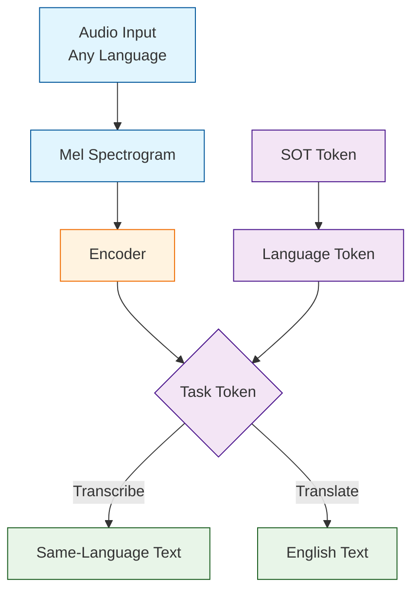
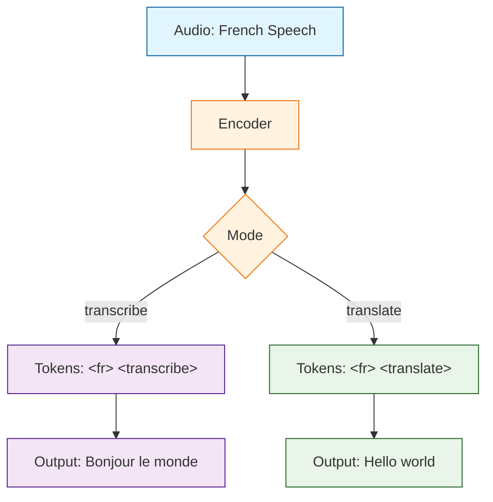
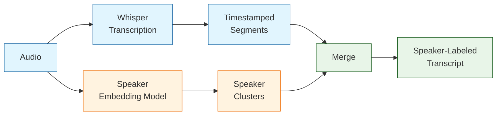

# Chapter 6: Language & Translation

Welcome to **Chapter 6: Language & Translation**. In this part of **Whisper.cpp Tutorial: High-Performance Speech Recognition in C/C++**, you will build an intuitive mental model first, then move into concrete implementation details and practical production tradeoffs.


> Multi-language support, translation mode, language detection, and speaker diarization with Whisper.cpp

## Learning Objectives

By the end of this chapter, you'll understand:
- How Whisper.cpp supports 99+ languages
- Automatic language detection and its API
- Translation mode (any language to English)
- Token-level language mechanics
- Speaker diarization techniques
- Building multilingual transcription applications

## Whisper's Multilingual Design

OpenAI trained Whisper on 680,000 hours of multilingual audio spanning 99 languages. The model learns a shared representation across all languages, which means a single model file can transcribe and translate dozens of languages without any per-language fine-tuning.



### Multilingual vs. English-Only Models

| Model | Languages | Size | Accuracy (en) | Use Case |
|-------|-----------|------|----------------|----------|
| `tiny.en` | English only | 39 MB | Good | Fast English-only |
| `tiny` | 99 languages | 39 MB | Good | Quick multilingual |
| `base.en` | English only | 74 MB | Better | English applications |
| `base` | 99 languages | 74 MB | Better | General multilingual |
| `small.en` | English only | 244 MB | Very good | Balanced English |
| `small` | 99 languages | 244 MB | Very good | Balanced multilingual |
| `medium.en` | English only | 769 MB | Excellent | High-quality English |
| `medium` | 99 languages | 769 MB | Excellent | High-quality multilingual |
| `large-v3` | 99 languages | 1550 MB | Best | Maximum accuracy |

English-only models (`.en` suffix) are slightly more accurate for English because their entire capacity is devoted to one language. Use the multilingual models when you need to handle non-English audio or when you do not know the language in advance.

## Language Detection

### How Language Detection Works

Whisper detects language by examining the first 30 seconds of audio. The encoder produces audio features, and the decoder predicts language probabilities over all supported language tokens.

```cpp
#include "whisper.h"
#include <vector>
#include <algorithm>
#include <string>

struct LanguageProb {
    std::string lang;
    float probability;
};

// Detect language of an audio file
std::vector<LanguageProb> detect_language(
    const char * model_path,
    const float * audio,
    int n_samples,
    int top_k = 5
) {
    struct whisper_context * ctx = whisper_init_from_file(model_path);
    if (!ctx) return {};

    // Process the first 30 seconds (or less)
    const int max_samples = 16000 * 30;
    int process_samples = std::min(n_samples, max_samples);

    // Compute mel spectrogram
    whisper_pcm_to_mel(ctx, audio, process_samples, 1);

    // Run encoder
    whisper_encode(ctx, 0, 4);

    // Get language probabilities
    std::vector<LanguageProb> results;
    const int n_lang = whisper_lang_max_id() + 1;

    // Allocate probability array
    std::vector<float> probs(n_lang, 0.0f);
    whisper_lang_auto_detect(ctx, 0, 4, probs.data());

    for (int i = 0; i < n_lang; ++i) {
        if (probs[i] > 0.001f) {  // Filter very low probabilities
            results.push_back({whisper_lang_str(i), probs[i]});
        }
    }

    // Sort by probability (descending)
    std::sort(results.begin(), results.end(),
        [](const LanguageProb & a, const LanguageProb & b) {
            return a.probability > b.probability;
        });

    // Keep top-k
    if ((int)results.size() > top_k) {
        results.resize(top_k);
    }

    whisper_free(ctx);
    return results;
}

// Usage
void print_detected_languages(const char * model, const float * audio, int n) {
    auto langs = detect_language(model, audio, n);

    printf("Detected languages:\n");
    for (const auto & lp : langs) {
        printf("  %-10s %.1f%%\n", lp.lang.c_str(), lp.probability * 100.0f);
    }
}
```

### Language Detection in Python

```python
import numpy as np

def detect_language_python(model_path, audio_path):
    """Detect the spoken language using whisper-cpp-python."""
    from whisper_cpp_python import Whisper
    import librosa

    # Load audio
    audio, sr = librosa.load(audio_path, sr=16000)

    # Initialize Whisper
    whisper = Whisper(model_path)

    # Detect language
    result = whisper.detect_language(audio)

    print("Language detection results:")
    for lang, prob in sorted(result.items(), key=lambda x: -x[1])[:5]:
        print(f"  {lang:10s} {prob * 100:5.1f}%")

    return result
```

### Supported Language Codes

| Code | Language | Code | Language | Code | Language |
|------|----------|------|----------|------|----------|
| `en` | English | `zh` | Chinese | `de` | German |
| `es` | Spanish | `ru` | Russian | `ko` | Korean |
| `fr` | French | `ja` | Japanese | `pt` | Portuguese |
| `it` | Italian | `ar` | Arabic | `nl` | Dutch |
| `hi` | Hindi | `tr` | Turkish | `pl` | Polish |
| `uk` | Ukrainian | `sv` | Swedish | `cs` | Czech |
| `vi` | Vietnamese | `th` | Thai | `el` | Greek |
| `id` | Indonesian | `he` | Hebrew | `da` | Danish |
| `fi` | Finnish | `no` | Norwegian | `ro` | Romanian |

*Whisper supports 99 languages total. The table above shows the most commonly used ones.*

## Translation Mode

### Translating Any Language to English

Whisper has a built-in translation mode that converts speech in any supported language directly to English text. This is not a two-step process (transcribe then translate) -- the model generates English tokens directly from non-English audio features.

```cpp
// Translate non-English audio to English
int translate_to_english(
    const char * model_path,
    const char * audio_file,
    const char * source_lang  // nullptr for auto-detect
) {
    struct whisper_context * ctx = whisper_init_from_file(model_path);
    if (!ctx) return 1;

    std::vector<float> pcmf32;
    if (!read_wav_file(audio_file, pcmf32)) {
        whisper_free(ctx);
        return 1;
    }

    // Configure for translation
    struct whisper_full_params wparams =
        whisper_full_default_params(WHISPER_SAMPLING_GREEDY);

    wparams.translate  = true;   // Enable translation to English
    wparams.language   = source_lang;  // Source language (nullptr = auto)
    wparams.n_threads  = 4;

    // Run translation
    if (whisper_full(ctx, wparams, pcmf32.data(), pcmf32.size()) != 0) {
        fprintf(stderr, "Translation failed\n");
        whisper_free(ctx);
        return 1;
    }

    // Print translated text with timestamps
    const int n_segments = whisper_full_n_segments(ctx);
    for (int i = 0; i < n_segments; ++i) {
        const int64_t t0 = whisper_full_get_segment_t0(ctx, i);
        const int64_t t1 = whisper_full_get_segment_t1(ctx, i);
        const char * text = whisper_full_get_segment_text(ctx, i);

        printf("[%02d:%02d.%03d --> %02d:%02d.%03d] %s\n",
            (int)(t0 / 100) / 60, (int)(t0 / 100) % 60, (int)(t0 % 100) * 10,
            (int)(t1 / 100) / 60, (int)(t1 / 100) % 60, (int)(t1 % 100) * 10,
            text);
    }

    whisper_free(ctx);
    return 0;
}
```

### Command-Line Translation

```bash
# Translate Spanish audio to English
./main -m models/ggml-medium.bin -f spanish_audio.wav --translate --language es

# Auto-detect language and translate
./main -m models/ggml-medium.bin -f unknown_audio.wav --translate

# Translate with SRT subtitle output
./main -m models/ggml-medium.bin -f french_audio.wav --translate -osrt
```

### Transcription vs. Translation Pipeline



## Token-Level Language Mechanics

### Special Tokens

Whisper uses special tokens to control language and task behavior. Understanding these tokens is important for advanced usage.

```cpp
// Important special tokens
void print_special_tokens(struct whisper_context * ctx) {
    printf("Token IDs:\n");
    printf("  SOT (start of transcript):  %d\n", whisper_token_sot(ctx));
    printf("  EOT (end of transcript):    %d\n", whisper_token_eot(ctx));
    printf("  SOT prev:                   %d\n", whisper_token_prev(ctx));
    printf("  NOT (no timestamps):        %d\n", whisper_token_not(ctx));
    printf("  BEG (begin):                %d\n", whisper_token_beg(ctx));

    // Language tokens
    printf("\nLanguage token IDs:\n");
    const char * langs[] = {"en", "es", "fr", "de", "ja", "zh"};
    for (const char * lang : langs) {
        int id = whisper_lang_id(lang);
        printf("  %-10s id=%d\n", lang, id);
    }
}
```

### Decoder Token Sequence

```
Transcription: <SOT> <lang:fr> <transcribe> <notimestamps> Bonjour le monde <EOT>
Translation:   <SOT> <lang:fr> <translate>   <notimestamps> Hello world      <EOT>
```

The language token tells the model what language the audio is in, and the task token tells it whether to transcribe (same language) or translate (to English).

## Multilingual Transcription Application

### Batch Processing Multiple Languages

```cpp
#include "whisper.h"
#include <vector>
#include <string>
#include <map>

struct TranscriptionResult {
    std::string filename;
    std::string detected_language;
    float language_confidence;
    std::string text;
    std::string translation;  // English translation (if applicable)
    bool success;
};

class MultilingualTranscriber {
private:
    struct whisper_context * ctx;

public:
    MultilingualTranscriber(const char * model_path) {
        ctx = whisper_init_from_file(model_path);
        if (!ctx) throw std::runtime_error("Failed to load model");
    }

    ~MultilingualTranscriber() {
        if (ctx) whisper_free(ctx);
    }

    TranscriptionResult process(const std::string & audio_file) {
        TranscriptionResult result;
        result.filename = audio_file;
        result.success = false;

        // Load audio
        std::vector<float> pcmf32;
        if (!read_wav_file(audio_file.c_str(), pcmf32)) {
            return result;
        }

        // Step 1: Detect language
        whisper_pcm_to_mel(ctx, pcmf32.data(), pcmf32.size(), 1);
        whisper_encode(ctx, 0, 4);

        std::vector<float> probs(whisper_lang_max_id() + 1, 0.0f);
        whisper_lang_auto_detect(ctx, 0, 4, probs.data());

        int best_lang = 0;
        for (int i = 1; i < (int)probs.size(); ++i) {
            if (probs[i] > probs[best_lang]) best_lang = i;
        }

        result.detected_language = whisper_lang_str(best_lang);
        result.language_confidence = probs[best_lang];

        // Step 2: Transcribe in original language
        struct whisper_full_params wparams =
            whisper_full_default_params(WHISPER_SAMPLING_GREEDY);
        wparams.language  = result.detected_language.c_str();
        wparams.translate = false;
        wparams.n_threads = 4;

        if (whisper_full(ctx, wparams, pcmf32.data(), pcmf32.size()) == 0) {
            const int n_seg = whisper_full_n_segments(ctx);
            for (int i = 0; i < n_seg; ++i) {
                result.text += whisper_full_get_segment_text(ctx, i);
            }
        }

        // Step 3: Translate to English (if not already English)
        if (result.detected_language != "en") {
            wparams.translate = true;

            if (whisper_full(ctx, wparams, pcmf32.data(), pcmf32.size()) == 0) {
                const int n_seg = whisper_full_n_segments(ctx);
                for (int i = 0; i < n_seg; ++i) {
                    result.translation += whisper_full_get_segment_text(ctx, i);
                }
            }
        }

        result.success = true;
        return result;
    }

    // Process a batch of files
    std::vector<TranscriptionResult> process_batch(
        const std::vector<std::string> & files
    ) {
        std::vector<TranscriptionResult> results;
        for (const auto & f : files) {
            printf("Processing: %s\n", f.c_str());
            results.push_back(process(f));
        }
        return results;
    }
};
```

### Python Multilingual Pipeline

```python
import os
import json
from dataclasses import dataclass, asdict
from typing import List, Optional

@dataclass
class TranscriptionResult:
    filename: str
    detected_language: str
    language_confidence: float
    text: str
    translation: Optional[str]
    success: bool

class MultilingualPipeline:
    """Full multilingual transcription and translation pipeline."""

    def __init__(self, model_path):
        from whisper_cpp_python import Whisper
        self.whisper = Whisper(model_path)

    def process_file(self, audio_path) -> TranscriptionResult:
        import librosa
        audio, sr = librosa.load(audio_path, sr=16000)

        # Detect language
        lang_probs = self.whisper.detect_language(audio)
        detected = max(lang_probs, key=lang_probs.get)
        confidence = lang_probs[detected]

        # Transcribe in original language
        result = self.whisper.transcribe(
            audio,
            language=detected,
            translate=False,
        )
        text = result.get("text", "").strip()

        # Translate to English if needed
        translation = None
        if detected != "en":
            trans_result = self.whisper.transcribe(
                audio,
                language=detected,
                translate=True,
            )
            translation = trans_result.get("text", "").strip()

        return TranscriptionResult(
            filename=os.path.basename(audio_path),
            detected_language=detected,
            language_confidence=confidence,
            text=text,
            translation=translation,
            success=True,
        )

    def process_directory(self, directory) -> List[TranscriptionResult]:
        results = []
        extensions = {".wav", ".mp3", ".m4a", ".flac", ".ogg"}

        for fname in sorted(os.listdir(directory)):
            if os.path.splitext(fname)[1].lower() in extensions:
                path = os.path.join(directory, fname)
                print(f"Processing: {fname}")
                try:
                    results.append(self.process_file(path))
                except Exception as e:
                    print(f"  Error: {e}")
                    results.append(TranscriptionResult(
                        filename=fname,
                        detected_language="",
                        language_confidence=0.0,
                        text="",
                        translation=None,
                        success=False,
                    ))

        return results

    def save_results(self, results, output_path):
        data = [asdict(r) for r in results]
        with open(output_path, "w", encoding="utf-8") as f:
            json.dump(data, f, indent=2, ensure_ascii=False)
        print(f"Results saved to {output_path}")


if __name__ == "__main__":
    pipeline = MultilingualPipeline("models/ggml-medium.bin")
    results = pipeline.process_directory("audio_files/")
    pipeline.save_results(results, "transcriptions.json")

    for r in results:
        print(f"\n--- {r.filename} ---")
        print(f"Language: {r.detected_language} ({r.language_confidence:.0%})")
        print(f"Text:     {r.text}")
        if r.translation:
            print(f"English:  {r.translation}")
```

## Speaker Diarization

Whisper itself does not perform speaker diarization (identifying *who* is speaking), but its per-segment timestamps and token-level timing make it straightforward to combine Whisper output with an external diarization model.

### Diarization Pipeline



### Combining Whisper with Speaker Embeddings

```python
import numpy as np
from sklearn.cluster import AgglomerativeClustering

class WhisperDiarizer:
    """Combine Whisper transcription with speaker diarization."""

    def __init__(self, whisper_model, embedding_model_path=None):
        from whisper_cpp_python import Whisper
        self.whisper = Whisper(whisper_model)

        # Load a speaker embedding model (e.g., speechbrain or resemblyzer)
        self.embedding_model = self._load_embedding_model(embedding_model_path)

    def _load_embedding_model(self, path):
        """Load a speaker embedding model for computing voice embeddings."""
        try:
            from resemblyzer import VoiceEncoder
            return VoiceEncoder()
        except ImportError:
            print("Warning: resemblyzer not installed. "
                  "Install with: pip install resemblyzer")
            return None

    def process(self, audio_path, n_speakers=None, max_speakers=8):
        import librosa

        audio, sr = librosa.load(audio_path, sr=16000)

        # Step 1: Transcribe with timestamps
        result = self.whisper.transcribe(audio)
        segments = result.get("segments", [])

        if not segments:
            return []

        # Step 2: Extract speaker embeddings for each segment
        embeddings = []
        for seg in segments:
            start_sample = int(seg["start"] * sr)
            end_sample   = int(seg["end"] * sr)
            segment_audio = audio[start_sample:end_sample]

            if len(segment_audio) < sr * 0.5:
                # Pad short segments
                segment_audio = np.pad(
                    segment_audio, (0, int(sr * 0.5) - len(segment_audio))
                )

            if self.embedding_model:
                emb = self.embedding_model.embed_utterance(segment_audio)
            else:
                # Fallback: use simple MFCC-based features
                emb = self._simple_embedding(segment_audio, sr)

            embeddings.append(emb)

        embeddings = np.array(embeddings)

        # Step 3: Cluster speakers
        if n_speakers is None:
            # Try to estimate number of speakers
            n_speakers = self._estimate_n_speakers(embeddings, max_speakers)

        clustering = AgglomerativeClustering(
            n_clusters=n_speakers
        )
        labels = clustering.fit_predict(embeddings)

        # Step 4: Combine results
        diarized = []
        for i, seg in enumerate(segments):
            diarized.append({
                "speaker": f"SPEAKER_{labels[i]}",
                "start":   seg["start"],
                "end":     seg["end"],
                "text":    seg["text"],
            })

        return diarized

    def _simple_embedding(self, audio, sr):
        """Simple MFCC-based embedding as a fallback."""
        import librosa
        mfcc = librosa.feature.mfcc(y=audio, sr=sr, n_mfcc=20)
        return np.mean(mfcc, axis=1)

    def _estimate_n_speakers(self, embeddings, max_speakers):
        """Estimate number of speakers using silhouette score."""
        from sklearn.metrics import silhouette_score

        if len(embeddings) < 3:
            return 1

        best_score = -1
        best_k = 2

        for k in range(2, min(max_speakers + 1, len(embeddings))):
            clustering = AgglomerativeClustering(n_clusters=k)
            labels = clustering.fit_predict(embeddings)
            score = silhouette_score(embeddings, labels)
            if score > best_score:
                best_score = score
                best_k = k

        return best_k


# Usage
if __name__ == "__main__":
    diarizer = WhisperDiarizer("models/ggml-medium.bin")
    results = diarizer.process("meeting.wav", n_speakers=3)

    for entry in results:
        print(f"[{entry['start']:.1f}s - {entry['end']:.1f}s] "
              f"{entry['speaker']}: {entry['text']}")
```

## Language-Specific Accuracy

### Word Error Rate by Language

| Language | Model | WER (%) | Notes |
|----------|-------|---------|-------|
| English | large-v3 | 2.7 | Best performance |
| Spanish | large-v3 | 3.5 | Excellent |
| French | large-v3 | 4.1 | Excellent |
| German | large-v3 | 4.8 | Very good |
| Japanese | large-v3 | 5.2 | Character-level |
| Chinese | large-v3 | 6.1 | Character-level |
| Russian | large-v3 | 5.5 | Very good |
| Arabic | large-v3 | 8.3 | Good, RTL text |
| Hindi | large-v3 | 9.1 | Good |
| Korean | large-v3 | 6.8 | Character-level |

*WER measurements vary by dataset. Numbers above are approximate and based on common benchmarks.*

### Tips for Better Multilingual Results

```cpp
// Optimize parameters for non-English languages
struct whisper_full_params get_multilingual_params(const char * lang) {
    struct whisper_full_params wparams =
        whisper_full_default_params(WHISPER_SAMPLING_BEAM_SEARCH);

    wparams.language  = lang;
    wparams.n_threads = 4;

    // Beam search works better for complex languages
    wparams.beam_search.beam_size = 5;
    wparams.beam_search.patience  = 1.0f;

    // Higher temperature for languages with more ambiguity
    if (strcmp(lang, "ja") == 0 || strcmp(lang, "zh") == 0 ||
        strcmp(lang, "ko") == 0) {
        // CJK languages benefit from slightly higher temperature
        wparams.temperature     = 0.2f;
        wparams.max_initial_ts  = 1.0f;
    }

    // Use longer segments for tonal languages
    if (strcmp(lang, "zh") == 0 || strcmp(lang, "th") == 0 ||
        strcmp(lang, "vi") == 0) {
        wparams.max_len = 0;  // No segment length limit
    }

    return wparams;
}
```

## Output Format Options

### Subtitle Generation (SRT / VTT)

```bash
# Generate SRT subtitles in original language
./main -m models/ggml-medium.bin -f audio.wav --language fr -osrt

# Generate WebVTT subtitles with translation
./main -m models/ggml-medium.bin -f audio.wav --language fr --translate -ovtt

# Generate both original and translated subtitles
./main -m models/ggml-medium.bin -f audio.wav --language fr -osrt -otxt
./main -m models/ggml-medium.bin -f audio.wav --language fr --translate -osrt
```

### Programmatic SRT Generation

```cpp
// Generate SRT subtitle content
std::string generate_srt(struct whisper_context * ctx) {
    std::string srt;
    const int n_segments = whisper_full_n_segments(ctx);

    for (int i = 0; i < n_segments; ++i) {
        const int64_t t0 = whisper_full_get_segment_t0(ctx, i);
        const int64_t t1 = whisper_full_get_segment_t1(ctx, i);
        const char * text = whisper_full_get_segment_text(ctx, i);

        // Subtitle index
        srt += std::to_string(i + 1) + "\n";

        // Timestamps in SRT format: HH:MM:SS,mmm
        char ts0[32], ts1[32];
        snprintf(ts0, sizeof(ts0), "%02d:%02d:%02d,%03d",
            (int)(t0 / 100) / 3600,
            ((int)(t0 / 100) % 3600) / 60,
            (int)(t0 / 100) % 60,
            (int)(t0 % 100) * 10);
        snprintf(ts1, sizeof(ts1), "%02d:%02d:%02d,%03d",
            (int)(t1 / 100) / 3600,
            ((int)(t1 / 100) % 3600) / 60,
            (int)(t1 / 100) % 60,
            (int)(t1 % 100) * 10);

        srt += std::string(ts0) + " --> " + std::string(ts1) + "\n";
        srt += std::string(text) + "\n\n";
    }

    return srt;
}
```

## Summary

Whisper.cpp's multilingual capabilities stem directly from the Whisper model's training on 680,000 hours of diverse audio. A single model file can detect, transcribe, and translate 99+ languages. The translation mode is particularly powerful because it produces English text directly from foreign-language audio in a single pass. Speaker diarization is not built in, but Whisper's precise timestamps make it straightforward to combine with external speaker-embedding models.

## Key Takeaways

1. **Single Model, Many Languages**: Multilingual Whisper models handle 99+ languages without per-language configuration
2. **Language Detection**: Use `whisper_lang_auto_detect` to identify the spoken language before transcription
3. **Direct Translation**: The `translate` flag produces English output from any supported language in one pass
4. **English-Only Models**: The `.en` suffix models are slightly more accurate for English-only workloads
5. **Speaker Diarization**: Combine Whisper timestamps with speaker embedding models for who-said-what output
6. **Beam Search for Multilingual**: Beam search decoding generally outperforms greedy decoding for non-English languages

## Next Steps

With multilingual transcription and translation covered, let's explore how to deploy Whisper.cpp across different platforms and programming languages. Continue to [Chapter 7: Platform Integration](07-platform-integration.md).

---

*Built with insights from the [whisper.cpp](https://github.com/ggerganov/whisper.cpp) project.*

## What Problem Does This Solve?

Most teams struggle here because the hard part is not writing more code, but deciding clear boundaries for `audio`, `results`, `self` so behavior stays predictable as complexity grows.

In practical terms, this chapter helps you avoid three common failures:

- coupling core logic too tightly to one implementation path
- missing the handoff boundaries between setup, execution, and validation
- shipping changes without clear rollback or observability strategy

After working through this chapter, you should be able to reason about `Chapter 6: Language & Translation` as an operating subsystem inside **Whisper.cpp Tutorial: High-Performance Speech Recognition in C/C++**, with explicit contracts for inputs, state transitions, and outputs.

Use the implementation notes around `language`, `wparams`, `result` as your checklist when adapting these patterns to your own repository.

## How it Works Under the Hood

Under the hood, `Chapter 6: Language & Translation` usually follows a repeatable control path:

1. **Context bootstrap**: initialize runtime config and prerequisites for `audio`.
2. **Input normalization**: shape incoming data so `results` receives stable contracts.
3. **Core execution**: run the main logic branch and propagate intermediate state through `self`.
4. **Policy and safety checks**: enforce limits, auth scopes, and failure boundaries.
5. **Output composition**: return canonical result payloads for downstream consumers.
6. **Operational telemetry**: emit logs/metrics needed for debugging and performance tuning.

When debugging, walk this sequence in order and confirm each stage has explicit success/failure conditions.

## Source Walkthrough

Use the following upstream sources to verify implementation details while reading this chapter:

- [View Repo](https://github.com/ggml-org/whisper.cpp)
  Why it matters: authoritative reference on `View Repo` (github.com).

Suggested trace strategy:
- search upstream code for `audio` and `results` to map concrete implementation paths
- compare docs claims against actual runtime/config code before reusing patterns in production

## Chapter Connections

- [Tutorial Index](index.md)
- [Previous Chapter: Chapter 5: Real-Time Streaming](05-real-time-streaming.md)
- [Next Chapter: Chapter 7: Platform Integration](07-platform-integration.md)
- [Main Catalog](../../README.md#-tutorial-catalog)
- [A-Z Tutorial Directory](../../discoverability/tutorial-directory.md)
