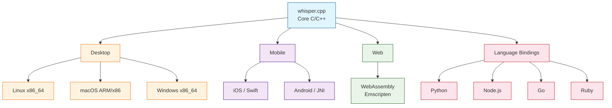
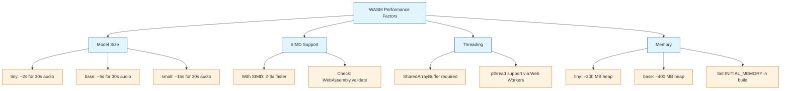

# Chapter 7: Platform Integration

> iOS, Android, WebAssembly, Python, and Node.js bindings for Whisper.cpp

## Learning Objectives

By the end of this chapter, you'll understand:
- How to build Whisper.cpp for iOS and Android
- WebAssembly compilation for in-browser speech recognition
- Python bindings via `whisper-cpp-python` and `ctypes`
- Node.js integration through native add-ons
- Cross-compilation strategies and platform-specific considerations

## Platform Overview

One of Whisper.cpp's greatest strengths is its portability. Because it is written in plain C/C++ with minimal dependencies, it can be compiled for virtually any platform that has a C compiler.



## iOS Integration

### Building for iOS

Whisper.cpp includes an Xcode project and a Swift package that makes iOS integration straightforward.

```bash
# Clone and prepare for iOS
git clone https://github.com/ggerganov/whisper.cpp
cd whisper.cpp

# Download a model suitable for mobile (tiny or base)
./models/download-ggml-model.sh tiny

# The Xcode project is in examples/whisper.objc/
# Or use the Swift package in examples/whisper.swiftui/
```

### Swift Wrapper

```swift
import Foundation

/// Swift wrapper around the whisper.cpp C API.
class WhisperContext {
    private var context: OpaquePointer?

    init?(modelPath: String) {
        var params = whisper_context_default_params()
        // Use Core ML on supported devices
        #if targetEnvironment(simulator)
        params.use_gpu = false
        #else
        params.use_gpu = true
        #endif

        guard let ctx = whisper_init_from_file_with_params(modelPath, params) else {
            return nil
        }
        self.context = ctx
    }

    deinit {
        if let ctx = context {
            whisper_free(ctx)
        }
    }

    /// Transcribe a PCM float buffer at 16 kHz mono.
    func transcribe(samples: [Float], language: String = "en") -> String? {
        guard let ctx = context else { return nil }

        var params = whisper_full_default_params(WHISPER_SAMPLING_GREEDY)
        params.print_realtime   = false
        params.print_progress   = false
        params.print_timestamps = false
        params.print_special    = false
        params.language         = (language as NSString).utf8String
        params.n_threads        = Int32(min(4, ProcessInfo.processInfo.activeProcessorCount))

        let result = samples.withUnsafeBufferPointer { buffer in
            whisper_full(ctx, params, buffer.baseAddress, Int32(buffer.count))
        }

        guard result == 0 else { return nil }

        var text = ""
        let nSegments = whisper_full_n_segments(ctx)
        for i in 0..<nSegments {
            if let segText = whisper_full_get_segment_text(ctx, i) {
                text += String(cString: segText)
            }
        }
        return text
    }

    /// Detect the spoken language.
    func detectLanguage(samples: [Float]) -> (language: String, confidence: Float)? {
        guard let ctx = context else { return nil }

        let maxSamples = min(samples.count, 16000 * 30) // First 30 seconds
        let subSamples = Array(samples.prefix(maxSamples))

        subSamples.withUnsafeBufferPointer { buffer in
            whisper_pcm_to_mel(ctx, buffer.baseAddress, Int32(buffer.count), 1)
        }

        whisper_encode(ctx, 0, 4)

        let nLang = Int(whisper_lang_max_id()) + 1
        var probs = [Float](repeating: 0, count: nLang)
        whisper_lang_auto_detect(ctx, 0, 4, &probs)

        var bestIdx = 0
        for i in 1..<nLang {
            if probs[i] > probs[bestIdx] { bestIdx = i }
        }

        let langStr = String(cString: whisper_lang_str(Int32(bestIdx)))
        return (langStr, probs[bestIdx])
    }
}
```

### iOS App Integration

```swift
import SwiftUI
import AVFoundation

struct TranscriptionView: View {
    @State private var transcription = ""
    @State private var isRecording = false

    private let whisper: WhisperContext?
    private let audioEngine = AVAudioEngine()

    init() {
        let modelPath = Bundle.main.path(
            forResource: "ggml-tiny", ofType: "bin"
        )
        self.whisper = modelPath.flatMap { WhisperContext(modelPath: $0) }
    }

    var body: some View {
        VStack(spacing: 20) {
            Text("Whisper.cpp iOS")
                .font(.title)

            ScrollView {
                Text(transcription)
                    .padding()
            }
            .frame(maxHeight: 300)
            .background(Color(.systemGray6))
            .cornerRadius(8)

            Button(action: toggleRecording) {
                Text(isRecording ? "Stop" : "Record")
                    .font(.headline)
                    .padding()
                    .frame(maxWidth: .infinity)
                    .background(isRecording ? Color.red : Color.blue)
                    .foregroundColor(.white)
                    .cornerRadius(10)
            }
        }
        .padding()
    }

    func toggleRecording() {
        if isRecording {
            stopRecording()
        } else {
            startRecording()
        }
        isRecording.toggle()
    }

    func startRecording() {
        let inputNode = audioEngine.inputNode
        let format = inputNode.outputFormat(forBus: 0)

        inputNode.installTap(onBus: 0, bufferSize: 1024, format: format) {
            buffer, _ in
            // Accumulate audio samples for processing
        }

        do {
            try audioEngine.start()
        } catch {
            print("Audio engine error: \(error)")
        }
    }

    func stopRecording() {
        audioEngine.stop()
        audioEngine.inputNode.removeTap(onBus: 0)
        // Process accumulated audio with whisper.transcribe(...)
    }
}
```

### iOS Build Configuration

| Setting | Recommended Value | Notes |
|---------|-------------------|-------|
| Model size | tiny or base | Larger models may exceed memory limits |
| Quantization | Q5_0 or Q4_0 | Reduces model file size significantly |
| Threads | 2-4 | Match device core count |
| Core ML | Enabled | Accelerates encoder on Apple Neural Engine |
| Minimum iOS | 15.0 | For modern Swift/SwiftUI features |

## Android Integration

### JNI Bridge

Whisper.cpp provides Java/Kotlin bindings through JNI (Java Native Interface).

```bash
# Build for Android using CMake
cd whisper.cpp

# Set up Android NDK paths
export ANDROID_NDK=/path/to/android-ndk
export API_LEVEL=24

# Build for arm64-v8a
cmake -B build-android \
    -DCMAKE_TOOLCHAIN_FILE=$ANDROID_NDK/build/cmake/android.toolchain.cmake \
    -DANDROID_ABI=arm64-v8a \
    -DANDROID_NATIVE_API_LEVEL=$API_LEVEL \
    -DBUILD_SHARED_LIBS=ON

cmake --build build-android --config Release
```

### Kotlin Wrapper

```kotlin
package com.example.whisper

import java.nio.FloatBuffer

class WhisperContext private constructor(private val nativePtr: Long) {

    companion object {
        init {
            System.loadLibrary("whisper_jni")
        }

        fun createFromFile(modelPath: String): WhisperContext? {
            val ptr = nativeInit(modelPath)
            return if (ptr != 0L) WhisperContext(ptr) else null
        }

        @JvmStatic private external fun nativeInit(modelPath: String): Long
        @JvmStatic private external fun nativeFree(ptr: Long)
        @JvmStatic private external fun nativeTranscribe(
            ptr: Long, samples: FloatArray, language: String, translate: Boolean
        ): String
        @JvmStatic private external fun nativeDetectLanguage(
            ptr: Long, samples: FloatArray
        ): String
    }

    fun transcribe(
        samples: FloatArray,
        language: String = "en",
        translate: Boolean = false
    ): String {
        return nativeTranscribe(nativePtr, samples, language, translate)
    }

    fun detectLanguage(samples: FloatArray): String {
        return nativeDetectLanguage(nativePtr, samples)
    }

    fun close() {
        nativeFree(nativePtr)
    }

    protected fun finalize() {
        close()
    }
}
```

### Android JNI Implementation

```cpp
// whisper_jni.cpp
#include <jni.h>
#include "whisper.h"
#include <string>

extern "C" {

JNIEXPORT jlong JNICALL
Java_com_example_whisper_WhisperContext_nativeInit(
    JNIEnv * env, jclass clazz, jstring model_path
) {
    const char * path = env->GetStringUTFChars(model_path, nullptr);

    struct whisper_context_params cparams = whisper_context_default_params();
    struct whisper_context * ctx =
        whisper_init_from_file_with_params(path, cparams);

    env->ReleaseStringUTFChars(model_path, path);
    return reinterpret_cast<jlong>(ctx);
}

JNIEXPORT void JNICALL
Java_com_example_whisper_WhisperContext_nativeFree(
    JNIEnv * env, jclass clazz, jlong ptr
) {
    auto * ctx = reinterpret_cast<struct whisper_context *>(ptr);
    if (ctx) whisper_free(ctx);
}

JNIEXPORT jstring JNICALL
Java_com_example_whisper_WhisperContext_nativeTranscribe(
    JNIEnv * env, jclass clazz, jlong ptr,
    jfloatArray samples, jstring language, jboolean translate
) {
    auto * ctx = reinterpret_cast<struct whisper_context *>(ptr);
    if (!ctx) return env->NewStringUTF("");

    // Get audio data
    jfloat * audio = env->GetFloatArrayElements(samples, nullptr);
    jsize n_samples = env->GetArrayLength(samples);

    // Get language string
    const char * lang = env->GetStringUTFChars(language, nullptr);

    // Configure parameters
    struct whisper_full_params wparams =
        whisper_full_default_params(WHISPER_SAMPLING_GREEDY);
    wparams.language   = lang;
    wparams.translate  = translate;
    wparams.n_threads  = 4;
    wparams.print_realtime   = false;
    wparams.print_progress   = false;
    wparams.print_timestamps = false;

    // Run inference
    whisper_full(ctx, wparams, audio, n_samples);

    // Collect results
    std::string result;
    const int n_segments = whisper_full_n_segments(ctx);
    for (int i = 0; i < n_segments; ++i) {
        result += whisper_full_get_segment_text(ctx, i);
    }

    // Cleanup
    env->ReleaseFloatArrayElements(samples, audio, 0);
    env->ReleaseStringUTFChars(language, lang);

    return env->NewStringUTF(result.c_str());
}

} // extern "C"
```

## WebAssembly (WASM)

### Building for the Browser

Whisper.cpp can be compiled to WebAssembly using Emscripten, allowing speech recognition to run entirely in the browser with no server required.

```bash
# Install Emscripten (if not already installed)
git clone https://github.com/emscripten-core/emsdk.git
cd emsdk
./emsdk install latest
./emsdk activate latest
source ./emsdk_env.sh

# Build whisper.cpp for WASM
cd whisper.cpp
mkdir build-wasm && cd build-wasm

emcmake cmake .. \
    -DCMAKE_BUILD_TYPE=Release \
    -DWHISPER_WASM_SINGLE_FILE=ON

emmake make -j$(nproc)
```

### WASM Build Options

| Option | Description | Default |
|--------|-------------|---------|
| `WHISPER_WASM_SINGLE_FILE` | Bundle WASM into a single JS file | OFF |
| `WHISPER_NO_METAL` | Disable Metal (not available in WASM) | ON |
| `WHISPER_NO_CUDA` | Disable CUDA (not available in WASM) | ON |
| `CMAKE_BUILD_TYPE` | Release for smaller binary | Debug |

### JavaScript Integration

```html
<!DOCTYPE html>
<html>
<head>
    <title>Whisper.cpp in the Browser</title>
</head>
<body>
    <h1>Browser Speech Recognition</h1>
    <button id="btnRecord">Start Recording</button>
    <button id="btnStop" disabled>Stop</button>
    <pre id="output"></pre>

    <script src="whisper.js"></script>
    <script>
    // Initialize Whisper WASM module
    let whisperModule = null;
    let audioContext = null;
    let mediaRecorder = null;
    let audioChunks = [];

    async function initWhisper() {
        // Load the WASM module
        whisperModule = await createWhisperModule();

        // Load the model (fetch from server or IndexedDB cache)
        const modelUrl = 'models/ggml-tiny.bin';
        const response = await fetch(modelUrl);
        const modelBuffer = await response.arrayBuffer();

        // Write model to WASM filesystem
        const modelData = new Uint8Array(modelBuffer);
        whisperModule.FS.writeFile('/model.bin', modelData);

        // Initialize Whisper context
        whisperModule._whisper_init('/model.bin');

        document.getElementById('output').textContent =
            'Whisper loaded. Ready to transcribe.';
    }

    async function startRecording() {
        audioContext = new AudioContext({ sampleRate: 16000 });
        const stream = await navigator.mediaDevices.getUserMedia({
            audio: {
                sampleRate: 16000,
                channelCount: 1,
                echoCancellation: true,
            }
        });

        mediaRecorder = new MediaRecorder(stream);
        audioChunks = [];

        mediaRecorder.ondataavailable = (event) => {
            audioChunks.push(event.data);
        };

        mediaRecorder.onstop = async () => {
            const audioBlob = new Blob(audioChunks, { type: 'audio/wav' });
            await transcribeBlob(audioBlob);
        };

        mediaRecorder.start();
        document.getElementById('btnRecord').disabled = true;
        document.getElementById('btnStop').disabled = false;
    }

    function stopRecording() {
        if (mediaRecorder) {
            mediaRecorder.stop();
        }
        document.getElementById('btnRecord').disabled = false;
        document.getElementById('btnStop').disabled = true;
    }

    async function transcribeBlob(blob) {
        const arrayBuffer = await blob.arrayBuffer();
        const audioData = new Float32Array(arrayBuffer);

        // Write audio to WASM filesystem
        const audioBytes = new Uint8Array(audioData.buffer);
        whisperModule.FS.writeFile('/audio.wav', audioBytes);

        // Run transcription
        const result = whisperModule._whisper_transcribe(
            '/audio.wav', 'en', false
        );

        const text = whisperModule.UTF8ToString(result);
        document.getElementById('output').textContent = text;
    }

    // Event listeners
    document.getElementById('btnRecord').addEventListener('click', startRecording);
    document.getElementById('btnStop').addEventListener('click', stopRecording);

    // Initialize on load
    initWhisper();
    </script>
</body>
</html>
```

### WASM Performance Considerations



## Python Bindings

### whisper-cpp-python Package

The `whisper-cpp-python` package provides a Pythonic interface to Whisper.cpp.

```bash
# Install from PyPI
pip install whisper-cpp-python

# Or build from source (for custom backends)
pip install whisper-cpp-python --no-binary :all:
```

### Basic Python Usage

```python
from whisper_cpp_python import Whisper

# Initialize
model = Whisper("models/ggml-base.en.bin")

# Transcribe from file
result = model.transcribe("audio.wav")
print(result["text"])

# Transcribe with options
result = model.transcribe(
    "audio.wav",
    language="en",
    n_threads=4,
    print_realtime=False,
    print_progress=False,
)

# Access segments with timestamps
for segment in result.get("segments", []):
    start = segment["start"]
    end   = segment["end"]
    text  = segment["text"]
    print(f"[{start:.2f} --> {end:.2f}] {text}")
```

### ctypes-Based Python Binding

For maximum control, you can call the Whisper.cpp shared library directly via `ctypes`.

```python
import ctypes
import numpy as np
import os

class WhisperCtypes:
    """Direct ctypes binding to libwhisper.so / libwhisper.dylib."""

    def __init__(self, lib_path, model_path):
        # Load shared library
        self.lib = ctypes.CDLL(lib_path)

        # Define function signatures
        self.lib.whisper_init_from_file.restype = ctypes.c_void_p
        self.lib.whisper_init_from_file.argtypes = [ctypes.c_char_p]

        self.lib.whisper_free.restype = None
        self.lib.whisper_free.argtypes = [ctypes.c_void_p]

        self.lib.whisper_full_default_params.restype = ctypes.c_void_p
        self.lib.whisper_full.restype = ctypes.c_int
        self.lib.whisper_full.argtypes = [
            ctypes.c_void_p,   # ctx
            ctypes.c_void_p,   # params (struct)
            ctypes.POINTER(ctypes.c_float),  # samples
            ctypes.c_int,      # n_samples
        ]

        self.lib.whisper_full_n_segments.restype = ctypes.c_int
        self.lib.whisper_full_n_segments.argtypes = [ctypes.c_void_p]

        self.lib.whisper_full_get_segment_text.restype = ctypes.c_char_p
        self.lib.whisper_full_get_segment_text.argtypes = [
            ctypes.c_void_p, ctypes.c_int
        ]

        # Initialize context
        self.ctx = self.lib.whisper_init_from_file(
            model_path.encode("utf-8")
        )
        if not self.ctx:
            raise RuntimeError(f"Failed to load model: {model_path}")

    def transcribe(self, audio: np.ndarray) -> str:
        """Transcribe float32 PCM audio at 16 kHz."""
        audio = audio.astype(np.float32)
        n_samples = len(audio)

        # Get default params (greedy)
        params = self.lib.whisper_full_default_params(0)

        # Run inference
        audio_ptr = audio.ctypes.data_as(ctypes.POINTER(ctypes.c_float))
        ret = self.lib.whisper_full(self.ctx, params, audio_ptr, n_samples)

        if ret != 0:
            raise RuntimeError(f"whisper_full failed with code {ret}")

        # Collect segments
        n_seg = self.lib.whisper_full_n_segments(self.ctx)
        text = ""
        for i in range(n_seg):
            seg_text = self.lib.whisper_full_get_segment_text(self.ctx, i)
            text += seg_text.decode("utf-8")

        return text

    def __del__(self):
        if hasattr(self, "ctx") and self.ctx:
            self.lib.whisper_free(self.ctx)


# Usage
if __name__ == "__main__":
    import librosa

    lib_ext = "dylib" if os.uname().sysname == "Darwin" else "so"
    whisper = WhisperCtypes(
        f"libwhisper.{lib_ext}",
        "models/ggml-base.en.bin",
    )

    audio, sr = librosa.load("audio.wav", sr=16000)
    text = whisper.transcribe(audio)
    print(f"Transcription: {text}")
```

## Node.js Integration

### Native Add-on with node-addon-api

```bash
# Install the whisper.cpp Node.js bindings
npm install whisper-cpp
# or build from source
npm install --build-from-source whisper-cpp
```

### Node.js Usage

```javascript
const { Whisper } = require('whisper-cpp');
const fs = require('fs');
const path = require('path');

async function transcribeFile(audioPath) {
    // Initialize Whisper
    const whisper = new Whisper(
        path.join(__dirname, 'models', 'ggml-base.en.bin')
    );

    // Read audio file (must be 16 kHz mono float32 PCM)
    const audioBuffer = fs.readFileSync(audioPath);
    const samples = new Float32Array(audioBuffer.buffer);

    // Transcribe
    const result = await whisper.transcribe(samples, {
        language: 'en',
        n_threads: 4,
        translate: false,
    });

    console.log('Transcription:', result.text);
    console.log('Segments:');
    for (const seg of result.segments) {
        console.log(`  [${seg.start.toFixed(2)}s - ${seg.end.toFixed(2)}s] ${seg.text}`);
    }

    // Cleanup
    whisper.free();
}

transcribeFile('audio.wav').catch(console.error);
```

### Express.js Transcription Server

```javascript
const express = require('express');
const multer = require('multer');
const { Whisper } = require('whisper-cpp');
const path = require('path');

const app = express();
const upload = multer({ storage: multer.memoryStorage() });

// Initialize Whisper once at startup
const whisper = new Whisper(
    path.join(__dirname, 'models', 'ggml-base.en.bin')
);

app.post('/transcribe', upload.single('audio'), async (req, res) => {
    if (!req.file) {
        return res.status(400).json({ error: 'No audio file provided' });
    }

    try {
        // Convert uploaded buffer to float32 samples
        const samples = bufferToFloat32(req.file.buffer);

        const result = await whisper.transcribe(samples, {
            language: req.body.language || 'en',
            translate: req.body.translate === 'true',
            n_threads: 4,
        });

        res.json({
            text: result.text,
            segments: result.segments,
            language: result.language,
        });
    } catch (err) {
        res.status(500).json({ error: err.message });
    }
});

function bufferToFloat32(buffer) {
    // Convert 16-bit PCM WAV to float32
    const view = new DataView(buffer.buffer);
    const samples = new Float32Array(buffer.length / 2);
    for (let i = 0; i < samples.length; i++) {
        samples[i] = view.getInt16(i * 2, true) / 32768.0;
    }
    return samples;
}

app.listen(3000, () => {
    console.log('Whisper transcription server listening on port 3000');
});
```

## Cross-Platform Build Matrix

### CMake Build Configurations

```bash
# Linux x86_64 (with AVX2)
cmake -B build -DCMAKE_BUILD_TYPE=Release -DWHISPER_AVX2=ON
cmake --build build -j$(nproc)

# macOS ARM (with Accelerate and Metal)
cmake -B build -DCMAKE_BUILD_TYPE=Release \
    -DWHISPER_METAL=ON \
    -DWHISPER_ACCELERATE=ON
cmake --build build -j$(sysctl -n hw.ncpu)

# macOS with Core ML
cmake -B build -DCMAKE_BUILD_TYPE=Release \
    -DWHISPER_COREML=ON
cmake --build build -j$(sysctl -n hw.ncpu)

# Windows (Visual Studio)
cmake -B build -G "Visual Studio 17 2022" -A x64
cmake --build build --config Release

# Raspberry Pi (ARM, NEON)
cmake -B build -DCMAKE_BUILD_TYPE=Release \
    -DWHISPER_NO_AVX=ON \
    -DWHISPER_NO_AVX2=ON \
    -DWHISPER_NO_FMA=ON
cmake --build build -j4
```

### Platform Feature Support

| Feature | Linux x86 | macOS ARM | Windows | iOS | Android | WASM |
|---------|-----------|-----------|---------|-----|---------|------|
| AVX/AVX2 | Yes | No | Yes | No | No | No |
| NEON | No | Yes | No | Yes | Yes (ARM) | No |
| Metal | No | Yes | No | Yes | No | No |
| CUDA | Yes | No | Yes | No | No | No |
| Core ML | No | Yes | No | Yes | No | No |
| SIMD (WASM) | N/A | N/A | N/A | N/A | N/A | Yes |
| Multithreading | pthreads | pthreads | Win32 | GCD | pthreads | Web Workers |

## Summary

Whisper.cpp's pure C/C++ implementation makes it one of the most portable speech recognition solutions available. From mobile apps (iOS/Android) to in-browser experiences (WebAssembly) to server-side integrations (Python/Node.js), the same core library powers speech recognition across all platforms. Each platform has its own acceleration opportunities -- Metal and Core ML on Apple devices, NEON on ARM, AVX2 on x86, and WASM SIMD in browsers.

## Key Takeaways

1. **iOS Integration**: Use the Swift wrapper with Core ML acceleration for best performance on Apple devices
2. **Android via JNI**: Build with the Android NDK and expose the C API through JNI to Kotlin/Java
3. **WebAssembly**: Emscripten compiles Whisper.cpp for the browser; use SIMD and threading for acceptable speed
4. **Python Bindings**: `whisper-cpp-python` provides the easiest integration; `ctypes` offers maximum control
5. **Node.js**: Native add-ons give full access to the C API from JavaScript server applications
6. **Platform-Specific Acceleration**: Each platform has unique SIMD and hardware acceleration options that should be enabled at build time

## Next Steps

With platform integration covered, it is time to prepare Whisper.cpp for production workloads. Continue to [Chapter 8: Production Deployment](08-deployment-production.md) for server mode, batch processing, GPU acceleration, and scaling patterns.

---

*Built with insights from the [whisper.cpp](https://github.com/ggerganov/whisper.cpp) project.*
