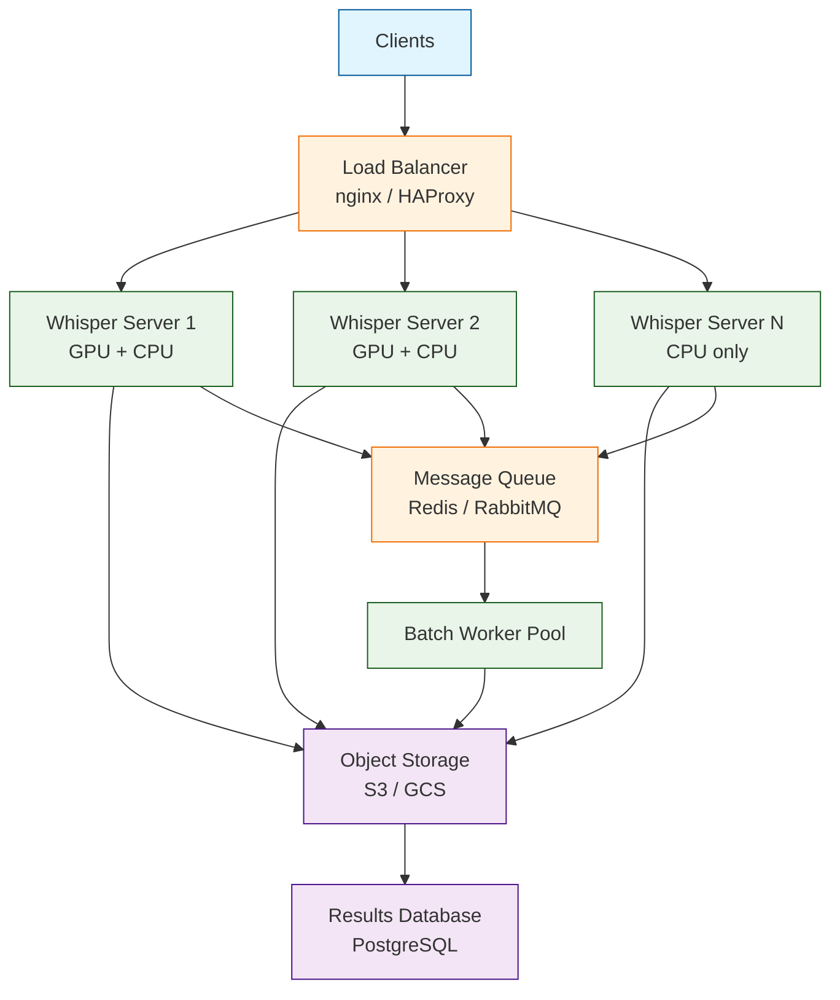
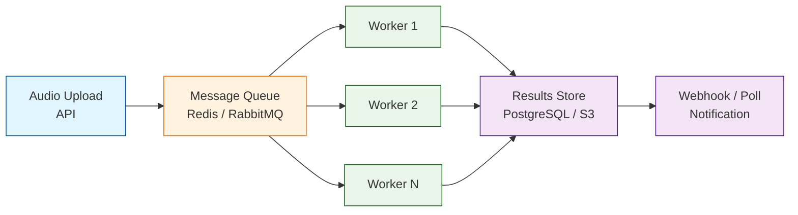

# Chapter 8: Production Deployment

Welcome to **Chapter 8: Production Deployment**. In this part of **Whisper.cpp Tutorial: High-Performance Speech Recognition in C/C++**, you will build an intuitive mental model first, then move into concrete implementation details and practical production tradeoffs.


> Server mode, batch processing, GPU acceleration, scaling patterns, and benchmarking for Whisper.cpp

## Learning Objectives

By the end of this chapter, you'll understand:
- Running Whisper.cpp as an HTTP server for production workloads
- Batch processing pipelines for high-throughput transcription
- GPU acceleration with CUDA, Metal, and OpenCL
- Horizontal and vertical scaling strategies
- Benchmarking methodology and performance profiling
- Monitoring, logging, and operational best practices

## Production Architecture

A production Whisper.cpp deployment typically sits behind a load balancer, with multiple worker processes handling concurrent transcription requests. The architecture can scale from a single server to a distributed cluster.



## Server Mode

### Built-in HTTP Server

Whisper.cpp includes a built-in HTTP server (`server` example) that exposes a REST API for transcription.

```bash
# Build the server
cmake -B build -DWHISPER_SDL2=OFF
cmake --build build --target server

# Run the server
./build/bin/server \
    -m models/ggml-medium.en.bin \
    --host 0.0.0.0 \
    --port 8080 \
    -t 4 \
    --convert
```

### Server Parameters

| Parameter | Description | Default |
|-----------|-------------|---------|
| `-m` | Model file path | (required) |
| `--host` | Bind address | `127.0.0.1` |
| `--port` | Listen port | `8080` |
| `-t` | Number of threads | `4` |
| `--convert` | Auto-convert audio to WAV | `false` |
| `--diarize` | Enable speaker diarization | `false` |
| `--tinydiarize` | Enable TinyDiarize | `false` |
| `-oj` | Output JSON | `false` |
| `--print-progress` | Print progress to stderr | `false` |

### REST API

```bash
# Health check
curl http://localhost:8080/health

# Transcribe an audio file
curl -X POST http://localhost:8080/inference \
    -H "Content-Type: multipart/form-data" \
    -F "file=@audio.wav" \
    -F "response_format=json" \
    -F "language=en"

# Transcribe with translation
curl -X POST http://localhost:8080/inference \
    -H "Content-Type: multipart/form-data" \
    -F "file=@spanish.wav" \
    -F "response_format=json" \
    -F "language=es" \
    -F "translate=true"
```

### Custom HTTP Server with C++

For more control, build a custom server around the Whisper.cpp library.

```cpp
#include "whisper.h"
#include <httplib.h>   // cpp-httplib
#include <json.hpp>    // nlohmann/json
#include <mutex>
#include <queue>
#include <thread>
#include <atomic>

using json = nlohmann::json;

class WhisperServer {
private:
    struct whisper_context * ctx = nullptr;
    std::mutex inference_mutex;
    httplib::Server server;

    struct TranscriptionJob {
        std::vector<float> audio;
        std::string language;
        bool translate;
        std::promise<json> result;
    };

    std::queue<TranscriptionJob> job_queue;
    std::mutex queue_mutex;
    std::condition_variable queue_cv;
    std::atomic<bool> running{false};
    std::vector<std::thread> workers;

public:
    WhisperServer(const char * model_path, int n_workers = 1) {
        ctx = whisper_init_from_file(model_path);
        if (!ctx) throw std::runtime_error("Failed to load model");

        setup_routes();
        start_workers(n_workers);
    }

    ~WhisperServer() {
        running = false;
        queue_cv.notify_all();
        for (auto & w : workers) {
            if (w.joinable()) w.join();
        }
        if (ctx) whisper_free(ctx);
    }

    void listen(const char * host, int port) {
        printf("Whisper server listening on %s:%d\n", host, port);
        server.listen(host, port);
    }

private:
    void setup_routes() {
        // Health endpoint
        server.Get("/health", [](const httplib::Request &,
                                  httplib::Response & res) {
            res.set_content(R"({"status":"ok"})", "application/json");
        });

        // Transcription endpoint
        server.Post("/v1/audio/transcriptions",
            [this](const httplib::Request & req, httplib::Response & res) {
                handle_transcription(req, res);
            }
        );

        // Translation endpoint
        server.Post("/v1/audio/translations",
            [this](const httplib::Request & req, httplib::Response & res) {
                handle_translation(req, res);
            }
        );
    }

    void handle_transcription(const httplib::Request & req,
                              httplib::Response & res) {
        // Extract audio from multipart form
        auto file = req.get_file_value("file");
        if (file.content.empty()) {
            res.status = 400;
            res.set_content(R"({"error":"No audio file"})", "application/json");
            return;
        }

        // Parse audio to float32 PCM
        std::vector<float> pcmf32;
        if (!parse_audio(file.content, pcmf32)) {
            res.status = 400;
            res.set_content(R"({"error":"Invalid audio"})", "application/json");
            return;
        }

        // Get language parameter
        std::string language = "en";
        if (req.has_param("language")) {
            language = req.get_param_value("language");
        }

        // Run inference (thread-safe)
        json result = transcribe(pcmf32, language, false);
        res.set_content(result.dump(), "application/json");
    }

    void handle_translation(const httplib::Request & req,
                            httplib::Response & res) {
        auto file = req.get_file_value("file");
        if (file.content.empty()) {
            res.status = 400;
            res.set_content(R"({"error":"No audio file"})", "application/json");
            return;
        }

        std::vector<float> pcmf32;
        if (!parse_audio(file.content, pcmf32)) {
            res.status = 400;
            res.set_content(R"({"error":"Invalid audio"})", "application/json");
            return;
        }

        std::string language = "";
        if (req.has_param("language")) {
            language = req.get_param_value("language");
        }

        json result = transcribe(pcmf32, language, true);
        res.set_content(result.dump(), "application/json");
    }

    json transcribe(const std::vector<float> & audio,
                    const std::string & language, bool translate) {
        std::lock_guard<std::mutex> lock(inference_mutex);

        struct whisper_full_params wparams =
            whisper_full_default_params(WHISPER_SAMPLING_GREEDY);
        wparams.print_progress   = false;
        wparams.print_special    = false;
        wparams.print_realtime   = false;
        wparams.print_timestamps = true;
        wparams.translate        = translate;
        wparams.n_threads        = 4;

        if (!language.empty()) {
            wparams.language = language.c_str();
        }

        auto t_start = std::chrono::high_resolution_clock::now();

        if (whisper_full(ctx, wparams, audio.data(), audio.size()) != 0) {
            return json{{"error", "Transcription failed"}};
        }

        auto t_end = std::chrono::high_resolution_clock::now();
        double duration_ms =
            std::chrono::duration<double, std::milli>(t_end - t_start).count();

        // Build response
        json result;
        result["text"] = "";

        json segments = json::array();
        const int n_seg = whisper_full_n_segments(ctx);
        for (int i = 0; i < n_seg; ++i) {
            const char * text = whisper_full_get_segment_text(ctx, i);
            const int64_t t0 = whisper_full_get_segment_t0(ctx, i);
            const int64_t t1 = whisper_full_get_segment_t1(ctx, i);

            result["text"] = result["text"].get<std::string>() + text;

            segments.push_back({
                {"id", i},
                {"start", t0 / 100.0},
                {"end",   t1 / 100.0},
                {"text", text},
            });
        }

        result["segments"] = segments;
        result["processing_time_ms"] = duration_ms;
        result["audio_duration_s"] = audio.size() / 16000.0;

        return result;
    }

    void start_workers(int n) {
        running = true;
        // Workers can be used for queue-based processing
        // For the simple server, inference_mutex serializes access
    }

    bool parse_audio(const std::string & data, std::vector<float> & pcmf32) {
        // Simplified: assume 16-bit PCM WAV
        // In production, use ffmpeg or a proper audio decoder
        if (data.size() < 44) return false;  // WAV header minimum

        const int16_t * samples = reinterpret_cast<const int16_t *>(
            data.data() + 44  // Skip WAV header
        );
        int n_samples = (data.size() - 44) / sizeof(int16_t);

        pcmf32.resize(n_samples);
        for (int i = 0; i < n_samples; ++i) {
            pcmf32[i] = samples[i] / 32768.0f;
        }

        return true;
    }
};

int main(int argc, char * argv[]) {
    const char * model = "models/ggml-medium.en.bin";
    const char * host  = "0.0.0.0";
    int port = 8080;

    if (argc > 1) model = argv[1];
    if (argc > 2) port = atoi(argv[2]);

    try {
        WhisperServer server(model);
        server.listen(host, port);
    } catch (const std::exception & e) {
        fprintf(stderr, "Error: %s\n", e.what());
        return 1;
    }

    return 0;
}
```

## Batch Processing

### File-Based Batch Pipeline

```python
import os
import json
import time
import logging
from pathlib import Path
from concurrent.futures import ProcessPoolExecutor, as_completed
from dataclasses import dataclass, asdict
from typing import List

logging.basicConfig(level=logging.INFO, format="%(asctime)s %(message)s")
logger = logging.getLogger(__name__)

@dataclass
class BatchResult:
    filename: str
    text: str
    language: str
    duration_s: float
    processing_s: float
    realtime_factor: float
    success: bool
    error: str = ""

def transcribe_single(args):
    """Transcribe a single file (runs in a worker process)."""
    audio_path, model_path, language = args
    from whisper_cpp_python import Whisper

    try:
        whisper = Whisper(model_path)

        import librosa
        audio, sr = librosa.load(audio_path, sr=16000)
        audio_duration = len(audio) / sr

        t0 = time.time()
        result = whisper.transcribe(audio, language=language)
        t1 = time.time()

        processing_time = t1 - t0
        rtf = processing_time / audio_duration if audio_duration > 0 else 0

        return BatchResult(
            filename=os.path.basename(audio_path),
            text=result.get("text", "").strip(),
            language=language,
            duration_s=audio_duration,
            processing_s=processing_time,
            realtime_factor=rtf,
            success=True,
        )

    except Exception as e:
        return BatchResult(
            filename=os.path.basename(audio_path),
            text="",
            language=language,
            duration_s=0,
            processing_s=0,
            realtime_factor=0,
            success=False,
            error=str(e),
        )


class BatchProcessor:
    """Process multiple audio files in parallel."""

    def __init__(self, model_path, max_workers=4, language="en"):
        self.model_path = model_path
        self.max_workers = max_workers
        self.language = language

    def process_directory(self, input_dir, output_path=None):
        audio_extensions = {".wav", ".mp3", ".m4a", ".flac", ".ogg", ".webm"}
        audio_files = []

        for f in sorted(Path(input_dir).iterdir()):
            if f.suffix.lower() in audio_extensions:
                audio_files.append(str(f))

        if not audio_files:
            logger.warning("No audio files found in %s", input_dir)
            return []

        logger.info("Processing %d files with %d workers",
                     len(audio_files), self.max_workers)

        args_list = [
            (f, self.model_path, self.language) for f in audio_files
        ]

        results = []
        t_start = time.time()

        with ProcessPoolExecutor(max_workers=self.max_workers) as executor:
            futures = {
                executor.submit(transcribe_single, args): args[0]
                for args in args_list
            }

            for future in as_completed(futures):
                result = future.result()
                results.append(result)

                status = "OK" if result.success else "FAIL"
                logger.info(
                    "[%s] %s  (%.1fs audio, %.1fs processing, RTF=%.2f)",
                    status, result.filename,
                    result.duration_s, result.processing_s,
                    result.realtime_factor,
                )

        t_total = time.time() - t_start
        total_audio = sum(r.duration_s for r in results)
        successful = sum(1 for r in results if r.success)

        logger.info("Batch complete: %d/%d succeeded, "
                     "%.1fs total audio, %.1fs wall time, "
                     "overall RTF=%.2f",
                     successful, len(results),
                     total_audio, t_total,
                     t_total / total_audio if total_audio > 0 else 0)

        if output_path:
            with open(output_path, "w") as f:
                json.dump([asdict(r) for r in results], f, indent=2)
            logger.info("Results written to %s", output_path)

        return results


if __name__ == "__main__":
    processor = BatchProcessor(
        model_path="models/ggml-medium.en.bin",
        max_workers=4,
        language="en",
    )
    processor.process_directory("audio_files/", "batch_results.json")
```

### Queue-Based Batch Architecture



## GPU Acceleration

### CUDA (NVIDIA GPUs)

```bash
# Build with CUDA support
cmake -B build \
    -DWHISPER_CUDA=ON \
    -DCMAKE_CUDA_ARCHITECTURES="60;70;75;80;86;89" \
    -DCMAKE_BUILD_TYPE=Release

cmake --build build -j$(nproc)

# Run with GPU
./build/bin/main -m models/ggml-medium.en.bin -f audio.wav --gpu 0
```

### Metal (Apple Silicon)

```bash
# Build with Metal support (macOS/iOS)
cmake -B build \
    -DWHISPER_METAL=ON \
    -DCMAKE_BUILD_TYPE=Release

cmake --build build -j$(sysctl -n hw.ncpu)

# Metal is used automatically when available
./build/bin/main -m models/ggml-medium.en.bin -f audio.wav
```

### GPU vs. CPU Performance

| Model | CPU (M1, 4T) | Metal (M1) | CPU (i9, 8T) | CUDA (RTX 3090) |
|-------|-------------|------------|-------------|-----------------|
| tiny | 0.8s | 0.3s | 1.2s | 0.15s |
| base | 1.5s | 0.5s | 2.3s | 0.25s |
| small | 4.2s | 1.2s | 6.5s | 0.5s |
| medium | 12.0s | 3.5s | 18.0s | 1.2s |
| large-v3 | 28.0s | 8.0s | 42.0s | 2.5s |

*Times for processing 30 seconds of audio. CPU times use the thread count shown. Actual results vary by hardware.*

### Selecting the Right Accelerator

```cpp
// Runtime GPU selection
struct whisper_context * init_with_best_backend(const char * model_path) {
    struct whisper_context_params cparams = whisper_context_default_params();

    #if defined(GGML_USE_CUDA)
        cparams.use_gpu = true;
        cparams.gpu_device = 0;
        printf("Using CUDA GPU acceleration\n");
    #elif defined(GGML_USE_METAL)
        cparams.use_gpu = true;
        printf("Using Metal GPU acceleration\n");
    #else
        cparams.use_gpu = false;
        printf("Using CPU-only inference\n");
    #endif

    return whisper_init_from_file_with_params(model_path, cparams);
}
```

## Scaling Patterns

### Vertical Scaling

Maximize throughput on a single machine by using larger models, more threads, and GPU acceleration.

```cpp
// Optimal thread configuration
int get_optimal_threads() {
    int hw_threads = std::thread::hardware_concurrency();

    // Whisper benefits from up to ~8 threads on most CPUs
    // Beyond that, contention reduces throughput
    return std::min(hw_threads, 8);
}

// Model selection based on available resources
const char * select_model(size_t available_memory_mb, bool has_gpu) {
    if (has_gpu && available_memory_mb > 4000) {
        return "models/ggml-large-v3.bin";       // Best accuracy
    } else if (available_memory_mb > 2000) {
        return "models/ggml-medium.en.bin";      // Great accuracy
    } else if (available_memory_mb > 1000) {
        return "models/ggml-small.en.bin";       // Good accuracy
    } else if (available_memory_mb > 500) {
        return "models/ggml-base.en.bin";        // Decent accuracy
    } else {
        return "models/ggml-tiny.en.bin";        // Fastest
    }
}
```

### Horizontal Scaling with Docker

```dockerfile
# Dockerfile for Whisper.cpp server
FROM ubuntu:22.04 AS builder

RUN apt-get update && apt-get install -y \
    build-essential cmake git wget \
    && rm -rf /var/lib/apt/lists/*

WORKDIR /app
RUN git clone https://github.com/ggerganov/whisper.cpp .
RUN cmake -B build -DCMAKE_BUILD_TYPE=Release \
    && cmake --build build --target server -j$(nproc)

# Download model during build
RUN bash models/download-ggml-model.sh medium.en

# Runtime image
FROM ubuntu:22.04
RUN apt-get update && apt-get install -y \
    libstdc++6 \
    && rm -rf /var/lib/apt/lists/*

WORKDIR /app
COPY --from=builder /app/build/bin/server /app/server
COPY --from=builder /app/models/ggml-medium.en.bin /app/models/

EXPOSE 8080

HEALTHCHECK --interval=30s --timeout=5s \
    CMD curl -f http://localhost:8080/health || exit 1

ENTRYPOINT ["/app/server"]
CMD ["-m", "/app/models/ggml-medium.en.bin", \
     "--host", "0.0.0.0", "--port", "8080", \
     "-t", "4", "--convert"]
```

```yaml
# docker-compose.yml for horizontal scaling
version: "3.8"

services:
  whisper:
    build: .
    deploy:
      replicas: 4
      resources:
        limits:
          cpus: "4.0"
          memory: 4G
    ports:
      - "8080"
    healthcheck:
      test: ["CMD", "curl", "-f", "http://localhost:8080/health"]
      interval: 30s
      timeout: 5s
      retries: 3

  nginx:
    image: nginx:alpine
    ports:
      - "80:80"
    volumes:
      - ./nginx.conf:/etc/nginx/nginx.conf:ro
    depends_on:
      - whisper

  redis:
    image: redis:7-alpine
    ports:
      - "6379:6379"
```

```nginx
# nginx.conf - load balancer
upstream whisper_servers {
    least_conn;
    server whisper:8080;
}

server {
    listen 80;

    client_max_body_size 100M;

    location / {
        proxy_pass http://whisper_servers;
        proxy_set_header Host $host;
        proxy_read_timeout 300s;
    }

    location /health {
        proxy_pass http://whisper_servers;
    }
}
```

## Benchmarking

### Systematic Benchmarking Script

```python
import time
import json
import subprocess
import os
from dataclasses import dataclass, asdict
from typing import List

@dataclass
class BenchmarkResult:
    model: str
    quantization: str
    audio_file: str
    audio_duration_s: float
    load_time_ms: float
    inference_time_ms: float
    total_time_ms: float
    realtime_factor: float
    memory_peak_mb: float
    threads: int
    gpu: str

def run_benchmark(
    model_path: str,
    audio_path: str,
    n_threads: int = 4,
    gpu: str = "none",
) -> BenchmarkResult:
    """Run a single benchmark using the whisper.cpp CLI."""

    # Determine audio duration
    import librosa
    audio, sr = librosa.load(audio_path, sr=16000)
    audio_duration = len(audio) / sr

    # Build command
    cmd = [
        "./build/bin/main",
        "-m", model_path,
        "-f", audio_path,
        "-t", str(n_threads),
        "--print-progress", "false",
        "-otxt",
    ]

    # Measure execution
    t0 = time.time()
    result = subprocess.run(
        cmd, capture_output=True, text=True, timeout=600,
    )
    t1 = time.time()

    total_ms = (t1 - t0) * 1000

    # Parse timing from stderr
    load_ms = 0.0
    inference_ms = 0.0
    for line in result.stderr.split("\n"):
        if "load time" in line:
            load_ms = _parse_time(line)
        if "total time" in line:
            inference_ms = _parse_time(line)

    model_name = os.path.basename(model_path)
    quant = "f16" if "f16" in model_name else \
            "q5_0" if "q5_0" in model_name else \
            "q4_0" if "q4_0" in model_name else "default"

    return BenchmarkResult(
        model=model_name,
        quantization=quant,
        audio_file=os.path.basename(audio_path),
        audio_duration_s=audio_duration,
        load_time_ms=load_ms,
        inference_time_ms=inference_ms,
        total_time_ms=total_ms,
        realtime_factor=total_ms / (audio_duration * 1000),
        memory_peak_mb=0,  # Requires external profiling
        threads=n_threads,
        gpu=gpu,
    )

def _parse_time(line: str) -> float:
    """Extract time in ms from a whisper.cpp timing line."""
    import re
    match = re.search(r"([\d.]+)\s*ms", line)
    return float(match.group(1)) if match else 0.0


def run_full_benchmark(
    models: List[str],
    audio_files: List[str],
    thread_counts: List[int] = [1, 2, 4, 8],
):
    results = []

    for model in models:
        for audio in audio_files:
            for threads in thread_counts:
                print(f"Benchmarking: {os.path.basename(model)}, "
                      f"{os.path.basename(audio)}, {threads} threads")

                try:
                    result = run_benchmark(model, audio, threads)
                    results.append(asdict(result))
                    print(f"  RTF={result.realtime_factor:.3f}, "
                          f"time={result.total_time_ms:.0f}ms")
                except Exception as e:
                    print(f"  Error: {e}")

    # Save results
    with open("benchmark_results.json", "w") as f:
        json.dump(results, f, indent=2)

    return results


if __name__ == "__main__":
    models = [
        "models/ggml-tiny.en.bin",
        "models/ggml-base.en.bin",
        "models/ggml-small.en.bin",
        "models/ggml-medium.en.bin",
    ]

    audio_files = [
        "bench_audio/short_5s.wav",
        "bench_audio/medium_30s.wav",
        "bench_audio/long_120s.wav",
    ]

    run_full_benchmark(models, audio_files)
```

### Real-Time Factor Reference

The **Real-Time Factor (RTF)** measures how fast the system processes audio relative to its duration. An RTF of 0.5 means 30 seconds of audio is processed in 15 seconds.

| Model | 1 Thread | 4 Threads | 8 Threads | Metal (M1) | CUDA (3090) |
|-------|----------|-----------|-----------|------------|-------------|
| tiny.en | 0.12 | 0.04 | 0.03 | 0.01 | 0.005 |
| base.en | 0.25 | 0.08 | 0.06 | 0.02 | 0.008 |
| small.en | 0.80 | 0.22 | 0.16 | 0.04 | 0.017 |
| medium.en | 2.40 | 0.65 | 0.48 | 0.12 | 0.040 |
| large-v3 | 5.60 | 1.50 | 1.10 | 0.27 | 0.083 |

*Lower RTF is better. RTF < 1.0 means faster than real-time.*

## Monitoring and Observability

### Prometheus Metrics

```cpp
// Add Prometheus metrics to the server
#include <prometheus/exposer.h>
#include <prometheus/registry.h>
#include <prometheus/counter.h>
#include <prometheus/histogram.h>

class WhisperMetrics {
private:
    std::shared_ptr<prometheus::Registry> registry;
    prometheus::Family<prometheus::Counter> & requests_total;
    prometheus::Family<prometheus::Counter> & errors_total;
    prometheus::Family<prometheus::Histogram> & latency_seconds;
    prometheus::Family<prometheus::Histogram> & audio_duration_seconds;

public:
    WhisperMetrics()
        : registry(std::make_shared<prometheus::Registry>())
        , requests_total(prometheus::BuildCounter()
            .Name("whisper_requests_total")
            .Help("Total transcription requests")
            .Register(*registry))
        , errors_total(prometheus::BuildCounter()
            .Name("whisper_errors_total")
            .Help("Total transcription errors")
            .Register(*registry))
        , latency_seconds(prometheus::BuildHistogram()
            .Name("whisper_latency_seconds")
            .Help("Transcription latency in seconds")
            .Register(*registry))
        , audio_duration_seconds(prometheus::BuildHistogram()
            .Name("whisper_audio_duration_seconds")
            .Help("Input audio duration in seconds")
            .Register(*registry))
    {}

    void record_request(const std::string & model,
                        const std::string & language,
                        double latency, double audio_duration,
                        bool success) {
        auto & req_counter = requests_total.Add({
            {"model", model}, {"language", language}
        });
        req_counter.Increment();

        if (!success) {
            auto & err_counter = errors_total.Add({
                {"model", model}, {"language", language}
            });
            err_counter.Increment();
        }

        auto & lat_hist = latency_seconds.Add(
            {{"model", model}},
            prometheus::Histogram::BucketBoundaries{
                0.1, 0.5, 1.0, 2.0, 5.0, 10.0, 30.0, 60.0
            }
        );
        lat_hist.Observe(latency);

        auto & dur_hist = audio_duration_seconds.Add(
            {{"model", model}},
            prometheus::Histogram::BucketBoundaries{
                1.0, 5.0, 10.0, 30.0, 60.0, 120.0, 300.0
            }
        );
        dur_hist.Observe(audio_duration);
    }

    std::shared_ptr<prometheus::Registry> get_registry() {
        return registry;
    }
};
```

### Health Check and Readiness

```cpp
// Production-grade health check
struct HealthStatus {
    bool model_loaded;
    bool accepting_requests;
    int queued_requests;
    double avg_latency_ms;
    size_t memory_used_mb;
    std::string model_name;
    std::string version;
};

json health_check(const WhisperServer & server) {
    HealthStatus status = server.get_health();

    return json{
        {"status", status.accepting_requests ? "healthy" : "unhealthy"},
        {"model_loaded", status.model_loaded},
        {"model", status.model_name},
        {"queued_requests", status.queued_requests},
        {"avg_latency_ms", status.avg_latency_ms},
        {"memory_used_mb", status.memory_used_mb},
        {"version", status.version},
    };
}
```

## Production Checklist

### Deployment Readiness

| Area | Item | Status |
|------|------|--------|
| **Model** | Appropriate model size selected for hardware | Required |
| **Model** | Quantization applied (Q5_0 recommended) | Recommended |
| **Server** | Health check endpoint configured | Required |
| **Server** | Request timeout set (e.g. 300s) | Required |
| **Server** | Max upload size configured | Required |
| **Scaling** | Thread count tuned for CPU cores | Required |
| **Scaling** | Load balancer configured for multiple instances | Recommended |
| **Monitoring** | Latency and error rate metrics exposed | Recommended |
| **Monitoring** | Alerting on error rate spikes | Recommended |
| **Security** | Input validation on uploaded files | Required |
| **Security** | Rate limiting on API endpoints | Recommended |
| **Reliability** | Graceful shutdown implemented | Required |
| **Reliability** | Auto-restart on crash (systemd/Docker) | Required |
| **Storage** | Disk space for audio and results | Required |
| **Logging** | Structured logging with request IDs | Recommended |

## Summary

Deploying Whisper.cpp in production involves choosing the right model size and quantization for your hardware, setting up a server (either the built-in one or a custom implementation), and building the supporting infrastructure for batch processing, scaling, and monitoring. GPU acceleration with CUDA or Metal provides dramatic speedups. Horizontal scaling through Docker and load balancing handles high-throughput workloads. Systematic benchmarking ensures you understand your system's real-time factor and can size infrastructure accordingly.

## Key Takeaways

1. **Server Mode**: The built-in HTTP server provides a ready-to-use REST API; custom servers offer more control
2. **Batch Processing**: Use process pools or queue-based architectures for high-throughput offline transcription
3. **GPU Acceleration**: CUDA and Metal provide 5-10x speedups over CPU-only inference
4. **Quantization**: Q5_0 offers the best accuracy-to-size ratio for most production deployments
5. **Horizontal Scaling**: Docker + load balancer scales to handle concurrent requests across multiple machines
6. **Benchmarking**: Measure RTF (Real-Time Factor) systematically across models, thread counts, and hardware
7. **Monitoring**: Track latency, error rate, and queue depth with Prometheus metrics for operational visibility

---

*Built with insights from the [whisper.cpp](https://github.com/ggerganov/whisper.cpp) project.*

## What Problem Does This Solve?

Most teams struggle here because the hard part is not writing more code, but deciding clear boundaries for `language`, `audio`, `json` so behavior stays predictable as complexity grows.

In practical terms, this chapter helps you avoid three common failures:

- coupling core logic too tightly to one implementation path
- missing the handoff boundaries between setup, execution, and validation
- shipping changes without clear rollback or observability strategy

After working through this chapter, you should be able to reason about `Chapter 8: Production Deployment` as an operating subsystem inside **Whisper.cpp Tutorial: High-Performance Speech Recognition in C/C++**, with explicit contracts for inputs, state transitions, and outputs.

Use the implementation notes around `result`, `server`, `models` as your checklist when adapting these patterns to your own repository.

## How it Works Under the Hood

Under the hood, `Chapter 8: Production Deployment` usually follows a repeatable control path:

1. **Context bootstrap**: initialize runtime config and prerequisites for `language`.
2. **Input normalization**: shape incoming data so `audio` receives stable contracts.
3. **Core execution**: run the main logic branch and propagate intermediate state through `json`.
4. **Policy and safety checks**: enforce limits, auth scopes, and failure boundaries.
5. **Output composition**: return canonical result payloads for downstream consumers.
6. **Operational telemetry**: emit logs/metrics needed for debugging and performance tuning.

When debugging, walk this sequence in order and confirm each stage has explicit success/failure conditions.

## Source Walkthrough

Use the following upstream sources to verify implementation details while reading this chapter:

- [View Repo](https://github.com/ggml-org/whisper.cpp)
  Why it matters: authoritative reference on `View Repo` (github.com).

Suggested trace strategy:
- search upstream code for `language` and `audio` to map concrete implementation paths
- compare docs claims against actual runtime/config code before reusing patterns in production

## Chapter Connections

- [Tutorial Index](index.md)
- [Previous Chapter: Chapter 7: Platform Integration](07-platform-integration.md)
- [Main Catalog](../../README.md#-tutorial-catalog)
- [A-Z Tutorial Directory](../../discoverability/tutorial-directory.md)
