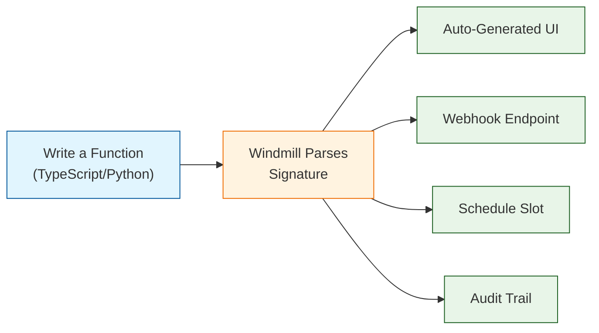
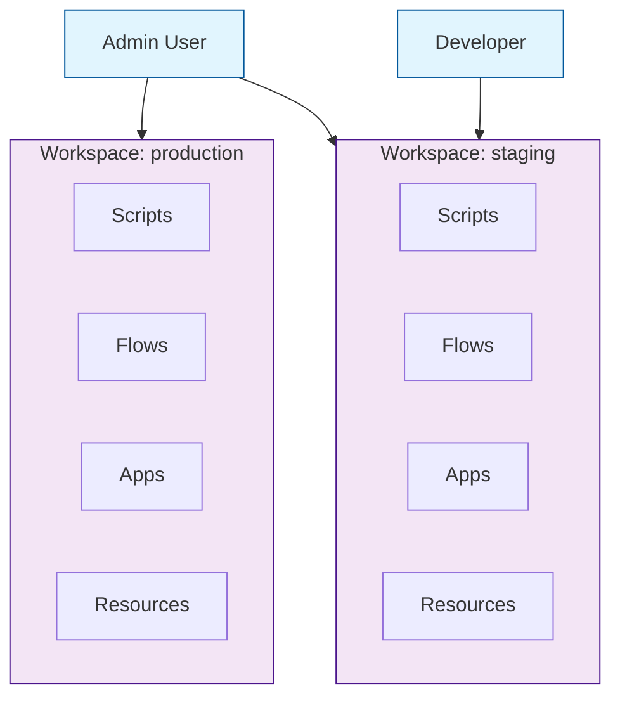

# Chapter 1: Getting Started

Welcome to **Chapter 1: Getting Started**. In this part of **Windmill Tutorial: Scripts to Webhooks, Workflows, and UIs**, you will install Windmill, write your first script, and see how Windmill auto-generates a UI, webhook, and schedule for every function you create.

> Install Windmill, write your first script, and witness the script-to-production pipeline in action.

## Overview

Windmill transforms any script into a production-ready endpoint. You write a function with typed parameters, and Windmill automatically generates:

- A web UI with input forms matching your function signature
- A REST API / webhook endpoint
- A schedulable cron job
- An audit-logged execution history



## Installation Options

### Docker Compose (Recommended)

```bash
# Clone the Windmill repository
git clone https://github.com/windmill-labs/windmill.git
cd windmill/docker-compose

# Start all services
docker compose up -d
```

This starts:

| Service | Port | Purpose |
|:--------|:-----|:--------|
| `windmill_server` | 8000 | API server and web UI |
| `windmill_worker` | -- | Executes jobs from the queue |
| `postgresql` | 5432 | Stores scripts, flows, jobs, audit logs |
| `lsp` | -- | Language server for in-browser editing |

Open `http://localhost:8000` and log in with the default credentials:

- **Email**: `admin@windmill.dev`
- **Password**: `changeme`

### Single Docker Container (Quick Test)

```bash
docker run -d \
  --name windmill \
  -p 8000:8000 \
  -v windmill_data:/tmp/windmill \
  ghcr.io/windmill-labs/windmill:main

# Open http://localhost:8000
```

### Helm Chart (Kubernetes)

```bash
helm repo add windmill https://windmill-labs.github.io/windmill-helm-charts
helm repo update

helm install windmill windmill/windmill \
  --namespace windmill \
  --create-namespace \
  --set windmill.baseDomain=windmill.example.com
```

See [Chapter 8: Self-Hosting & Production](08-self-hosting-and-production.md) for full Kubernetes configuration.

## Your First Script (TypeScript)

Navigate to the **Home** tab and click **+ Script**. Select **TypeScript (Deno)** as the language.

```typescript
// Windmill parses this function signature to generate the UI
// Each parameter becomes a form field with the correct type

export async function main(
  name: string,
  greeting: string = "Hello",
  repeat: number = 1
): Promise<string> {
  const message = `${greeting}, ${name}!`;
  const lines: string[] = [];

  for (let i = 0; i < repeat; i++) {
    lines.push(message);
  }

  return lines.join("\n");
}
```

Save this script as `f/examples/hello_world`. Windmill will:

1. Parse the function signature
2. Generate a form with fields: `name` (required string), `greeting` (string, default "Hello"), `repeat` (number, default 1)
3. Create a webhook at `POST /api/w/{workspace}/jobs/run/p/f/examples/hello_world`
4. Make it available in the Flow Builder and App Builder

### Run It

Click **Test** in the editor. Fill in `name = "Windmill"` and click **Run**. You will see the result:

```
Hello, Windmill!
```

## Your First Script (Python)

```python
# Each parameter with a type annotation becomes a form field
# Default values become optional fields

def main(
    name: str,
    greeting: str = "Hello",
    repeat: int = 1
) -> str:
    """Generate a greeting message."""
    message = f"{greeting}, {name}!"
    return "\n".join([message] * repeat)
```

Python scripts run in isolated virtual environments. Windmill auto-detects `import` statements and installs dependencies.

## Understanding the Script Path

Every script in Windmill has a path like `f/folder/script_name` or `u/username/script_name`:

| Prefix | Meaning |
|:-------|:--------|
| `f/` | Folder-scoped (shared with workspace) |
| `u/` | User-scoped (private to the user) |

The path determines permissions and is used in the webhook URL, the CLI, and cross-references from flows and apps.

## Auto-Generated Webhook

Every saved script gets a webhook endpoint. You can call it immediately:

```bash
# Get a token from the UI: Settings > Tokens > Create Token
TOKEN="your_windmill_token"
WORKSPACE="demo"

# Call the script via webhook
curl -X POST "http://localhost:8000/api/w/${WORKSPACE}/jobs/run/p/f/examples/hello_world" \
  -H "Authorization: Bearer ${TOKEN}" \
  -H "Content-Type: application/json" \
  -d '{"name": "API Caller", "greeting": "Hey", "repeat": 2}'
```

Response:

```json
"Hey, API Caller!\nHey, API Caller!"
```

For async execution (fire and forget):

```bash
curl -X POST "http://localhost:8000/api/w/${WORKSPACE}/jobs/run_wait_result/p/f/examples/hello_world" \
  -H "Authorization: Bearer ${TOKEN}" \
  -H "Content-Type: application/json" \
  -d '{"name": "Async Caller"}'
```

## Workspace Concepts

A **workspace** is an isolated tenant. Each workspace has its own:

- Scripts, flows, and apps
- Variables and secrets
- Resources (database connections, API keys)
- Users and permissions (groups, folders)



## CLI Quick Start

Install the Windmill CLI for local development:

```bash
# Install via npm
npm install -g windmill-cli

# Or via deno
deno install -A https://deno.land/x/wmill/main.ts -n wmill

# Authenticate
wmill workspace add my-windmill http://localhost:8000 --token YOUR_TOKEN

# Push a local script
wmill script push f/examples/hello_world hello_world.ts

# Pull remote scripts to local
wmill pull

# Sync local changes to remote
wmill push
```

The CLI enables git-based workflows: write scripts locally, version them in Git, and deploy via CI/CD.

## Source Code Walkthrough

### Windmill TypeScript worker — `backend/windmill-worker/src/worker.rs`

Windmill's worker runtime is written in Rust. The [`backend/windmill-worker/src/worker.rs`](https://github.com/windmill-labs/windmill/blob/main/backend/windmill-worker/src/worker.rs) file shows how jobs are dequeued, dispatched to the correct language runtime (Deno for TypeScript, Python subprocess, etc.), and how results are returned. This is what runs every time you execute a script.

### Auto-generated webhook — `backend/windmill-api/src/jobs.rs`

Script webhook endpoints are generated automatically. [`backend/windmill-api/src/jobs.rs`](https://github.com/windmill-labs/windmill/blob/main/backend/windmill-api/src/jobs.rs) implements the `/api/w/{workspace}/jobs/run/p/{path}` route that the auto-generated webhook calls — showing exactly how script path maps to a REST endpoint.


## What Just Happened

In this chapter you:

1. Installed Windmill via Docker Compose
2. Wrote a TypeScript script with typed parameters
3. Saw the auto-generated UI form
4. Called the script via its auto-generated webhook
5. Learned about workspaces and the CLI

The key insight: **every script is simultaneously a UI, an API, and a schedulable job**. Windmill treats code as the single source of truth and generates everything else from the function signature.

---

**Next: [Chapter 2: Architecture & Runtimes](02-architecture-and-runtimes.md)** -- understand how Windmill executes your scripts across polyglot runtimes.

[Back to Tutorial Index](README.md) | [Chapter 2: Architecture & Runtimes](02-architecture-and-runtimes.md)

---

*Generated for [Awesome Code Docs](https://github.com/johnxie/awesome-code-docs)*
