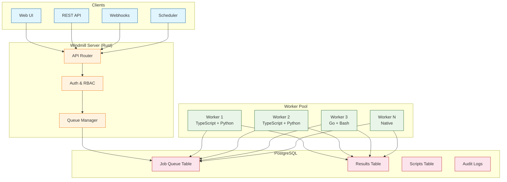
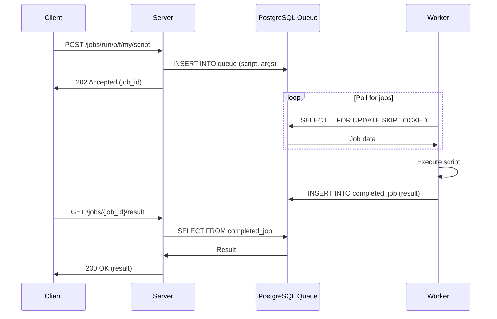
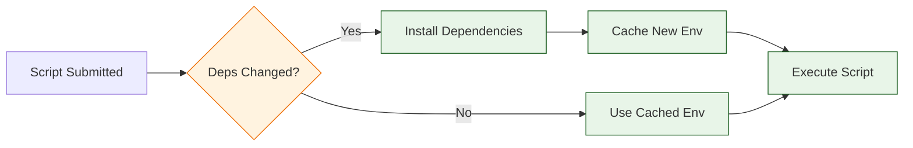

# Chapter 2: Architecture & Runtimes

Welcome to **Chapter 2: Architecture & Runtimes**. In this part of **Windmill Tutorial: Scripts to Webhooks, Workflows, and UIs**, you will understand the internals of how Windmill executes scripts, manages job queues, and supports multiple programming languages in a single platform.

> Understand Windmill's worker architecture, job queue, and polyglot runtime system.

## Overview

Windmill's architecture is built around a central job queue backed by PostgreSQL. Scripts and flows are submitted as jobs, picked up by workers, executed in isolated environments, and results are stored back in the database. This design gives you horizontal scalability, fault tolerance, and language-agnostic execution.

## High-Level Architecture



## Core Components

### 1. Windmill Server

The server is written in **Rust** (using Actix-web) and handles:

- HTTP API routing
- Authentication (OAuth, SAML, SCIM)
- Job submission to the PostgreSQL queue
- WebSocket connections for real-time UI updates
- Static file serving for the Svelte frontend

The server is stateless -- you can run multiple instances behind a load balancer.

### 2. PostgreSQL

PostgreSQL is the single source of truth:

| Table | Purpose |
|:------|:--------|
| `queue` | Pending and running jobs |
| `completed_job` | Finished job results and logs |
| `script` | Script source code and metadata |
| `flow` | Flow definitions (DAG of steps) |
| `variable` | Variables and encrypted secrets |
| `resource` | External service connections |
| `audit` | Full audit trail of all actions |
| `account` | User accounts and permissions |

### 3. Workers

Workers are the execution engines. Each worker:

1. Polls the `queue` table for pending jobs
2. Claims a job using `SELECT ... FOR UPDATE SKIP LOCKED`
3. Sets up the execution environment (dependencies, variables)
4. Executes the script in an isolated process
5. Writes results back to `completed_job`



### 4. Worker Groups and Tags

You can tag workers to handle specific job types:

```bash
# Start a worker that only handles Python jobs
docker run ghcr.io/windmill-labs/windmill:main \
  windmill worker \
  --tags "python,heavy-compute" \
  --database-url "postgres://windmill:windmill@db:5432/windmill"
```

Scripts can be tagged to run only on specific workers:

```typescript
// Script metadata (in Windmill UI)
// Tag: heavy-compute

export async function main(data: number[]): Promise<number> {
  // CPU-intensive computation
  return data.reduce((sum, val) => sum + val * val, 0);
}
```

This enables heterogeneous clusters: GPU workers for ML, high-memory workers for data processing, lightweight workers for quick API calls.

## Supported Runtimes

| Language | Runtime | Dependency Management |
|:---------|:--------|:----------------------|
| **TypeScript** | Deno (Bun available) | Auto-detected imports, lockfile |
| **Python** | CPython | Auto-detected imports, `requirements.txt` inline |
| **Go** | Go compiler | `go.mod` auto-generated |
| **Bash** | System shell | System packages |
| **SQL** | Direct DB query | Resource connection |
| **PowerShell** | pwsh | System modules |
| **PHP** | PHP runtime | Composer auto-detected |
| **Rust** | Cargo | `Cargo.toml` inline |
| **REST** | HTTP client | Built-in |
| **GraphQL** | HTTP client | Built-in |

### TypeScript Runtime Details

```typescript
// TypeScript scripts run on Deno by default
// Imports are auto-resolved and cached

import { Client } from "https://deno.land/x/postgres@v0.17.0/mod.ts";

// npm packages are also supported
// import Anthropic from "npm:@anthropic-ai/sdk";

export async function main(query: string): Promise<object[]> {
  const client = new Client({
    hostname: "localhost",
    port: 5432,
    user: "postgres",
    database: "mydb",
  });
  await client.connect();
  const result = await client.queryObject(query);
  await client.end();
  return result.rows;
}
```

### Python Runtime Details

```python
# Python scripts auto-detect imports
# Windmill creates a virtual environment and installs packages

import pandas as pd
import requests

def main(url: str, columns: list[str] | None = None) -> dict:
    """Fetch CSV from URL and return summary statistics."""
    df = pd.read_csv(url)

    if columns:
        df = df[columns]

    return {
        "shape": list(df.shape),
        "columns": list(df.columns),
        "summary": df.describe().to_dict()
    }
```

Windmill parses the `import` statements, installs packages via `pip`, and caches the virtual environment for subsequent runs.

### Dependency Caching

Windmill aggressively caches dependencies:



Cache layers:

1. **Global pip/deno cache** on the worker filesystem
2. **Per-script lockfile** pinning exact versions
3. **Docker layer caching** for custom images

## Job Lifecycle

Every job goes through these states:

| State | Description |
|:------|:------------|
| `Queued` | Job submitted, waiting for a worker |
| `Running` | Worker picked it up, executing |
| `Completed` | Finished successfully, result stored |
| `Failed` | Execution error, error stored |
| `Cancelled` | Manually cancelled or timed out |

```typescript
// You can check job status via the API
const response = await fetch(
  `http://localhost:8000/api/w/demo/jobs/get/${jobId}`,
  { headers: { Authorization: `Bearer ${token}` } }
);

const job = await response.json();
console.log(job.type);    // "CompletedJob" or "QueuedJob"
console.log(job.success); // true or false
console.log(job.result);  // the return value of your script
```

## Performance Characteristics

- **Cold start** (new dependencies): 2-10 seconds depending on package count
- **Warm start** (cached deps): 50-200ms
- **Native scripts** (REST, SQL): under 50ms
- **Throughput**: a single worker handles ~26 million jobs/month (Windmill benchmark)
- **Horizontal scaling**: add more workers to increase throughput linearly

## Source Code Walkthrough

### Worker dispatcher — `backend/windmill-worker/src/worker.rs`

The central dispatch logic in [`backend/windmill-worker/src/worker.rs`](https://github.com/windmill-labs/windmill/blob/main/backend/windmill-worker/src/worker.rs) routes jobs to language-specific execution handlers. The match on `language` field shows exactly how TypeScript jobs go to the Deno runtime, Python to the Python subprocess executor, Go to the Go compiler, etc.

### Job queue — `backend/windmill-queue/src/queues.rs`

[`backend/windmill-queue/src/queues.rs`](https://github.com/windmill-labs/windmill/blob/main/backend/windmill-queue/src/queues.rs) implements the PostgreSQL-backed job queue: `push_job`, `pull_job`, and the polling loop that workers use to claim new work. This is the core of Windmill's distributed execution model.


## What You Learned

In this chapter you:

1. Mapped the server-worker-database architecture
2. Understood how jobs flow from submission to completion via PostgreSQL
3. Learned about worker groups and tags for heterogeneous workloads
4. Reviewed the supported language runtimes and dependency management
5. Saw how caching keeps execution fast after the first run

The key insight: **Windmill's architecture is a distributed job queue backed by PostgreSQL**, making it inherently scalable and observable. Every job is a row in the database with full audit history.

---

**Next: [Chapter 3: Script Development](03-script-development.md)** -- deep-dive into writing production scripts with resources, error handling, and advanced patterns.

[Back to Tutorial Index](README.md) | [Previous: Chapter 1](01-getting-started.md) | [Next: Chapter 3](03-script-development.md)

---

*Generated for [Awesome Code Docs](https://github.com/johnxie/awesome-code-docs)*
