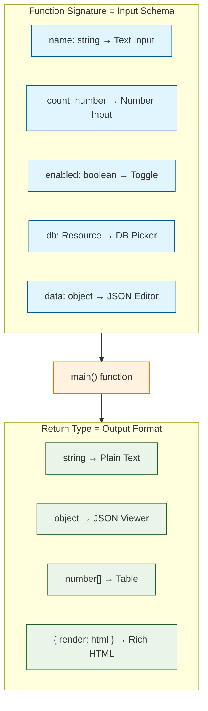

# Chapter 3: Script Development

Welcome to **Chapter 3: Script Development**. In this part of **Windmill Tutorial: Scripts to Webhooks, Workflows, and UIs**, you will master writing production-quality scripts with typed inputs, resource access, error handling, and state management.

> Write production scripts in TypeScript and Python with typed resources, structured error handling, and result formatting.

## Overview

A Windmill script is a regular function with one special contract: the `main` function is the entry point, and its parameters define the auto-generated UI. Beyond that, you can use any library, access external resources, return structured data, and handle errors gracefully.

## The Script Contract



## TypeScript Script Patterns

### Basic Script with Rich Types

```typescript
// f/scripts/process_orders

// Windmill maps TS types to UI form fields
type Order = {
  id: string;
  customer: string;
  amount: number;
  status: "pending" | "shipped" | "delivered";
};

export async function main(
  orders: Order[],
  min_amount: number = 0,
  status_filter: "pending" | "shipped" | "delivered" | "all" = "all"
): Promise<{
  filtered_count: number;
  total_amount: number;
  orders: Order[];
}> {
  let filtered = orders;

  if (status_filter !== "all") {
    filtered = filtered.filter((o) => o.status === status_filter);
  }

  filtered = filtered.filter((o) => o.amount >= min_amount);

  const total_amount = filtered.reduce((sum, o) => sum + o.amount, 0);

  return {
    filtered_count: filtered.length,
    total_amount,
    orders: filtered,
  };
}
```

### Using Resources (Database Example)

Resources are typed connections to external services. See [Chapter 7](07-variables-secrets-and-resources.md) for full details.

```typescript
// f/scripts/query_users

// Import the Windmill SDK for resource types
import * as wmill from "npm:windmill-client@1";

// The special type annotation connects to a resource picker in the UI
// Windmill resolves this at runtime to the actual connection details
type Postgresql = {
  host: string;
  port: number;
  user: string;
  password: string;
  dbname: string;
};

import { Client } from "https://deno.land/x/postgres@v0.17.0/mod.ts";

export async function main(
  db: Postgresql,
  search_term: string,
  limit: number = 50
): Promise<object[]> {
  const client = new Client({
    hostname: db.host,
    port: db.port,
    user: db.user,
    password: db.password,
    database: db.dbname,
  });

  await client.connect();

  try {
    const result = await client.queryObject(
      `SELECT id, name, email, created_at
       FROM users
       WHERE name ILIKE $1 OR email ILIKE $1
       ORDER BY created_at DESC
       LIMIT $2`,
      [`%${search_term}%`, limit]
    );
    return result.rows;
  } finally {
    await client.end();
  }
}
```

### HTTP API Integration

```typescript
// f/scripts/fetch_github_issues

export async function main(
  repo: string = "windmill-labs/windmill",
  state: "open" | "closed" | "all" = "open",
  per_page: number = 30
): Promise<object[]> {
  const url = `https://api.github.com/repos/${repo}/issues?state=${state}&per_page=${per_page}`;

  const response = await fetch(url, {
    headers: {
      Accept: "application/vnd.github.v3+json",
      "User-Agent": "windmill-script",
    },
  });

  if (!response.ok) {
    throw new Error(
      `GitHub API returned ${response.status}: ${await response.text()}`
    );
  }

  const issues = await response.json();

  return issues.map((issue: any) => ({
    number: issue.number,
    title: issue.title,
    state: issue.state,
    author: issue.user.login,
    labels: issue.labels.map((l: any) => l.name),
    created_at: issue.created_at,
  }));
}
```

## Python Script Patterns

### Data Processing with Pandas

```python
# f/scripts/analyze_csv

import pandas as pd
from typing import Optional

def main(
    csv_url: str,
    group_by_column: str,
    agg_column: str,
    agg_function: str = "sum",
    top_n: Optional[int] = None
) -> dict:
    """Analyze CSV data with grouping and aggregation."""
    df = pd.read_csv(csv_url)

    if group_by_column not in df.columns:
        raise ValueError(
            f"Column '{group_by_column}' not found. "
            f"Available: {list(df.columns)}"
        )

    grouped = df.groupby(group_by_column)[agg_column].agg(agg_function)
    grouped = grouped.sort_values(ascending=False)

    if top_n:
        grouped = grouped.head(top_n)

    return {
        "total_rows": len(df),
        "unique_groups": len(grouped),
        "results": grouped.to_dict(),
        "column_types": df.dtypes.astype(str).to_dict()
    }
```

### Using the Windmill Client SDK

```python
# f/scripts/state_example

import wmill

def main(
    counter_name: str,
    increment: int = 1
) -> dict:
    """Demonstrate stateful scripts using Windmill internal state."""

    # Get the current state (persists between runs)
    state = wmill.get_state() or {"counters": {}}

    counters = state.get("counters", {})
    current = counters.get(counter_name, 0)
    new_value = current + increment
    counters[counter_name] = new_value

    state["counters"] = counters
    wmill.set_state(state)

    return {
        "counter": counter_name,
        "previous_value": current,
        "new_value": new_value,
        "all_counters": counters
    }
```

### Sending Emails via SMTP Resource

```python
# f/scripts/send_report_email

import smtplib
from email.mime.text import MIMEText
from email.mime.multipart import MIMEMultipart

def main(
    smtp: dict,  # Resource<smtp>
    to_email: str,
    subject: str,
    body_html: str,
    from_name: str = "Windmill Reports"
) -> str:
    """Send an HTML email using an SMTP resource."""
    msg = MIMEMultipart("alternative")
    msg["Subject"] = subject
    msg["From"] = f"{from_name} <{smtp['user']}>"
    msg["To"] = to_email

    msg.attach(MIMEText(body_html, "html"))

    with smtplib.SMTP(smtp["host"], smtp["port"]) as server:
        server.starttls()
        server.login(smtp["user"], smtp["password"])
        server.sendmail(smtp["user"], to_email, msg.as_string())

    return f"Email sent to {to_email}"
```

## Error Handling Patterns

### Structured Errors in TypeScript

```typescript
// f/scripts/safe_api_call

export async function main(
  url: string,
  method: "GET" | "POST" = "GET",
  body: object | undefined = undefined,
  retries: number = 3
): Promise<object> {
  let lastError: Error | null = null;

  for (let attempt = 1; attempt <= retries; attempt++) {
    try {
      const response = await fetch(url, {
        method,
        headers: { "Content-Type": "application/json" },
        body: body ? JSON.stringify(body) : undefined,
      });

      if (!response.ok) {
        throw new Error(`HTTP ${response.status}: ${await response.text()}`);
      }

      return {
        status: response.status,
        data: await response.json(),
        attempts: attempt,
      };
    } catch (error) {
      lastError = error as Error;
      console.log(`Attempt ${attempt}/${retries} failed: ${error}`);

      if (attempt < retries) {
        // Exponential backoff
        await new Promise((r) => setTimeout(r, 1000 * Math.pow(2, attempt)));
      }
    }
  }

  throw new Error(
    `All ${retries} attempts failed. Last error: ${lastError?.message}`
  );
}
```

### Python Error Recovery

```python
# f/scripts/robust_etl

import traceback
from datetime import datetime

def main(
    source_url: str,
    destination_table: str,
    fail_on_partial: bool = False
) -> dict:
    """ETL with detailed error tracking."""
    results = {
        "started_at": datetime.utcnow().isoformat(),
        "source": source_url,
        "destination": destination_table,
        "processed": 0,
        "errors": [],
        "status": "success"
    }

    try:
        import requests
        response = requests.get(source_url, timeout=30)
        response.raise_for_status()
        records = response.json()
    except Exception as e:
        results["status"] = "failed"
        results["errors"].append(f"Fetch error: {str(e)}")
        return results

    for i, record in enumerate(records):
        try:
            # Process each record
            validate_record(record)
            results["processed"] += 1
        except Exception as e:
            error_info = {
                "record_index": i,
                "error": str(e),
                "traceback": traceback.format_exc()
            }
            results["errors"].append(error_info)

    if results["errors"]:
        results["status"] = "partial" if results["processed"] > 0 else "failed"
        if fail_on_partial:
            raise Exception(
                f"ETL completed with {len(results['errors'])} errors"
            )

    results["finished_at"] = datetime.utcnow().isoformat()
    return results


def validate_record(record: dict) -> None:
    """Validate a single record."""
    required = ["id", "name", "value"]
    missing = [f for f in required if f not in record]
    if missing:
        raise ValueError(f"Missing fields: {missing}")
```

## Rendering Rich Output

### HTML Output

```typescript
// f/scripts/html_report

export async function main(
  title: string,
  data: { name: string; value: number }[]
): Promise<{ render: string; html: string }> {
  const rows = data
    .map(
      (d) =>
        `<tr><td>${d.name}</td><td style="text-align:right">${d.value.toLocaleString()}</td></tr>`
    )
    .join("");

  const html = `
    <div style="font-family: sans-serif; padding: 16px;">
      <h2>${title}</h2>
      <table style="border-collapse: collapse; width: 100%;">
        <thead>
          <tr style="background: #f5f5f5;">
            <th style="padding: 8px; text-align: left;">Name</th>
            <th style="padding: 8px; text-align: right;">Value</th>
          </tr>
        </thead>
        <tbody>${rows}</tbody>
      </table>
      <p style="color: #666; margin-top: 12px;">
        Total: ${data.reduce((s, d) => s + d.value, 0).toLocaleString()}
      </p>
    </div>
  `;

  // Returning { render: "html", html: "..." } triggers rich rendering
  return { render: "html", html };
}
```

## Script Metadata

Control script behavior with metadata comments:

```typescript
// Script metadata (placed at the top of the file)
//
// lock: [lockfile contents or path]
// tag: gpu-worker
// timeout: 300
// cache_ttl: 3600
// concurrency_limit: 5

export async function main() {
  // ...
}
```

| Metadata | Purpose |
|:---------|:--------|
| `tag` | Route to specific worker groups |
| `timeout` | Max execution time in seconds |
| `cache_ttl` | Cache results for N seconds |
| `concurrency_limit` | Max simultaneous executions |

## What You Learned

In this chapter you:

1. Understood the script contract (main function, typed params, return types)
2. Built TypeScript and Python scripts with database access, HTTP calls, and state
3. Implemented retry logic and structured error handling
4. Rendered rich HTML output in the Windmill UI
5. Configured script metadata for routing, caching, and timeouts

The key insight: **Windmill scripts are plain functions with superpowers** -- typed parameters become forms, return values become APIs, and metadata controls execution behavior.

---

**Next: [Chapter 4: Flow Builder & Workflows](04-flow-builder-and-workflows.md)** -- compose scripts into multi-step DAG workflows with branching, loops, and error handling.

[Back to Tutorial Index](README.md) | [Previous: Chapter 2](02-architecture-and-runtimes.md) | [Next: Chapter 4](04-flow-builder-and-workflows.md)

---

*Generated for [Awesome Code Docs](https://github.com/johnxie/awesome-code-docs)*
