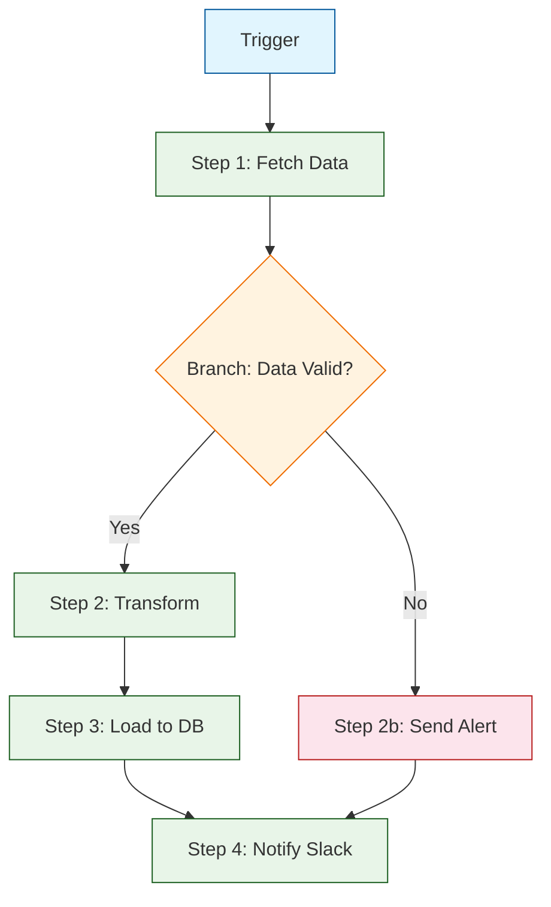
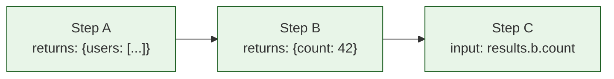
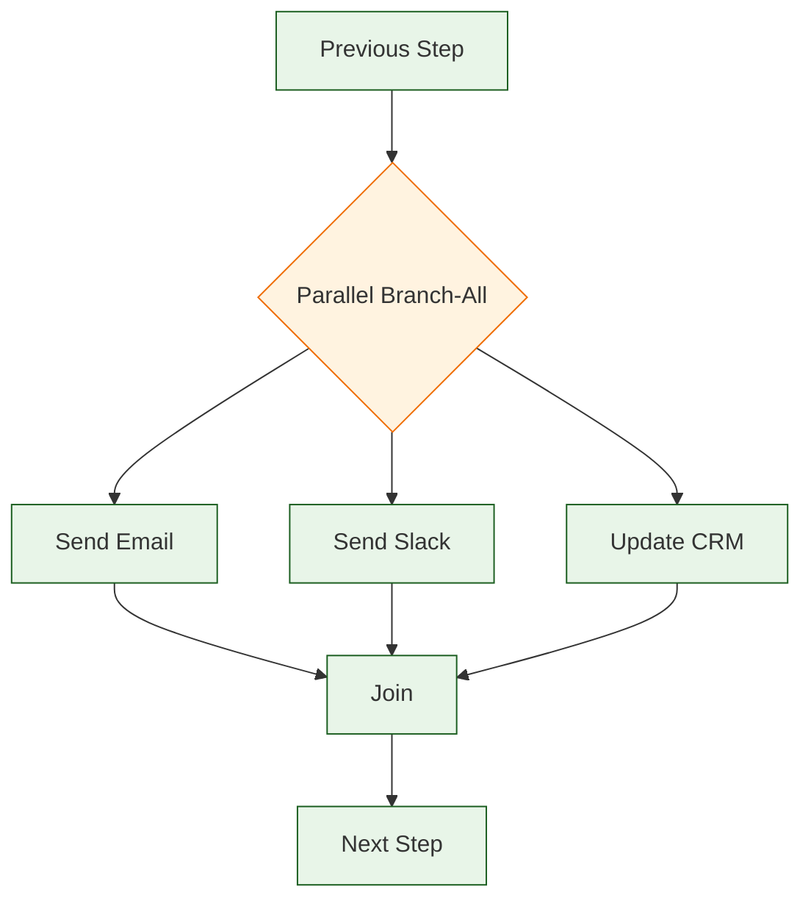
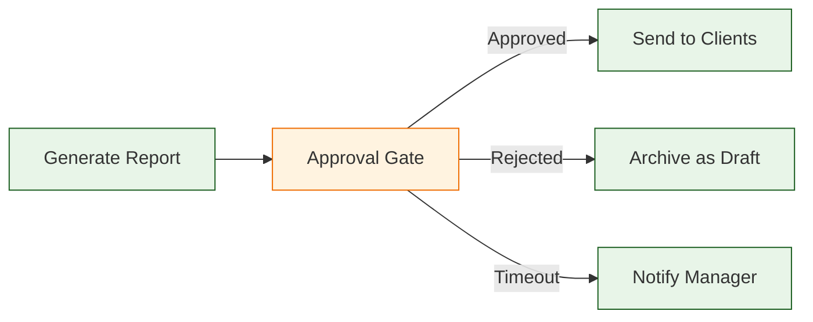

# Chapter 4: Flow Builder & Workflows

Welcome to **Chapter 4: Flow Builder & Workflows**. In this part of **Windmill Tutorial: Scripts to Webhooks, Workflows, and UIs**, you will learn how to compose scripts into multi-step workflows with branching, loops, approval steps, error handling, and retries.

> Build DAG workflows that chain scripts together with branching, loops, retries, and human-in-the-loop approvals.

## Overview

A **Flow** in Windmill is a Directed Acyclic Graph (DAG) of steps. Each step can be a script, an inline script, another flow, or a control node (branch, loop, approval). Flows are defined visually in the Flow Builder or as YAML/JSON for git-based workflows.



## Creating Your First Flow

### Via the UI

1. Click **+ Flow** from the Home page
2. Add a **Trigger** (manual, schedule, webhook)
3. Add steps by clicking **+** between nodes
4. Connect outputs to inputs using the expression editor

### Flow Definition (YAML)

Flows can be defined as code and synced via the CLI:

```yaml
# f/flows/etl_pipeline.flow.yaml
summary: "ETL Pipeline: Fetch, Transform, Load"
description: "Daily ETL from API to PostgreSQL"
value:
  modules:
    - id: fetch_data
      value:
        type: script
        path: f/scripts/fetch_api_data
        input_transforms:
          url:
            type: static
            value: "https://api.example.com/data"
          api_key:
            type: javascript
            expr: "$var('f/variables/api_key')"

    - id: transform
      value:
        type: rawscript
        language: python
        content: |
          def main(raw_data: list) -> list:
              return [
                  {
                      "id": r["id"],
                      "name": r["name"].strip().title(),
                      "value": round(float(r["amount"]), 2),
                      "processed_at": __import__("datetime").datetime.utcnow().isoformat()
                  }
                  for r in raw_data
                  if r.get("amount") is not None
              ]
        input_transforms:
          raw_data:
            type: javascript
            expr: "results.fetch_data"

    - id: load_to_db
      value:
        type: script
        path: f/scripts/bulk_insert
        input_transforms:
          db:
            type: resource
            value: "f/resources/production_db"
          table_name:
            type: static
            value: "processed_data"
          records:
            type: javascript
            expr: "results.transform"

    - id: notify
      value:
        type: script
        path: f/scripts/send_slack_message
        input_transforms:
          channel:
            type: static
            value: "#data-pipeline"
          message:
            type: javascript
            expr: |
              `ETL complete: ${results.transform.length} records loaded`
```

## Input Transforms and Expressions

Each step's inputs can reference previous step results using JavaScript expressions:



### Expression Reference

| Expression | Description |
|:-----------|:------------|
| `results.step_id` | Output of a previous step |
| `results.step_id.field` | Specific field from output |
| `flow_input.param_name` | Flow-level input parameter |
| `$var('f/variables/name')` | Read a variable |
| `$res('f/resources/name')` | Read a resource |
| `previous_result` | Output of the immediately preceding step |

### TypeScript Input Transform

```typescript
// Complex transformations in the expression editor
// Available in the "JavaScript" input transform mode

const users = results.fetch_users;
const threshold = flow_input.min_score;

// Filter and transform
const qualified = users
  .filter((u) => u.score >= threshold)
  .map((u) => ({
    email: u.email,
    name: `${u.first_name} ${u.last_name}`,
    tier: u.score > 90 ? "gold" : "silver",
  }));

return qualified;
```

## Branching (Conditional Logic)

Add a **Branch** node to route execution based on conditions:

```yaml
# Branch step in flow YAML
- id: route_by_status
  value:
    type: branchone
    branches:
      - summary: "High Priority"
        expr: "results.classify.priority === 'high'"
        modules:
          - id: escalate
            value:
              type: script
              path: f/scripts/escalate_ticket

      - summary: "Medium Priority"
        expr: "results.classify.priority === 'medium'"
        modules:
          - id: assign_team
            value:
              type: script
              path: f/scripts/assign_to_team

    default:
      - id: auto_respond
        value:
          type: script
          path: f/scripts/send_auto_response
```

### Branch-All (Parallel Execution)

Use `branchall` to run multiple branches in parallel:

```yaml
- id: parallel_notifications
  value:
    type: branchall
    parallel: true
    branches:
      - summary: "Send Email"
        modules:
          - id: email
            value:
              type: script
              path: f/scripts/send_email

      - summary: "Send Slack"
        modules:
          - id: slack
            value:
              type: script
              path: f/scripts/send_slack

      - summary: "Update CRM"
        modules:
          - id: crm
            value:
              type: script
              path: f/scripts/update_crm
```



## For-Loops

Iterate over arrays with the **ForLoop** step:

```yaml
- id: process_each_user
  value:
    type: forloopflow
    iterator:
      type: javascript
      expr: "results.fetch_users"
    skip_failures: true
    parallel: 5  # Process 5 items concurrently
    modules:
      - id: enrich
        value:
          type: script
          path: f/scripts/enrich_user
          input_transforms:
            user:
              type: javascript
              expr: "flow_input.iter.value"
            index:
              type: javascript
              expr: "flow_input.iter.index"
```

Inside a loop, `flow_input.iter.value` gives the current item and `flow_input.iter.index` gives the index.

## Error Handling and Retries

### Per-Step Retries

```yaml
- id: call_flaky_api
  value:
    type: script
    path: f/scripts/call_external_api
  retry:
    constant:
      attempts: 3
      seconds: 10
    # Or exponential backoff:
    # exponential:
    #   attempts: 5
    #   multiplier: 2
    #   seconds: 5
    #   max_seconds: 300
```

### Error Handler Steps

Catch errors from any step and run recovery logic:

```yaml
- id: risky_operation
  value:
    type: script
    path: f/scripts/risky_operation
  stop_after_if:
    skip_if_stopped: false
    expr: "!result.success"

- id: handle_error
  value:
    type: rawscript
    language: typescript
    content: |
      export async function main(error_context: object) {
        // Log the error, send alert, or run compensating action
        console.log("Error in risky_operation:", error_context);
        return { recovered: true, action: "sent_alert" };
      }
    input_transforms:
      error_context:
        type: javascript
        expr: "previous_result"
```

## Approval Steps (Human-in-the-Loop)

Add approval gates that pause the flow and wait for human confirmation:

```yaml
- id: generate_report
  value:
    type: script
    path: f/scripts/generate_financial_report

- id: approval_gate
  value:
    type: approval
    timeout: 86400  # 24 hours
  summary: "Approve financial report before sending to clients"

- id: send_report
  value:
    type: script
    path: f/scripts/send_report_to_clients
```



Approvers receive a link. They can view the flow state and approve or reject.

## Suspend and Resume

Flows can suspend and resume later, useful for long-running processes:

```typescript
// In an inline script step
import * as wmill from "npm:windmill-client@1";

export async function main() {
  // Do some work
  const orderId = await createOrder();

  // Suspend the flow -- it will resume when the webhook is called
  const resumeUrl = await wmill.getResumeUrls();

  // Send the resume URL to an external system
  await notifyExternalSystem(orderId, resumeUrl.approvalPage);

  // The flow pauses here until resumed
  return { orderId, status: "waiting_for_confirmation" };
}
```

## Flow as a Sub-Flow

Flows can call other flows as steps, enabling composition:

```yaml
- id: run_sub_pipeline
  value:
    type: flow
    path: f/flows/data_validation_pipeline
    input_transforms:
      data:
        type: javascript
        expr: "results.fetch_data"
```

This creates a hierarchy: a master orchestration flow calls specialized sub-flows, each of which can be tested and versioned independently.

## Debugging Flows

When a flow fails:

1. Open the flow run in the **Runs** tab
2. Each step shows its status (green/red), duration, inputs, and outputs
3. Click a failed step to see the full error and logs
4. Use **Restart from step** to re-run from the failure point

## Source Code Walkthrough

### Flow execution — `backend/windmill-worker/src/flow_status_helpers.rs`

[`backend/windmill-worker/src/flow_status_helpers.rs`](https://github.com/windmill-labs/windmill/blob/main/backend/windmill-worker/src/flow_status_helpers.rs) implements the DAG execution engine: step sequencing, branch evaluation, loop iteration, and suspend/resume for approval steps. This is where flow state transitions are managed.

### Flow API — `backend/windmill-api/src/flows.rs`

[`backend/windmill-api/src/flows.rs`](https://github.com/windmill-labs/windmill/blob/main/backend/windmill-api/src/flows.rs) handles flow CRUD operations and defines the JSON schema for flow modules (step, branchall, branchone, for-loop, flow). Reviewing this shows the data model behind the visual Flow Builder.


## What You Learned

In this chapter you:

1. Created flows via the UI and as YAML definitions
2. Connected step outputs to inputs with JavaScript expressions
3. Built conditional branches and parallel execution
4. Implemented for-loops with concurrency control
5. Added retries, error handlers, and approval gates
6. Composed flows from sub-flows

The key insight: **Windmill flows are composable DAGs** where each node is a script. The flow builder handles orchestration, retries, and state passing so your scripts stay focused on business logic.

---

**Next: [Chapter 5: App Builder & UIs](05-app-builder-and-uis.md)** -- build drag-and-drop internal tools powered by your scripts and flows.

[Back to Tutorial Index](README.md) | [Previous: Chapter 3](03-script-development.md) | [Next: Chapter 5](05-app-builder-and-uis.md)

---

*Generated for [Awesome Code Docs](https://github.com/johnxie/awesome-code-docs)*
