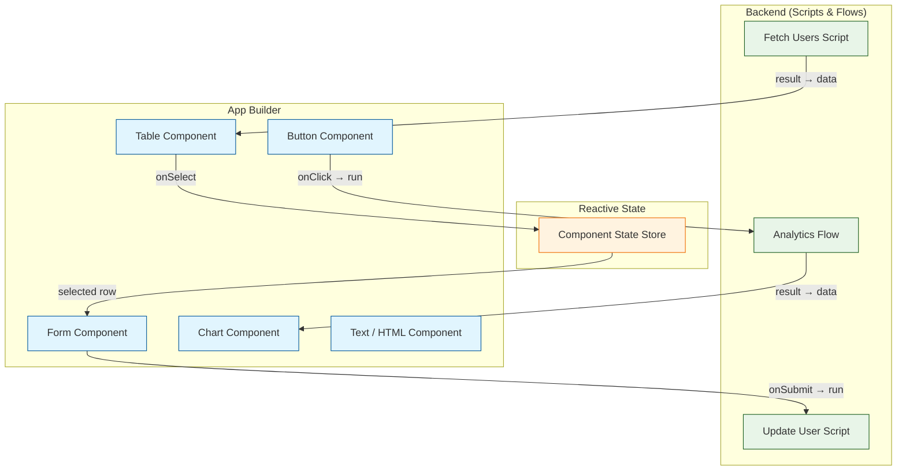
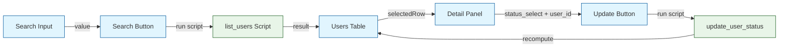

# Chapter 5: App Builder & UIs

Welcome to **Chapter 5: App Builder & UIs**. In this part of **Windmill Tutorial: Scripts to Webhooks, Workflows, and UIs**, you will build internal tools and dashboards using Windmill's drag-and-drop App Builder, powered by your scripts and flows from previous chapters.

> Build internal tools with drag-and-drop components backed by your Windmill scripts and flows.

## Overview

The App Builder lets you create rich, interactive internal tools without writing frontend code. You drag components onto a canvas, wire them to scripts and flows as backends, and publish shareable apps. Every component can read from and write to a reactive state, making complex UIs possible without a frontend framework.



## Creating an App

1. Navigate to **Home** and click **+ App**
2. You see a canvas with a grid layout
3. Drag components from the left panel
4. Configure each component's data source and behavior in the right panel

## Available Components

| Category | Components |
|:---------|:-----------|
| **Layout** | Container, Tabs, Drawer, Modal, Stepper, Horizontal/Vertical Split |
| **Display** | Text, HTML, Image, Icon, Map, PDF Viewer, Log Display |
| **Input** | Text Input, Number, Select, Multi-select, Date Picker, File Upload, Toggle, Slider, Rich Text Editor |
| **Data** | Table, AgGrid Table, List, JSON Viewer |
| **Charts** | Bar, Line, Pie, Scatter, Timeseries (via Plotly / Chart.js) |
| **Action** | Button, Form, Download Button, Approve Button |

## Example: User Management Dashboard

### Step 1: Backend Scripts

First, create the scripts that power the app (see [Chapter 3](03-script-development.md)):

```typescript
// f/scripts/list_users
type Postgresql = {
  host: string;
  port: number;
  user: string;
  password: string;
  dbname: string;
};

import { Client } from "https://deno.land/x/postgres@v0.17.0/mod.ts";

export async function main(
  db: Postgresql,
  search: string = "",
  limit: number = 100
): Promise<object[]> {
  const client = new Client({
    hostname: db.host,
    port: db.port,
    user: db.user,
    password: db.password,
    database: db.dbname,
  });
  await client.connect();

  try {
    const result = await client.queryObject(
      `SELECT id, name, email, role, status, created_at
       FROM users
       WHERE ($1 = '' OR name ILIKE '%' || $1 || '%' OR email ILIKE '%' || $1 || '%')
       ORDER BY created_at DESC
       LIMIT $2`,
      [search, limit]
    );
    return result.rows;
  } finally {
    await client.end();
  }
}
```

```typescript
// f/scripts/update_user_status

type Postgresql = {
  host: string;
  port: number;
  user: string;
  password: string;
  dbname: string;
};

import { Client } from "https://deno.land/x/postgres@v0.17.0/mod.ts";

export async function main(
  db: Postgresql,
  user_id: number,
  new_status: "active" | "suspended" | "archived"
): Promise<string> {
  const client = new Client({
    hostname: db.host,
    port: db.port,
    user: db.user,
    password: db.password,
    database: db.dbname,
  });
  await client.connect();

  try {
    await client.queryObject(
      `UPDATE users SET status = $1, updated_at = NOW() WHERE id = $2`,
      [new_status, user_id]
    );
    return `User ${user_id} status updated to ${new_status}`;
  } finally {
    await client.end();
  }
}
```

### Step 2: App Layout

The app definition (simplified JSON):

```json
{
  "grid": [
    {
      "id": "search_bar",
      "type": "textinputcomponent",
      "config": {
        "placeholder": "Search users by name or email...",
        "defaultValue": ""
      },
      "position": { "x": 0, "y": 0, "w": 8, "h": 1 }
    },
    {
      "id": "search_button",
      "type": "buttoncomponent",
      "config": {
        "label": "Search",
        "color": "blue",
        "onClickAction": {
          "type": "runnableByPath",
          "path": "f/scripts/list_users",
          "inputTransforms": {
            "db": { "type": "resource", "value": "f/resources/main_db" },
            "search": { "type": "eval", "expr": "search_bar.result" }
          }
        }
      },
      "position": { "x": 8, "y": 0, "w": 4, "h": 1 }
    },
    {
      "id": "users_table",
      "type": "tablecomponent",
      "config": {
        "dataSource": {
          "type": "runnableByPath",
          "path": "f/scripts/list_users",
          "runOnAppLoad": true,
          "inputTransforms": {
            "db": { "type": "resource", "value": "f/resources/main_db" },
            "search": { "type": "static", "value": "" }
          }
        },
        "columns": [
          { "key": "id", "header": "ID", "width": 60 },
          { "key": "name", "header": "Name" },
          { "key": "email", "header": "Email" },
          { "key": "role", "header": "Role", "width": 100 },
          { "key": "status", "header": "Status", "width": 100 }
        ],
        "selectableRows": true
      },
      "position": { "x": 0, "y": 1, "w": 12, "h": 6 }
    },
    {
      "id": "detail_panel",
      "type": "containercomponent",
      "config": {
        "title": "User Details"
      },
      "subgrid": [
        {
          "id": "user_name_display",
          "type": "textcomponent",
          "config": {
            "content": {
              "type": "eval",
              "expr": "'Selected: ' + (users_table.selectedRow?.name || 'None')"
            }
          }
        },
        {
          "id": "status_select",
          "type": "selectcomponent",
          "config": {
            "items": ["active", "suspended", "archived"],
            "defaultValue": {
              "type": "eval",
              "expr": "users_table.selectedRow?.status"
            }
          }
        },
        {
          "id": "update_button",
          "type": "buttoncomponent",
          "config": {
            "label": "Update Status",
            "color": "green",
            "onClickAction": {
              "type": "runnableByPath",
              "path": "f/scripts/update_user_status",
              "inputTransforms": {
                "db": { "type": "resource", "value": "f/resources/main_db" },
                "user_id": {
                  "type": "eval",
                  "expr": "users_table.selectedRow?.id"
                },
                "new_status": {
                  "type": "eval",
                  "expr": "status_select.result"
                }
              },
              "recomputeOnSuccess": ["users_table"]
            }
          }
        }
      ],
      "position": { "x": 0, "y": 7, "w": 12, "h": 4 }
    }
  ]
}
```

### Step 3: Reactive Wiring



The data flow is:

1. On app load, `list_users` runs and populates the table
2. User types in search bar and clicks Search -- table refreshes
3. User clicks a table row -- detail panel updates with selected row data
4. User changes status and clicks Update -- script runs, then table recomputes

## Background Runnables

Apps can have **background runnables** that run on load or on a timer:

```json
{
  "backgroundRunnables": [
    {
      "id": "bg_stats",
      "type": "runnableByPath",
      "path": "f/scripts/get_dashboard_stats",
      "runOnAppLoad": true,
      "autoRefreshSeconds": 30,
      "inputTransforms": {
        "db": { "type": "resource", "value": "f/resources/main_db" }
      }
    }
  ]
}
```

Components can reference background runnable results:

```
// In a Text component's content expression:
`Active Users: ${bg_stats.result.active_count} | Total: ${bg_stats.result.total_count}`
```

## Charts and Visualizations

### Bar Chart from Script Data

```python
# f/scripts/get_monthly_signups

def main(db: dict, months: int = 12) -> list:
    """Get monthly signup counts for charting."""
    import psycopg2

    conn = psycopg2.connect(
        host=db["host"], port=db["port"],
        user=db["user"], password=db["password"],
        dbname=db["dbname"]
    )
    cur = conn.cursor()
    cur.execute("""
        SELECT
            TO_CHAR(created_at, 'YYYY-MM') as month,
            COUNT(*) as signups
        FROM users
        WHERE created_at >= NOW() - INTERVAL '%s months'
        GROUP BY 1
        ORDER BY 1
    """, (months,))

    results = [{"month": r[0], "signups": r[1]} for r in cur.fetchall()]
    conn.close()
    return results
```

In the App Builder, add a **Bar Chart** component and set:

- **Data source**: `f/scripts/get_monthly_signups`
- **X-axis**: `month`
- **Y-axis**: `signups`

## Styling and Theming

Apps support CSS customization per component:

```json
{
  "id": "header_text",
  "type": "textcomponent",
  "config": {
    "content": "User Management Dashboard",
    "style": {
      "fontSize": "24px",
      "fontWeight": "bold",
      "color": "#1a1a2e",
      "padding": "16px 0"
    }
  }
}
```

Global CSS can be added in the app settings for consistent styling across all components.

## Publishing and Permissions

| Action | Description |
|:-------|:------------|
| **Preview** | Test the app in the editor |
| **Publish** | Make the app available at its URL |
| **Share** | Set permissions per user/group/folder |
| **Public** | Make accessible without authentication |

Published apps are accessible at: `http://localhost:8000/apps/get/f/apps/user_dashboard`

## Source Code Walkthrough

### App frontend — `frontend/src/lib/components/apps/`

The App Builder UI components live in [`frontend/src/lib/components/apps/`](https://github.com/windmill-labs/windmill/tree/main/frontend/src/lib/components/apps). This directory contains the drag-and-drop canvas, individual component renderers (Button, Table, Chart, etc.), and the component configuration panels. The Svelte components show exactly how apps are serialized and rendered.

### App runtime — `backend/windmill-api/src/apps.rs`

[`backend/windmill-api/src/apps.rs`](https://github.com/windmill-labs/windmill/blob/main/backend/windmill-api/src/apps.rs) handles app publication, versioning, and the policy system that controls what script paths an app can call. This governs the permissions model for published internal tools.


## What You Learned

In this chapter you:

1. Built an interactive dashboard with table, form, and chart components
2. Wired components to backend scripts with input transforms
3. Implemented reactive data flow (select row, update, recompute)
4. Added background runnables for auto-refreshing data
5. Styled and published the app

The key insight: **Windmill apps are thin reactive UIs over your scripts**. The frontend is declarative configuration; the backend is the same scripts you already wrote. No React, no bundler, no deployment pipeline -- just wire components to functions.

---

**Next: [Chapter 6: Scheduling & Triggers](06-scheduling-and-triggers.md)** -- automate script and flow execution with cron schedules, webhooks, and event triggers.

[Back to Tutorial Index](README.md) | [Previous: Chapter 4](04-flow-builder-and-workflows.md) | [Next: Chapter 6](06-scheduling-and-triggers.md)

---

*Generated for [Awesome Code Docs](https://github.com/johnxie/awesome-code-docs)*
