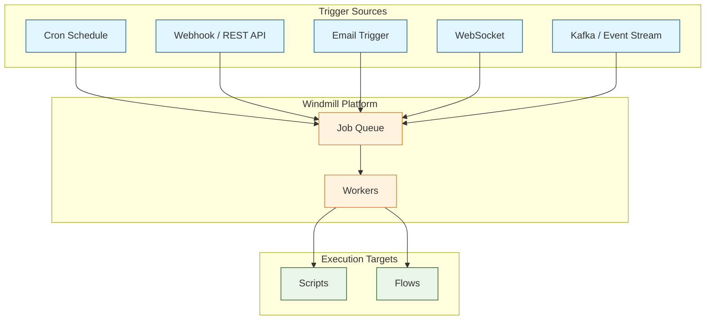
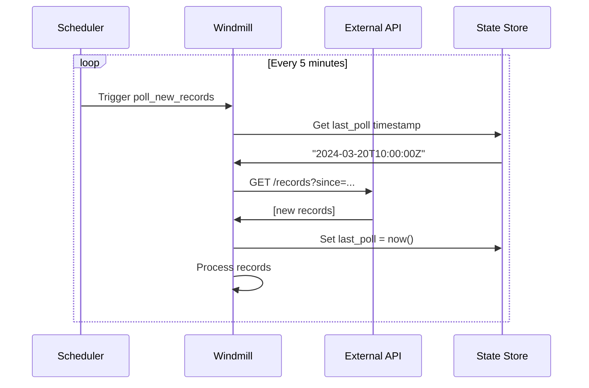

# Chapter 6: Scheduling & Triggers

Welcome to **Chapter 6: Scheduling & Triggers**. In this part of **Windmill Tutorial: Scripts to Webhooks, Workflows, and UIs**, you will automate script and flow execution using cron schedules, webhooks, email triggers, and event-driven patterns.

> Automate execution with cron schedules, webhooks, email triggers, and event-driven patterns.

## Overview

Windmill supports multiple trigger mechanisms that turn your scripts and flows into automated processes. Every script already has a webhook (see [Chapter 1](01-getting-started.md)), but this chapter covers the full range: scheduled cron jobs, webhook customization, email triggers, and event-driven architectures.



## Cron Schedules

### Creating a Schedule

1. Navigate to **Schedules** from the sidebar
2. Click **+ Schedule**
3. Select the script or flow to run
4. Set the cron expression and arguments

### Cron Expression Reference

| Expression | Meaning |
|:-----------|:--------|
| `* * * * *` | Every minute |
| `0 * * * *` | Every hour |
| `0 9 * * *` | Every day at 9:00 AM |
| `0 9 * * 1-5` | Weekdays at 9:00 AM |
| `0 0 1 * *` | First day of each month |
| `*/15 * * * *` | Every 15 minutes |
| `0 9,17 * * *` | At 9:00 AM and 5:00 PM |

### Schedule via CLI

```bash
# Create a schedule using wmill CLI
wmill schedule create \
  --path f/schedules/daily_etl \
  --script f/flows/etl_pipeline \
  --cron "0 2 * * *" \
  --args '{"source": "production", "full_sync": false}' \
  --timezone "America/New_York"
```

### Schedule Definition (YAML)

```yaml
# f/schedules/daily_report.schedule.yaml
path: f/schedules/daily_report
script_path: f/scripts/generate_daily_report
schedule: "0 8 * * 1-5"
timezone: "Europe/London"
args:
  report_type: "daily_summary"
  recipients:
    - "team@example.com"
  include_charts: true
enabled: true
on_failure:
  path: f/scripts/send_schedule_failure_alert
  args:
    channel: "#alerts"
```

### Schedule with Error Handling

```typescript
// f/scripts/generate_daily_report

import * as wmill from "npm:windmill-client@1";

export async function main(
  report_type: string,
  recipients: string[],
  include_charts: boolean = true
): Promise<object> {
  const startTime = Date.now();

  try {
    // Generate report data
    const data = await fetchReportData(report_type);
    const html = formatReport(data, include_charts);

    // Send to each recipient
    const results = await Promise.allSettled(
      recipients.map((email) => sendEmail(email, html))
    );

    const sent = results.filter((r) => r.status === "fulfilled").length;
    const failed = results.filter((r) => r.status === "rejected").length;

    return {
      status: "completed",
      sent,
      failed,
      duration_ms: Date.now() - startTime,
      report_type,
    };
  } catch (error) {
    // The error will be captured by the schedule's on_failure handler
    throw new Error(`Report generation failed: ${error}`);
  }
}

async function fetchReportData(type: string): Promise<object> {
  // Your data fetching logic
  return {};
}

function formatReport(data: object, charts: boolean): string {
  return "<html><body>Report</body></html>";
}

async function sendEmail(to: string, html: string): Promise<void> {
  // Your email sending logic
}
```

## Webhooks

### Synchronous Webhook (Wait for Result)

```bash
# Synchronous: waits for the script to complete, returns the result
curl -X POST \
  "http://localhost:8000/api/w/demo/jobs/run_wait_result/p/f/scripts/process_order" \
  -H "Authorization: Bearer ${TOKEN}" \
  -H "Content-Type: application/json" \
  -d '{
    "order_id": "ORD-12345",
    "items": [
      {"sku": "WIDGET-A", "quantity": 3},
      {"sku": "GADGET-B", "quantity": 1}
    ]
  }'
```

### Asynchronous Webhook (Fire and Forget)

```bash
# Asynchronous: returns job ID immediately
JOB_ID=$(curl -s -X POST \
  "http://localhost:8000/api/w/demo/jobs/run/p/f/scripts/process_order" \
  -H "Authorization: Bearer ${TOKEN}" \
  -H "Content-Type: application/json" \
  -d '{"order_id": "ORD-12345"}')

echo "Job ID: ${JOB_ID}"

# Poll for result later
curl -s "http://localhost:8000/api/w/demo/jobs_u/completed/get_result/${JOB_ID}" \
  -H "Authorization: Bearer ${TOKEN}"
```

### Webhook Authentication Options

| Method | Header | Description |
|:-------|:-------|:------------|
| **Bearer Token** | `Authorization: Bearer <token>` | User or workspace token |
| **Query Param** | `?token=<token>` | Token as URL parameter |
| **Webhook Secret** | `X-Windmill-Signature` | HMAC signature validation |

### Validating Webhook Signatures

```typescript
// f/scripts/webhook_receiver

import { HmacSha256 } from "https://deno.land/std@0.190.0/crypto/mod.ts";

export async function main(
  payload: object,
  signature: string,
  webhook_secret: string
): Promise<object> {
  // Validate the incoming webhook signature
  const expectedSig = new HmacSha256(webhook_secret)
    .update(JSON.stringify(payload))
    .hex();

  if (signature !== expectedSig) {
    throw new Error("Invalid webhook signature");
  }

  // Process the validated payload
  return { valid: true, processed: true, data: payload };
}
```

## Email Triggers

Windmill can process incoming emails as triggers:

```python
# f/scripts/process_incoming_email

def main(
    from_addr: str,
    to_addr: str,
    subject: str,
    body: str,
    attachments: list[dict] | None = None
) -> dict:
    """Process incoming email and route to appropriate handler."""

    # Classify the email
    if "invoice" in subject.lower():
        return handle_invoice(from_addr, body, attachments)
    elif "support" in subject.lower():
        return handle_support_ticket(from_addr, subject, body)
    else:
        return {
            "action": "archived",
            "from": from_addr,
            "subject": subject,
            "reason": "no matching handler"
        }


def handle_invoice(sender: str, body: str, attachments: list | None) -> dict:
    return {"action": "invoice_processed", "sender": sender}


def handle_support_ticket(sender: str, subject: str, body: str) -> dict:
    return {"action": "ticket_created", "sender": sender, "subject": subject}
```

## Event-Driven Patterns

### Polling Pattern with State

Use Windmill's internal state to implement a polling trigger:

```python
# f/scripts/poll_new_records
# Scheduled every 5 minutes via cron: */5 * * * *

import wmill
import requests

def main(api_url: str, api_key: str) -> dict:
    """Poll an API for new records since last check."""

    # Get last poll timestamp from state
    state = wmill.get_state() or {}
    last_poll = state.get("last_poll", "2024-01-01T00:00:00Z")

    # Fetch new records
    response = requests.get(
        f"{api_url}/records",
        params={"since": last_poll, "limit": 100},
        headers={"Authorization": f"Bearer {api_key}"},
        timeout=30
    )
    response.raise_for_status()
    records = response.json()

    # Update state with current timestamp
    from datetime import datetime, timezone
    state["last_poll"] = datetime.now(timezone.utc).isoformat()
    wmill.set_state(state)

    # Process new records
    return {
        "new_records": len(records),
        "since": last_poll,
        "records": records
    }
```



### Webhook-to-Flow Pipeline

Chain a webhook receiver to a processing flow:

```typescript
// f/scripts/github_webhook_handler

export async function main(
  event_type: string,
  payload: object
): Promise<object> {
  // Route GitHub events to appropriate flows
  const eventHandlers: Record<string, string> = {
    push: "f/flows/handle_push",
    pull_request: "f/flows/handle_pr",
    issues: "f/flows/handle_issue",
    release: "f/flows/handle_release",
  };

  const flowPath = eventHandlers[event_type];

  if (!flowPath) {
    return { status: "ignored", event_type };
  }

  // Trigger the flow asynchronously
  const response = await fetch(
    `http://localhost:8000/api/w/demo/jobs/run/p/${flowPath}`,
    {
      method: "POST",
      headers: {
        Authorization: `Bearer ${Deno.env.get("WM_TOKEN")}`,
        "Content-Type": "application/json",
      },
      body: JSON.stringify({ event_type, payload }),
    }
  );

  return {
    status: "dispatched",
    event_type,
    flow: flowPath,
    job_id: await response.text(),
  };
}
```

## Managing Schedules

### List Schedules via API

```bash
curl -s "http://localhost:8000/api/w/demo/schedules/list" \
  -H "Authorization: Bearer ${TOKEN}" | jq '.[].path'
```

### Disable/Enable a Schedule

```bash
# Disable
curl -X POST "http://localhost:8000/api/w/demo/schedules/setenabledschedule" \
  -H "Authorization: Bearer ${TOKEN}" \
  -H "Content-Type: application/json" \
  -d '{"path": "f/schedules/daily_report", "enabled": false}'
```

### View Schedule Run History

Navigate to **Runs** in the UI and filter by schedule path. Each run shows:

- Start time and duration
- Input arguments
- Result or error
- Worker that executed the job

## What You Learned

In this chapter you:

1. Created cron schedules with timezone support and error handlers
2. Used synchronous and asynchronous webhooks
3. Implemented webhook signature validation
4. Built polling-based triggers with persistent state
5. Chained webhooks to flows for event-driven architectures

The key insight: **Every Windmill script is already an API endpoint** -- schedules and triggers just automate when those endpoints get called. The same script works interactively, via webhook, and on a schedule with zero changes.

---

**Next: [Chapter 7: Variables, Secrets & Resources](07-variables-secrets-and-resources.md)** -- manage credentials, connections, and configuration securely.

[Back to Tutorial Index](README.md) | [Previous: Chapter 5](05-app-builder-and-uis.md) | [Next: Chapter 7](07-variables-secrets-and-resources.md)

---

*Generated for [Awesome Code Docs](https://github.com/johnxie/awesome-code-docs)*
