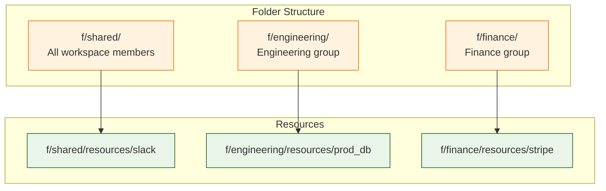

# Chapter 7: Variables, Secrets & Resources

Welcome to **Chapter 7: Variables, Secrets & Resources**. In this part of **Windmill Tutorial: Scripts to Webhooks, Workflows, and UIs**, you will learn how Windmill manages configuration, credentials, and external service connections securely.

> Manage credentials, API keys, database connections, and configuration with encrypted variables and typed resources.

## Overview

Windmill provides three mechanisms for managing configuration and secrets:

| Mechanism | Purpose | Encrypted | Typed |
|:----------|:--------|:----------|:------|
| **Variable** | Simple key-value pairs | Optional | No |
| **Secret** | Sensitive values (API keys, passwords) | Yes | No |
| **Resource** | Typed connections to external services | Yes (fields) | Yes |

```mermaid
flowchart TB
    subgraph Config["Configuration Layer"]
        V[Variables<br/>"API base URL"]
        S[Secrets<br/>"API key: sk-xxx"]
        R[Resources<br/>"PostgreSQL connection"]
    end

    subgraph Scripts["Script Access"]
        TS["TypeScript:<br/>$var(), $res()"]
        PY["Python:<br/>wmill.get_variable()<br/>wmill.get_resource()"]
    end

    subgraph Flows["Flow Access"]
        FI["Input Transforms:<br/>$var('path')<br/>$res('path')"]
    end

    subgraph Apps["App Access"]
        AI["Component Config:<br/>resource selector"]
    end

    Config --> Scripts
    Config --> Flows
    Config --> Apps

    classDef config fill:#fce4ec,stroke:#b71c1c
    classDef access fill:#e8f5e8,stroke:#1b5e20

    class V,S,R config
    class TS,PY,FI,AI access
```

## Variables

### Creating Variables

Navigate to **Variables** in the sidebar and click **+ Variable**.

| Field | Example | Description |
|:------|:--------|:------------|
| Path | `f/variables/api_base_url` | Unique identifier |
| Value | `https://api.example.com/v2` | The variable content |
| Is Secret | No | Whether to encrypt |
| Description | "Base URL for Example API" | Documentation |

### Using Variables in TypeScript

```typescript
// f/scripts/use_variables_ts

// Method 1: Windmill SDK
import * as wmill from "npm:windmill-client@1";

export async function main(): Promise<object> {
  // Read a plain variable
  const baseUrl = await wmill.getVariable("f/variables/api_base_url");

  // Read a secret variable (decrypted at runtime)
  const apiKey = await wmill.getVariable("f/variables/api_secret_key");

  const response = await fetch(`${baseUrl}/status`, {
    headers: { Authorization: `Bearer ${apiKey}` },
  });

  return await response.json();
}
```

### Using Variables in Python

```python
# f/scripts/use_variables_py

import wmill

def main() -> dict:
    # Read variables using the SDK
    base_url = wmill.get_variable("f/variables/api_base_url")
    api_key = wmill.get_variable("f/variables/api_secret_key")

    import requests
    response = requests.get(
        f"{base_url}/status",
        headers={"Authorization": f"Bearer {api_key}"},
        timeout=10
    )
    return response.json()
```

### Variables in Flow Expressions

In a flow step's input transform, reference variables with the `$var()` helper:

```javascript
// In a flow input transform expression
const url = $var("f/variables/api_base_url");
const key = $var("f/variables/api_secret_key");
return { url, key };
```

## Secrets

Secrets are variables with encryption enabled. When you mark a variable as **Is Secret**:

1. The value is encrypted at rest in PostgreSQL using the server's encryption key
2. The value is never shown in the UI after creation (only `****`)
3. The value is decrypted only at runtime, inside the worker process
4. Audit logs record who accessed the secret and when

### Creating Secrets via CLI

```bash
# Create a secret variable
wmill variable create \
  --path f/variables/stripe_api_key \
  --value "sk_live_xxxxxxxxxxxxx" \
  --secret true \
  --description "Stripe production API key"

# Update a secret (value replaced entirely)
wmill variable update \
  --path f/variables/stripe_api_key \
  --value "sk_live_new_key_yyyyy"
```

### Secret Rotation Pattern

```python
# f/scripts/rotate_api_key

import wmill

def main(
    service_name: str,
    variable_path: str
) -> dict:
    """Rotate an API key and update the Windmill variable."""
    import requests

    # Step 1: Generate new key from the service
    old_key = wmill.get_variable(variable_path)
    new_key = generate_new_key(service_name, old_key)

    # Step 2: Verify the new key works
    if not verify_key(service_name, new_key):
        raise ValueError("New key verification failed, aborting rotation")

    # Step 3: Update the Windmill variable
    wmill.set_variable(variable_path, new_key)

    # Step 4: Revoke the old key
    revoke_key(service_name, old_key)

    return {
        "service": service_name,
        "variable_path": variable_path,
        "status": "rotated",
        "old_key_prefix": old_key[:8] + "...",
        "new_key_prefix": new_key[:8] + "..."
    }


def generate_new_key(service: str, old_key: str) -> str:
    # Service-specific key generation
    return "new_key_placeholder"


def verify_key(service: str, key: str) -> bool:
    return True


def revoke_key(service: str, key: str) -> None:
    pass
```

## Resources

Resources are **typed connections** to external services. Unlike plain variables, resources have a schema that defines the expected fields.

### Built-in Resource Types

Windmill ships with 300+ resource types:

| Category | Resource Types |
|:---------|:---------------|
| **Databases** | PostgreSQL, MySQL, MongoDB, Redis, ClickHouse, BigQuery |
| **Cloud** | AWS (S3, Lambda, SQS), GCP, Azure |
| **SaaS** | Slack, GitHub, GitLab, Linear, Notion, Airtable |
| **Email** | SMTP, SendGrid, Mailgun |
| **Auth** | OAuth2, OIDC, LDAP |
| **Storage** | S3-compatible, SFTP, FTP |
| **Messaging** | Kafka, RabbitMQ, NATS |

### Creating a PostgreSQL Resource

Navigate to **Resources** and click **+ Resource**. Select type **postgresql**.

```json
{
  "host": "db.example.com",
  "port": 5432,
  "user": "app_user",
  "password": "secure_password",
  "dbname": "production",
  "sslmode": "require"
}
```

The path will be something like `f/resources/production_db`.

### Using Resources in Scripts

```typescript
// f/scripts/query_with_resource

// The type annotation tells Windmill to show a resource picker
// for postgresql resources in the auto-generated UI
type Postgresql = {
  host: string;
  port: number;
  user: string;
  password: string;
  dbname: string;
  sslmode?: string;
};

import { Client } from "https://deno.land/x/postgres@v0.17.0/mod.ts";

export async function main(
  db: Postgresql,
  query: string
): Promise<object[]> {
  const client = new Client({
    hostname: db.host,
    port: db.port,
    user: db.user,
    password: db.password,
    database: db.dbname,
    tls: { enabled: db.sslmode === "require" },
  });

  await client.connect();
  try {
    const result = await client.queryObject(query);
    return result.rows;
  } finally {
    await client.end();
  }
}
```

When this script runs in the UI, the `db` parameter shows a dropdown listing all postgresql resources in the workspace.

### Using Resources in Python

```python
# f/scripts/s3_upload

def main(
    s3: dict,  # Resource<s3>
    bucket: str,
    key: str,
    content: str
) -> str:
    """Upload content to S3 using an S3 resource."""
    import boto3

    client = boto3.client(
        "s3",
        aws_access_key_id=s3["awsAccessKeyId"],
        aws_secret_access_key=s3["awsSecretAccessKey"],
        region_name=s3.get("region", "us-east-1"),
        endpoint_url=s3.get("endpointUrl")  # For MinIO/R2
    )

    client.put_object(
        Bucket=bucket,
        Key=key,
        Body=content.encode("utf-8"),
        ContentType="text/plain"
    )

    return f"Uploaded to s3://{bucket}/{key}"
```

### OAuth Resources

Windmill supports OAuth2 flows for services like Slack, GitHub, and Google:

1. Configure OAuth app credentials in **Instance Settings**
2. Create a resource of type `slack` (or `github`, `google_sheets`, etc.)
3. Click **Connect** -- Windmill handles the OAuth flow
4. The resource stores the access token and refresh token
5. Windmill auto-refreshes expired tokens

```typescript
// f/scripts/post_to_slack

type Slack = {
  token: string;
};

export async function main(
  slack: Slack,
  channel: string,
  message: string
): Promise<object> {
  const response = await fetch("https://slack.com/api/chat.postMessage", {
    method: "POST",
    headers: {
      Authorization: `Bearer ${slack.token}`,
      "Content-Type": "application/json",
    },
    body: JSON.stringify({ channel, text: message }),
  });

  return await response.json();
}
```

### Custom Resource Types

Define your own resource types for internal services:

```json
{
  "name": "internal_api",
  "schema": {
    "type": "object",
    "properties": {
      "base_url": {
        "type": "string",
        "description": "API base URL"
      },
      "api_key": {
        "type": "string",
        "description": "API authentication key"
      },
      "timeout_seconds": {
        "type": "integer",
        "default": 30,
        "description": "Request timeout"
      },
      "environment": {
        "type": "string",
        "enum": ["staging", "production"],
        "default": "staging"
      }
    },
    "required": ["base_url", "api_key"]
  }
}
```

## Folder-Based Permissions

Variables and resources follow the folder permission model:



Scripts in `f/engineering/` can access resources in `f/engineering/` and `f/shared/`, but not `f/finance/`.

## Environment-Based Configuration

A common pattern: use different resources for different environments:

```typescript
// f/scripts/environment_aware

import * as wmill from "npm:windmill-client@1";

export async function main(
  environment: "staging" | "production" = "staging"
): Promise<object> {
  // Dynamically select the resource based on environment
  const dbResourcePath = `f/resources/${environment}_db`;

  const db = await wmill.getResource(dbResourcePath);

  // Use the resource
  return { connected_to: environment, host: db.host };
}
```

## Source Code Walkthrough

### Variables and secrets — `backend/windmill-api/src/variables.rs`

[`backend/windmill-api/src/variables.rs`](https://github.com/windmill-labs/windmill/blob/main/backend/windmill-api/src/variables.rs) implements the Variables API: creation, encryption for secrets (AES-256-GCM via the `magic_crypt` crate), workspace scoping, and the permission model that prevents unauthorized reads. This is where secret encryption happens.

### Resource types — `backend/windmill-api/src/resources.rs`

[`backend/windmill-api/src/resources.rs`](https://github.com/windmill-labs/windmill/blob/main/backend/windmill-api/src/resources.rs) implements typed resources: JSON Schema validation for resource values, OAuth token refresh logic for OAuth resource types, and the `r/` path prefix that scripts use to reference resources in their type signatures.


## What You Learned

In this chapter you:

1. Created variables (plain and secret) and accessed them from scripts
2. Built typed resources for databases, cloud services, and SaaS APIs
3. Set up OAuth resources with automatic token refresh
4. Defined custom resource types for internal services
5. Applied folder-based permissions for access control
6. Implemented secret rotation and environment-based configuration

The key insight: **Resources are typed, encrypted, and audited** -- they separate credentials from code, enable resource reuse across scripts, and provide a clear permission model.

---

**Next: [Chapter 8: Self-Hosting & Production](08-self-hosting-and-production.md)** -- deploy Windmill on your infrastructure with Docker Compose or Kubernetes, and scale for production workloads.

[Back to Tutorial Index](README.md) | [Previous: Chapter 6](06-scheduling-and-triggers.md) | [Next: Chapter 8](08-self-hosting-and-production.md)

---

*Generated for [Awesome Code Docs](https://github.com/johnxie/awesome-code-docs)*
