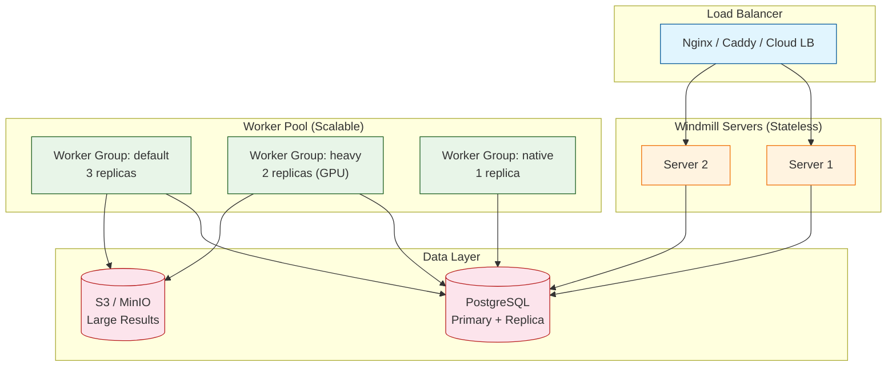
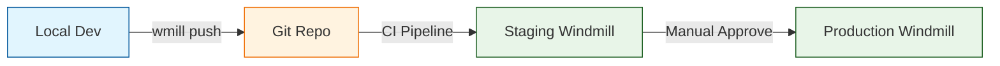
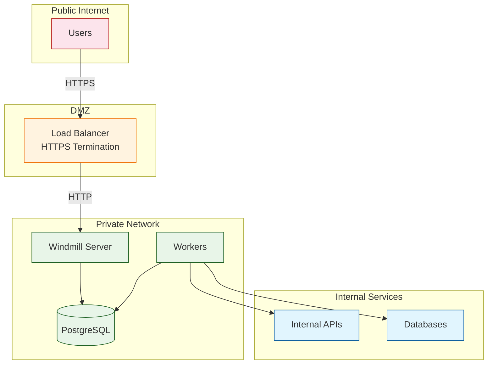

# Chapter 8: Self-Hosting & Production

Welcome to **Chapter 8: Self-Hosting & Production**. In this part of **Windmill Tutorial: Scripts to Webhooks, Workflows, and UIs**, you will deploy Windmill on your own infrastructure, scale workers for production workloads, configure observability, and implement CI/CD workflows.

> Deploy Windmill on Docker Compose or Kubernetes, scale workers, configure backups, and set up CI/CD.

## Overview

Windmill is designed for self-hosting. The Community Edition (AGPLv3) includes all core features. The Enterprise Edition adds SSO/SAML, audit log export, priority support, and advanced worker management. This chapter covers production-grade deployment patterns.



## Docker Compose Production Setup

```yaml
# docker-compose.prod.yml
version: "3.8"

services:
  db:
    image: postgres:16
    restart: unless-stopped
    volumes:
      - pg_data:/var/lib/postgresql/data
    environment:
      POSTGRES_USER: windmill
      POSTGRES_PASSWORD: ${DB_PASSWORD}
      POSTGRES_DB: windmill
    shm_size: 256mb
    healthcheck:
      test: ["CMD-SHELL", "pg_isready -U windmill"]
      interval: 10s
      timeout: 5s
      retries: 5

  windmill_server:
    image: ghcr.io/windmill-labs/windmill:main
    restart: unless-stopped
    ports:
      - "8000:8000"
    environment:
      DATABASE_URL: postgres://windmill:${DB_PASSWORD}@db:5432/windmill
      BASE_URL: https://windmill.example.com
      RUST_LOG: info
      NUM_WORKERS: 0  # Server only, no local workers
      COOKIE_DOMAIN: windmill.example.com
      BASE_INTERNAL_URL: http://windmill_server:8000
    depends_on:
      db:
        condition: service_healthy

  windmill_worker_default:
    image: ghcr.io/windmill-labs/windmill:main
    restart: unless-stopped
    deploy:
      replicas: 3
    environment:
      DATABASE_URL: postgres://windmill:${DB_PASSWORD}@db:5432/windmill
      BASE_INTERNAL_URL: http://windmill_server:8000
      WORKER_GROUP: default
      NUM_WORKERS: 4
      RUST_LOG: info
    depends_on:
      db:
        condition: service_healthy
    volumes:
      - worker_cache:/tmp/windmill/cache

  windmill_worker_heavy:
    image: ghcr.io/windmill-labs/windmill:main
    restart: unless-stopped
    deploy:
      replicas: 1
      resources:
        limits:
          memory: 8G
          cpus: "4"
    environment:
      DATABASE_URL: postgres://windmill:${DB_PASSWORD}@db:5432/windmill
      BASE_INTERNAL_URL: http://windmill_server:8000
      WORKER_GROUP: heavy
      WORKER_TAGS: "heavy-compute,ml,data-processing"
      NUM_WORKERS: 2
      RUST_LOG: info
    depends_on:
      db:
        condition: service_healthy
    volumes:
      - worker_cache_heavy:/tmp/windmill/cache

  windmill_lsp:
    image: ghcr.io/windmill-labs/windmill-lsp:latest
    restart: unless-stopped

  caddy:
    image: caddy:2
    restart: unless-stopped
    ports:
      - "80:80"
      - "443:443"
    volumes:
      - ./Caddyfile:/etc/caddy/Caddyfile
      - caddy_data:/data
    depends_on:
      - windmill_server

volumes:
  pg_data:
  worker_cache:
  worker_cache_heavy:
  caddy_data:
```

### Caddyfile for HTTPS

```
# Caddyfile
windmill.example.com {
    reverse_proxy windmill_server:8000
}
```

### Environment File

```bash
# .env
DB_PASSWORD=a_very_strong_password_here
```

### Start Production Stack

```bash
docker compose -f docker-compose.prod.yml --env-file .env up -d

# Check logs
docker compose -f docker-compose.prod.yml logs -f windmill_server
docker compose -f docker-compose.prod.yml logs -f windmill_worker_default
```

## Kubernetes Deployment

### Helm Chart

```bash
helm repo add windmill https://windmill-labs.github.io/windmill-helm-charts
helm repo update

helm install windmill windmill/windmill \
  --namespace windmill \
  --create-namespace \
  --values values.yaml
```

### values.yaml

```yaml
# values.yaml for production Kubernetes deployment
windmill:
  baseDomain: windmill.example.com
  baseProtocol: https
  appReplicas: 2
  lspReplicas: 1

  workerGroups:
    - name: default
      replicas: 5
      resources:
        requests:
          cpu: "500m"
          memory: "1Gi"
        limits:
          cpu: "2"
          memory: "4Gi"

    - name: heavy
      replicas: 2
      tags: "heavy-compute,ml"
      resources:
        requests:
          cpu: "2"
          memory: "4Gi"
        limits:
          cpu: "8"
          memory: "16Gi"

    - name: native
      replicas: 1
      tags: "native"
      resources:
        requests:
          cpu: "200m"
          memory: "256Mi"

postgresql:
  enabled: true
  auth:
    postgresPassword: "change-this-in-production"
    database: windmill
  primary:
    persistence:
      size: 50Gi
    resources:
      requests:
        cpu: "1"
        memory: "2Gi"

ingress:
  enabled: true
  className: nginx
  annotations:
    cert-manager.io/cluster-issuer: letsencrypt-prod
  tls:
    - secretName: windmill-tls
      hosts:
        - windmill.example.com
```

### Worker Autoscaling

```yaml
# worker-hpa.yaml
apiVersion: autoscaling/v2
kind: HorizontalPodAutoscaler
metadata:
  name: windmill-worker-default
  namespace: windmill
spec:
  scaleTargetRef:
    apiVersion: apps/v1
    kind: Deployment
    name: windmill-worker-default
  minReplicas: 3
  maxReplicas: 20
  metrics:
    - type: External
      external:
        metric:
          name: windmill_queue_length
        target:
          type: AverageValue
          averageValue: "10"
```

## Database Configuration

### PostgreSQL Tuning

```sql
-- Recommended settings for Windmill workloads
ALTER SYSTEM SET max_connections = 200;
ALTER SYSTEM SET shared_buffers = '2GB';
ALTER SYSTEM SET effective_cache_size = '6GB';
ALTER SYSTEM SET work_mem = '64MB';
ALTER SYSTEM SET maintenance_work_mem = '512MB';
ALTER SYSTEM SET random_page_cost = 1.1;

-- Connection pooling is handled by Windmill internally
-- but you can also use PgBouncer for large deployments
```

### Backup Strategy

```bash
#!/bin/bash
# backup_windmill.sh -- run daily via cron

BACKUP_DIR="/backups/windmill"
TIMESTAMP=$(date +%Y%m%d_%H%M%S)
DB_HOST="localhost"
DB_NAME="windmill"
DB_USER="windmill"

# Full database dump
pg_dump -h ${DB_HOST} -U ${DB_USER} -d ${DB_NAME} \
  --format=custom \
  --compress=9 \
  -f "${BACKUP_DIR}/windmill_${TIMESTAMP}.dump"

# Upload to S3
aws s3 cp "${BACKUP_DIR}/windmill_${TIMESTAMP}.dump" \
  "s3://my-backups/windmill/${TIMESTAMP}.dump"

# Retain last 30 days locally
find ${BACKUP_DIR} -name "*.dump" -mtime +30 -delete

echo "Backup completed: windmill_${TIMESTAMP}.dump"
```

## CI/CD with the Windmill CLI

### Git-Based Workflow



### GitHub Actions Deployment

```yaml
# .github/workflows/deploy-windmill.yml
name: Deploy Windmill Scripts

on:
  push:
    branches: [main]
    paths:
      - "windmill/**"

jobs:
  deploy-staging:
    runs-on: ubuntu-latest
    steps:
      - uses: actions/checkout@v4

      - name: Install Windmill CLI
        run: |
          npm install -g windmill-cli

      - name: Deploy to Staging
        env:
          WM_TOKEN: ${{ secrets.WINDMILL_STAGING_TOKEN }}
          WM_URL: ${{ secrets.WINDMILL_STAGING_URL }}
        run: |
          wmill workspace add staging ${WM_URL} --token ${WM_TOKEN}
          cd windmill
          wmill push --workspace staging

  deploy-production:
    needs: deploy-staging
    runs-on: ubuntu-latest
    environment: production
    steps:
      - uses: actions/checkout@v4

      - name: Install Windmill CLI
        run: npm install -g windmill-cli

      - name: Deploy to Production
        env:
          WM_TOKEN: ${{ secrets.WINDMILL_PROD_TOKEN }}
          WM_URL: ${{ secrets.WINDMILL_PROD_URL }}
        run: |
          wmill workspace add production ${WM_URL} --token ${WM_TOKEN}
          cd windmill
          wmill push --workspace production
```

### Repository Structure

```
windmill/
  f/
    scripts/
      hello_world.ts
      fetch_api_data.py
      query_users.ts
    flows/
      etl_pipeline.flow.yaml
      notification_chain.flow.yaml
    apps/
      user_dashboard.app.yaml
    resources/
      staging_db.resource.yaml
      production_db.resource.yaml
    variables/
      api_base_url.variable.yaml
    schedules/
      daily_etl.schedule.yaml
  wmill.yaml  # workspace config
```

## Monitoring and Observability

### Prometheus Metrics

Windmill exposes metrics at `/api/metrics`:

```yaml
# prometheus.yml
scrape_configs:
  - job_name: windmill
    metrics_path: /api/metrics
    static_configs:
      - targets: ["windmill-server:8000"]
```

Key metrics:

| Metric | Description |
|:-------|:------------|
| `windmill_queue_count` | Jobs waiting in the queue |
| `windmill_worker_execution_count` | Total jobs executed |
| `windmill_worker_execution_duration_seconds` | Job execution time |
| `windmill_worker_busy` | Whether workers are occupied |

### Grafana Dashboard

```json
{
  "panels": [
    {
      "title": "Queue Depth",
      "type": "timeseries",
      "targets": [
        {"expr": "windmill_queue_count"}
      ]
    },
    {
      "title": "Job Throughput",
      "type": "timeseries",
      "targets": [
        {"expr": "rate(windmill_worker_execution_count[5m])"}
      ]
    },
    {
      "title": "P95 Execution Time",
      "type": "timeseries",
      "targets": [
        {"expr": "histogram_quantile(0.95, windmill_worker_execution_duration_seconds_bucket)"}
      ]
    }
  ]
}
```

### Audit Logs

Every action in Windmill is audited:

```bash
# Query audit logs via API
curl -s "http://localhost:8000/api/w/demo/audit/list?per_page=50" \
  -H "Authorization: Bearer ${TOKEN}" | jq '.[] | {
    timestamp: .timestamp,
    action: .action_kind,
    resource: .resource,
    user: .username
  }'
```

## Security Hardening

### Production Checklist

| Item | Configuration |
|:-----|:--------------|
| Change default password | Update admin@windmill.dev password immediately |
| Set encryption key | `WINDMILL_ENCRYPTION_KEY` env var (persist across restarts) |
| Enable HTTPS | TLS termination via Caddy, Nginx, or cloud LB |
| Restrict CORS | Set `COOKIE_DOMAIN` to your domain |
| Network isolation | Workers only need access to PostgreSQL and target services |
| Secret encryption | All secrets encrypted at rest with the encryption key |
| RBAC | Use folders and groups to limit access per team |
| Token rotation | Rotate API tokens regularly |
| Database encryption | Enable PostgreSQL TDE or use encrypted volumes |

### Network Architecture



## Upgrade Strategy

```bash
# 1. Pull the latest images
docker compose -f docker-compose.prod.yml pull

# 2. Apply database migrations (automatic on server start)
# 3. Rolling restart
docker compose -f docker-compose.prod.yml up -d --no-deps windmill_server
docker compose -f docker-compose.prod.yml up -d --no-deps windmill_worker_default
docker compose -f docker-compose.prod.yml up -d --no-deps windmill_worker_heavy

# Windmill handles database migrations automatically on startup.
# Workers gracefully finish running jobs before restarting.
```

For Kubernetes:

```bash
helm upgrade windmill windmill/windmill \
  --namespace windmill \
  --values values.yaml \
  --set windmill.image.tag=latest
```

## What You Learned

In this chapter you:

1. Deployed Windmill with Docker Compose for production use
2. Configured Kubernetes with Helm, worker groups, and autoscaling
3. Tuned PostgreSQL and set up automated backups
4. Built CI/CD pipelines with GitHub Actions and the Windmill CLI
5. Configured Prometheus metrics and Grafana dashboards
6. Applied security hardening and network isolation

The key insight: **Windmill's stateless server + worker architecture** scales horizontally by adding workers and vertically by assigning resource limits to worker groups. PostgreSQL is the only stateful component, making backup and recovery straightforward.

---

**This completes the Windmill Tutorial.** You now have the knowledge to go from a single script to a production-grade internal platform.

[Back to Tutorial Index](README.md) | [Previous: Chapter 7](07-variables-secrets-and-resources.md)

---

*Generated for [Awesome Code Docs](https://github.com/johnxie/awesome-code-docs)*
