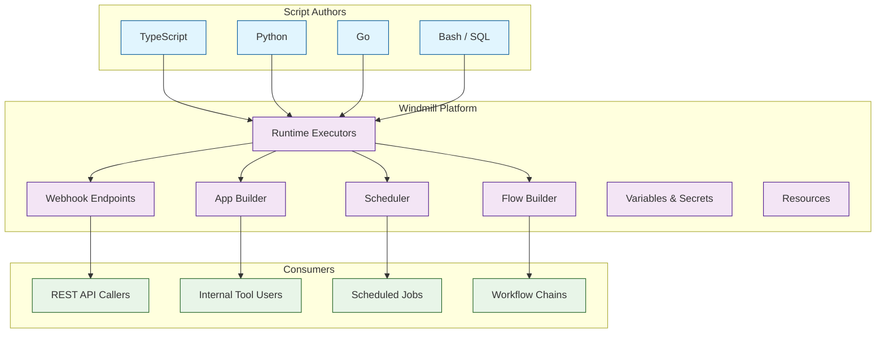

# Windmill Tutorial: Scripts to Webhooks, Workflows, and UIs

> Turn scripts into production-ready webhooks, workflows, and internal tools with Windmill -- the open-source alternative to Retool + Temporal.

<div align="center">

**Open-Source Developer Platform**

[](https://github.com/windmill-labs/windmill)

</div>

---

## Why This Track Matters

Windmill occupies a unique position in the developer tooling landscape: it combines the script-first approach of infrastructure-as-code with the visual building capabilities of low-code platforms. Unlike pure low-code tools (Retool, Appsmith) or pure workflow engines (Temporal, n8n), Windmill lets you write real code in TypeScript, Python, Go, Bash, SQL, or any language -- then instantly exposes that code as APIs, scheduled jobs, workflows, and UIs.

This track focuses on:

- **Script-to-Production Pipeline** -- write a function, get a webhook, UI, and schedule automatically
- **Polyglot Runtimes** -- use TypeScript, Python, Go, Bash, SQL, and more in one platform
- **Flow Builder** -- compose scripts into complex DAG workflows with retries and error handling
- **App Builder** -- drag-and-drop internal tool builder connected to your scripts
- **Self-Hosted Control** -- run on your own infrastructure with full audit trails

## Current Snapshot (auto-updated)

- repository: [`windmill-labs/windmill`](https://github.com/windmill-labs/windmill)
- stars: about **16.2k**
- latest release: [`v1.675.1`](https://github.com/windmill-labs/windmill/releases/tag/v1.675.1) (published 2026-04-05)

## Mental Model



## Chapter Guide

1. **[Chapter 1: Getting Started](01-getting-started.md)** -- Installation, first script, auto-generated UI
2. **[Chapter 2: Architecture & Runtimes](02-architecture-and-runtimes.md)** -- Workers, job queue, polyglot execution
3. **[Chapter 3: Script Development](03-script-development.md)** -- TypeScript, Python, resources, error handling
4. **[Chapter 4: Flow Builder & Workflows](04-flow-builder-and-workflows.md)** -- DAG flows, branching, retries, approval steps
5. **[Chapter 5: App Builder & UIs](05-app-builder-and-uis.md)** -- Drag-and-drop internal tools
6. **[Chapter 6: Scheduling & Triggers](06-scheduling-and-triggers.md)** -- Cron, webhooks, email, Kafka triggers
7. **[Chapter 7: Variables, Secrets & Resources](07-variables-secrets-and-resources.md)** -- Credentials, OAuth, resource types
8. **[Chapter 8: Self-Hosting & Production](08-self-hosting-and-production.md)** -- Docker Compose, Kubernetes, scaling workers

## What You Will Learn

- **Deploy Windmill** locally with Docker or in production on Kubernetes
- **Write Scripts** in TypeScript, Python, Go, Bash, and SQL with auto-generated UIs
- **Build Workflows** using the visual Flow Builder with branching, loops, and error handling
- **Create Internal Tools** with the drag-and-drop App Builder
- **Schedule and Trigger** jobs via cron, webhooks, and event streams
- **Manage Secrets** securely with encrypted variables and resource types
- **Scale Workers** horizontally for high-throughput job execution
- **Integrate Everything** via 300+ pre-built resource types and OAuth connectors

## Prerequisites

- Docker and Docker Compose (for local setup)
- Basic familiarity with TypeScript or Python
- A terminal / command-line environment

## Quick Start

```bash
# Clone the official docker-compose setup
git clone https://github.com/windmill-labs/windmill.git
cd windmill/docker-compose

# Start Windmill
docker compose up -d

# Open http://localhost:8000
# Default credentials: admin@windmill.dev / changeme
```

## Key Concepts at a Glance

| Concept | Description |
|:--------|:------------|
| **Script** | A function in any supported language; auto-generates UI + API |
| **Flow** | A DAG of scripts with branching, loops, retries |
| **App** | A drag-and-drop UI connected to scripts and flows |
| **Resource** | A typed connection to external services (DB, API, etc.) |
| **Variable** | A key-value pair, optionally encrypted as a secret |
| **Schedule** | A cron expression that triggers a script or flow |
| **Webhook** | An HTTP endpoint auto-created for every script and flow |
| **Worker** | A process that executes jobs from the queue |
| **Workspace** | An isolated tenant with its own scripts, flows, and permissions |

## Source References

- [Windmill GitHub Repository](https://github.com/windmill-labs/windmill)
- [Windmill Documentation](https://www.windmill.dev/docs)
- [Windmill Hub (Community Scripts)](https://hub.windmill.dev)
- [Awesome Code Docs](https://github.com/johnxie/awesome-code-docs)

## Related Tutorials

- [n8n AI Tutorial](../n8n-ai-tutorial/) -- Visual workflow automation with AI nodes
- [Activepieces Tutorial](../activepieces-tutorial/) -- Open-source business automation
- [Appsmith Tutorial](../appsmith-tutorial/) -- Low-code internal tool builder

## Navigation & Backlinks

- [Start Here: Chapter 1: Getting Started](01-getting-started.md)
- [Back to Main Catalog](../../README.md#-tutorial-catalog)
- [Browse A-Z Tutorial Directory](../../discoverability/tutorial-directory.md)
- [Search by Intent](../../discoverability/query-hub.md)
- [Explore Category Hubs](../../README.md#category-hubs)

## Full Chapter Map

1. [Chapter 1: Getting Started](01-getting-started.md)
2. [Chapter 2: Architecture & Runtimes](02-architecture-and-runtimes.md)
3. [Chapter 3: Script Development](03-script-development.md)
4. [Chapter 4: Flow Builder & Workflows](04-flow-builder-and-workflows.md)
5. [Chapter 5: App Builder & UIs](05-app-builder-and-uis.md)
6. [Chapter 6: Scheduling & Triggers](06-scheduling-and-triggers.md)
7. [Chapter 7: Variables, Secrets & Resources](07-variables-secrets-and-resources.md)
8. [Chapter 8: Self-Hosting & Production](08-self-hosting-and-production.md)

---

**Ready to turn scripts into production infrastructure? Start with [Chapter 1: Getting Started](01-getting-started.md).**

*Generated for [Awesome Code Docs](https://github.com/johnxie/awesome-code-docs)*

*Generated by [AI Codebase Knowledge Builder](https://github.com/The-Pocket/Tutorial-Codebase-Knowledge)*
