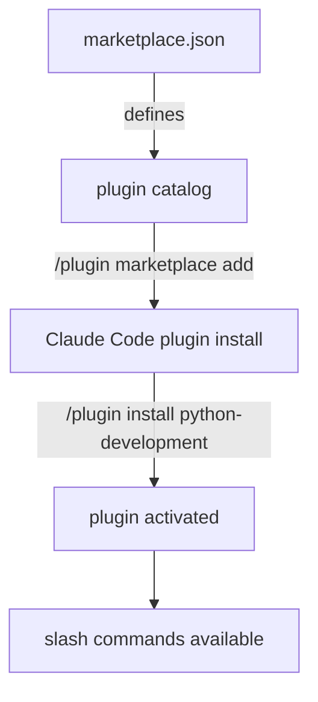

# Chapter 1: Getting Started

Welcome to **Chapter 1: Getting Started**. In this part of **Wshobson Agents Tutorial: Pluginized Multi-Agent Workflows for Claude Code**, you will build an intuitive mental model first, then move into concrete implementation details and practical production tradeoffs.


This chapter gets the marketplace connected and installs your first focused plugin set.

## Learning Goals

- add the marketplace to Claude Code
- install a minimal but useful first plugin portfolio
- verify slash-command discovery and invocation
- avoid over-installing plugins in early setup

## Quick Start Commands

```bash
/plugin marketplace add wshobson/agents
/plugin
/plugin install python-development
/plugin install code-review-ai
```

After installation, re-run `/plugin` and verify new commands are available.

## First-Session Operating Pattern

- pick one command workflow, for example test generation or review
- run a small target scope first
- validate output quality before adding more plugins

## Baseline Plugin Starter Set

- `python-development`
- `javascript-typescript`
- `code-review-ai`
- `git-pr-workflows`

This set is enough for many day-one coding loops.

## Source References

- [README Quick Start](https://github.com/wshobson/agents/blob/main/README.md#quick-start)
- [Plugin Reference](https://github.com/wshobson/agents/blob/main/docs/plugins.md)

## Summary

You now have a working baseline installation and first command surface.

Next: [Chapter 2: Marketplace Architecture and Plugin Structure](02-marketplace-architecture-and-plugin-structure.md)

## Source Code Walkthrough

> **Note:** `wshobson/agents` is a collection of Claude Code plugin definitions (YAML/Markdown), not a traditional compiled library. The "source code" is the plugin manifest and prompt files themselves. The relevant files for this chapter are the plugin installation interface and marketplace metadata.

### `.claude-plugin/marketplace.json`

The marketplace metadata file at [`/.claude-plugin/marketplace.json`](https://github.com/wshobson/agents/blob/main/.claude-plugin/marketplace.json) defines the plugin catalog that `/plugin marketplace add wshobson/agents` installs. It lists available plugins, their categories, and discovery metadata — this is the entry point for the Getting Started workflow.

### `README.md` Quick Start section

The [Quick Start section of the README](https://github.com/wshobson/agents/blob/main/README.md#quick-start) documents the exact `/plugin` commands used in this chapter and explains the intended first-session operating pattern.

## How These Components Connect


