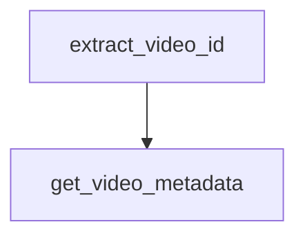

# Chapter 1: Getting Started

Welcome to **Chapter 1: Getting Started**. In this part of **Wshobson Agents Tutorial: Pluginized Multi-Agent Workflows for Claude Code**, you will build an intuitive mental model first, then move into concrete implementation details and practical production tradeoffs.


This chapter gets the marketplace connected and installs your first focused plugin set.

## Learning Goals

- add the marketplace to Claude Code
- install a minimal but useful first plugin portfolio
- verify slash-command discovery and invocation
- avoid over-installing plugins in early setup

## Quick Start Commands

```bash
/plugin marketplace add wshobson/agents
/plugin
/plugin install python-development
/plugin install code-review-ai
```

After installation, re-run `/plugin` and verify new commands are available.

## First-Session Operating Pattern

- pick one command workflow, for example test generation or review
- run a small target scope first
- validate output quality before adding more plugins

## Baseline Plugin Starter Set

- `python-development`
- `javascript-typescript`
- `code-review-ai`
- `git-pr-workflows`

This set is enough for many day-one coding loops.

## Source References

- [README Quick Start](https://github.com/wshobson/agents/blob/main/README.md#quick-start)
- [Plugin Reference](https://github.com/wshobson/agents/blob/main/docs/plugins.md)

## Summary

You now have a working baseline installation and first command surface.

Next: [Chapter 2: Marketplace Architecture and Plugin Structure](02-marketplace-architecture-and-plugin-structure.md)

## Depth Expansion Playbook

## Source Code Walkthrough

### `tools/yt-design-extractor.py`

The `extract_video_id` function in [`tools/yt-design-extractor.py`](https://github.com/wshobson/agents/blob/HEAD/tools/yt-design-extractor.py) handles a key part of this chapter's functionality:

```py


def extract_video_id(url: str) -> str:
    """Pull the 11-char video ID out of any common YouTube URL format."""
    patterns = [
        r"(?:v=|/v/|youtu\.be/)([a-zA-Z0-9_-]{11})",
        r"(?:embed/)([a-zA-Z0-9_-]{11})",
        r"(?:shorts/)([a-zA-Z0-9_-]{11})",
    ]
    for pat in patterns:
        m = re.search(pat, url)
        if m:
            return m.group(1)
    # Maybe the user passed a bare ID
    if re.match(r"^[a-zA-Z0-9_-]{11}$", url):
        return url
    sys.exit(f"Could not extract video ID from: {url}")


def get_video_metadata(url: str) -> dict:
    """Use yt-dlp to pull title, description, chapters, duration, etc."""
    cmd = [
        "yt-dlp",
        "--dump-json",
        "--no-download",
        "--no-playlist",
        url,
    ]
    print("[*] Fetching video metadata …")
    try:
        result = subprocess.run(cmd, capture_output=True, text=True, timeout=120)
    except subprocess.TimeoutExpired:
```

This function is important because it defines how Wshobson Agents Tutorial: Pluginized Multi-Agent Workflows for Claude Code implements the patterns covered in this chapter.

### `tools/yt-design-extractor.py`

The `get_video_metadata` function in [`tools/yt-design-extractor.py`](https://github.com/wshobson/agents/blob/HEAD/tools/yt-design-extractor.py) handles a key part of this chapter's functionality:

```py


def get_video_metadata(url: str) -> dict:
    """Use yt-dlp to pull title, description, chapters, duration, etc."""
    cmd = [
        "yt-dlp",
        "--dump-json",
        "--no-download",
        "--no-playlist",
        url,
    ]
    print("[*] Fetching video metadata …")
    try:
        result = subprocess.run(cmd, capture_output=True, text=True, timeout=120)
    except subprocess.TimeoutExpired:
        sys.exit("yt-dlp metadata fetch timed out after 120s.")
    if result.returncode != 0:
        sys.exit(f"yt-dlp metadata failed:\n{result.stderr}")
    try:
        return json.loads(result.stdout)
    except json.JSONDecodeError as e:
        sys.exit(
            f"yt-dlp returned invalid JSON: {e}\nFirst 200 chars: {result.stdout[:200]}"
        )


def get_transcript(video_id: str) -> list[dict] | None:
    """Grab the transcript via youtube-transcript-api. Returns list of
    {text, start, duration} dicts, or None if unavailable."""
    try:
        from youtube_transcript_api import YouTubeTranscriptApi
        from youtube_transcript_api._errors import (
```

This function is important because it defines how Wshobson Agents Tutorial: Pluginized Multi-Agent Workflows for Claude Code implements the patterns covered in this chapter.


## How These Components Connect


