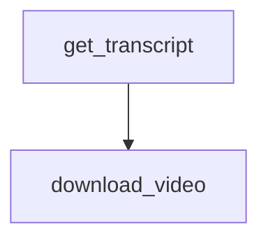

# Chapter 2: Marketplace Architecture and Plugin Structure

Welcome to **Chapter 2: Marketplace Architecture and Plugin Structure**. In this part of **Wshobson Agents Tutorial: Pluginized Multi-Agent Workflows for Claude Code**, you will build an intuitive mental model first, then move into concrete implementation details and practical production tradeoffs.


This chapter explains the repository's composable plugin architecture.

## Learning Goals

- understand how plugins isolate capabilities
- map relationships between `agents`, `commands`, and `skills`
- identify where marketplace metadata lives
- evaluate plugin design quality quickly

## Structural Overview

Key paths:

- `.claude-plugin/marketplace.json`: plugin catalog metadata
- `plugins/<plugin-name>/agents/`: specialist agent prompts
- `plugins/<plugin-name>/commands/`: slash-command behavior
- `plugins/<plugin-name>/skills/`: progressive-disclosure skill packs
- `docs/`: operator and contributor documentation

## Design Principles

The project emphasizes:

- single-responsibility plugins
- composability over monolithic bundles
- minimal token footprint by selective installs
- maintainable boundaries for updates and reviews

## Architecture Review Checklist

- is plugin scope focused and clearly named?
- are command names predictable and discoverable?
- do skills have clear activation criteria?
- is there overlap that should be decomposed further?

## Source References

- [Architecture Guide](https://github.com/wshobson/agents/blob/main/docs/architecture.md)
- [Marketplace Directory](https://github.com/wshobson/agents/tree/main/.claude-plugin)
- [Plugins Directory](https://github.com/wshobson/agents/tree/main/plugins)

## Summary

You now understand the composable architecture that powers the ecosystem.

Next: [Chapter 3: Installation and Plugin Selection Strategy](03-installation-and-plugin-selection-strategy.md)

## Depth Expansion Playbook

## Source Code Walkthrough

### `tools/yt-design-extractor.py`

The `get_transcript` function in [`tools/yt-design-extractor.py`](https://github.com/wshobson/agents/blob/HEAD/tools/yt-design-extractor.py) handles a key part of this chapter's functionality:

```py


def get_transcript(video_id: str) -> list[dict] | None:
    """Grab the transcript via youtube-transcript-api. Returns list of
    {text, start, duration} dicts, or None if unavailable."""
    try:
        from youtube_transcript_api import YouTubeTranscriptApi
        from youtube_transcript_api._errors import (
            TranscriptsDisabled,
            NoTranscriptFound,
            VideoUnavailable,
        )
    except ImportError:
        print("[!] youtube-transcript-api not installed. Skipping transcript.")
        return None

    try:
        print("[*] Fetching transcript …")
        ytt_api = YouTubeTranscriptApi()
        transcript = ytt_api.fetch(video_id)
        entries = []
        for snippet in transcript:
            entries.append(
                {
                    "text": snippet.text,
                    "start": snippet.start,
                    "duration": snippet.duration,
                }
            )
        return entries
    except (TranscriptsDisabled, NoTranscriptFound, VideoUnavailable) as e:
        print(f"[!] Transcript unavailable ({e}). Will proceed without it.")
```

This function is important because it defines how Wshobson Agents Tutorial: Pluginized Multi-Agent Workflows for Claude Code implements the patterns covered in this chapter.

### `tools/yt-design-extractor.py`

The `download_video` function in [`tools/yt-design-extractor.py`](https://github.com/wshobson/agents/blob/HEAD/tools/yt-design-extractor.py) handles a key part of this chapter's functionality:

```py


def download_video(url: str, out_dir: Path) -> Path:
    """Download video, preferring 720p or lower. Falls back to best available."""
    out_template = str(out_dir / "video.%(ext)s")
    cmd = [
        "yt-dlp",
        "-f",
        "bestvideo[height<=720]+bestaudio/best[height<=720]/best",
        "--merge-output-format",
        "mp4",
        "-o",
        out_template,
        "--no-playlist",
        url,
    ]
    print("[*] Downloading video (720p preferred) …")
    try:
        result = subprocess.run(cmd, capture_output=True, text=True, timeout=600)
    except subprocess.TimeoutExpired:
        sys.exit(
            "Video download timed out after 10 minutes. "
            "The video may be too large or your connection too slow."
        )
    if result.returncode != 0:
        sys.exit(f"yt-dlp download failed:\n{result.stderr}")

    # Find the downloaded file
    for f in out_dir.iterdir():
        if f.name.startswith("video.") and f.suffix in (".mp4", ".mkv", ".webm"):
            return f
    sys.exit("Download succeeded but could not locate video file.")
```

This function is important because it defines how Wshobson Agents Tutorial: Pluginized Multi-Agent Workflows for Claude Code implements the patterns covered in this chapter.


## How These Components Connect


