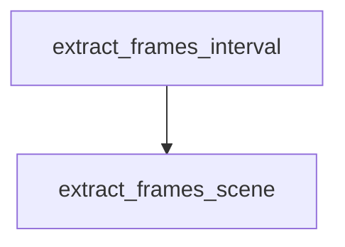

# Chapter 3: Installation and Plugin Selection Strategy

Welcome to **Chapter 3: Installation and Plugin Selection Strategy**. In this part of **Wshobson Agents Tutorial: Pluginized Multi-Agent Workflows for Claude Code**, you will build an intuitive mental model first, then move into concrete implementation details and practical production tradeoffs.


This chapter shows how to choose plugin portfolios by objective instead of installing everything.

## Learning Goals

- select plugins by workflow goal and team constraints
- build phased installation plans for new teams
- avoid context bloat from uncontrolled plugin growth
- align plugin choices with quality and review practices

## Strategy Framework

1. Define your top three recurring workflows.
2. Map each workflow to one or two primary plugins.
3. Add one review/governance plugin.
4. Expand only when command gaps are verified.

## Example Portfolio Profiles

### Solo Full-Stack Engineer

- `backend-development`
- `frontend-mobile-development`
- `unit-testing`
- `code-review-ai`

### Platform Team

- `cloud-infrastructure`
- `kubernetes-operations`
- `cicd-automation`
- `security-scanning`

### Data/LLM Team

- `llm-application-dev`
- `data-engineering`
- `machine-learning-ops`
- `performance-testing-review`

## Anti-Patterns

- installing 20+ plugins before validating any workflow
- adding overlapping plugins without command-level rationale
- skipping review and security plugins in production-adjacent projects

## Source References

- [Plugin Catalog](https://github.com/wshobson/agents/blob/main/docs/plugins.md)
- [Usage Guide](https://github.com/wshobson/agents/blob/main/docs/usage.md)

## Summary

You now have a practical method for controlled plugin adoption.

Next: [Chapter 4: Commands, Natural Language, and Workflow Orchestration](04-commands-natural-language-and-workflow-orchestration.md)

## Depth Expansion Playbook

## Source Code Walkthrough

### `tools/yt-design-extractor.py`

The `extract_frames_interval` function in [`tools/yt-design-extractor.py`](https://github.com/wshobson/agents/blob/HEAD/tools/yt-design-extractor.py) handles a key part of this chapter's functionality:

```py


def extract_frames_interval(
    video_path: Path, out_dir: Path, interval: int = 30
) -> list[Path]:
    """Extract one frame every `interval` seconds."""
    frames_dir = out_dir / "frames"
    frames_dir.mkdir(exist_ok=True)
    pattern = str(frames_dir / "frame_%04d.png")
    cmd = [
        "ffmpeg",
        "-i",
        str(video_path),
        "-vf",
        f"fps=1/{interval}",
        "-q:v",
        "2",
        pattern,
        "-y",
    ]
    print(f"[*] Extracting frames every {interval}s …")
    try:
        result = subprocess.run(cmd, capture_output=True, text=True, timeout=600)
    except subprocess.TimeoutExpired:
        sys.exit("Frame extraction timed out after 10 minutes.")
    if result.returncode != 0:
        print(f"[!] ffmpeg frame extraction failed (exit code {result.returncode}):")
        print(f"    {result.stderr[:500]}")
        return []
    frames = sorted(frames_dir.glob("frame_*.png"))
    if not frames:
        print(
```

This function is important because it defines how Wshobson Agents Tutorial: Pluginized Multi-Agent Workflows for Claude Code implements the patterns covered in this chapter.

### `tools/yt-design-extractor.py`

The `extract_frames_scene` function in [`tools/yt-design-extractor.py`](https://github.com/wshobson/agents/blob/HEAD/tools/yt-design-extractor.py) handles a key part of this chapter's functionality:

```py


def extract_frames_scene(
    video_path: Path, out_dir: Path, threshold: float = 0.3
) -> list[Path]:
    """Use ffmpeg scene-change detection to grab visually distinct frames."""
    frames_dir = out_dir / "frames_scene"
    frames_dir.mkdir(exist_ok=True)
    pattern = str(frames_dir / "scene_%04d.png")
    cmd = [
        "ffmpeg",
        "-i",
        str(video_path),
        "-vf",
        f"select='gt(scene,{threshold})',showinfo",
        "-vsync",
        "vfr",
        "-q:v",
        "2",
        pattern,
        "-y",
    ]
    print(f"[*] Extracting scene-change frames (threshold={threshold}) …")
    try:
        result = subprocess.run(cmd, capture_output=True, text=True, timeout=600)
    except subprocess.TimeoutExpired:
        sys.exit("Scene-change frame extraction timed out after 10 minutes.")
    if result.returncode != 0:
        print(f"[!] ffmpeg scene detection failed (exit code {result.returncode}):")
        print(f"    {result.stderr[:500]}")
        return []
    frames = sorted(frames_dir.glob("scene_*.png"))
```

This function is important because it defines how Wshobson Agents Tutorial: Pluginized Multi-Agent Workflows for Claude Code implements the patterns covered in this chapter.


## How These Components Connect


