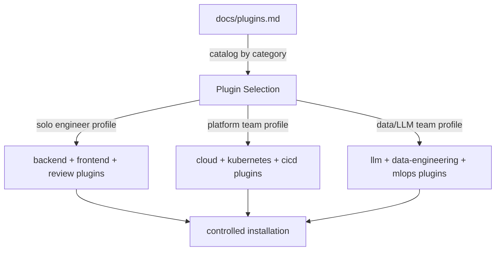

# Chapter 3: Installation and Plugin Selection Strategy

Welcome to **Chapter 3: Installation and Plugin Selection Strategy**. In this part of **Wshobson Agents Tutorial: Pluginized Multi-Agent Workflows for Claude Code**, you will build an intuitive mental model first, then move into concrete implementation details and practical production tradeoffs.

This chapter shows how to choose plugin portfolios by objective instead of installing everything.

## Learning Goals

- select plugins by workflow goal and team constraints
- build phased installation plans for new teams
- avoid context bloat from uncontrolled plugin growth
- align plugin choices with quality and review practices

## Strategy Framework

1. Define your top three recurring workflows.
2. Map each workflow to one or two primary plugins.
3. Add one review/governance plugin.
4. Expand only when command gaps are verified.

## Example Portfolio Profiles

### Solo Full-Stack Engineer

- `backend-development`
- `frontend-mobile-development`
- `unit-testing`
- `code-review-ai`

### Platform Team

- `cloud-infrastructure`
- `kubernetes-operations`
- `cicd-automation`
- `security-scanning`

### Data/LLM Team

- `llm-application-dev`
- `data-engineering`
- `machine-learning-ops`
- `performance-testing-review`

## Anti-Patterns

- installing 20+ plugins before validating any workflow
- adding overlapping plugins without command-level rationale
- skipping review and security plugins in production-adjacent projects

## Source References

- [Plugin Catalog](https://github.com/wshobson/agents/blob/main/docs/plugins.md)
- [Usage Guide](https://github.com/wshobson/agents/blob/main/docs/usage.md)

## Summary

You now have a practical method for controlled plugin adoption.

Next: [Chapter 4: Commands, Natural Language, and Workflow Orchestration](04-commands-natural-language-and-workflow-orchestration.md)

## Source Code Walkthrough

> **Note:** `wshobson/agents` stores all behavior in plugin definition files (Markdown/YAML), not compiled source code. Plugin selection strategy is encoded in the catalog and documentation rather than executable functions.

### `docs/plugins.md`

The [plugin catalog documentation](https://github.com/wshobson/agents/blob/main/docs/plugins.md) is the primary reference for this chapter. It lists all available plugins by category (Backend, Frontend, Cloud, Security, etc.) and explains which workflows each plugin supports — the direct basis for the portfolio profiles described in this chapter.

### `docs/usage.md`

The [usage guide](https://github.com/wshobson/agents/blob/main/docs/usage.md) explains the phased installation approach: start minimal, add plugins when workflow gaps emerge. This documents the anti-patterns around over-installation that this chapter covers.

## How These Components Connect

