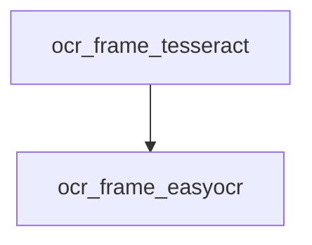

# Chapter 4: Commands, Natural Language, and Workflow Orchestration

Welcome to **Chapter 4: Commands, Natural Language, and Workflow Orchestration**. In this part of **Wshobson Agents Tutorial: Pluginized Multi-Agent Workflows for Claude Code**, you will build an intuitive mental model first, then move into concrete implementation details and practical production tradeoffs.


This chapter covers the two primary interfaces and when to use each.

## Learning Goals

- apply slash commands for deterministic task execution
- use natural language when agent reasoning is more useful
- compose multi-step workflows safely
- improve reproducibility of complex runs

## Command-First Pattern

Use commands when you need explicit behavior and arguments:

```bash
/full-stack-orchestration:full-stack-feature "user dashboard with analytics"
/security-scanning:security-hardening --level comprehensive
```

Benefits:

- predictable execution path
- clear argument contract
- easier runbook reuse across team members

## Natural-Language Pattern

Use NL when you want dynamic agent selection:

- "Use backend-architect and security-auditor to review this auth flow."

Benefits:

- faster ideation for exploratory tasks
- less command memorization overhead

## Hybrid Workflow

- start with command scaffold
- refine with natural-language follow-ups
- finish with explicit review command for quality gates

## Source References

- [Usage Guide](https://github.com/wshobson/agents/blob/main/docs/usage.md)
- [README Popular Use Cases](https://github.com/wshobson/agents/blob/main/README.md#popular-use-cases)

## Summary

You now have a balanced command/NL operating model for reliable multi-agent workflows.

Next: [Chapter 5: Agents, Skills, and Model Tier Strategy](05-agents-skills-and-model-tier-strategy.md)

## Depth Expansion Playbook

## Source Code Walkthrough

### `tools/yt-design-extractor.py`

The `ocr_frame_tesseract` function in [`tools/yt-design-extractor.py`](https://github.com/wshobson/agents/blob/HEAD/tools/yt-design-extractor.py) handles a key part of this chapter's functionality:

```py


def ocr_frame_tesseract(frame_path: Path) -> str:
    """Extract text from a frame using Tesseract OCR. Converts to grayscale first."""
    if not TESSERACT_AVAILABLE:
        return ""
    try:
        img = Image.open(frame_path)
        if img.mode != "L":
            img = img.convert("L")
        text = pytesseract.image_to_string(img, config="--psm 6")
        return text.strip()
    except Exception as e:
        print(f"[!] OCR failed for {frame_path}: {e}")
        return ""


def ocr_frame_easyocr(frame_path: Path, reader) -> str:
    """Extract text from a frame using EasyOCR (better for stylized text)."""
    try:
        results = reader.readtext(str(frame_path), detail=0)
        return "\n".join(results).strip()
    except Exception as e:
        print(f"[!] OCR failed for {frame_path}: {e}")
        return ""


def run_ocr_on_frames(
    frames: list[Path], ocr_engine: str = "tesseract", workers: int = 4
) -> dict[Path, str]:
    """Run OCR on frames. Tesseract runs in parallel; EasyOCR sequentially.
    Returns {frame_path: text}."""
```

This function is important because it defines how Wshobson Agents Tutorial: Pluginized Multi-Agent Workflows for Claude Code implements the patterns covered in this chapter.

### `tools/yt-design-extractor.py`

The `ocr_frame_easyocr` function in [`tools/yt-design-extractor.py`](https://github.com/wshobson/agents/blob/HEAD/tools/yt-design-extractor.py) handles a key part of this chapter's functionality:

```py


def ocr_frame_easyocr(frame_path: Path, reader) -> str:
    """Extract text from a frame using EasyOCR (better for stylized text)."""
    try:
        results = reader.readtext(str(frame_path), detail=0)
        return "\n".join(results).strip()
    except Exception as e:
        print(f"[!] OCR failed for {frame_path}: {e}")
        return ""


def run_ocr_on_frames(
    frames: list[Path], ocr_engine: str = "tesseract", workers: int = 4
) -> dict[Path, str]:
    """Run OCR on frames. Tesseract runs in parallel; EasyOCR sequentially.
    Returns {frame_path: text}."""
    if not frames:
        return {}

    results = {}

    if ocr_engine == "easyocr":
        if not EASYOCR_AVAILABLE:
            sys.exit(
                "EasyOCR was explicitly requested but is not installed.\n"
                "  Install: pip install torch torchvision --index-url "
                "https://download.pytorch.org/whl/cpu && pip install easyocr\n"
                "  Or use: --ocr-engine tesseract"
            )
        else:
            print("[*] Initializing EasyOCR (this may take a moment) …")
```

This function is important because it defines how Wshobson Agents Tutorial: Pluginized Multi-Agent Workflows for Claude Code implements the patterns covered in this chapter.


## How These Components Connect


