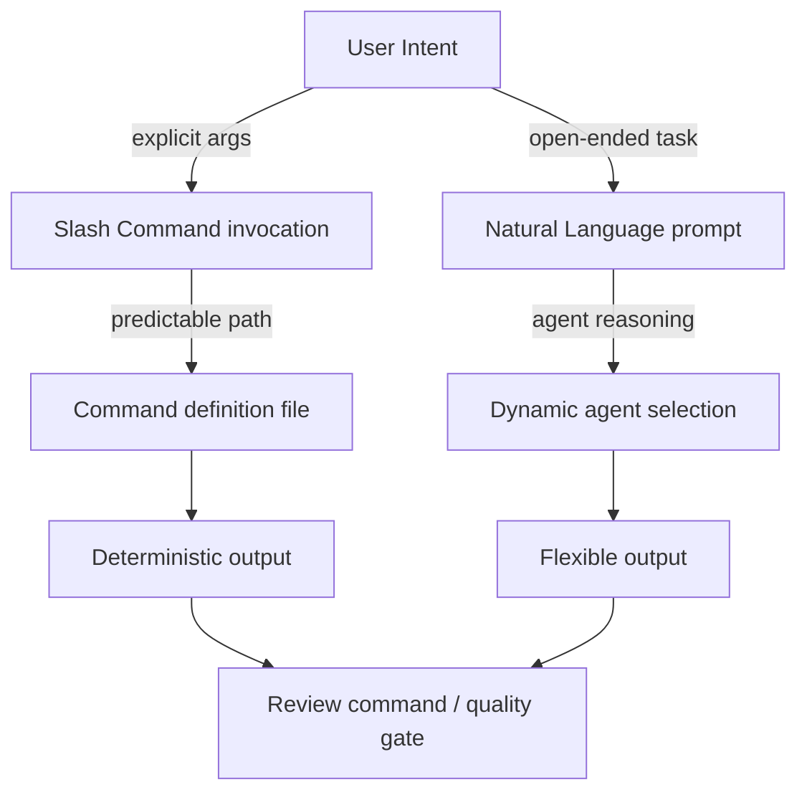

# Chapter 4: Commands, Natural Language, and Workflow Orchestration

Welcome to **Chapter 4: Commands, Natural Language, and Workflow Orchestration**. In this part of **Wshobson Agents Tutorial: Pluginized Multi-Agent Workflows for Claude Code**, you will build an intuitive mental model first, then move into concrete implementation details and practical production tradeoffs.


This chapter covers the two primary interfaces and when to use each.

## Learning Goals

- apply slash commands for deterministic task execution
- use natural language when agent reasoning is more useful
- compose multi-step workflows safely
- improve reproducibility of complex runs

## Command-First Pattern

Use commands when you need explicit behavior and arguments:

```bash
/full-stack-orchestration:full-stack-feature "user dashboard with analytics"
/security-scanning:security-hardening --level comprehensive
```

Benefits:

- predictable execution path
- clear argument contract
- easier runbook reuse across team members

## Natural-Language Pattern

Use NL when you want dynamic agent selection:

- "Use backend-architect and security-auditor to review this auth flow."

Benefits:

- faster ideation for exploratory tasks
- less command memorization overhead

## Hybrid Workflow

- start with command scaffold
- refine with natural-language follow-ups
- finish with explicit review command for quality gates

## Source References

- [Usage Guide](https://github.com/wshobson/agents/blob/main/docs/usage.md)
- [README Popular Use Cases](https://github.com/wshobson/agents/blob/main/README.md#popular-use-cases)

## Summary

You now have a balanced command/NL operating model for reliable multi-agent workflows.

Next: [Chapter 5: Agents, Skills, and Model Tier Strategy](05-agents-skills-and-model-tier-strategy.md)

## Source Code Walkthrough

> **Note:** `wshobson/agents` is a prompt-file collection. Command invocation patterns are defined in the plugin command files, not in compiled source. The relevant references for this chapter are the command definition files and usage documentation.

### `docs/usage.md` — Command patterns

The [usage guide](https://github.com/wshobson/agents/blob/main/docs/usage.md) documents both the slash-command invocation pattern (e.g. `/full-stack-orchestration:full-stack-feature`) and the natural-language fallback approach. It also covers the hybrid workflow pattern (command scaffold + NL refinement) described in this chapter.

### `plugins/` command files

Individual command behavior is defined in files like [`plugins/full-stack-orchestration/commands/`](https://github.com/wshobson/agents/tree/main/plugins) — each command file specifies its arguments, default behaviors, and expected outputs, making the invocation contract explicit.

## How These Components Connect


