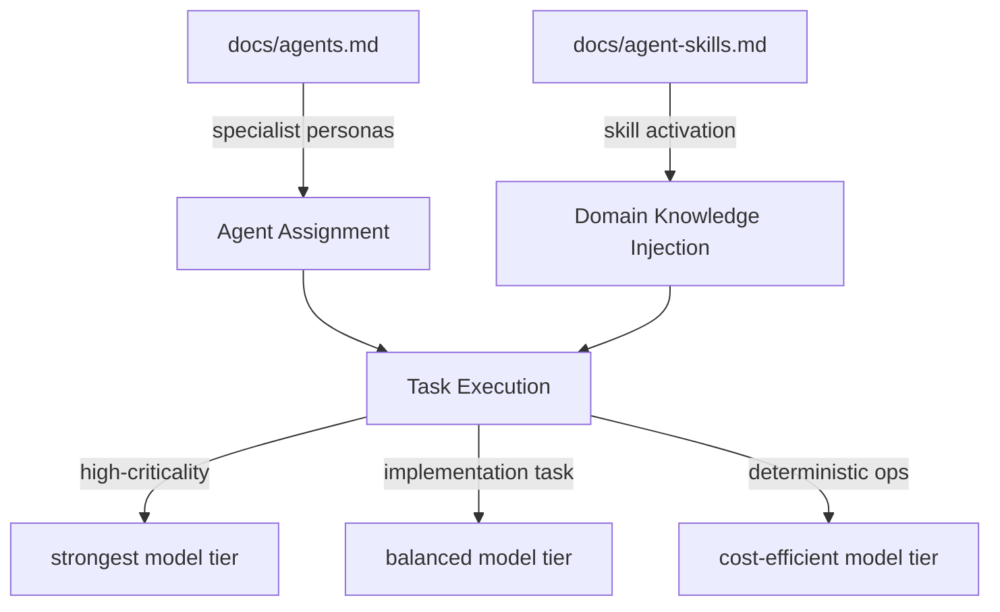

# Chapter 5: Agents, Skills, and Model Tier Strategy

Welcome to **Chapter 5: Agents, Skills, and Model Tier Strategy**. In this part of **Wshobson Agents Tutorial: Pluginized Multi-Agent Workflows for Claude Code**, you will build an intuitive mental model first, then move into concrete implementation details and practical production tradeoffs.

This chapter explains how specialists, skill packs, and model assignment combine to shape output quality and cost.

## Learning Goals

- understand agent category coverage and specialization
- use skills for progressive-disclosure knowledge loading
- reason about model-tier assignment tradeoffs
- tune workflows for quality/cost targets

## Agent + Skill Interaction

- agents provide execution persona and task behavior
- skills inject narrow, high-value domain knowledge on demand
- plugin boundaries keep activation surfaces focused

## Model Tier Strategy

The project documents tiered model use across high-criticality and fast operational tasks.

Practical heuristic:

- critical architecture/security decisions: strongest model tier
- implementation-heavy but bounded tasks: balanced tier
- deterministic operational tasks: cost-efficient tier

## Operational Checklist

- verify agent choice before long runs
- ensure relevant skill triggers are present in prompts
- re-run sensitive workflows with review-oriented agents
- track token/cost patterns by plugin profile

## Source References

- [Agent Reference](https://github.com/wshobson/agents/blob/main/docs/agents.md)
- [Agent Skills Guide](https://github.com/wshobson/agents/blob/main/docs/agent-skills.md)
- [README Model Strategy](https://github.com/wshobson/agents/blob/main/README.md#three-tier-model-strategy)

## Summary

You now understand how to combine specialists, skills, and model strategy for better outcomes.

Next: [Chapter 6: Multi-Agent Team Patterns and Production Workflows](06-multi-agent-team-patterns-and-production-workflows.md)

## Source Code Walkthrough

> **Note:** `wshobson/agents` defines agent behavior through prompt files and documentation, not compiled code. Specialist agent personas, skill packs, and model tier guidance all live in Markdown files within the plugin directories.

### `docs/agents.md`

The [agent reference](https://github.com/wshobson/agents/blob/main/docs/agents.md) catalogs all available specialist agents (backend-architect, security-auditor, performance-engineer, etc.) and explains their roles. This is the primary source for the agent-category coverage and specialization concepts in this chapter.

### `docs/agent-skills.md`

The [agent skills guide](https://github.com/wshobson/agents/blob/main/docs/agent-skills.md) documents how skill packs activate progressive-disclosure domain knowledge on demand — the mechanism this chapter covers for narrowing context to high-value specializations without token bloat.

## How These Components Connect

