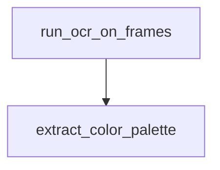

# Chapter 5: Agents, Skills, and Model Tier Strategy

Welcome to **Chapter 5: Agents, Skills, and Model Tier Strategy**. In this part of **Wshobson Agents Tutorial: Pluginized Multi-Agent Workflows for Claude Code**, you will build an intuitive mental model first, then move into concrete implementation details and practical production tradeoffs.


This chapter explains how specialists, skill packs, and model assignment combine to shape output quality and cost.

## Learning Goals

- understand agent category coverage and specialization
- use skills for progressive-disclosure knowledge loading
- reason about model-tier assignment tradeoffs
- tune workflows for quality/cost targets

## Agent + Skill Interaction

- agents provide execution persona and task behavior
- skills inject narrow, high-value domain knowledge on demand
- plugin boundaries keep activation surfaces focused

## Model Tier Strategy

The project documents tiered model use across high-criticality and fast operational tasks.

Practical heuristic:

- critical architecture/security decisions: strongest model tier
- implementation-heavy but bounded tasks: balanced tier
- deterministic operational tasks: cost-efficient tier

## Operational Checklist

- verify agent choice before long runs
- ensure relevant skill triggers are present in prompts
- re-run sensitive workflows with review-oriented agents
- track token/cost patterns by plugin profile

## Source References

- [Agent Reference](https://github.com/wshobson/agents/blob/main/docs/agents.md)
- [Agent Skills Guide](https://github.com/wshobson/agents/blob/main/docs/agent-skills.md)
- [README Model Strategy](https://github.com/wshobson/agents/blob/main/README.md#three-tier-model-strategy)

## Summary

You now understand how to combine specialists, skills, and model strategy for better outcomes.

Next: [Chapter 6: Multi-Agent Team Patterns and Production Workflows](06-multi-agent-team-patterns-and-production-workflows.md)

## Depth Expansion Playbook

## Source Code Walkthrough

### `tools/yt-design-extractor.py`

The `run_ocr_on_frames` function in [`tools/yt-design-extractor.py`](https://github.com/wshobson/agents/blob/HEAD/tools/yt-design-extractor.py) handles a key part of this chapter's functionality:

```py


def run_ocr_on_frames(
    frames: list[Path], ocr_engine: str = "tesseract", workers: int = 4
) -> dict[Path, str]:
    """Run OCR on frames. Tesseract runs in parallel; EasyOCR sequentially.
    Returns {frame_path: text}."""
    if not frames:
        return {}

    results = {}

    if ocr_engine == "easyocr":
        if not EASYOCR_AVAILABLE:
            sys.exit(
                "EasyOCR was explicitly requested but is not installed.\n"
                "  Install: pip install torch torchvision --index-url "
                "https://download.pytorch.org/whl/cpu && pip install easyocr\n"
                "  Or use: --ocr-engine tesseract"
            )
        else:
            print("[*] Initializing EasyOCR (this may take a moment) …")
            reader = easyocr.Reader(["en"], gpu=False, verbose=False)

    if ocr_engine == "tesseract" and not TESSERACT_AVAILABLE:
        print("[!] Tesseract/pytesseract not installed, skipping OCR")
        return {}

    print(f"[*] Running OCR on {len(frames)} frames ({ocr_engine}) …")

    if ocr_engine == "easyocr":
        # EasyOCR doesn't parallelize well, run sequentially
```

This function is important because it defines how Wshobson Agents Tutorial: Pluginized Multi-Agent Workflows for Claude Code implements the patterns covered in this chapter.

### `tools/yt-design-extractor.py`

The `extract_color_palette` function in [`tools/yt-design-extractor.py`](https://github.com/wshobson/agents/blob/HEAD/tools/yt-design-extractor.py) handles a key part of this chapter's functionality:

```py


def extract_color_palette(frame_path: Path, color_count: int = 6) -> list[tuple]:
    """Extract dominant colors from a frame. Returns list of RGB tuples."""
    if not COLORTHIEF_AVAILABLE:
        return []
    try:
        ct = ColorThief(str(frame_path))
        palette = ct.get_palette(color_count=color_count, quality=5)
        return palette
    except Exception as e:
        print(f"[!] Color extraction failed for {frame_path}: {e}")
        return []


def rgb_to_hex(rgb: tuple) -> str:
    """Convert RGB tuple to hex color string."""
    return "#{:02x}{:02x}{:02x}".format(*rgb)


def analyze_color_palettes(frames: list[Path], sample_size: int = 10) -> dict:
    """Analyze color palettes across sampled frames."""
    if not COLORTHIEF_AVAILABLE:
        return {}
    if not frames:
        return {}

    # Sample frames evenly across the video
    step = max(1, len(frames) // sample_size)
    sampled = frames[::step][:sample_size]

    print(f"[*] Extracting color palettes from {len(sampled)} frames …")
```

This function is important because it defines how Wshobson Agents Tutorial: Pluginized Multi-Agent Workflows for Claude Code implements the patterns covered in this chapter.


## How These Components Connect


