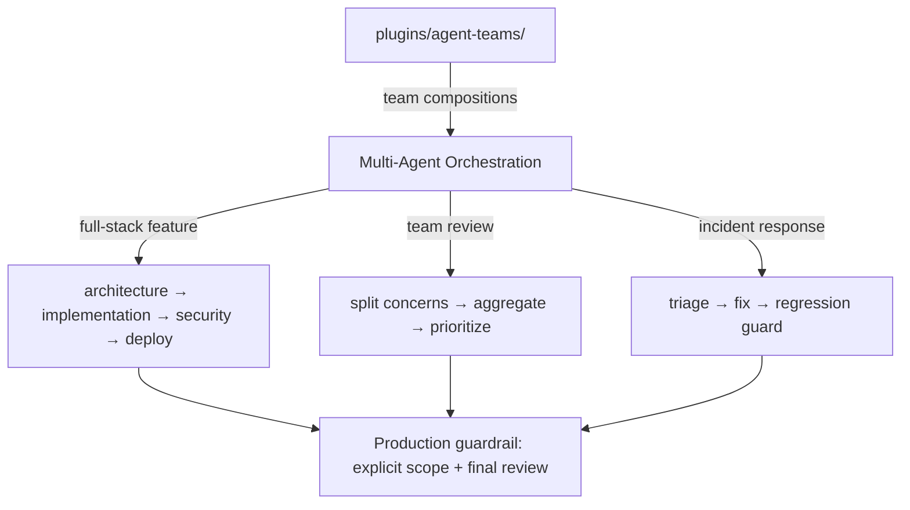

# Chapter 6: Multi-Agent Team Patterns and Production Workflows

Welcome to **Chapter 6: Multi-Agent Team Patterns and Production Workflows**. In this part of **Wshobson Agents Tutorial: Pluginized Multi-Agent Workflows for Claude Code**, you will build an intuitive mental model first, then move into concrete implementation details and practical production tradeoffs.

This chapter focuses on orchestrated workflows where multiple agents collaborate with clear handoffs.

## Learning Goals

- run multi-agent flows for feature, review, and incident work
- understand orchestration sequencing and handoff quality
- apply team-oriented plugin patterns like `agent-teams`
- reduce coordination failures in long-running tasks

## Common Multi-Agent Patterns

### Full-Stack Feature Flow

- architecture design
- implementation stream
- security review
- deployment and observability checks

### Team Review Flow

- split review concerns (architecture, security, performance)
- aggregate findings
- prioritize by severity and blast radius

### Incident Response Flow

- triage and root-cause hypothesis
- focused fixes
- regression guards and post-incident documentation

## Production Guardrails

- set explicit scope and stop criteria before orchestration
- enforce final review passes for security-sensitive changes
- keep command logs for incident retrospectives

## Source References

- [Usage Guide: Multi-Agent Workflows](https://github.com/wshobson/agents/blob/main/docs/usage.md#multi-agent-workflow-examples)
- [README Agent Teams](https://github.com/wshobson/agents/blob/main/README.md#agent-teams-plugin-new)
- [Agent Teams Plugin](https://github.com/wshobson/agents/tree/main/plugins/agent-teams)

## Summary

You now have concrete patterns for reliable multi-agent collaboration.

Next: [Chapter 7: Governance, Safety, and Operational Best Practices](07-governance-safety-and-operational-best-practices.md)

## Source Code Walkthrough

> **Note:** `wshobson/agents` expresses multi-agent team patterns through plugin compositions and documentation, not executable source code. The `plugins/agent-teams` directory and usage guide document the orchestration patterns covered here.

### `plugins/agent-teams/`

The [`plugins/agent-teams/` directory](https://github.com/wshobson/agents/tree/main/plugins/agent-teams) contains the agent-teams plugin definition. This plugin is specifically designed for coordinated multi-agent workflows — it defines team compositions, handoff patterns, and the orchestration commands referenced in this chapter's Full-Stack Feature Flow and Team Review Flow patterns.

### `docs/usage.md` — Multi-agent workflow examples

The [multi-agent workflow examples section](https://github.com/wshobson/agents/blob/main/docs/usage.md#multi-agent-workflow-examples) in the usage guide documents concrete orchestration sequences for feature development, review, and incident response — the three patterns this chapter covers.

## How These Components Connect

