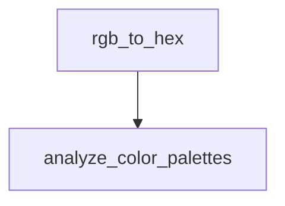

# Chapter 6: Multi-Agent Team Patterns and Production Workflows

Welcome to **Chapter 6: Multi-Agent Team Patterns and Production Workflows**. In this part of **Wshobson Agents Tutorial: Pluginized Multi-Agent Workflows for Claude Code**, you will build an intuitive mental model first, then move into concrete implementation details and practical production tradeoffs.


This chapter focuses on orchestrated workflows where multiple agents collaborate with clear handoffs.

## Learning Goals

- run multi-agent flows for feature, review, and incident work
- understand orchestration sequencing and handoff quality
- apply team-oriented plugin patterns like `agent-teams`
- reduce coordination failures in long-running tasks

## Common Multi-Agent Patterns

### Full-Stack Feature Flow

- architecture design
- implementation stream
- security review
- deployment and observability checks

### Team Review Flow

- split review concerns (architecture, security, performance)
- aggregate findings
- prioritize by severity and blast radius

### Incident Response Flow

- triage and root-cause hypothesis
- focused fixes
- regression guards and post-incident documentation

## Production Guardrails

- set explicit scope and stop criteria before orchestration
- enforce final review passes for security-sensitive changes
- keep command logs for incident retrospectives

## Source References

- [Usage Guide: Multi-Agent Workflows](https://github.com/wshobson/agents/blob/main/docs/usage.md#multi-agent-workflow-examples)
- [README Agent Teams](https://github.com/wshobson/agents/blob/main/README.md#agent-teams-plugin-new)
- [Agent Teams Plugin](https://github.com/wshobson/agents/tree/main/plugins/agent-teams)

## Summary

You now have concrete patterns for reliable multi-agent collaboration.

Next: [Chapter 7: Governance, Safety, and Operational Best Practices](07-governance-safety-and-operational-best-practices.md)

## Depth Expansion Playbook

## Source Code Walkthrough

### `tools/yt-design-extractor.py`

The `rgb_to_hex` function in [`tools/yt-design-extractor.py`](https://github.com/wshobson/agents/blob/HEAD/tools/yt-design-extractor.py) handles a key part of this chapter's functionality:

```py


def rgb_to_hex(rgb: tuple) -> str:
    """Convert RGB tuple to hex color string."""
    return "#{:02x}{:02x}{:02x}".format(*rgb)


def analyze_color_palettes(frames: list[Path], sample_size: int = 10) -> dict:
    """Analyze color palettes across sampled frames."""
    if not COLORTHIEF_AVAILABLE:
        return {}
    if not frames:
        return {}

    # Sample frames evenly across the video
    step = max(1, len(frames) // sample_size)
    sampled = frames[::step][:sample_size]

    print(f"[*] Extracting color palettes from {len(sampled)} frames …")

    all_colors = []
    for frame in sampled:
        palette = extract_color_palette(frame)
        all_colors.extend(palette)

    if not all_colors:
        return {}

    # Find most common colors (rounded to reduce similar colors)
    def round_color(rgb, bucket_size=32):
        return tuple((c // bucket_size) * bucket_size for c in rgb)

```

This function is important because it defines how Wshobson Agents Tutorial: Pluginized Multi-Agent Workflows for Claude Code implements the patterns covered in this chapter.

### `tools/yt-design-extractor.py`

The `analyze_color_palettes` function in [`tools/yt-design-extractor.py`](https://github.com/wshobson/agents/blob/HEAD/tools/yt-design-extractor.py) handles a key part of this chapter's functionality:

```py


def analyze_color_palettes(frames: list[Path], sample_size: int = 10) -> dict:
    """Analyze color palettes across sampled frames."""
    if not COLORTHIEF_AVAILABLE:
        return {}
    if not frames:
        return {}

    # Sample frames evenly across the video
    step = max(1, len(frames) // sample_size)
    sampled = frames[::step][:sample_size]

    print(f"[*] Extracting color palettes from {len(sampled)} frames …")

    all_colors = []
    for frame in sampled:
        palette = extract_color_palette(frame)
        all_colors.extend(palette)

    if not all_colors:
        return {}

    # Find most common colors (rounded to reduce similar colors)
    def round_color(rgb, bucket_size=32):
        return tuple((c // bucket_size) * bucket_size for c in rgb)

    rounded = [round_color(c) for c in all_colors]
    most_common = Counter(rounded).most_common(12)

    return {
        "dominant_colors": [rgb_to_hex(c) for c, _ in most_common[:6]],
```

This function is important because it defines how Wshobson Agents Tutorial: Pluginized Multi-Agent Workflows for Claude Code implements the patterns covered in this chapter.


## How These Components Connect


