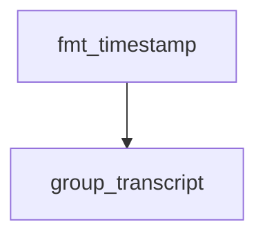

# Chapter 7: Governance, Safety, and Operational Best Practices

Welcome to **Chapter 7: Governance, Safety, and Operational Best Practices**. In this part of **Wshobson Agents Tutorial: Pluginized Multi-Agent Workflows for Claude Code**, you will build an intuitive mental model first, then move into concrete implementation details and practical production tradeoffs.


This chapter establishes team-level controls so plugin scale does not become operational chaos.

## Learning Goals

- define plugin governance for consistent team usage
- enforce quality/safety checks in automated workflows
- manage plugin drift and command-surface growth
- document runbooks for repeatable outcomes

## Governance Baseline

- maintain approved-plugin lists by team function
- review plugin additions through change-management process
- pair automation workflows with review checkpoints
- track risky command categories with stronger scrutiny

## Safety Controls

- require security scanning commands for production-bound changes
- standardize code-review command usage before merge
- prefer explicit slash commands in sensitive workflows
- isolate experimental plugins from core CI/CD paths

## Operational Best Practices

- start with small scope and expand progressively
- keep workflow templates for common tasks
- record failures and fixes in internal runbooks
- periodically prune unused plugins

## Source References

- [Usage Best Practices](https://github.com/wshobson/agents/blob/main/docs/usage.md#best-practices)
- [Plugin Design Principles](https://github.com/wshobson/agents/blob/main/docs/plugins.md#plugin-design-principles)
- [Contributing Guidelines](https://github.com/wshobson/agents/blob/main/.github/CONTRIBUTING.md)

## Summary

You now have a governance model for scaling plugin-based agent operations.

Next: [Chapter 8: Contribution Workflow and Plugin Authoring Patterns](08-contribution-workflow-and-plugin-authoring-patterns.md)

## Depth Expansion Playbook

## Source Code Walkthrough

### `tools/yt-design-extractor.py`

The `fmt_timestamp` function in [`tools/yt-design-extractor.py`](https://github.com/wshobson/agents/blob/HEAD/tools/yt-design-extractor.py) handles a key part of this chapter's functionality:

```py


def fmt_timestamp(seconds: float) -> str:
    m, s = divmod(int(seconds), 60)
    h, m = divmod(m, 60)
    if h:
        return f"{h}:{m:02d}:{s:02d}"
    return f"{m}:{s:02d}"


def group_transcript(entries: list[dict], chunk_seconds: int = 60) -> list[dict]:
    """Merge transcript snippets into chunks of at least `chunk_seconds` duration."""
    if not entries:
        return []
    groups = []
    current = {"start": entries[0]["start"], "text": ""}
    for e in entries:
        if e["start"] - current["start"] >= chunk_seconds and current["text"]:
            groups.append(current)
            current = {"start": e["start"], "text": ""}
        current["text"] += " " + e["text"]
    if current["text"]:
        groups.append(current)
    for g in groups:
        g["text"] = g["text"].strip()
    return groups


def build_markdown(
    meta: dict,
    transcript: list[dict] | None,
    interval_frames: list[Path],
```

This function is important because it defines how Wshobson Agents Tutorial: Pluginized Multi-Agent Workflows for Claude Code implements the patterns covered in this chapter.

### `tools/yt-design-extractor.py`

The `group_transcript` function in [`tools/yt-design-extractor.py`](https://github.com/wshobson/agents/blob/HEAD/tools/yt-design-extractor.py) handles a key part of this chapter's functionality:

```py


def group_transcript(entries: list[dict], chunk_seconds: int = 60) -> list[dict]:
    """Merge transcript snippets into chunks of at least `chunk_seconds` duration."""
    if not entries:
        return []
    groups = []
    current = {"start": entries[0]["start"], "text": ""}
    for e in entries:
        if e["start"] - current["start"] >= chunk_seconds and current["text"]:
            groups.append(current)
            current = {"start": e["start"], "text": ""}
        current["text"] += " " + e["text"]
    if current["text"]:
        groups.append(current)
    for g in groups:
        g["text"] = g["text"].strip()
    return groups


def build_markdown(
    meta: dict,
    transcript: list[dict] | None,
    interval_frames: list[Path],
    scene_frames: list[Path],
    out_dir: Path,
    interval: int,
    ocr_results: Optional[dict[Path, str]] = None,
    color_analysis: Optional[dict] = None,
) -> Path:
    """Assemble the final reference markdown document."""
    title = meta.get("title", "Untitled Video")
```

This function is important because it defines how Wshobson Agents Tutorial: Pluginized Multi-Agent Workflows for Claude Code implements the patterns covered in this chapter.


## How These Components Connect


