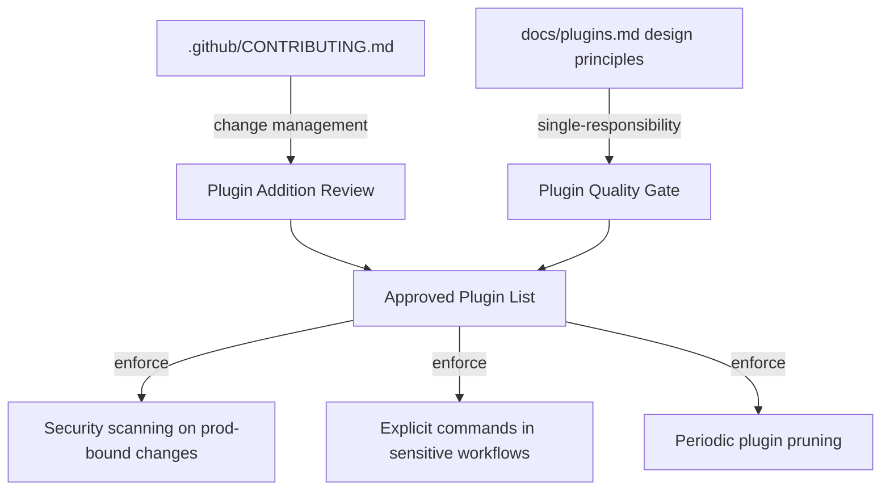

# Chapter 7: Governance, Safety, and Operational Best Practices

Welcome to **Chapter 7: Governance, Safety, and Operational Best Practices**. In this part of **Wshobson Agents Tutorial: Pluginized Multi-Agent Workflows for Claude Code**, you will build an intuitive mental model first, then move into concrete implementation details and practical production tradeoffs.

This chapter establishes team-level controls so plugin scale does not become operational chaos.

## Learning Goals

- define plugin governance for consistent team usage
- enforce quality/safety checks in automated workflows
- manage plugin drift and command-surface growth
- document runbooks for repeatable outcomes

## Governance Baseline

- maintain approved-plugin lists by team function
- review plugin additions through change-management process
- pair automation workflows with review checkpoints
- track risky command categories with stronger scrutiny

## Safety Controls

- require security scanning commands for production-bound changes
- standardize code-review command usage before merge
- prefer explicit slash commands in sensitive workflows
- isolate experimental plugins from core CI/CD paths

## Operational Best Practices

- start with small scope and expand progressively
- keep workflow templates for common tasks
- record failures and fixes in internal runbooks
- periodically prune unused plugins

## Source References

- [Usage Best Practices](https://github.com/wshobson/agents/blob/main/docs/usage.md#best-practices)
- [Plugin Design Principles](https://github.com/wshobson/agents/blob/main/docs/plugins.md#plugin-design-principles)
- [Contributing Guidelines](https://github.com/wshobson/agents/blob/main/.github/CONTRIBUTING.md)

## Summary

You now have a governance model for scaling plugin-based agent operations.

Next: [Chapter 8: Contribution Workflow and Plugin Authoring Patterns](08-contribution-workflow-and-plugin-authoring-patterns.md)

## Source Code Walkthrough

> **Note:** `wshobson/agents` governance patterns are expressed through documentation conventions and contributing guidelines, not executable source code. The relevant sources for this chapter are the contributing guide and plugin design principles docs.

### `.github/CONTRIBUTING.md`

The [contributing guidelines](https://github.com/wshobson/agents/blob/main/.github/CONTRIBUTING.md) document the change-management process for plugin additions — the organizational equivalent of the approved-plugin-list and review checkpoint patterns described in this chapter.

### `docs/plugins.md` — Plugin design principles

The [plugin design principles section](https://github.com/wshobson/agents/blob/main/docs/plugins.md#plugin-design-principles) specifies the single-responsibility requirement, overlap prevention, and explicit naming conventions that form the governance baseline. Following these principles prevents the plugin drift and command-surface sprawl this chapter guards against.

## How These Components Connect

