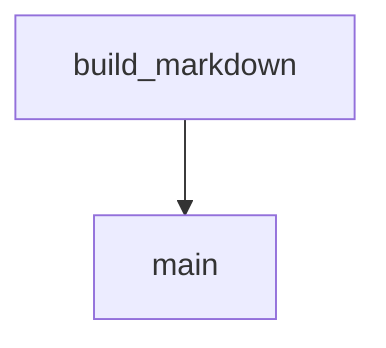

# Chapter 8: Contribution Workflow and Plugin Authoring Patterns

Welcome to **Chapter 8: Contribution Workflow and Plugin Authoring Patterns**. In this part of **Wshobson Agents Tutorial: Pluginized Multi-Agent Workflows for Claude Code**, you will build an intuitive mental model first, then move into concrete implementation details and practical production tradeoffs.


This chapter provides a practical path for submitting high-quality plugin and documentation contributions.

## Learning Goals

- follow contribution expectations from issue through PR
- author plugins that match project architecture principles
- avoid common quality pitfalls in agent/command/skill additions
- improve long-term maintainability of contributed work

## Contribution Flow

1. Open or identify an issue for significant changes.
2. Build focused changes in a feature branch.
3. Keep plugin scope narrow and purpose explicit.
4. Update docs when command surfaces or behavior change.
5. Submit PR with clear rationale and expected outcomes.

## Plugin Authoring Heuristics

- one clear plugin purpose over large mixed bundles
- explicit naming for agent and command files
- minimal overlap with existing plugin responsibilities
- include practical usage examples for discoverability

## Quality Gate Checklist

- command behavior is testable and discoverable
- docs reflect actual command names and category placement
- model and skill assumptions are explicit
- contributor guidance remains aligned with repository standards

## Source References

- [Contributing Guide](https://github.com/wshobson/agents/blob/main/.github/CONTRIBUTING.md)
- [Architecture and Design Principles](https://github.com/wshobson/agents/blob/main/docs/architecture.md)
- [Plugin Catalog](https://github.com/wshobson/agents/blob/main/docs/plugins.md)

## Summary

You now have an end-to-end model for adopting and contributing to `wshobson/agents`.

Next steps:

- curate your team's approved plugin baseline
- codify command templates for repeatable workflows
- contribute one focused plugin or documentation improvement

## Depth Expansion Playbook

## Source Code Walkthrough

### `tools/yt-design-extractor.py`

The `build_markdown` function in [`tools/yt-design-extractor.py`](https://github.com/wshobson/agents/blob/HEAD/tools/yt-design-extractor.py) handles a key part of this chapter's functionality:

```py


def build_markdown(
    meta: dict,
    transcript: list[dict] | None,
    interval_frames: list[Path],
    scene_frames: list[Path],
    out_dir: Path,
    interval: int,
    ocr_results: Optional[dict[Path, str]] = None,
    color_analysis: Optional[dict] = None,
) -> Path:
    """Assemble the final reference markdown document."""
    title = meta.get("title", "Untitled Video")
    channel = meta.get("channel", meta.get("uploader", "Unknown"))
    duration = meta.get("duration", 0)
    description = meta.get("description", "")
    chapters = meta.get("chapters") or []
    video_url = meta.get("webpage_url", "")
    tags = meta.get("tags") or []

    ocr_results = ocr_results or {}
    color_analysis = color_analysis or {}

    lines: list[str] = []

    # --- Header ---
    lines.append(f"# {title}\n")
    lines.append(f"> **Source:** [{channel}]({video_url})  ")
    lines.append(f"> **Duration:** {fmt_timestamp(duration)}  ")
    lines.append(f"> **Extracted:** {datetime.now().strftime('%Y-%m-%d %H:%M')}  ")
    if tags:
```

This function is important because it defines how Wshobson Agents Tutorial: Pluginized Multi-Agent Workflows for Claude Code implements the patterns covered in this chapter.

### `tools/yt-design-extractor.py`

The `main` function in [`tools/yt-design-extractor.py`](https://github.com/wshobson/agents/blob/HEAD/tools/yt-design-extractor.py) handles a key part of this chapter's functionality:

```py


def main():
    parser = argparse.ArgumentParser(
        description="Extract design concepts from a YouTube video into a "
        "structured markdown reference document.",
        formatter_class=argparse.RawDescriptionHelpFormatter,
        epilog=textwrap.dedent("""\
            Examples:
              %(prog)s "https://youtu.be/eVnQFWGDEdY"
              %(prog)s "https://youtu.be/eVnQFWGDEdY" --full
              %(prog)s "https://youtu.be/eVnQFWGDEdY" --interval 15 --scene-detect --ocr
              %(prog)s "https://youtu.be/eVnQFWGDEdY" --ocr --ocr-engine easyocr --colors
              %(prog)s "https://youtu.be/eVnQFWGDEdY" -o ./my-output
        """),
    )
    parser.add_argument("url", help="YouTube video URL or ID")
    parser.add_argument(
        "-o",
        "--output-dir",
        help="Output directory (default: ./yt-extract-<video_id>)",
    )
    parser.add_argument(
        "--interval",
        type=int,
        default=30,
        help="Seconds between keyframe captures (default: 30)",
    )
    parser.add_argument(
        "--scene-detect",
        action="store_true",
        help="Also extract frames on scene changes (good for visual-heavy videos)",
```

This function is important because it defines how Wshobson Agents Tutorial: Pluginized Multi-Agent Workflows for Claude Code implements the patterns covered in this chapter.


## How These Components Connect


