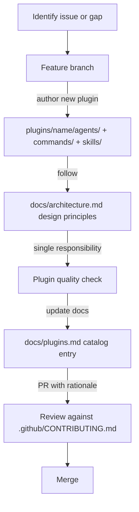

# Chapter 8: Contribution Workflow and Plugin Authoring Patterns

Welcome to **Chapter 8: Contribution Workflow and Plugin Authoring Patterns**. In this part of **Wshobson Agents Tutorial: Pluginized Multi-Agent Workflows for Claude Code**, you will build an intuitive mental model first, then move into concrete implementation details and practical production tradeoffs.

This chapter provides a practical path for submitting high-quality plugin and documentation contributions.

## Learning Goals

- follow contribution expectations from issue through PR
- author plugins that match project architecture principles
- avoid common quality pitfalls in agent/command/skill additions
- improve long-term maintainability of contributed work

## Contribution Flow

1. Open or identify an issue for significant changes.
2. Build focused changes in a feature branch.
3. Keep plugin scope narrow and purpose explicit.
4. Update docs when command surfaces or behavior change.
5. Submit PR with clear rationale and expected outcomes.

## Plugin Authoring Heuristics

- one clear plugin purpose over large mixed bundles
- explicit naming for agent and command files
- minimal overlap with existing plugin responsibilities
- include practical usage examples for discoverability

## Quality Gate Checklist

- command behavior is testable and discoverable
- docs reflect actual command names and category placement
- model and skill assumptions are explicit
- contributor guidance remains aligned with repository standards

## Source References

- [Contributing Guide](https://github.com/wshobson/agents/blob/main/.github/CONTRIBUTING.md)
- [Architecture and Design Principles](https://github.com/wshobson/agents/blob/main/docs/architecture.md)
- [Plugin Catalog](https://github.com/wshobson/agents/blob/main/docs/plugins.md)

## Summary

You now have an end-to-end model for adopting and contributing to `wshobson/agents`.

Next steps:

- curate your team's approved plugin baseline
- codify command templates for repeatable workflows
- contribute one focused plugin or documentation improvement

## Source Code Walkthrough

> **Note:** `wshobson/agents` contribution process centers on authoring plugin definition files (Markdown/YAML), not compiled code. The contribution workflow and quality gates are defined in the contributing guide and architecture documentation.

### `.github/CONTRIBUTING.md`

The [CONTRIBUTING.md](https://github.com/wshobson/agents/blob/main/.github/CONTRIBUTING.md) defines the end-to-end contribution flow: issue → feature branch → focused changes → updated docs → PR with rationale. This file is the authoritative reference for the Contribution Flow section of this chapter.

### `docs/architecture.md`

The [architecture guide](https://github.com/wshobson/agents/blob/main/docs/architecture.md) specifies the plugin authoring heuristics this chapter covers: single plugin purpose, explicit naming, minimal overlap, and required usage examples. Reviewing this file before authoring a plugin prevents the most common quality pitfalls.

## How These Components Connect

